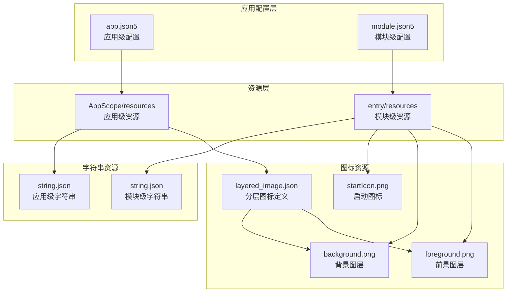
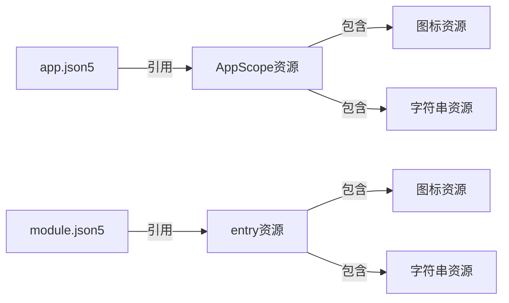
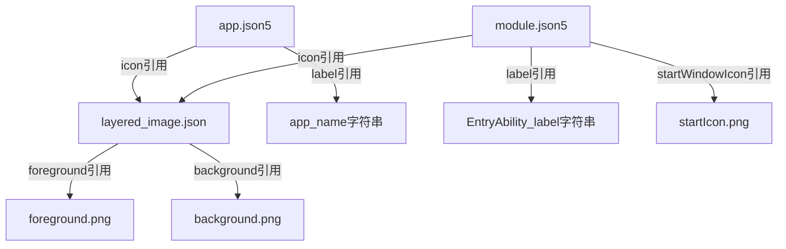
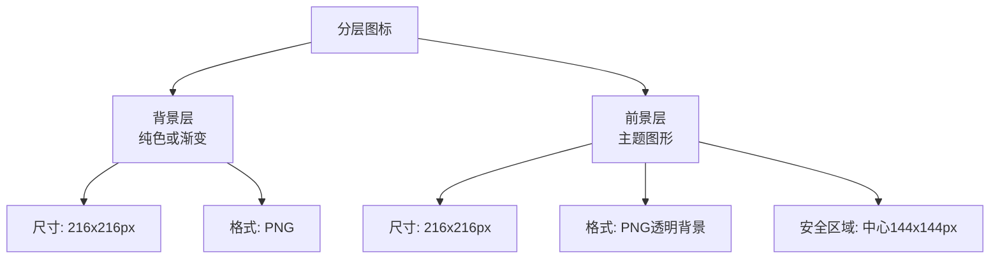
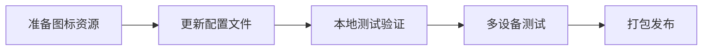

# 应用图标与名称配置 - 技术设计文档

**版本**: v1.0
**创建日期**: 2025-01-14
**最后更新**: 2025-01-14
**作者**: Specification Driven Development Agent
**状态**: 草稿

## 1. 设计概述

### 1.1 设计目标
通过修改鸿蒙应用资源配置文件和资源文件，实现：
- 替换默认应用图标为专业的健康护理主题图标
- 配置本地化的中文名称和描述信息
- 确保多设备类型和分辨率的适配性

### 1.2 技术选型
| 技术项 | 选型方案 | 选型理由 |
|--------|---------|---------|
| 图标格式 | PNG + 分层图标(layered_image) | 鸿蒙系统推荐格式，支持自适应图标 |
| 资源引用 | $media 和 $string 引用语法 | 鸿蒙标准资源引用方式，支持本地化 |
| 配置文件 | app.json5 + module.json5 | 鸿蒙应用配置标准格式 |
| 本地化方案 | 资源目录限定符 | 支持多语言和多设备适配 |

### 1.3 设计约束
- **技术约束**：必须遵循鸿蒙HarmonyOS NEXT应用资源配置规范
- **兼容性约束**：需支持phone、tablet、2in1、wearable四种设备类型
- **设计约束**：图标设计需符合健康护理行业特征
- **资源约束**：图标资源需提供多种分辨率以适配不同屏幕密度

## 2. 架构设计

### 2.1 整体架构



### 2.2 模块划分
| 模块 | 职责 | 文件位置 |
|------|------|---------|
| 应用配置模块 | 管理应用级图标和名称配置 | AppScope/app.json5 |
| 模块配置模块 | 管理模块级图标和名称配置 | entry/src/main/module.json5 |
| 图标资源模块 | 提供各尺寸和设备类型的图标资源 | resources/base/media/ |
| 字符串资源模块 | 提供本地化的字符串资源 | resources/base/element/ |

### 2.3 依赖关系


## 3. 模块详细设计

### 3.1 应用配置模块

#### 3.1.1 职责定义
负责定义应用级别的图标和名称，影响应用在系统中的显示。

#### 3.1.2 配置结构
```typescript
// app.json5 配置结构
interface AppConfig {
  app: {
    bundleName: string;        // 应用包名
    vendor: string;            // 供应商
    versionCode: number;       // 版本号
    versionName: string;       // 版本名
    icon: string;              // 图标资源引用 "$media:layered_image"
    label: string;             // 名称资源引用 "$string:app_name"
  }
}
```

#### 3.1.3 关键配置项
| 配置项 | 当前值 | 目标值 | 说明 |
|--------|--------|--------|------|
| app.icon | $media:layered_image | $media:layered_image | 保持引用，替换实际资源 |
| app.label | $string:app_name | $string:app_name | 保持引用，修改字符串值 |

### 3.2 模块配置模块

#### 3.2.1 职责定义
负责定义模块级别的图标、名称和描述，影响Ability在系统中的显示。

#### 3.2.2 配置结构
```typescript
// module.json5 配置结构
interface ModuleConfig {
  module: {
    name: string;
    type: string;
    description: string;       // 模块描述 "$string:module_desc"
    mainElement: string;
    deviceTypes: string[];
    abilities: Ability[];
  }
}

interface Ability {
  name: string;
  description: string;         // Ability描述
  icon: string;                // Ability图标
  label: string;               // Ability标签
  startWindowIcon: string;     // 启动窗口图标
  startWindowBackground: string;
  exported: boolean;
  skills: Skill[];
}
```

#### 3.2.3 关键配置项
| 配置项 | 当前值 | 目标值 | 说明 |
|--------|--------|--------|------|
| module.description | $string:module_desc | $string:module_desc | 保持引用，修改字符串值 |
| abilities[0].icon | $media:layered_image | $media:layered_image | 保持引用 |
| abilities[0].label | $string:EntryAbility_label | $string:EntryAbility_label | 保持引用，修改字符串值 |
| abilities[0].startWindowIcon | $media:startIcon | $media:startIcon | 保持引用，替换实际资源 |

### 3.3 图标资源模块

#### 3.3.1 职责定义
提供应用图标和启动图标的图像资源，支持多种分辨率和设备类型。

#### 3.3.2 分层图标设计
```typescript
// layered_image.json 结构
interface LayeredImage {
  "layered-image": {
    background: string;  // 背景图层 "$media:background"
    foreground: string;  // 前景图层 "$media:foreground"
  }
}
```

#### 3.3.3 图标设计规范
| 图标类型 | 尺寸要求 | 格式 | 用途 |
|---------|---------|------|------|
| foreground.png | 216x216 px | PNG (透明背景) | 分层图标前景层 |
| background.png | 216x216 px | PNG | 分层图标背景层 |
| startIcon.png | 256x256 px | PNG | 启动窗口图标 |

#### 3.3.4 图标设计元素
**健康护理主题图标设计建议**：
- **主元素**：医疗十字符号或心形图案
- **辅助元素**：护理帽、听诊器、药丸等
- **配色方案**：
  - 主色：#4A90E2（医疗蓝）或 #50C878（健康绿）
  - 辅色：#FFFFFF（白色）
  - 背景色：渐变蓝色或纯色

### 3.4 字符串资源模块

#### 3.4.1 职责定义
提供本地化的字符串资源，支持多语言环境。

#### 3.4.2 数据结构
```typescript
// string.json 结构
interface StringResource {
  string: StringItem[];
}

interface StringItem {
  name: string;   // 资源名称
  value: string;  // 资源值
}
```

#### 3.4.3 字符串资源配置
**应用级字符串资源** (AppScope/resources/base/element/string.json):
| 资源名 | 当前值 | 目标值 |
|--------|--------|--------|
| app_name | harmonyhealthcare | 健康护理 |

**模块级字符串资源** (entry/src/main/resources/base/element/string.json):
| 资源名 | 当前值 | 目标值 |
|--------|--------|--------|
| module_desc | module description | 健康护理主模块 |
| EntryAbility_desc | description | 健康护理应用主入口 |
| EntryAbility_label | label | 健康护理 |

## 4. 数据模型设计

### 4.1 核心数据结构
本功能不涉及业务数据模型，仅涉及资源配置数据。

**资源配置模型**：
```typescript
// 图标资源配置
interface IconConfig {
  type: 'layered' | 'static';
  resources: {
    foreground?: string;  // 前景图路径
    background?: string;  // 背景图路径
    static?: string;      // 静态图路径
  };
  sizes: {
    width: number;
    height: number;
  }[];
}

// 字符串资源配置
interface StringConfig {
  key: string;
  value: string;
  locale?: string;  // 语言环境，默认为base
}
```

### 4.2 数据存储
| 数据类型 | 存储位置 | 格式 |
|---------|---------|------|
| 应用配置 | AppScope/app.json5 | JSON5 |
| 模块配置 | entry/src/main/module.json5 | JSON5 |
| 图标资源 | resources/base/media/*.png | PNG |
| 分层图标定义 | resources/base/media/layered_image.json | JSON |
| 字符串资源 | resources/base/element/string.json | JSON |

### 4.3 资源引用关系


## 5. API设计

### 5.1 内部API
本功能为静态资源配置，不涉及运行时API调用。

### 5.2 系统接口
鸿蒙系统提供的资源加载接口：
```typescript
// 资源管理器接口（系统提供）
interface ResourceManager {
  // 获取媒体资源
  getMediaContent(resId: number): Promise<Uint8Array>;

  // 获取字符串资源
  getStringValue(resId: number): Promise<string>;

  // 获取限定符资源
  getMediaByName(resName: string): Promise<Uint8Array>;
}
```

### 5.3 资源引用语法
| 引用类型 | 语法格式 | 示例 |
|---------|---------|------|
| 媒体资源 | $media:资源名 | $media:layered_image |
| 字符串资源 | $string:资源名 | $string:app_name |
| 颜色资源 | $color:资源名 | $color:start_window_background |
| 配置文件 | $profile:文件名 | $profile:main_pages |

## 6. 关键算法设计

本功能为静态资源配置，不涉及复杂算法。

## 7. UI/UX设计

### 7.1 图标设计规范

#### 图标视觉层次


#### 图标设计要点
1. **前景层设计**：
   - 主体图形位于中心安全区域（144x144px）
   - 使用透明背景
   - 图形简洁易识别

2. **背景层设计**：
   - 使用渐变或纯色背景
   - 与前景层形成对比
   - 符合品牌色调

3. **启动图标设计**：
   - 与分层图标风格一致
   - 尺寸256x256px
   - 可包含更多细节

### 7.2 名称显示规范
| 显示位置 | 最大长度 | 显示规则 |
|---------|---------|---------|
| 主屏幕图标下 | 6-8个汉字 | 超出显示省略号 |
| 应用详情页 | 无限制 | 完整显示 |
| 最近任务列表 | 6-8个汉字 | 超出显示省略号 |

## 8. 性能设计

### 8.1 性能目标
| 指标 | 目标值 | 测量方法 |
|------|--------|---------|
| 图标加载时间 | < 100ms | 应用启动时测量 |
| 资源解析时间 | < 50ms | 配置文件解析耗时 |
| 内存占用 | < 1MB | 图标资源内存占用 |

### 8.2 优化策略
1. **图标资源优化**：
   - 使用PNG格式，压缩率优化
   - 提供多种分辨率，按需加载
   - 使用分层图标，系统自动适配

2. **配置文件优化**：
   - 使用JSON5格式，支持注释
   - 配置项精简，避免冗余

### 8.3 监控方案
- 通过DevEco Studio的资源配置检查工具验证配置正确性
- 通过多设备测试验证图标显示效果

## 9. 安全设计

### 9.1 数据安全
本功能仅涉及静态资源配置，无敏感数据：
- 图标资源为公开资源，无需加密
- 字符串资源为显示文本，无安全风险

### 9.2 权限控制
本功能不需要额外权限：
- 资源读取使用应用沙箱内资源
- 不涉及系统权限申请

### 9.3 安全审计
- 确保图标资源不包含敏感信息
- 确保字符串资源不泄露隐私数据

## 10. 测试设计

### 10.1 测试策略
| 测试类型 | 测试重点 | 测试方法 |
|---------|---------|---------|
| 配置验证 | 配置文件语法正确性 | DevEco Studio编译检查 |
| 资源验证 | 资源文件存在且格式正确 | 资源检查工具 |
| 显示验证 | 图标和名称显示正确 | 多设备人工测试 |
| 兼容性测试 | 多设备类型适配 | 不同设备测试 |

### 10.2 测试用例
| 用例ID | 测试场景 | 预期结果 | 优先级 |
|--------|---------|---------|--------|
| TC-001 | 应用安装后查看主屏幕 | 显示健康护理图标和名称 | P0 |
| TC-002 | 点击应用启动 | 启动窗口显示匹配的图标 | P1 |
| TC-003 | 在平板设备上查看 | 图标清晰，名称显示正确 | P1 |
| TC-004 | 在穿戴设备上查看 | 图标适配，名称显示正确 | P1 |
| TC-005 | 查看应用详情 | 显示完整的应用名称和描述 | P2 |

### 10.3 Mock数据
本功能为静态配置，不需要Mock数据。

## 11. 部署设计

### 11.1 环境要求
- DevEco Studio 4.0 或更高版本
- HarmonyOS NEXT SDK
- 目标设备：HarmonyOS NEXT 及以上版本

### 11.2 配置管理
| 配置项 | 配置文件 | 修改方式 |
|--------|---------|---------|
| 应用图标 | AppScope/resources/base/media/ | 替换PNG文件 |
| 应用名称 | AppScope/resources/base/element/string.json | 修改JSON值 |
| 模块名称 | entry/src/main/resources/base/element/string.json | 修改JSON值 |

### 11.3 发布流程


## 12. 附录

### 12.1 术语表
| 术语 | 定义 |
|-----|------|
| layered_image | 鸿蒙分层图标，由前景层和背景层组成 |
| AppScope | 应用级作用域，配置影响整个应用 |
| EntryAbility | 应用主入口能力，代表应用的主界面 |
| JSON5 | JSON的超集，支持注释和更灵活的语法 |

### 12.2 参考资料
- [鸿蒙应用资源配置指南](https://developer.huawei.com/consumer/cn/doc/harmonyos-guides-V5/application-configuration-stage-V5)
- [鸿蒙应用图标设计规范](https://developer.huawei.com/consumer/cn/doc/harmonyos-guides-V5/icon-design-V5)
- [鸿蒙资源限定符使用](https://developer.huawei.com/consumer/cn/doc/harmonyos-guides-V5/resource-qualifier-V5)

### 12.3 变更历史
| 版本 | 日期 | 变更内容 | 作者 |
|-----|------|---------|------|
| v1.0 | 2025-01-14 | 初始版本创建 | SDD Agent |
