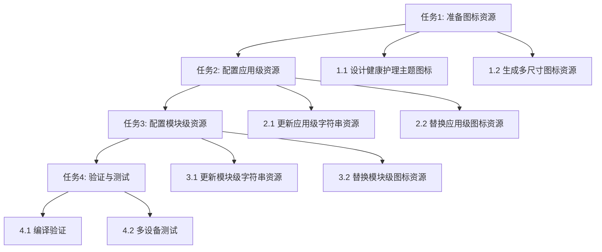

# 应用图标与名称配置 - 编码任务规划

**版本**: v1.0
**创建日期**: 2025-01-14
**最后更新**: 2025-01-14
**作者**: Specification Driven Development Agent
**状态**: 待执行

## 任务概述

本文档将技术设计转化为具体的编码任务，共包含 **4个主任务** 和 **8个子任务**，覆盖所有需求规格。

### 任务依赖关系


---

## 任务1: 准备图标资源

**任务描述**: 设计并准备健康护理主题的应用图标资源文件，包括分层图标的前景层、背景层和启动窗口图标。

**输入**:
- 图标设计规范（尺寸、格式、配色方案）
- 健康护理主题设计元素

**输出**:
- foreground.png (前景层图标)
- background.png (背景层图标)
- startIcon.png (启动窗口图标)

**验收标准**:
- 图标符合健康护理主题特征
- 图标尺寸符合鸿蒙规范
- 图标格式为PNG，透明度正确

**优先级**: P0

**预估工时**: 2小时

### 子任务 1.1: 设计健康护理主题图标

**任务描述**: 使用图像设计工具创建健康护理主题的图标设计稿，包含医疗十字、心形等健康护理元素。

**执行步骤**:
1. 确定图标设计风格：现代简约风格，医疗健康主题
2. 选择主色调：医疗蓝 (#4A90E2) 或健康绿 (#50C878)
3. 设计前景层图形：
   - 中心区域绘制医疗十字符号
   - 可添加心形或护理元素作为辅助
   - 确保图形在144x144px安全区域内
4. 设计背景层：
   - 使用渐变蓝色背景
   - 或使用纯色背景配合前景层
5. 设计启动图标：
   - 基于分层图标风格
   - 可添加更多细节元素

**输入**:
- 健康护理行业图标参考
- 鸿蒙图标设计规范

**输出**:
- 图标设计稿（可使用Figma、Sketch等工具）

**验收标准**:
- 图标设计稿符合健康护理主题
- 设计稿尺寸为216x216px（前景/背景）和256x256px（启动图标）

**代码生成提示**:
```
请设计一个健康护理主题的应用图标：
- 风格：现代简约，专业医疗感
- 主元素：医疗十字符号，位于中心
- 辅助元素：可添加心形图案或护理帽元素
- 配色：主色#4A90E2（医疗蓝），辅色#FFFFFF（白色）
- 前景层：透明背景，图形在中心144x144px安全区域
- 背景层：渐变蓝色背景（从#4A90E2到#6BB3F8）
- 启动图标：基于分层图标，可添加更多细节
```

---

### 子任务 1.2: 生成多尺寸图标资源

**任务描述**: 基于设计稿导出符合鸿蒙规范的PNG图标资源文件。

**执行步骤**:
1. 导出前景层图标：
   - 文件名：foreground.png
   - 尺寸：216x216px
   - 格式：PNG，透明背景
   - 位置：AppScope/resources/base/media/foreground.png
2. 导出背景层图标：
   - 文件名：background.png
   - 尺寸：216x216px
   - 格式：PNG
   - 位置：AppScope/resources/base/media/background.png
3. 导出启动窗口图标：
   - 文件名：startIcon.png
   - 尺寸：256x256px
   - 格式：PNG
   - 位置：entry/src/main/resources/base/media/startIcon.png
4. 优化PNG文件大小（使用压缩工具）

**输入**:
- 图标设计稿

**输出**:
- AppScope/resources/base/media/foreground.png
- AppScope/resources/base/media/background.png
- entry/src/main/resources/base/media/startIcon.png

**验收标准**:
- 所有图标文件存在且格式正确
- 图标尺寸符合规范
- PNG文件已优化压缩

**代码生成提示**:
```
请将设计好的图标导出为以下PNG文件：
1. foreground.png (216x216px, 透明背景) -> AppScope/resources/base/media/
2. background.png (216x216px) -> AppScope/resources/base/media/
3. startIcon.png (256x256px) -> entry/src/main/resources/base/media/

确保：
- PNG格式正确
- 尺寸精确
- 文件已压缩优化
```

---

## 任务2: 配置应用级资源

**任务描述**: 更新应用级别的字符串资源和图标资源，配置应用的中文名称和图标。

**输入**:
- AppScope/resources/base/element/string.json
- AppScope/resources/base/media/ 下的图标文件

**输出**:
- 更新后的 AppScope/resources/base/element/string.json

**验收标准**:
- 应用名称显示为"健康护理"
- 应用图标正确加载

**优先级**: P0

**预估工时**: 0.5小时

**依赖**: 任务1

### 子任务 2.1: 更新应用级字符串资源

**任务描述**: 修改应用级字符串资源文件，将应用名称从"harmonyhealthcare"改为"健康护理"。

**执行步骤**:
1. 打开文件：`AppScope/resources/base/element/string.json`
2. 找到 `app_name` 资源项
3. 将值从 "harmonyhealthcare" 修改为 "健康护理"
4. 保存文件

**输入**:
```json
{
  "string": [
    {
      "name": "app_name",
      "value": "harmonyhealthcare"
    }
  ]
}
```

**输出**:
```json
{
  "string": [
    {
      "name": "app_name",
      "value": "健康护理"
    }
  ]
}
```

**验收标准**:
- JSON格式正确
- app_name值为"健康护理"

**代码生成提示**:
```
请修改文件 AppScope/resources/base/element/string.json：

将：
{
  "string": [
    {
      "name": "app_name",
      "value": "harmonyhealthcare"
    }
  ]
}

修改为：
{
  "string": [
    {
      "name": "app_name",
      "value": "健康护理"
    }
  ]
}
```

---

### 子任务 2.2: 替换应用级图标资源

**任务描述**: 将准备好的图标资源文件复制到应用级资源目录，替换默认图标。

**执行步骤**:
1. 确认新图标文件已准备好：
   - foreground.png
   - background.png
2. 替换 AppScope/resources/base/media/ 目录下的图标文件：
   - 覆盖 foreground.png
   - 覆盖 background.png
3. 确认 layered_image.json 配置正确（无需修改）

**输入**:
- 新的 foreground.png
- 新的 background.png

**输出**:
- 更新后的 AppScope/resources/base/media/foreground.png
- 更新后的 AppScope/resources/base/media/background.png

**验收标准**:
- 图标文件已替换
- layered_image.json 引用正确

**代码生成提示**:
```
请将以下图标文件复制到 AppScope/resources/base/media/ 目录：
- foreground.png (覆盖现有文件)
- background.png (覆盖现有文件)

确认 layered_image.json 配置如下（无需修改）：
{
  "layered-image": {
    "background": "$media:background",
    "foreground": "$media:foreground"
  }
}
```

---

## 任务3: 配置模块级资源

**任务描述**: 更新模块级别的字符串资源和图标资源，配置模块的中文名称、描述和启动图标。

**输入**:
- entry/src/main/resources/base/element/string.json
- entry/src/main/resources/base/media/ 下的图标文件

**输出**:
- 更新后的 entry/src/main/resources/base/element/string.json
- 更新后的 entry/src/main/resources/base/media/startIcon.png

**验收标准**:
- 模块名称显示为"健康护理"
- 模块描述为中文
- 启动图标正确显示

**优先级**: P0

**预估工时**: 0.5小时

**依赖**: 任务2

### 子任务 3.1: 更新模块级字符串资源

**任务描述**: 修改模块级字符串资源文件，将模块名称、Ability标签和描述改为中文。

**执行步骤**:
1. 打开文件：`entry/src/main/resources/base/element/string.json`
2. 修改以下资源项：
   - `module_desc`: "module description" → "健康护理主模块"
   - `EntryAbility_desc`: "description" → "健康护理应用主入口"
   - `EntryAbility_label`: "label" → "健康护理"
3. 保存文件

**输入**:
```json
{
  "string": [
    {
      "name": "module_desc",
      "value": "module description"
    },
    {
      "name": "EntryAbility_desc",
      "value": "description"
    },
    {
      "name": "EntryAbility_label",
      "value": "label"
    },
    ...
  ]
}
```

**输出**:
```json
{
  "string": [
    {
      "name": "module_desc",
      "value": "健康护理主模块"
    },
    {
      "name": "EntryAbility_desc",
      "value": "健康护理应用主入口"
    },
    {
      "name": "EntryAbility_label",
      "value": "健康护理"
    },
    ...
  ]
}
```

**验收标准**:
- JSON格式正确
- 所有字符串资源已本地化为中文

**代码生成提示**:
```
请修改文件 entry/src/main/resources/base/element/string.json：

将以下资源项：
- module_desc: "module description" -> "健康护理主模块"
- EntryAbility_desc: "description" -> "健康护理应用主入口"
- EntryAbility_label: "label" -> "健康护理"

保持其他资源项不变（read_media_reason, write_media_reason, location_reason等）。
```

---

### 子任务 3.2: 替换模块级图标资源

**任务描述**: 将准备好的启动窗口图标复制到模块级资源目录。

**执行步骤**:
1. 确认新启动图标文件已准备好：startIcon.png
2. 替换 entry/src/main/resources/base/media/ 目录下的图标文件：
   - 覆盖 startIcon.png
3. 同时更新模块级的分层图标资源（foreground.png, background.png）

**输入**:
- 新的 startIcon.png
- 新的 foreground.png
- 新的 background.png

**输出**:
- 更新后的 entry/src/main/resources/base/media/startIcon.png
- 更新后的 entry/src/main/resources/base/media/foreground.png
- 更新后的 entry/src/main/resources/base/media/background.png

**验收标准**:
- 启动图标文件已替换
- 模块级分层图标已更新

**代码生成提示**:
```
请将以下图标文件复制到 entry/src/main/resources/base/media/ 目录：
- startIcon.png (覆盖现有文件)
- foreground.png (覆盖现有文件)
- background.png (覆盖现有文件)
```

---

## 任务4: 验证与测试

**任务描述**: 验证配置正确性，测试图标和名称在多设备上的显示效果。

**输入**:
- 完整的项目配置
- 图标资源文件

**输出**:
- 验证报告
- 测试结果

**验收标准**:
- 编译无错误
- 图标和名称显示正确
- 多设备兼容性验证通过

**优先级**: P0

**预估工时**: 1小时

**依赖**: 任务3

### 子任务 4.1: 编译验证

**任务描述**: 使用DevEco Studio编译项目，验证配置文件语法正确性和资源引用有效性。

**执行步骤**:
1. 在DevEco Studio中打开项目
2. 执行 Clean Project 清理构建缓存
3. 执行 Rebuild Project 重新构建
4. 检查编译输出：
   - 确认无语法错误
   - 确认无资源引用错误
   - 确认无缺失资源警告
5. 如有错误，根据错误信息修复

**输入**:
- 完整的项目代码

**输出**:
- 编译成功/失败报告

**验收标准**:
- 编译成功，无错误
- 无资源相关警告

**代码生成提示**:
```
请在DevEco Studio中执行以下操作：
1. Clean Project
2. Rebuild Project
3. 检查Build Output，确认：
   - 无语法错误
   - 无资源引用错误
   - 无缺失资源警告

如有错误，请根据错误信息修复配置。
```

---

### 子任务 4.2: 多设备测试

**任务描述**: 在多种设备类型上测试图标和名称的显示效果。

**执行步骤**:
1. 在模拟器或真机上安装应用：
   - Phone 设备测试
   - Tablet 设备测试（如有条件）
   - Wearable 设备测试（如有条件）
2. 验证主屏幕显示：
   - 图标显示正确（非默认图标）
   - 名称显示为"健康护理"
3. 验证启动窗口：
   - 启动图标显示正确
   - 与应用图标风格一致
4. 验证应用详情页：
   - 应用名称完整显示
   - 描述信息正确
5. 记录测试结果

**输入**:
- 已编译的HAP包

**输出**:
- 测试结果报告

**验收标准**:
- 所有设备类型图标显示正确
- 名称显示为中文"健康护理"
- 启动图标与应用图标风格一致

**代码生成提示**:
```
请在以下设备上测试应用：

1. Phone设备：
   - 安装应用
   - 查看主屏幕图标和名称
   - 启动应用，观察启动窗口图标
   - 查看应用详情

2. Tablet设备（如有）：
   - 同上测试步骤

3. Wearable设备（如有）：
   - 同上测试步骤

预期结果：
- 图标显示为健康护理主题图标
- 名称显示为"健康护理"
- 启动图标风格一致
```

---

## 任务执行顺序

| 执行顺序 | 任务ID | 任务名称 | 预估工时 | 依赖 |
|---------|--------|---------|---------|------|
| 1 | 1.1 | 设计健康护理主题图标 | 1小时 | 无 |
| 2 | 1.2 | 生成多尺寸图标资源 | 1小时 | 1.1 |
| 3 | 2.1 | 更新应用级字符串资源 | 0.25小时 | 1.2 |
| 4 | 2.2 | 替换应用级图标资源 | 0.25小时 | 1.2 |
| 5 | 3.1 | 更新模块级字符串资源 | 0.25小时 | 2.1, 2.2 |
| 6 | 3.2 | 替换模块级图标资源 | 0.25小时 | 2.1, 2.2 |
| 7 | 4.1 | 编译验证 | 0.5小时 | 3.1, 3.2 |
| 8 | 4.2 | 多设备测试 | 0.5小时 | 4.1 |

**总预估工时**: 4小时

---

## 需求覆盖矩阵

| 需求ID | 需求描述 | 覆盖任务 | 验证状态 |
|--------|---------|---------|---------|
| FR-001 | 配置应用级图标资源 | 1.1, 1.2, 2.2 | 待验证 |
| FR-002 | 配置启动窗口图标 | 1.1, 1.2, 3.2 | 待验证 |
| FR-003 | 适配多设备类型图标 | 1.2, 4.2 | 待验证 |
| FR-004 | 配置应用级中文名称 | 2.1 | 待验证 |
| FR-005 | 配置模块级显示名称 | 3.1 | 待验证 |
| FR-006 | 配置模块描述信息 | 3.1 | 待验证 |
| NFR-001 | 图标资源加载性能 | 4.1 | 待验证 |
| NFR-002 | 设备兼容性 | 4.2 | 待验证 |
| NFR-003 | 分辨率适配 | 1.2, 4.2 | 待验证 |
| NFR-004 | 视觉一致性 | 1.1, 4.2 | 待验证 |

---

## 附录

### 文件修改清单

| 文件路径 | 操作类型 | 说明 |
|---------|---------|------|
| AppScope/resources/base/media/foreground.png | 替换 | 应用图标前景层 |
| AppScope/resources/base/media/background.png | 替换 | 应用图标背景层 |
| AppScope/resources/base/element/string.json | 修改 | 应用名称本地化 |
| entry/src/main/resources/base/media/startIcon.png | 替换 | 启动窗口图标 |
| entry/src/main/resources/base/media/foreground.png | 替换 | 模块图标前景层 |
| entry/src/main/resources/base/media/background.png | 替换 | 模块图标背景层 |
| entry/src/main/resources/base/element/string.json | 修改 | 模块名称和描述本地化 |

### 变更历史

| 版本 | 日期 | 变更内容 | 作者 |
|-----|------|---------|------|
| v1.0 | 2025-01-14 | 初始版本创建 | SDD Agent |
