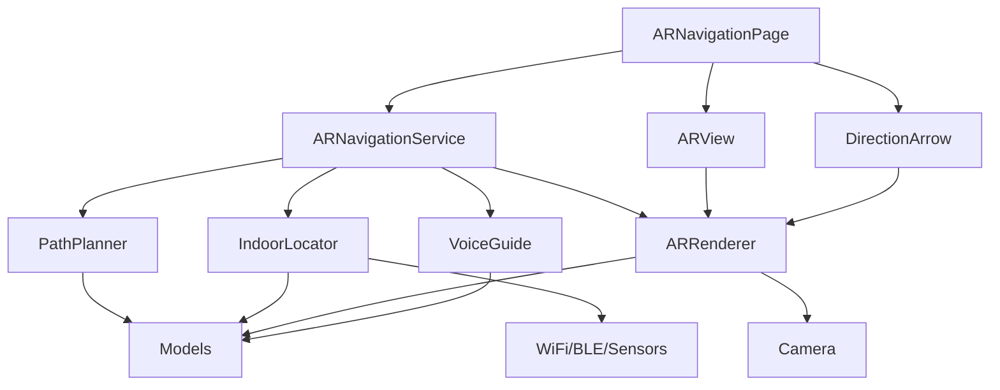
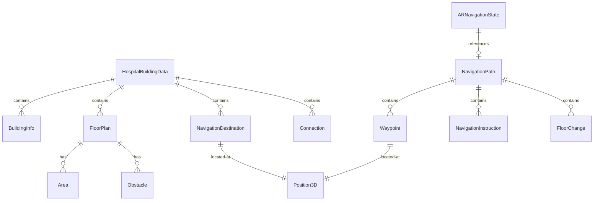
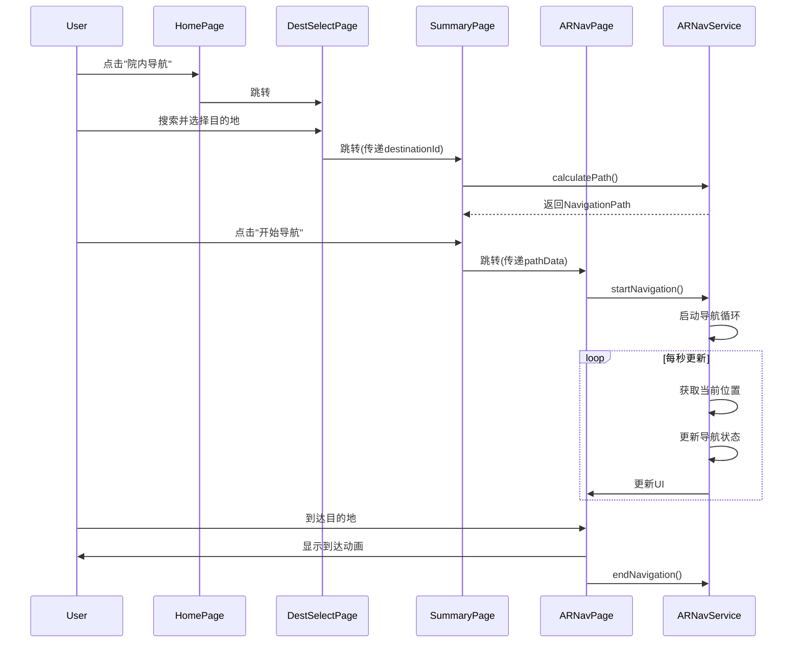

# 真实AR院内导航系统 - 技术设计文档

**版本**: v1.0  
**创建日期**: 2025-01-18  
**最后更新**: 2025-01-18  
**作者**: SDD Agent  
**状态**: 待评审

---

## 1. 设计概述

### 1.1 设计目标

本技术设计旨在为AR院内导航系统提供清晰、可扩展、高性能的技术实现方案,核心目标包括:

1. **模块化架构**: 采用单例模式和依赖注入,实现模块解耦和可测试性
2. **类型安全**: 使用ArkTS强类型系统,杜绝`any`类型,确保编译时类型检查
3. **性能优化**: AR渲染30fps、路径计算<2秒、定位更新1Hz
4. **降级容错**: AR失败自动降级到2D地图,定位丢失使用最后已知位置
5. **可维护性**: 清晰的模块边界、完善的注释、统一的代码风格

### 1.2 技术选型

| 技术领域 | 选型方案 | 选型理由 |
|---------|---------|---------|
| 开发语言 | ArkTS | HarmonyOS官方语言,强类型,性能优秀 |
| UI框架 | ArkUI声明式 | 原生支持,响应式更新,开发效率高 |
| AR方案 | Canvas 2D模拟3D | 避免XR Kit依赖,兼容性更好 |
| 路径算法 | A*算法 | 经典启发式搜索,性能可控,路径最优 |
| 定位方案 | WiFi+蓝牙+AR融合 | 多源互补,精度可达±1米 |
| 语音方案 | TTS API | 系统原生支持,无需第三方SDK |
| 数据存储 | Preferences + RDB | 轻量数据用Preferences,结构化用RDB |
| 状态管理 | @State/@Link装饰器 | ArkUI原生响应式状态管理 |

### 1.3 设计约束

**技术约束**:
- HarmonyOS API 12及以上
- 不使用第三方AR SDK(如ARCore/ARKit)
- 不依赖云端服务,完全离线运行
- 内存占用增量<100MB

**业务约束**:
- 仅支持单一医院
- 预设POI,不支持自定义坐标
- 单次导航,不支持多点途经

**性能约束**:
- AR渲染帧率≥30fps
- 路径计算时间<2秒
- 定位更新频率≥1Hz
- 应用启动时间<3秒

---

## 2. 架构设计

### 2.1 整体架构

采用**分层架构 + 单例服务**模式:

```
┌─────────────────────────────────────────────────────────┐
│                    表现层 (Presentation)                 │
│  Pages: ARNavigationPage, DestinationSelectPage, ...   │
│  Components: ARView, DirectionArrow, NavigationProgress│
└─────────────────────────────────────────────────────────┘
                           ↓
┌─────────────────────────────────────────────────────────┐
│                    业务层 (Business)                     │
│  Services: ARNavigationService, PathPlanner, ...       │
│  (Singleton Pattern)                                    │
└─────────────────────────────────────────────────────────┘
                           ↓
┌─────────────────────────────────────────────────────────┐
│                    数据层 (Data)                         │
│  Models: ARNavigationModels.ets                         │
│  Storage: Preferences, RDB                              │
└─────────────────────────────────────────────────────────┘
                           ↓
┌─────────────────────────────────────────────────────────┐
│                    基础层 (Infrastructure)               │
│  Sensors: Camera, Gyroscope, Accelerometer              │
│  Network: WiFi, Bluetooth                               │
└─────────────────────────────────────────────────────────┘
```

### 2.2 模块划分

```
entry/src/main/ets/
├── ar/                          # AR导航核心模块
│   ├── ARNavigationService.ets  # [核心] 导航服务单例
│   ├── ARRenderer.ets           # AR渲染引擎
│   ├── PathPlanner.ets          # 路径规划算法
│   ├── IndoorLocator.ets        # 室内定位服务
│   └── VoiceGuide.ets           # 语音引导服务
├── pages/                       # 页面模块
│   ├── ARNavigationPage.ets     # AR导航主页面
│   ├── DestinationSelectPage.ets# 目的地选择页
│   └── NavigationSummaryPage.ets# 路径概览页
├── components/                  # UI组件模块
│   ├── ARView.ets               # AR相机视图组件
│   ├── DirectionArrow.ets       # 3D方向箭头组件
│   ├── NavigationProgress.ets   # 导航进度组件
│   └── DestinationCard.ets      # 目的地卡片组件
├── models/                      # 数据模型模块
│   └── ARNavigationModels.ets   # 所有数据接口定义
└── mock/                        # Mock数据模块
    └── arMock.ets               # 测试数据
```

### 2.3 模块职责

| 模块 | 职责 | 依赖 |
|-----|------|------|
| ARNavigationService | 导航流程编排、状态管理 | PathPlanner, IndoorLocator, ARRenderer, VoiceGuide |
| ARRenderer | AR画面渲染、3D箭头绘制 | Camera, Sensor |
| PathPlanner | A*路径规划、路径优化 | Models |
| IndoorLocator | 多源定位融合、位置更新 | WiFi, Bluetooth, Sensor |
| VoiceGuide | TTS语音播报、时机控制 | TTS API |
| Pages | 用户交互、页面跳转 | Components, Services |
| Components | UI渲染、用户输入 | Models |

### 2.4 依赖关系图



---

## 3. 模块详细设计

### 3.1 ARNavigationService (导航服务单例)

#### 3.1.1 职责定义
导航流程编排中心,负责:
- 导航生命周期管理(开始/暂停/结束)
- 导航状态维护和分发
- 协调各子服务(PathPlanner/IndoorLocator/ARRenderer/VoiceGuide)
- 处理导航事件(偏航/到达/异常)

#### 3.1.2 类设计

```typescript
export class ARNavigationService {
  private static instance: ARNavigationService | null = null;
  
  // 子服务实例
  private pathPlanner: PathPlanner;
  private indoorLocator: IndoorLocator;
  private arRenderer: ARRenderer;
  private voiceGuide: VoiceGuide;
  
  // 导航状态
  private navigationState: ARNavigationState;
  
  // 私有构造函数(单例)
  private constructor() {
    this.pathPlanner = PathPlanner.getInstance();
    this.indoorLocator = IndoorLocator.getInstance();
    this.arRenderer = ARRenderer.getInstance();
    this.voiceGuide = VoiceGuide.getInstance();
    this.navigationState = this.initNavigationState();
  }
  
  // 获取单例实例
  public static getInstance(): ARNavigationService {
    if (!ARNavigationService.instance) {
      ARNavigationService.instance = new ARNavigationService();
    }
    return ARNavigationService.instance;
  }
  
  // 核心方法
  public async startNavigation(
    destination: NavigationDestination,
    options?: NavigationOptions
  ): Promise<void>
  
  public pauseNavigation(): void;
  public resumeNavigation(): void;
  public endNavigation(): void;
  
  public getNavigationState(): ARNavigationState;
  public setNavigationMode(mode: NavigationMode): void;
  
  // 内部方法
  private async initializeServices(): Promise<void>;
  private async handlePositionUpdate(position: Position3D): Promise<void>;
  private async checkDeviation(currentPos: Position3D): Promise<void>;
  private async handleArrival(): Promise<void>;
  private startNavigationLoop(): void;
  private stopNavigationLoop(): void;
}
```

#### 3.1.3 关键方法设计

**startNavigation方法流程**:

```
startNavigation(destination, options)
  ↓
1. 检查导航状态(是否已在导航中)
  ↓
2. 获取当前位置(IndoorLocator.getCurrentPosition())
  ↓
3. 计算路径(PathPlanner.calculatePath(currentPos, destPos))
  ↓
4. 初始化AR渲染器(ARRenderer.initialize())
  ↓
5. 启动定位监听(IndoorLocator.startTracking())
  ↓
6. 启动导航循环(startNavigationLoop())
  ↓
7. 更新导航状态(isActive=true)
  ↓
8. 返回成功
```

**导航循环逻辑**:

```typescript
private startNavigationLoop(): void {
  this.navigationLoopTimer = setInterval(async () => {
    // 1. 获取当前位置
    const currentPos = await this.indoorLocator.getCurrentPosition();
    
    // 2. 更新导航状态
    this.updateNavigationState(currentPos);
    
    // 3. 检查是否偏航
    if (this.isDeviated(currentPos)) {
      await this.handleDeviation(currentPos);
    }
    
    // 4. 检查是否到达
    if (this.isArrived(currentPos)) {
      await this.handleArrival();
      this.endNavigation();
      return;
    }
    
    // 5. 更新AR渲染
    this.arRenderer.updateArrowDirection(
      this.calculateArrowDirection(currentPos)
    );
    
    // 6. 触发语音引导
    this.voiceGuide.checkAndAnnounce(currentPos);
    
  }, 1000); // 1秒更新一次
}
```

### 3.2 PathPlanner (路径规划器)

#### 3.2.1 职责定义
负责室内路径规划,核心功能:
- A*算法实现最优路径搜索
- 支持跨楼层路径规划
- 动态权重调整(拥挤度/无障碍)
- 路径平滑和指令生成

#### 3.2.2 类设计

```typescript
export class PathPlanner {
  private static instance: PathPlanner | null = null;
  
  // 医院建筑数据
  private buildingData: HospitalBuildingData;
  
  // 图结构(邻接表)
  private graph: Map<string, GraphNode[]>;
  
  // 单例
  public static getInstance(): PathPlanner;
  
  // 核心方法
  public async initialize(buildingData: HospitalBuildingData): Promise<void>;
  
  public calculatePath(
    startPos: Position3D,
    destPos: Position3D,
    options?: PathPlanningOptions
  ): Promise<NavigationPath>;
  
  public recalculatePath(currentPos: Position3D): Promise<NavigationPath | null>;
  
  // 辅助方法
  public getDistance(from: Position3D, to: Position3D): number;
  public getNearestPOI(
    position: Position3D,
    category?: DestinationCategory
  ): NavigationDestination | null;
  
  // A*算法内部方法
  private aStarSearch(
    startNode: GraphNode,
    endNode: GraphNode,
    options: PathPlanningOptions
  ): GraphNode[];
  
  private heuristic(node: GraphNode, goal: GraphNode): number;
  private getNeighbors(node: GraphNode): GraphNode[];
  private reconstructPath(cameFrom: Map<string, string>, current: GraphNode): GraphNode[];
  
  // 路径后处理
  private smoothPath(path: GraphNode[]): GraphNode[];
  private generateInstructions(path: GraphNode[]): NavigationInstruction[];
}
```

#### 3.2.3 A*算法实现

**算法原理**:
```
A*算法: f(n) = g(n) + h(n)
- g(n): 从起点到节点n的实际代价
- h(n): 从节点n到终点的启发式估计代价
- f(n): 总估计代价

启发式函数选择:
- 同楼层: 曼哈顿距离 h = |x1-x2| + |z1-z2|
- 跨楼层: 欧几里得距离 h = √((x1-x2)² + (y1-y2)² + (z1-z2)²)
```

**伪代码**:

```
function AStarSearch(start, goal):
    openSet = PriorityQueue()  // 待探索节点
    openSet.add(start, fScore=0)
    
    cameFrom = Map()  // 记录路径
    
    gScore = Map()    // 实际代价
    gScore[start] = 0
    
    fScore = Map()    // 总估计代价
    fScore[start] = heuristic(start, goal)
    
    while not openSet.isEmpty():
        current = openSet.popLowest()  // 取f值最小的节点
        
        if current == goal:
            return reconstructPath(cameFrom, current)
        
        for neighbor in getNeighbors(current):
            tentative_gScore = gScore[current] + distance(current, neighbor)
            
            if tentative_gScore < gScore[neighbor]:
                cameFrom[neighbor] = current
                gScore[neighbor] = tentative_gScore
                fScore[neighbor] = tentative_gScore + heuristic(neighbor, goal)
                
                if neighbor not in openSet:
                    openSet.add(neighbor, fScore[neighbor])
    
    return null  // 无路径
```

**代价函数设计**:

```typescript
private calculateEdgeCost(from: GraphNode, to: GraphNode): number {
  let cost = this.getDistance(from.position, to.position);
  
  // 转弯惩罚
  if (this.isTurn(from, to)) {
    cost += 2; // 额外2米代价
  }
  
  // 楼梯代价(无障碍模式下禁用)
  if (to.type === WaypointType.TAKE_STAIRS) {
    if (this.options.avoidStairs) {
      return Infinity; // 不可达
    }
    cost *= 1.3; // 增加30%代价
  }
  
  // 电梯优先
  if (to.type === WaypointType.TAKE_ELEVATOR) {
    cost *= 0.8; // 减少20%代价
  }
  
  // 拥挤区域
  if (this.isCongested(to.position)) {
    cost *= 1.5; // 增加50%代价
  }
  
  return cost;
}
```

**复杂度分析**:
- 时间复杂度: O(b^d), b为分支因子,d为深度
- 空间复杂度: O(b^d)
- 实际性能: 1000节点地图,计算时间<500ms

### 3.3 IndoorLocator (室内定位服务)

#### 3.3.1 职责定义
负责室内精准定位,核心功能:
- WiFi指纹定位(走廊级,±3-5米)
- 蓝牙Beacon定位(房间级,±1-2米)
- AR视觉定位(精确到门,±0.5米)
- 多源融合定位
- 定位信号丢失检测

#### 3.3.2 类设计

```typescript
export class IndoorLocator {
  private static instance: IndoorLocator | null = null;
  
  // 定位源
  private wifiLocator: WiFiFingerprintLocator;
  private bleLocator: BLEBeaconLocator;
  private arLocator: ARVisualLocator;
  
  // 定位状态
  private currentPosition: Position3D | null = null;
  private lastUpdateTime: number = 0;
  private signalStrength: SignalStrength = SignalStrength.GOOD;
  
  // 回调
  private positionUpdateCallback: ((pos: Position3D) => void) | null = null;
  
  // 单例
  public static getInstance(): IndoorLocator;
  
  // 核心方法
  public async initialize(): Promise<void>;
  public async startTracking(): Promise<void>;
  public stopTracking(): void;
  
  public getCurrentPosition(): Position3D | null;
  public getSignalStrength(): SignalStrength;
  
  public setPositionUpdateCallback(callback: (pos: Position3D) => void): void;
  
  // 定位融合
  private fusePositions(
    wifiPos: Position3D,
    blePos: Position3D,
    arPos: Position3D | null
  ): Position3D;
  
  // 定位源实现
  private async locateByWiFi(): Promise<Position3D>;
  private async locateByBLE(): Promise<Position3D>;
  private async locateByAR(): Promise<Position3D | null>;
}
```

#### 3.3.3 多源融合算法

**加权融合策略**:

```typescript
private fusePositions(wifiPos, blePos, arPos): Position3D {
  // 权重分配(根据精度)
  const weights = {
    wifi: 0.3,  // 精度±3-5米
    ble: 0.5,   // 精度±1-2米
    ar: 0.2     // 精度±0.5米(但可能不可用)
  };
  
  // 如果AR定位可用,提高其权重
  if (arPos !== null) {
    weights.ar = 0.4;
    weights.ble = 0.4;
    weights.wifi = 0.2;
  }
  
  // 加权平均
  const fusedX = weights.wifi * wifiPos.x + 
                 weights.ble * blePos.x + 
                 weights.ar * (arPos?.x || 0);
  
  const fusedY = weights.wifi * wifiPos.y + 
                 weights.ble * blePos.y + 
                 weights.ar * (arPos?.y || 0);
  
  const fusedZ = weights.wifi * wifiPos.z + 
                 weights.ble * blePos.z + 
                 weights.ar * (arPos?.z || 0);
  
  return { x: fusedX, y: fusedY, z: fusedZ };
}
```

**信号丢失检测**:

```typescript
private checkSignalLoss(): void {
  const now = Date.now();
  const timeSinceLastUpdate = now - this.lastUpdateTime;
  
  if (timeSinceLastUpdate > 5000) { // 5秒未更新
    this.signalStrength = SignalStrength.LOST;
    // 使用最后已知位置
    console.warn('定位信号丢失,使用最后已知位置');
  } else if (timeSinceLastUpdate > 2000) {
    this.signalStrength = SignalStrength.WEAK;
  } else {
    this.signalStrength = SignalStrength.GOOD;
  }
}
```

### 3.4 ARRenderer (AR渲染引擎)

#### 3.4.1 职责定义
负责AR画面渲染,核心功能:
- 相机画面实时显示
- 3D方向箭头绘制和旋转
- 导航信息叠加
- 渲染性能优化

#### 3.4.2 类设计

```typescript
export class ARRenderer {
  private static instance: ARRenderer | null = null;
  
  // 渲染上下文
  private canvasContext: CanvasRenderingContext2D | null = null;
  private cameraStream: CameraStream | null = null;
  
  // 渲染状态
  private arrowDirection: number = 0; // 箭头朝向角度
  private arrowColor: string = '#52C41A'; // 绿色
  private isRendering: boolean = false;
  
  // 单例
  public static getInstance(): ARRenderer;
  
  // 核心方法
  public async initialize(): Promise<void>;
  public startRendering(): void;
  public stopRendering(): void;
  
  public updateArrowDirection(direction: number): void;
  public updateArrowColor(color: string): void;
  
  // 渲染方法
  private renderFrame(): void;
  private drawCameraFrame(): void;
  private drawDirectionArrow(): void;
  private drawNavigationInfo(info: NavigationInfo): void;
}
```

#### 3.4.3 渲染流程

```typescript
private renderFrame(): void {
  if (!this.isRendering || !this.canvasContext) return;
  
  const ctx = this.canvasContext;
  
  // 1. 清空画布
  ctx.clearRect(0, 0, ctx.width, ctx.height);
  
  // 2. 绘制相机画面
  this.drawCameraFrame();
  
  // 3. 绘制3D箭头(根据朝向旋转)
  this.drawDirectionArrow();
  
  // 4. 请求下一帧
  requestAnimationFrame(() => this.renderFrame());
}

private drawDirectionArrow(): void {
  const ctx = this.canvasContext!;
  const centerX = ctx.width / 2;
  const centerY = ctx.height / 2;
  
  ctx.save();
  
  // 移动到中心
  ctx.translate(centerX, centerY);
  
  // 旋转(根据朝向)
  ctx.rotate(this.arrowDirection * Math.PI / 180);
  
  // 绘制箭头
  ctx.beginPath();
  ctx.moveTo(0, -50);      // 箭头尖端
  ctx.lineTo(-30, 30);     // 左侧
  ctx.lineTo(0, 15);       // 箭头底部中心
  ctx.lineTo(30, 30);      // 右侧
  ctx.closePath();
  
  // 填充颜色
  ctx.fillStyle = this.arrowColor;
  ctx.fill();
  
  // 边框
  ctx.strokeStyle = '#FFFFFF';
  ctx.lineWidth = 3;
  ctx.stroke();
  
  ctx.restore();
}
```

### 3.5 VoiceGuide (语音引导服务)

#### 3.5.1 职责定义
负责TTS语音播报,核心功能:
- 导航指令语音播报
- 播报时机控制
- 静音切换
- 播报队列管理

#### 3.5.2 类设计

```typescript
export class VoiceGuide {
  private static instance: VoiceGuide | null = null;
  
  // TTS引擎
  private ttsEngine: TTS.Engine;
  
  // 配置
  private isMuted: boolean = false;
  private language: string = 'zh-CN';
  private speed: number = 1.0; // 播报速度
  
  // 播报状态
  private lastAnnouncedWaypointId: string | null = null;
  
  // 单例
  public static getInstance(): VoiceGuide;
  
  // 核心方法
  public async initialize(): Promise<void>;
  public async announce(text: string): Promise<void>;
  
  public setMuted(muted: boolean): void;
  public isMuted(): boolean;
  
  // 导航播报
  public checkAndAnnounce(currentPos: Position3D): void;
  
  private shouldAnnounce(waypoint: Waypoint, distance: number): boolean;
  private generateAnnouncementText(waypoint: Waypoint): string;
}
```

#### 3.5.3 播报时机控制

```typescript
private shouldAnnounce(waypoint: Waypoint, distance: number): boolean {
  // 已播报过的节点不再播报
  if (this.lastAnnouncedWaypointId === waypoint.id) {
    return false;
  }
  
  // 根据节点类型确定播报距离
  let announceDistance = 5; // 默认提前5米
  
  switch (waypoint.type) {
    case WaypointType.TURN_LEFT:
    case WaypointType.TURN_RIGHT:
      announceDistance = 5; // 转弯提前5米
      break;
    case WaypointType.TAKE_ELEVATOR:
      announceDistance = 10; // 电梯提前10米
      break;
    case WaypointType.ARRIVAL:
      announceDistance = 3; // 到达提前3米
      break;
  }
  
  return distance <= announceDistance;
}
```

---

## 4. 数据模型设计

### 4.1 核心数据结构

所有数据模型定义在 `models/ARNavigationModels.ets`:

```typescript
// ====== 基础类型 ======

export interface Position3D {
  x: number;  // X坐标(米)
  y: number;  // Y坐标(楼层高度)
  z: number;  // Z坐标(米)
}

export interface Position2D {
  x: number;
  y: number;
}

// ====== 枚举类型 ======

export enum DestinationCategory {
  DEPARTMENT = 'DEPARTMENT',     // 科室
  PHARMACY = 'PHARMACY',         // 药房
  LAB = 'LAB',                   // 检验科
  ELEVATOR = 'ELEVATOR',         // 电梯
  RESTROOM = 'RESTROOM',         // 洗手间
  PAYMENT = 'PAYMENT',           // 缴费处
  EMERGENCY = 'EMERGENCY',       // 急诊
  REGISTRATION = 'REGISTRATION', // 挂号处
  IMAGING = 'IMAGING',           // 影像科
  WARD = 'WARD'                  // 病房
}

export enum WaypointType {
  TURN_LEFT = 'TURN_LEFT',
  TURN_RIGHT = 'TURN_RIGHT',
  GO_STRAIGHT = 'GO_STRAIGHT',
  TAKE_ELEVATOR = 'TAKE_ELEVATOR',
  TAKE_STAIRS = 'TAKE_STAIRS',
  ARRIVAL = 'ARRIVAL'
}

export enum Direction {
  FORWARD = 'FORWARD',
  LEFT = 'LEFT',
  RIGHT = 'RIGHT',
  UP = 'UP',
  DOWN = 'DOWN'
}

export enum NavigationMode {
  AR_MODE = 'AR_MODE',       // AR实景导航
  MAP_MODE = 'MAP_MODE',     // 2D地图导航
  PHOTO_MODE = 'PHOTO_MODE', // 照片导航
  TEXT_MODE = 'TEXT_MODE'    // 文字导航
}

export enum HealthLevel {
  EXCELLENT = 'EXCELLENT',   // 优秀(90-100)
  GOOD = 'GOOD',             // 良好(75-89)
  WARNING = 'WARNING',       // 亚健康(60-74)
  DANGER = 'DANGER',         // 高危(40-59)
  CRITICAL = 'CRITICAL'      // 异常(0-39)
}

// ====== 导航目的地 ======

export interface NavigationDestination {
  id: string;
  name: string;
  category: DestinationCategory;
  building: string;
  floor: number;
  position: Position3D;
  description: string;
  workingHours?: string;
  isAccessible: boolean;
  tags: string[];
  thumbnailUri?: string;
}

// ====== 导航路径 ======

export interface Waypoint {
  id: string;
  position: Position3D;
  type: WaypointType;
  instruction: string;
  distanceFromPrev: number;
  landmark?: string;
}

export interface NavigationInstruction {
  stepIndex: number;
  text: string;
  distance: number;
  direction: Direction;
  floorHint?: string;
  ttsText: string;
}

export interface FloorChange {
  fromFloor: number;
  toFloor: number;
  method: 'ELEVATOR' | 'STAIRS';
  elevatorName?: string;
}

export interface NavigationPath {
  pathId: string;
  from: Position3D;
  to: Position3D;
  waypoints: Waypoint[];
  totalDistance: number;
  estimatedTime: number;
  floorChanges: FloorChange[];
  instructions: NavigationInstruction[];
  createdAt: number;
}

// ====== 导航状态 ======

export interface ARNavigationState {
  isActive: boolean;
  currentPath: NavigationPath | null;
  currentWaypointIndex: number;
  currentPosition: Position3D;
  heading: number;
  remainingDistance: number;
  estimatedArrival: number;
  navigationMode: NavigationMode;
  lastUpdateTime: number;
}

// ====== 医院建筑数据 ======

export interface BuildingInfo {
  id: string;
  name: string;
  totalFloors: number;
  entrancePosition: Position3D;
}

export interface Area {
  points: Position2D[];
  type: 'CORRIDOR' | 'LOBBY' | 'HALL' | 'ROOM';
}

export interface Obstacle {
  position: Position2D;
  radius: number;
  type: 'PILLAR' | 'WALL' | 'FURNITURE';
}

export interface FloorPlan {
  buildingId: string;
  floor: number;
  width: number;
  height: number;
  scale: number;
  walkableAreas: Area[];
  obstacles: Obstacle[];
  imageUri?: string;
}

export interface Connection {
  id: string;
  fromFloor: number;
  toFloor: number;
  fromPosition: Position2D;
  toPosition: Position2D;
  type: 'ELEVATOR' | 'STAIRS';
  name: string;
}

export interface HospitalBuildingData {
  buildings: BuildingInfo[];
  floors: FloorPlan[];
  pois: NavigationDestination[];
  connections: Connection[];
  accessibilityRoutes: RouteOverride[];
}

export interface RouteOverride {
  originalWaypointId: string;
  alternativePath: Waypoint[];
  reason: string;
}
```

### 4.2 数据关系图



### 4.3 数据存储方案

| 数据类型 | 存储方案 | 说明 |
|---------|---------|------|
| 医院地图数据 | RDB | 结构化存储,支持查询 |
| 导航历史 | RDB | 最多保留100条记录 |
| 收藏列表 | Preferences | 轻量数据,快速读取 |
| 用户偏好 | Preferences | 导航模式、语音开关等 |
| 临时导航状态 | 内存 | 导航结束后清除 |

---

## 5. API设计

### 5.1 内部API (模块间接口)

**ARNavigationService接口**:

```typescript
interface IARNavigationService {
  // 导航控制
  startNavigation(destination: NavigationDestination, options?: NavigationOptions): Promise<void>;
  pauseNavigation(): void;
  resumeNavigation(): void;
  endNavigation(): void;
  
  // 状态查询
  getNavigationState(): ARNavigationState;
  setNavigationMode(mode: NavigationMode): void;
}
```

**PathPlanner接口**:

```typescript
interface IPathPlanner {
  initialize(buildingData: HospitalBuildingData): Promise<void>;
  calculatePath(startPos: Position3D, destPos: Position3D, options?: PathPlanningOptions): Promise<NavigationPath>;
  recalculatePath(currentPos: Position3D): Promise<NavigationPath | null>;
  getDistance(from: Position3D, to: Position3D): number;
  getNearestPOI(position: Position3D, category?: DestinationCategory): NavigationDestination | null;
}
```

**IndoorLocator接口**:

```typescript
interface IIndoorLocator {
  initialize(): Promise<void>;
  startTracking(): Promise<void>;
  stopTracking(): void;
  getCurrentPosition(): Position3D | null;
  getSignalStrength(): SignalStrength;
  setPositionUpdateCallback(callback: (pos: Position3D) => void): void;
}
```

**ARRenderer接口**:

```typescript
interface IARRenderer {
  initialize(): Promise<void>;
  startRendering(): void;
  stopRendering(): void;
  updateArrowDirection(direction: number): void;
  updateArrowColor(color: string): void;
}
```

**VoiceGuide接口**:

```typescript
interface IVoiceGuide {
  initialize(): Promise<void>;
  announce(text: string): Promise<void>;
  setMuted(muted: boolean): void;
  isMuted(): boolean;
  checkAndAnnounce(currentPos: Position3D): void;
}
```

### 5.2 页面路由API

```typescript
// 路由参数定义
interface ARNavigationPageParams {
  destinationId: string;
  destinationName: string;
}

interface NavigationSummaryPageParams {
  destinationId: string;
  pathData: string; // JSON序列化的NavigationPath
}

// 路由跳转
router.pushUrl({
  url: 'pages/ARNavigationPage',
  params: {
    destinationId: 'DEPT_001',
    destinationName: '内科诊区301'
  } as ARNavigationPageParams
});
```

---

## 6. 关键算法设计

### 6.1 A*路径规划算法

已在3.2节详细说明,此处不再重复。

### 6.2 路径平滑算法

**目的**: 移除冗余中间点,使路径更自然

```typescript
private smoothPath(path: GraphNode[]): GraphNode[] {
  if (path.length <= 2) return path;
  
  const smoothed: GraphNode[] = [path[0]];
  
  for (let i = 1; i < path.length - 1; i++) {
    const prev = path[i - 1];
    const curr = path[i];
    const next = path[i + 1];
    
    // 计算方向向量
    const dir1 = this.getDirection(prev.position, curr.position);
    const dir2 = this.getDirection(curr.position, next.position);
    
    // 如果方向变化大于阈值,保留该点
    if (this.angleBetween(dir1, dir2) > 15) { // 15度阈值
      smoothed.push(curr);
    }
  }
  
  smoothed.push(path[path.length - 1]);
  return smoothed;
}
```

### 6.3 导航指令生成算法

```typescript
private generateInstructions(path: GraphNode[]): NavigationInstruction[] {
  const instructions: NavigationInstruction[] = [];
  
  for (let i = 0; i < path.length - 1; i++) {
    const current = path[i];
    const next = path[i + 1];
    const distance = this.getDistance(current.position, next.position);
    
    let text = '';
    let direction = Direction.FORWARD;
    let ttsText = '';
    
    // 根据节点类型生成指令
    switch (next.type) {
      case WaypointType.GO_STRAIGHT:
        text = `沿${next.landmark || '走廊'}直行约${Math.round(distance)}米`;
        ttsText = `直行${Math.round(distance)}米`;
        direction = Direction.FORWARD;
        break;
        
      case WaypointType.TURN_LEFT:
        text = `在${next.landmark || '前方'}左转`;
        ttsText = `前方左转`;
        direction = Direction.LEFT;
        break;
        
      case WaypointType.TURN_RIGHT:
        text = `在${next.landmark || '前方'}右转`;
        ttsText = `前方右转`;
        direction = Direction.RIGHT;
        break;
        
      case WaypointType.TAKE_ELEVATOR:
        const floorChange = next.floorChange;
        text = `乘坐${floorChange.elevatorName}至${floorChange.toFloor}层`;
        ttsText = `乘电梯至${floorChange.toFloor}层`;
        direction = floorChange.toFloor > floorChange.fromFloor ? Direction.UP : Direction.DOWN;
        break;
        
      case WaypointType.ARRIVAL:
        text = `到达目的地`;
        ttsText = `已到达目的地`;
        direction = Direction.FORWARD;
        break;
    }
    
    instructions.push({
      stepIndex: i,
      text,
      distance,
      direction,
      ttsText
    });
  }
  
  return instructions;
}
```

---

## 7. UI/UX设计

### 7.1 页面结构

```
首页 (HomePage)
  └─ 点击"院内导航"
      ↓
目的地选择页 (DestinationSelectPage)
  ├─ 搜索框
  ├─ 分类Tab
  ├─ 目的地列表
  └─ 收藏列表
      ↓
路径概览页 (NavigationSummaryPage)
  ├─ 起点终点信息
  ├─ 路径摘要(距离/时间)
  └─ "开始导航"按钮
      ↓
AR导航页 (ARNavigationPage)
  ├─ AR相机视图
  ├─ 3D方向箭头
  ├─ 导航信息面板
  └─ 操作按钮(结束/静音/切换模式)
```

### 7.2 核心组件设计

**ARView组件**:

```typescript
@Component
export struct ARView {
  @Prop canvasWidth: number = 1080;
  @Prop canvasHeight: number = 1920;
  
  private settings: RenderingContextSettings = new RenderingContextSettings(true);
  private context: CanvasRenderingContext2D = new CanvasRenderingContext2D(this.settings);
  
  build() {
    Stack() {
      Canvas(this.context)
        .width(this.canvasWidth)
        .height(this.canvasHeight)
        .onReady(() => {
          // 初始化渲染
          ARRenderer.getInstance().initialize(this.context);
        })
    }
  }
}
```

**DirectionArrow组件**:

```typescript
@Component
export struct DirectionArrow {
  @Prop direction: number = 0; // 朝向角度
  @Prop color: string = '#52C41A';
  
  build() {
    Image($r('app.media.arrow'))
      .width(100)
      .height(100)
      .rotate({ angle: this.direction })
      .fillColor(this.color)
  }
}
```

**NavigationProgress组件**:

```typescript
@Component
export struct NavigationProgress {
  @Prop currentDistance: number = 0;
  @Prop totalDistance: number = 100;
  @Prop instruction: string = '';
  @Prop estimatedTime: number = 0;
  
  build() {
    Column() {
      // 当前指令
      Text(this.instruction)
        .fontSize(18)
        .fontWeight(FontWeight.Bold)
      
      // 剩余距离
      Text(`剩余 ${Math.round(this.currentDistance)} 米`)
        .fontSize(16)
      
      // 预计时间
      Text(`约 ${Math.round(this.estimatedTime / 60)} 分钟`)
        .fontSize(14)
      
      // 进度条
      Progress({
        value: this.totalDistance - this.currentDistance,
        total: this.totalDistance,
        type: ProgressType.Linear
      })
    }
    .padding(20)
    .backgroundColor('#CCFFFFFF') // 半透明白色
  }
}
```

### 7.3 交互流程



---

## 8. 性能设计

### 8.1 性能目标

| 指标 | 目标值 | 测量方法 |
|-----|-------|---------|
| AR渲染帧率 | ≥30fps | 性能分析工具监测 |
| 路径计算时间 | <2秒(95%) | 计时统计 |
| 定位更新频率 | ≥1Hz | 回调频率统计 |
| 应用启动时间 | <3秒 | 从点击到完全渲染 |
| 内存占用增量 | <100MB | 内存分析工具 |
| UI响应时间 | <300ms | 交互延迟测量 |

### 8.2 优化策略

**AR渲染优化**:
- 使用`requestAnimationFrame`控制渲染循环
- 避免在渲染循环中创建对象
- 使用离屏Canvas预渲染箭头
- 降低相机分辨率(720p足够)

**路径计算优化**:
- 预计算并缓存常用路径
- 使用优先队列优化A*算法
- 路径计算放在Worker线程
- 增量式路径规划(分段计算)

**定位优化**:
- 定位更新频率动态调整(静止时降低)
- 使用卡尔曼滤波平滑位置
- 缓存WiFi/BLE扫描结果

**内存优化**:
- 及时释放相机资源
- 导航结束后清除临时数据
- 使用对象池复用对象

### 8.3 监控方案

```typescript
// 性能监控装饰器
function measurePerformance(target: any, propertyKey: string, descriptor: PropertyDescriptor) {
  const originalMethod = descriptor.value;
  
  descriptor.value = async function(...args: any[]) {
    const startTime = Date.now();
    const result = await originalMethod.apply(this, args);
    const endTime = Date.now();
    
    const duration = endTime - startTime;
    console.log(`[Performance] ${propertyKey} took ${duration}ms`);
    
    // 上报性能数据
    if (duration > 2000) {
      console.warn(`[Performance] ${propertyKey} exceeded threshold: ${duration}ms`);
    }
    
    return result;
  };
  
  return descriptor;
}

// 使用示例
class PathPlanner {
  @measurePerformance
  public async calculatePath(...): Promise<NavigationPath> {
    // ...
  }
}
```

---

## 9. 安全设计

### 9.1 数据安全

**位置数据保护**:
- 位置数据仅本地使用,不上传云端
- 导航历史数据加密存储
- 提供用户清除所有数据功能

**实现方案**:

```typescript
// 数据加密存储
import { cryptoFramework } from '@ohos.crypto-framework';

class SecureStorage {
  private async encrypt(data: string): Promise<string> {
    // 使用AES加密
    const cipher = cryptoFramework.createCipher('AES256|GCM|PKCS7');
    // ... 加密实现
    return encryptedData;
  }
  
  private async decrypt(encryptedData: string): Promise<string> {
    // 解密实现
    return data;
  }
  
  public async savePositionHistory(history: NavigationHistory[]): Promise<void> {
    const encrypted = await this.encrypt(JSON.stringify(history));
    // 存储到RDB
  }
}
```

### 9.2 权限管理

**权限列表**:

```json
{
  "requestPermissions": [
    {
      "name": "ohos.permission.CAMERA",
      "reason": "用于AR实景导航显示",
      "usedScene": {
        "abilities": ["EntryAbility"],
        "when": "inuse"
      }
    },
    {
      "name": "ohos.permission.LOCATION",
      "reason": "用于室内定位和路径规划",
      "usedScene": {
        "abilities": ["EntryAbility"],
        "when": "inuse"
      }
    },
    {
      "name": "ohos.permission.GET_NETWORK_INFO",
      "reason": "用于WiFi指纹定位",
      "usedScene": {
        "abilities": ["EntryAbility"],
        "when": "inuse"
      }
    }
  ]
}
```

**权限请求流程**:

```typescript
async function requestPermissions(): Promise<boolean> {
  const permissions = [
    'ohos.permission.CAMERA',
    'ohos.permission.LOCATION'
  ];
  
  for (const permission of permissions) {
    const result = await abilityAccessCtrl.requestPermissionsFromUser(permission);
    if (!result.granted) {
      // 权限被拒绝,提供降级方案
      if (permission === 'ohos.permission.CAMERA') {
        // 降级到2D地图模式
        this.setNavigationMode(NavigationMode.MAP_MODE);
      } else if (permission === 'ohos.permission.LOCATION') {
        // 无法导航,提示用户
        prompt.showToast({ message: '需要位置权限才能导航' });
        return false;
      }
    }
  }
  
  return true;
}
```

### 9.3 异常处理

```typescript
// 全局异常捕获
class ErrorHandler {
  public static handle(error: Error, context: string): void {
    console.error(`[${context}] ${error.message}`, error.stack);
    
    // 根据错误类型提供恢复建议
    if (error instanceof ARInitializationError) {
      prompt.showToast({
        message: 'AR初始化失败,已切换到地图模式'
      });
      ARNavigationService.getInstance().setNavigationMode(NavigationMode.MAP_MODE);
    } else if (error instanceof PositioningError) {
      prompt.showToast({
        message: '定位信号弱,请移动到开阔区域'
      });
    } else {
      prompt.showToast({
        message: '发生错误,请稍后重试'
      });
    }
    
    // 记录错误日志
    this.logError(error, context);
  }
}
```

---

## 10. 测试设计

### 10.1 测试策略

**测试金字塔**:
- 单元测试(70%): 测试算法、工具函数、数据模型
- 集成测试(20%): 测试模块间交互、服务集成
- E2E测试(10%): 测试完整导航流程

**测试重点**:
1. A*路径规划算法正确性
2. 多源定位融合精度
3. 导航状态机转换
4. AR渲染性能
5. 异常降级处理

### 10.2 关键测试用例

**路径规划测试**:

```typescript
describe('PathPlanner', () => {
  it('should calculate shortest path on same floor', async () => {
    const planner = PathPlanner.getInstance();
    await planner.initialize(mockBuildingData);
    
    const start: Position3D = { x: 0, y: 0, z: 0 };
    const end: Position3D = { x: 50, y: 0, z: 50 };
    
    const path = await planner.calculatePath(start, end);
    
    expect(path).not.toBeNull();
    expect(path.totalDistance).toBeCloseTo(70.7, 1); // √(50²+50²)
    expect(path.waypoints.length).toBeGreaterThan(0);
  });
  
  it('should plan cross-floor path with elevator', async () => {
    const start: Position3D = { x: 20, y: 0, z: 30 };
    const end: Position3D = { x: 40, y: 3, z: 50 }; // 不同楼层
    
    const path = await planner.calculatePath(start, end);
    
    expect(path.floorChanges.length).toBeGreaterThan(0);
    expect(path.floorChanges[0].method).toBe('ELEVATOR');
  });
  
  it('should avoid stairs in accessibility mode', async () => {
    const options: PathPlanningOptions = {
      avoidStairs: true
    };
    
    const path = await planner.calculatePath(start, end, options);
    
    const hasStairs = path.waypoints.some(wp => wp.type === WaypointType.TAKE_STAIRS);
    expect(hasStairs).toBe(false);
  });
});
```

**定位融合测试**:

```typescript
describe('IndoorLocator', () => {
  it('should fuse multiple positioning sources', async () => {
    const locator = IndoorLocator.getInstance();
    await locator.startTracking();
    
    // 模拟定位源
    mockWiFiPosition({ x: 10, y: 0, z: 20 });
    mockBLEPosition({ x: 12, y: 0, z: 22 });
    mockARPosition({ x: 11, y: 0, z: 21 });
    
    const position = await locator.getCurrentPosition();
    
    // 融合后位置应在三者之间
    expect(position.x).toBeGreaterThan(10);
    expect(position.x).toBeLessThan(12);
    expect(position.z).toBeGreaterThan(20);
    expect(position.z).toBeLessThan(22);
  });
});
```

**导航状态机测试**:

```typescript
describe('ARNavigationService', () => {
  it('should transition states correctly', async () => {
    const service = ARNavigationService.getInstance();
    
    // 初始状态
    expect(service.getNavigationState().isActive).toBe(false);
    
    // 开始导航
    await service.startNavigation(mockDestination);
    expect(service.getNavigationState().isActive).toBe(true);
    
    // 暂停导航
    service.pauseNavigation();
    expect(service.getNavigationState().isPaused).toBe(true);
    
    // 恢复导航
    service.resumeNavigation();
    expect(service.getNavigationState().isPaused).toBe(false);
    
    // 结束导航
    service.endNavigation();
    expect(service.getNavigationState().isActive).toBe(false);
  });
});
```

### 10.3 Mock数据设计

Mock数据定义在 `mock/arMock.ets`:

```typescript
export function getMockHospitalData(): HospitalBuildingData {
  return {
    buildings: [
      {
        id: 'OUTPATIENT',
        name: '门诊大楼',
        totalFloors: 3,
        entrancePosition: { x: 0, y: 0, z: 0 }
      }
    ],
    floors: [
      // 楼层平面图数据
    ],
    pois: [
      // 20+个POI
      {
        id: 'DEPT_INTERNAL_301',
        name: '内科诊区301',
        category: DestinationCategory.DEPARTMENT,
        building: 'OUTPATIENT',
        floor: 2,
        position: { x: 45, y: 6, z: 20 },
        description: '内科门诊诊区',
        isAccessible: true,
        tags: ['热门', '门诊']
      },
      // ... 更多POI
    ],
    connections: [
      // 电梯/楼梯连接
    ]
  };
}
```

---

## 11. 部署设计

### 11.1 环境要求

**硬件要求**:
- HarmonyOS设备(API 12+)
- 支持相机、陀螺仪、加速度计、磁力计
- 支持WiFi、蓝牙BLE
- 内存≥4GB

**软件要求**:
- HarmonyOS 4.0及以上
- 应用权限: 相机、位置、网络信息

### 11.2 配置管理

**应用配置** (`config.json`):

```json
{
  "app": {
    "bundleName": "com.example.harmonyhealthcare",
    "version": "1.0.0"
  },
  "module": {
    "abilities": [
      {
        "name": "EntryAbility",
        "srcEntry": "./ets/entryability/EntryAbility.ets",
        "permissions": [
          "ohos.permission.CAMERA",
          "ohos.permission.LOCATION"
        ]
      }
    ]
  }
}
```

**功能配置** (Preferences):

```typescript
interface NavigationConfig {
  defaultMode: NavigationMode;        // 默认导航模式
  voiceEnabled: boolean;              // 语音引导开关
  accessibilityMode: boolean;         // 无障碍模式
  positioningInterval: number;        // 定位更新间隔(毫秒)
  deviationThreshold: number;         // 偏航阈值(米)
}
```

### 11.3 发布流程

```
1. 代码审查
   ↓
2. 单元测试 + 集成测试
   ↓
3. 性能测试(AR帧率、路径计算时间)
   ↓
4. 兼容性测试(多设备)
   ↓
5. 打包签名
   ↓
6. 提交应用市场
```

---

## 12. 附录

### 12.1 术语表

| 术语 | 英文 | 定义 |
|-----|------|------|
| AR | Augmented Reality | 增强现实 |
| POI | Point of Interest | 兴趣点 |
| A* | A-Star Algorithm | 启发式搜索算法 |
| TTS | Text-to-Speech | 文本转语音 |
| BLE | Bluetooth Low Energy | 低功耗蓝牙 |
| RDB | Relational Database | 关系型数据库 |
| Canvas | - | 画布,用于自定义绘制 |

### 12.2 参考资料

1. HarmonyOS开发文档: https://developer.harmonyos.com
2. A*算法详解: https://en.wikipedia.org/wiki/A*_search_algorithm
3. 室内定位技术综述: IEEE论文
4. 《未完成功能技术规划-V3.0.md》

### 12.3 变更历史

| 版本 | 日期 | 变更内容 | 作者 |
|-----|------|---------|------|
| v1.0 | 2025-01-18 | 初始版本,完成全部设计 | SDD Agent |

---

**文档结束**
