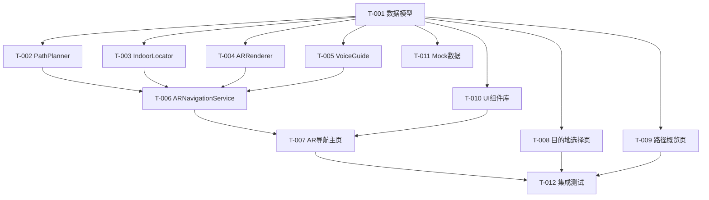

# 真实AR院内导航系统 - 编码任务清单

**版本**: v1.0  
**创建日期**: 2025-01-18  
**最后更新**: 2025-01-18  
**作者**: SDD Agent  
**状态**: 待执行

---

## 任务规划说明

### 任务组织原则
- **按模块划分**: 每个任务对应一个独立模块或功能点
- **依赖关系**: 明确标注任务间的前置依赖
- **优先级**: P0(核心) > P1(重要) > P2(增强)
- **粒度控制**: 每个任务预计工作量2-8小时

### 任务执行流程
1. 按优先级和依赖关系顺序执行
2. 每个任务完成后进行单元测试
3. 模块集成后进行集成测试
4. 全部完成后进行E2E测试

---

## 任务总览

| 任务ID | 任务名称 | 优先级 | 预计工时 | 依赖任务 | 状态 |
|--------|---------|--------|---------|---------|------|
| T-001 | 创建数据模型定义文件 | P0 | 2h | - | 待开始 |
| T-002 | 实现PathPlanner路径规划器 | P0 | 6h | T-001 | 待开始 |
| T-003 | 实现IndoorLocator室内定位服务 | P0 | 5h | T-001 | 待开始 |
| T-004 | 实现ARRenderer渲染引擎 | P0 | 4h | T-001 | 待开始 |
| T-005 | 实现VoiceGuide语音引导服务 | P1 | 3h | T-001 | 待开始 |
| T-006 | 实现ARNavigationService核心服务 | P0 | 6h | T-002,T-003,T-004,T-005 | 待开始 |
| T-007 | 创建AR导航主页面 | P0 | 5h | T-006 | 待开始 |
| T-008 | 创建目的地选择页面 | P0 | 4h | T-001 | 待开始 |
| T-009 | 创建路径概览页面 | P0 | 3h | T-001,T-002 | 待开始 |
| T-010 | 创建UI组件库 | P1 | 4h | T-001 | 待开始 |
| T-011 | 创建Mock数据 | P1 | 2h | T-001 | 待开始 |
| T-012 | 集成测试与优化 | P0 | 4h | T-007,T-008,T-009 | 待开始 |

**总预计工时**: 48小时 (6个工作日)

---

## 详细任务定义

### 任务 T-001: 创建数据模型定义文件

**优先级**: P0  
**预计工时**: 2小时  
**依赖任务**: 无  
**负责模块**: models/ARNavigationModels.ets

#### 任务描述
创建AR导航系统的完整数据模型定义文件,包含所有接口、枚举、类型别名。

#### 输入
- 需求规格文档中的数据模型定义
- 技术设计文档中的数据结构设计

#### 输出
- `entry/src/main/ets/models/ARNavigationModels.ets` 文件

#### 详细步骤
1. 创建文件 `models/ARNavigationModels.ets`
2. 定义基础类型接口:
   - `Position3D` (x, y, z坐标)
   - `Position2D` (x, y坐标)
3. 定义枚举类型:
   - `DestinationCategory` (10种目的地分类)
   - `WaypointType` (6种途经点类型)
   - `Direction` (5种方向)
   - `NavigationMode` (4种导航模式)
   - `HealthLevel` (5种健康等级)
4. 定义核心数据接口:
   - `NavigationDestination` (导航目的地)
   - `Waypoint` (途经点)
   - `NavigationInstruction` (导航指令)
   - `FloorChange` (楼层切换)
   - `NavigationPath` (导航路径)
   - `ARNavigationState` (导航状态)
5. 定义医院建筑数据接口:
   - `BuildingInfo` (建筑信息)
   - `Area` (区域)
   - `Obstacle` (障碍物)
   - `FloorPlan` (楼层平面图)
   - `Connection` (楼层连接)
   - `HospitalBuildingData` (医院建筑数据)
   - `RouteOverride` (路线覆盖)
6. 添加完整的中文注释
7. 使用`export`导出所有类型

#### 验收标准
- ✅ 所有接口和枚举定义完整
- ✅ 类型定义符合ArkTS语法规范
- ✅ 所有字段有中文注释说明
- ✅ 无`any`类型使用
- ✅ 文件可正常编译

#### 代码生成提示
```
请创建文件 entry/src/main/ets/models/ARNavigationModels.ets

要求:
1. 导出所有接口和枚举
2. 使用ArkTS语法(API 12兼容)
3. 所有字段添加中文注释
4. 枚举值使用大写下划线命名
5. 可选字段用 ? 标记
6. 禁止使用 any 类型

参考技术设计文档第4章的数据模型定义。
```

---

### 任务 T-002: 实现PathPlanner路径规划器

**优先级**: P0  
**预计工时**: 6小时  
**依赖任务**: T-001  
**负责模块**: ar/PathPlanner.ets

#### 任务描述
实现室内路径规划算法服务,核心功能包括A*算法、跨楼层路径规划、动态权重优化。

#### 输入
- 数据模型定义 (T-001)
- 医院建筑数据结构
- A*算法设计文档

#### 输出
- `entry/src/main/ets/ar/PathPlanner.ets` 文件

#### 详细步骤
1. 创建单例类 `PathPlanner`
2. 实现 `initialize(buildingData: HospitalBuildingData)` 方法:
   - 加载建筑数据
   - 构建图的邻接表表示
   - 初始化A*算法数据结构
3. 实现 `calculatePath(startPos, destPos, options)` 方法:
   - 调用A*搜索算法
   - 支持跨楼层路径规划
   - 应用动态权重(拥挤度/无障碍)
   - 生成完整NavigationPath对象
4. 实现A*算法核心逻辑:
   - `aStarSearch(startNode, endNode, options)` 方法
   - `heuristic(node, goal)` 启发式函数
   - `getNeighbors(node)` 获取邻居节点
   - `reconstructPath(cameFrom, current)` 路径重建
5. 实现路径后处理:
   - `smoothPath(path)` 路径平滑
   - `generateInstructions(path)` 生成导航指令
6. 实现辅助方法:
   - `getDistance(from, to)` 计算距离
   - `getNearestPOI(position, category)` 查找最近POI
   - `recalculatePath(currentPos)` 重新规划
7. 添加错误处理和日志

#### 验收标准
- ✅ A*算法正确实现,能找到最短路径
- ✅ 支持跨楼层路径规划
- ✅ 无障碍模式能避开楼梯
- ✅ 路径计算时间<2秒(1000节点地图)
- ✅ 生成的导航指令自然流畅
- ✅ 单元测试覆盖率>80%

#### 代码生成提示
```
请创建文件 entry/src/main/ets/ar/PathPlanner.ets

要求:
1. 使用单例模式(getInstance)
2. 实现A*算法,启发式函数使用曼哈顿距离(同楼层)或欧几里得距离(跨楼层)
3. 支持动态权重: 拥挤区域+50%, 楼梯+30%, 电梯-10%
4. 路径平滑算法: 移除角度变化<15度的中间点
5. 导航指令生成规则:
   - 直行: "沿{地标}直行约{距离}米"
   - 转弯: "在{地标}处左转/右转"
   - 换层: "乘坐{电梯名}至{楼层}层"
6. 所有异步操作用try-catch包裹
7. 添加性能监控装饰器
8. 关键算法步骤添加中文注释

参考技术设计文档第3.2节的详细设计。
```

---

### 任务 T-003: 实现IndoorLocator室内定位服务

**优先级**: P0  
**预计工时**: 5小时  
**依赖任务**: T-001  
**负责模块**: ar/IndoorLocator.ets

#### 任务描述
实现室内精准定位服务,支持WiFi指纹、蓝牙Beacon、AR视觉定位的多源融合。

#### 输入
- 数据模型定义 (T-001)
- 定位融合算法设计

#### 输出
- `entry/src/main/ets/ar/IndoorLocator.ets` 文件

#### 详细步骤
1. 创建单例类 `IndoorLocator`
2. 实现定位源管理:
   - `WiFiFingerprintLocator` WiFi指纹定位
   - `BLEBeaconLocator` 蓝牙Beacon定位
   - `ARVisualLocator` AR视觉定位
3. 实现 `initialize()` 方法:
   - 初始化各定位源
   - 申请必要权限
4. 实现 `startTracking()` 方法:
   - 启动WiFi扫描
   - 启动BLE扫描
   - 启动AR定位(可选)
   - 启动定位更新循环
5. 实现 `fusePositions(wifiPos, blePos, arPos)` 融合算法:
   - 加权平均融合
   - 动态权重分配
   - 卡尔曼滤波平滑
6. 实现 `getCurrentPosition()` 方法:
   - 返回融合后的位置
   - 检测信号丢失
7. 实现信号质量监测:
   - `checkSignalLoss()` 信号丢失检测
   - `getSignalStrength()` 获取信号强度
8. 添加位置更新回调机制

#### 验收标准
- ✅ 定位精度达到±3米(95%情况)
- ✅ 定位更新频率≥1Hz
- ✅ 信号丢失时使用最后已知位置
- ✅ 多源融合算法正确实现
- ✅ 权限申请流程完整
- ✅ 单元测试覆盖率>80%

#### 代码生成提示
```
请创建文件 entry/src/main/ets/ar/IndoorLocator.ets

要求:
1. 使用单例模式
2. 实现多源定位融合:
   - WiFi指纹定位: 精度±3-5米,权重0.3
   - 蓝牙Beacon定位: 精度±1-2米,权重0.5
   - AR视觉定位: 精度±0.5米,权重0.2(可选)
3. 加权融合公式: pos = w1*pos1 + w2*pos2 + w3*pos3
4. 信号丢失检测: 5秒未更新视为丢失
5. 使用卡尔曼滤波平滑位置数据
6. 定位更新频率1Hz
7. 添加权限检查和申请逻辑
8. 所有异步操作用try-catch包裹

参考技术设计文档第3.3节的详细设计。
```

---

### 任务 T-004: 实现ARRenderer渲染引擎

**优先级**: P0  
**预计工时**: 4小时  
**依赖任务**: T-001  
**负责模块**: ar/ARRenderer.ets

#### 任务描述
实现AR画面渲染引擎,使用Canvas 2D模拟3D效果,绘制方向箭头和导航信息。

#### 输入
- 数据模型定义 (T-001)
- AR渲染设计文档

#### 输出
- `entry/src/main/ets/ar/ARRenderer.ets` 文件

#### 详细步骤
1. 创建单例类 `ARRenderer`
2. 实现 `initialize()` 方法:
   - 获取Canvas上下文
   - 初始化相机流
   - 设置渲染参数
3. 实现 `startRendering()` 渲染循环:
   - 使用`requestAnimationFrame`
   - 调用`renderFrame()`方法
4. 实现 `renderFrame()` 主渲染逻辑:
   - 清空画布
   - 绘制相机画面
   - 绘制3D方向箭头
   - 绘制导航信息叠加
5. 实现 `drawDirectionArrow()` 箭头绘制:
   - 根据朝向角度旋转
   - 根据状态改变颜色
   - 绘制箭头形状
6. 实现 `updateArrowDirection(direction)` 更新朝向
7. 实现 `updateArrowColor(color)` 更新颜色
8. 实现性能优化:
   - 离屏Canvas预渲染
   - 避免在循环中创建对象
9. 实现 `stopRendering()` 停止渲染

#### 验收标准
- ✅ AR渲染帧率≥30fps
- ✅ 箭头能根据朝向正确旋转
- ✅ 箭头颜色能动态改变
- ✅ 相机画面正常显示
- ✅ 渲染循环能正常启动和停止
- ✅ 内存无泄漏

#### 代码生成提示
```
请创建文件 entry/src/main/ets/ar/ARRenderer.ets

要求:
1. 使用单例模式
2. 使用Canvas 2D绘制,模拟3D效果
3. 渲染循环使用requestAnimationFrame,目标30fps
4. 方向箭头绘制:
   - 形状: 三角箭头,尖端指向上方
   - 旋转: 根据direction角度(0-360度)
   - 颜色: 绿色(正常)/黄色(转弯)/红色(到达)
5. 相机画面绘制: 使用Camera API获取实时画面
6. 性能优化:
   - 使用离屏Canvas预渲染箭头
   - 避免在渲染循环中创建新对象
7. 资源释放: stopRendering时释放相机资源
8. 添加帧率监控日志

参考技术设计文档第3.4节的详细设计。
```

---

### 任务 T-005: 实现VoiceGuide语音引导服务

**优先级**: P1  
**预计工时**: 3小时  
**依赖任务**: T-001  
**负责模块**: ar/VoiceGuide.ets

#### 任务描述
实现TTS语音引导服务,在关键导航节点自动播报导航指令。

#### 输入
- 数据模型定义 (T-001)
- TTS API文档

#### 输出
- `entry/src/main/ets/ar/VoiceGuide.ets` 文件

#### 详细步骤
1. 创建单例类 `VoiceGuide`
2. 实现 `initialize()` 方法:
   - 初始化TTS引擎
   - 设置语言为中文
   - 设置播报速度
3. 实现 `announce(text)` 播报方法:
   - 检查静音状态
   - 调用TTS API播报
   - 处理播报队列
4. 实现 `checkAndAnnounce(currentPos)` 智能播报:
   - 检查是否到达播报触发点
   - 判断播报时机(提前距离)
   - 生成播报文本
   - 避免重复播报
5. 实现 `shouldAnnounce(waypoint, distance)` 判断逻辑:
   - 转弯节点: 提前5米
   - 电梯节点: 提前10米
   - 到达终点: 提前3米
6. 实现 `setMuted(muted)` 静音切换
7. 实现播报队列管理:
   - 避免播报重叠
   - 优先级队列

#### 验收标准
- ✅ TTS播报功能正常
- ✅ 播报时机准确(提前距离正确)
- ✅ 静音切换功能正常
- ✅ 不会重复播报同一节点
- ✅ 播报内容简洁明确
- ✅ 单元测试覆盖率>80%

#### 代码生成提示
```
请创建文件 entry/src/main/ets/ar/VoiceGuide.ets

要求:
1. 使用单例模式
2. 使用HarmonyOS TTS API
3. 播报时机控制:
   - 转弯: 提前5米播报
   - 电梯: 提前10米播报
   - 到达: 提前3米播报
4. 播报内容使用ttsText字段(精简版)
5. 避免重复播报: 记录lastAnnouncedWaypointId
6. 静音功能: isMuted状态控制
7. 播报队列: 避免多个播报重叠
8. 语言设置: zh-CN, 速度1.0

参考技术设计文档第3.5节的详细设计。
```

---

### 任务 T-006: 实现ARNavigationService核心服务

**优先级**: P0  
**预计工时**: 6小时  
**依赖任务**: T-002, T-003, T-004, T-005  
**负责模块**: ar/ARNavigationService.ets

#### 任务描述
实现AR导航核心服务,作为导航流程编排中心,协调各子服务完成完整导航流程。

#### 输入
- PathPlanner (T-002)
- IndoorLocator (T-003)
- ARRenderer (T-004)
- VoiceGuide (T-005)

#### 输出
- `entry/src/main/ets/ar/ARNavigationService.ets` 文件

#### 详细步骤
1. 创建单例类 `ARNavigationService`
2. 注入子服务实例:
   - PathPlanner
   - IndoorLocator
   - ARRenderer
   - VoiceGuide
3. 实现 `startNavigation(destination, options)` 启动导航:
   - 检查导航状态
   - 获取当前位置
   - 计算导航路径
   - 初始化AR渲染器
   - 启动定位监听
   - 启动导航循环
   - 更新导航状态
4. 实现导航循环 `startNavigationLoop()`:
   - 每秒更新一次
   - 获取当前位置
   - 更新导航状态
   - 检查偏航
   - 检查到达
   - 更新AR渲染
   - 触发语音引导
5. 实现 `handlePositionUpdate(position)` 位置更新处理
6. 实现 `checkDeviation(currentPos)` 偏航检测:
   - 计算到路径的距离
   - 距离>5米触发重规划
7. 实现 `handleArrival()` 到达处理:
   - 显示到达动画
   - 播报到达语音
   - 保存导航记录
8. 实现 `pauseNavigation()` 暂停导航
9. 实现 `resumeNavigation()` 恢复导航
10. 实现 `endNavigation()` 结束导航:
    - 停止导航循环
    - 停止定位监听
    - 停止AR渲染
    - 释放资源
11. 实现 `setNavigationMode(mode)` 模式切换

#### 验收标准
- ✅ 导航流程完整可运行
- ✅ 导航状态正确转换
- ✅ 偏航检测和重规划功能正常
- ✅ 到达检测准确(±3米)
- ✅ 各子服务协调正确
- ✅ 资源正确释放,无内存泄漏
- ✅ 集成测试通过

#### 代码生成提示
```
请创建文件 entry/src/main/ets/ar/ARNavigationService.ets

要求:
1. 使用单例模式
2. 依赖注入子服务: PathPlanner, IndoorLocator, ARRenderer, VoiceGuide
3. 导航循环: setInterval, 1秒更新一次
4. 偏航检测: 距离路径>5米触发重规划
5. 到达检测: 剩余距离<3米触发到达
6. 状态管理: 使用ARNavigationState接口
7. 资源管理: endNavigation时释放所有资源
8. 错误处理: 所有异步操作用try-catch包裹
9. 日志记录: 关键步骤添加日志
10. 性能监控: 添加性能监控装饰器

参考技术设计文档第3.1节的详细设计。
```

---

### 任务 T-007: 创建AR导航主页面

**优先级**: P0  
**预计工时**: 5小时  
**依赖任务**: T-006  
**负责模块**: pages/ARNavigationPage.ets

#### 任务描述
创建AR导航主页面,包含AR相机视图、3D箭头、导航信息面板和操作按钮。

#### 输入
- ARNavigationService (T-006)
- UI组件库 (T-010)

#### 输出
- `entry/src/main/ets/pages/ARNavigationPage.ets` 文件

#### 详细步骤
1. 创建页面 `ARNavigationPage`
2. 定义页面状态:
   - `@State navigationState: ARNavigationState`
   - `@State isMuted: boolean`
   - `@State showModeSelector: boolean`
3. 实现页面布局:
   - 顶部栏: 返回按钮、目的地名称、模式切换
   - 主区域: AR相机视图(Canvas)
   - 底部面板: 导航信息、进度条、操作按钮
4. 实现生命周期:
   - `aboutToAppear()`: 解析路由参数,启动导航
   - `aboutToDisappear()`: 结束导航,释放资源
5. 实现AR视图绑定:
   - 获取Canvas上下文
   - 传递给ARRenderer
6. 实现导航信息更新:
   - 监听navigationState变化
   - 更新UI显示
7. 实现交互功能:
   - 结束导航按钮
   - 静音切换按钮
   - 模式切换菜单
8. 实现降级UI:
   - AR失败时显示2D地图
   - 显示错误提示
9. 实现到达动画:
   - 剩余距离<3米时显示
   - 目的地详情卡片

#### 验收标准
- ✅ 页面布局符合设计稿
- ✅ AR视图正常显示
- ✅ 导航信息实时更新
- ✅ 交互功能正常
- ✅ 降级UI正常显示
- ✅ 到达动画正常
- ✅ 页面性能良好(无卡顿)

#### 代码生成提示
```
请创建文件 entry/src/main/ets/pages/ARNavigationPage.ets

要求:
1. 使用@Entry @Component装饰器
2. 页面布局:
   - Stack布局实现AR视图与UI叠加
   - 顶部栏: Row布局,返回按钮+标题+模式切换
   - 主区域: Canvas组件(全屏)
   - 底部面板: Column布局,半透明背景
3. 状态管理:
   - @State navigationState: 导航状态
   - @State isMuted: 静音状态
4. 生命周期:
   - aboutToAppear: 解析路由参数,调用ARNavigationService.startNavigation()
   - aboutToDisappear: 调用ARNavigationService.endNavigation()
5. AR视图: Canvas绑定ARRenderer
6. 导航信息: 显示当前指令、剩余距离、预计时间、进度条
7. 交互: 结束导航、静音切换、模式切换
8. 降级: AR失败时显示2D地图模式
9. 样式: 使用GlobalTheme统一风格
10. 响应式: 支持横竖屏适配

参考技术设计文档第7.2节的UI设计。
```

---

### 任务 T-008: 创建目的地选择页面

**优先级**: P0  
**预计工时**: 4小时  
**依赖任务**: T-001  
**负责模块**: pages/DestinationSelectPage.ets

#### 任务描述
创建目的地选择页面,提供搜索、分类浏览、收藏功能。

#### 输入
- 数据模型定义 (T-001)
- Mock数据 (T-011)

#### 输出
- `entry/src/main/ets/pages/DestinationSelectPage.ets` 文件

#### 详细步骤
1. 创建页面 `DestinationSelectPage`
2. 定义页面状态:
   - `@State searchKeyword: string`
   - `@State selectedCategory: DestinationCategory`
   - `@State destinationList: NavigationDestination[]`
   - `@State favoriteList: string[]`
3. 实现页面布局:
   - 顶部: 搜索框
   - 中部: 分类Tab + 目的地列表
   - 底部: 收藏快捷入口
4. 实现搜索功能:
   - 输入时实时过滤
   - 支持科室名称、编号搜索
   - 显示搜索结果数量
5. 实现分类浏览:
   - Tab切换分类
   - 显示分类图标和数量
   - 分类内搜索
6. 实现收藏功能:
   - 添加/移除收藏
   - 收藏列表持久化
   - 收藏标识显示
7. 实现目的地列表:
   - LazyForEach虚拟滚动
   - 显示名称、位置、距离
   - 点击跳转到路径概览页
8. 实现热门推荐:
   - 根据tags筛选热门目的地
   - 优先显示在列表顶部

#### 验收标准
- ✅ 搜索功能正常,响应<500ms
- ✅ 分类浏览功能正常
- ✅ 收藏功能正常,数据持久化
- ✅ 目的地列表显示正确
- ✅ 点击跳转正常
- ✅ 页面性能良好

#### 代码生成提示
```
请创建文件 entry/src/main/ets/pages/DestinationSelectPage.ets

要求:
1. 使用@Entry @Component装饰器
2. 页面布局:
   - 顶部: Search组件(搜索框)
   - 中部: Tabs组件(分类) + List组件(目的地列表)
   - 底部: Row布局(收藏快捷入口)
3. 搜索功能:
   - TextInput组件,实时搜索
   - 过滤逻辑: 名称/编号匹配
   - 响应时间<500ms
4. 分类浏览:
   - Tabs组件,10个分类Tab
   - 每个Tab显示图标和数量
5. 目的地列表:
   - List组件,LazyForEach虚拟滚动
   - ListItem显示: 名称、位置、距离、收藏标识
   - 点击跳转到NavigationSummaryPage
6. 收藏功能:
   - 使用Preferences存储
   - 点击收藏图标切换状态
7. 热门推荐: 根据tags='热门'筛选
8. 样式: 使用GlobalTheme统一风格

参考技术设计文档第7.1节的页面结构。
```

---

### 任务 T-009: 创建路径概览页面

**优先级**: P0  
**预计工时**: 3小时  
**依赖任务**: T-001, T-002  
**负责模块**: pages/NavigationSummaryPage.ets

#### 任务描述
创建路径概览页面,显示路径信息摘要和"开始导航"按钮。

#### 输入
- 数据模型定义 (T-001)
- PathPlanner (T-002)

#### 输出
- `entry/src/main/ets/pages/NavigationSummaryPage.ets` 文件

#### 详细步骤
1. 创建页面 `NavigationSummaryPage`
2. 定义页面状态:
   - `@State destination: NavigationDestination`
   - `@State navigationPath: NavigationPath`
   - `@State isLoading: boolean`
3. 实现页面布局:
   - 顶部: 返回按钮、标题
   - 中部: 起点终点信息、路径摘要
   - 底部: "开始导航"按钮
4. 实现路径计算:
   - 获取当前位置
   - 调用PathPlanner.calculatePath()
   - 显示加载状态
5. 实现路径信息显示:
   - 总距离、预计时间
   - 途经点摘要列表
   - 楼层切换信息
6. 实现"开始导航"按钮:
   - 点击跳转到ARNavigationPage
   - 传递destinationId和pathData
7. 实现错误处理:
   - 路径计算失败提示
   - 提供重试按钮

#### 验收标准
- ✅ 路径计算正确
- ✅ 路径信息显示完整
- ✅ 点击"开始导航"正常跳转
- ✅ 加载状态正常显示
- ✅ 错误处理完善

#### 代码生成提示
```
请创建文件 entry/src/main/ets/pages/NavigationSummaryPage.ets

要求:
1. 使用@Entry @Component装饰器
2. 页面布局:
   - 顶部: Row布局(返回按钮+标题)
   - 中部: Column布局(起点终点卡片+路径摘要)
   - 底部: Button组件("开始导航")
3. 路径计算:
   - aboutToAppear中调用PathPlanner.calculatePath()
   - 显示Loading动画
4. 路径信息:
   - 总距离: "约XXX米"
   - 预计时间: "约X分钟"
   - 途经点: 列表显示,最多5个
   - 楼层切换: 显示电梯/楼梯信息
5. 开始导航按钮:
   - 点击跳转到ARNavigationPage
   - 传递参数: destinationId, pathData(JSON序列化)
6. 错误处理:
   - 计算失败显示错误提示
   - 提供重试按钮
7. 样式: 使用GlobalTheme统一风格

参考技术设计文档第7.1节的页面结构。
```

---

### 任务 T-010: 创建UI组件库

**优先级**: P1  
**预计工时**: 4小时  
**依赖任务**: T-001  
**负责模块**: components/

#### 任务描述
创建可复用的UI组件库,包括ARView、DirectionArrow、NavigationProgress、DestinationCard等组件。

#### 输入
- 数据模型定义 (T-001)
- UI设计规范

#### 输出
- `entry/src/main/ets/components/ARView.ets`
- `entry/src/main/ets/components/DirectionArrow.ets`
- `entry/src/main/ets/components/NavigationProgress.ets`
- `entry/src/main/ets/components/DestinationCard.ets`

#### 详细步骤
1. 创建 `ARView` 组件:
   - Canvas绑定
   - 尺寸自适应
   - 渲染上下文传递
2. 创建 `DirectionArrow` 组件:
   - 箭头图片/绘制
   - 旋转动画
   - 颜色动态改变
3. 创建 `NavigationProgress` 组件:
   - 当前指令显示
   - 剩余距离显示
   - 预计时间显示
   - 进度条
4. 创建 `DestinationCard` 组件:
   - 目的地信息展示
   - 收藏按钮
   - 距离显示
   - 点击事件
5. 添加组件属性定义:
   - 使用`@Prop`定义输入属性
   - 使用`@Link`定义双向绑定
6. 添加样式主题:
   - 使用GlobalTheme
   - 支持自定义样式

#### 验收标准
- ✅ 所有组件可独立使用
- ✅ 组件属性定义完整
- ✅ 组件样式符合设计规范
- ✅ 组件可复用性强
- ✅ 组件性能良好

#### 代码生成提示
```
请创建以下组件文件:

1. components/ARView.ets
   - Canvas组件封装
   - 属性: canvasWidth, canvasHeight
   - 事件: onReady传递渲染上下文

2. components/DirectionArrow.ets
   - 方向箭头组件
   - 属性: direction(角度), color(颜色)
   - 使用rotate旋转, Image组件或Canvas绘制

3. components/NavigationProgress.ets
   - 导航进度组件
   - 属性: currentDistance, totalDistance, instruction, estimatedTime
   - 使用Progress组件显示进度条

4. components/DestinationCard.ets
   - 目的地卡片组件
   - 属性: destination(NavigationDestination), isFavorite, distance
   - 事件: onClick, onFavoriteToggle

要求:
- 所有组件使用@Component装饰器
- 使用@Prop定义输入属性
- 使用@Link定义双向绑定
- 样式使用GlobalTheme
- 添加完整的属性注释

参考技术设计文档第7.2节的组件设计。
```

---

### 任务 T-011: 创建Mock数据

**优先级**: P1  
**预计工时**: 2小时  
**依赖任务**: T-001  
**负责模块**: mock/arMock.ets

#### 任务描述
创建完整的Mock数据,包括医院建筑数据、POI列表、示例导航路径等。

#### 输入
- 数据模型定义 (T-001)

#### 输出
- `entry/src/main/ets/mock/arMock.ets` 文件

#### 详细步骤
1. 创建 `getMockHospitalData()` 函数:
   - 返回完整HospitalBuildingData
   - 包含2栋楼(门诊楼+住院楼)
   - 每栋楼3-5层
   - 每层楼平面图数据
   - 至少20个POI
   - 楼层连接(电梯/楼梯)
2. 创建 `getMockDestinations()` 函数:
   - 返回常用目的地列表
   - 按热度排序
   - 包含各种分类
3. 创建 `getMockNavigationPath()` 函数:
   - 返回示例导航路径
   - 从门诊大厅到内科诊区
   - 包含至少6个waypoint
   - 包含楼层切换
4. 创建 `getMockDestinationsByCategory()` 函数:
   - 按分类筛选目的地
5. 确保数据真实合理:
   - 坐标比例正确
   - 距离计算合理
   - 楼层关系正确

#### 验收标准
- ✅ Mock数据结构完整
- ✅ 数据真实合理
- ✅ 所有类型匹配接口定义
- ✅ 数据覆盖各种场景
- ✅ 可用于开发和测试

#### 代码生成提示
```
请创建文件 entry/src/main/ets/mock/arMock.ets

要求:
1. getMockHospitalData():
   - 2栋楼: 门诊大楼(3层), 住院大楼(5层)
   - 每层楼平面图: walkableAreas, obstacles
   - 20+个POI, 覆盖所有DestinationCategory
   - 楼层连接: 电梯+楼梯

2. getMockDestinations():
   - 返回常用目的地列表
   - 按tags='热门'排序

3. getMockNavigationPath():
   - 示例路径: 门诊大厅 → 内科诊区301
   - 总距离: 约185米
   - 预计时间: 约2.5分钟
   - waypoints: 至少6个
   - floorChanges: 1次(乘电梯)
   - instructions: 至少4条

4. 数据要求:
   - 坐标真实合理(比例1:1)
   - 距离计算正确
   - 楼层关系正确
   - 所有字符串使用中文

参考技术设计文档第4.1节的数据模型和需求规格文档第5章。
```

---

### 任务 T-012: 集成测试与优化

**优先级**: P0  
**预计工时**: 4小时  
**依赖任务**: T-007, T-008, T-009  
**负责模块**: 全局

#### 任务描述
进行模块集成测试,验证完整导航流程,优化性能和用户体验。

#### 输入
- 所有已完成的模块

#### 输出
- 集成测试报告
- 性能优化记录
- Bug修复记录

#### 详细步骤
1. **模块集成测试**:
   - 测试ARNavigationService与各子服务集成
   - 测试页面跳转流程
   - 测试数据流转
2. **完整流程测试**:
   - 测试从首页到导航完成的完整流程
   - 测试各种导航场景(同楼层/跨楼层/无障碍)
   - 测试异常情况(AR失败/定位丢失/偏航)
3. **性能测试**:
   - 测试AR渲染帧率
   - 测试路径计算时间
   - 测试定位更新频率
   - 测试内存占用
4. **性能优化**:
   - 优化AR渲染性能
   - 优化路径计算性能
   - 优化内存使用
5. **用户体验优化**:
   - 优化UI响应速度
   - 优化动画流畅度
   - 优化错误提示
6. **Bug修复**:
   - 记录发现的Bug
   - 修复Bug
   - 回归测试

#### 验收标准
- ✅ 所有集成测试通过
- ✅ 完整导航流程正常
- ✅ 性能指标达标:
  - AR渲染≥30fps
  - 路径计算<2秒
  - 定位更新≥1Hz
  - 内存增量<100MB
- ✅ 无严重Bug
- ✅ 用户体验良好

#### 测试用例
```
集成测试用例:

1. 完整导航流程测试
   - 首页 → 目的地选择 → 路径概览 → AR导航 → 到达
   - 验证每个步骤的数据流转正确

2. 跨楼层导航测试
   - 选择不同楼层的目的地
   - 验证路径包含楼层切换
   - 验证电梯/楼梯选择正确

3. 无障碍模式测试
   - 开启无障碍模式
   - 验证路径避开楼梯
   - 验证优先选择电梯

4. 偏航重规划测试
   - 模拟偏离路线
   - 验证自动重规划触发
   - 验证新路径正确

5. AR失败降级测试
   - 模拟AR初始化失败
   - 验证自动切换到2D地图模式
   - 验证导航不中断

6. 定位丢失处理测试
   - 模拟定位信号丢失
   - 验证使用最后已知位置
   - 验证显示提示信息

7. 性能测试
   - 测试AR渲染帧率(目标≥30fps)
   - 测试路径计算时间(目标<2秒)
   - 测试内存占用(目标<100MB增量)
```

---

## 任务执行建议

### 执行顺序
建议按以下顺序执行任务:

**第一阶段: 基础模块 (第1天)**
1. T-001: 创建数据模型定义文件
2. T-011: 创建Mock数据

**第二阶段: 核心服务 (第2-3天)**
3. T-002: 实现PathPlanner路径规划器
4. T-003: 实现IndoorLocator室内定位服务
5. T-004: 实现ARRenderer渲染引擎
6. T-005: 实现VoiceGuide语音引导服务

**第三阶段: 业务编排 (第4天)**
7. T-006: 实现ARNavigationService核心服务

**第四阶段: UI开发 (第5天)**
8. T-010: 创建UI组件库
9. T-008: 创建目的地选择页面
10. T-009: 创建路径概览页面
11. T-007: 创建AR导航主页面

**第五阶段: 测试优化 (第6天)**
12. T-012: 集成测试与优化

### 开发规范
- 每个任务完成后进行代码审查
- 每个模块完成后进行单元测试
- 使用Git进行版本控制,每个任务一个分支
- 及时更新文档和注释

### 风险提示
- **T-003 IndoorLocator**: 定位功能依赖硬件,需在真机测试
- **T-004 ARRenderer**: AR渲染性能关键,需重点优化
- **T-006 ARNavigationService**: 核心服务,逻辑复杂,需充分测试

---

## 附录

### A. 文件清单

完成所有任务后,将创建以下文件:

```
entry/src/main/ets/
├── ar/
│   ├── ARNavigationService.ets  (T-006)
│   ├── ARRenderer.ets           (T-004)
│   ├── PathPlanner.ets          (T-002)
│   ├── IndoorLocator.ets        (T-003)
│   └── VoiceGuide.ets           (T-005)
├── pages/
│   ├── ARNavigationPage.ets     (T-007)
│   ├── DestinationSelectPage.ets(T-008)
│   └── NavigationSummaryPage.ets(T-009)
├── components/
│   ├── ARView.ets               (T-010)
│   ├── DirectionArrow.ets       (T-010)
│   ├── NavigationProgress.ets   (T-010)
│   └── DestinationCard.ets      (T-010)
├── models/
│   └── ARNavigationModels.ets   (T-001)
└── mock/
    └── arMock.ets               (T-011)
```

### B. 依赖关系图



### C. 变更历史

| 版本 | 日期 | 变更内容 | 作者 |
|-----|------|---------|------|
| v1.0 | 2025-01-18 | 初始版本,完成所有任务定义 | SDD Agent |

---

**文档结束**
