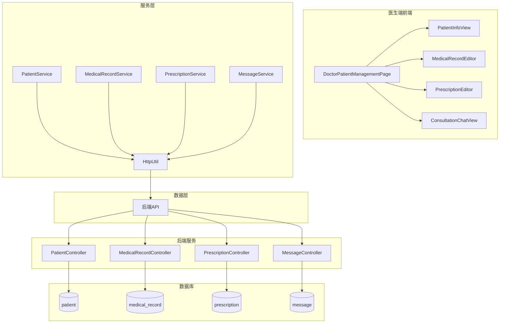
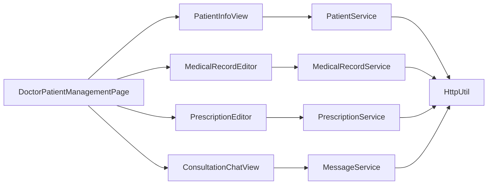
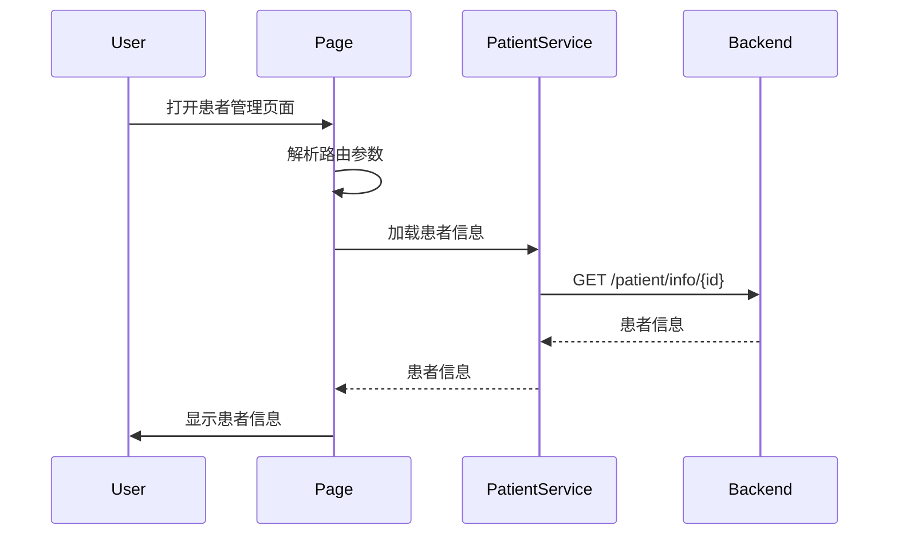
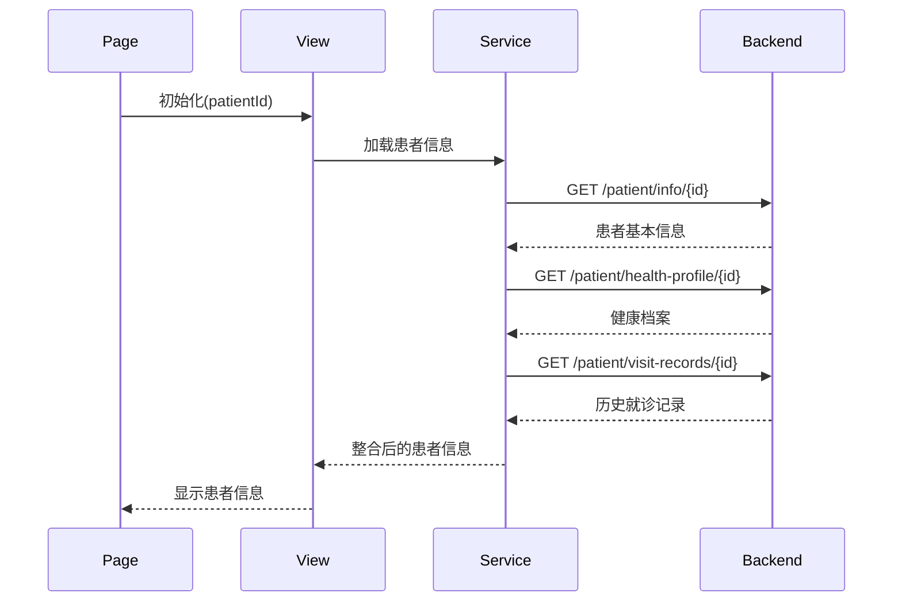
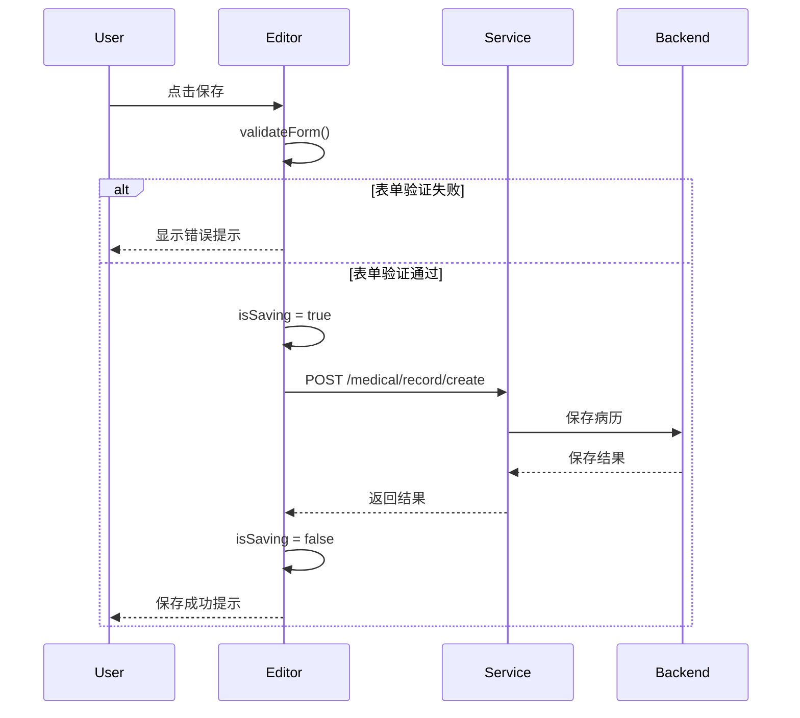
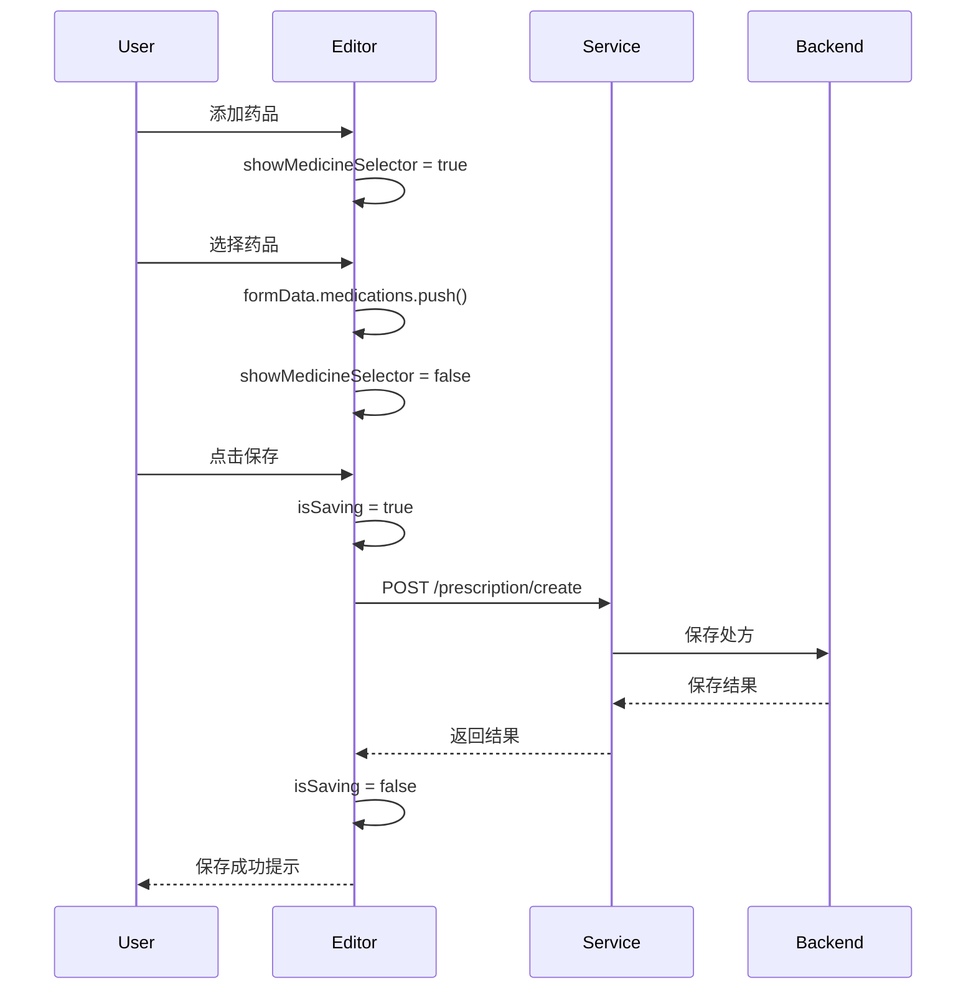
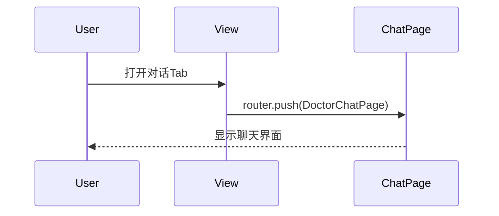
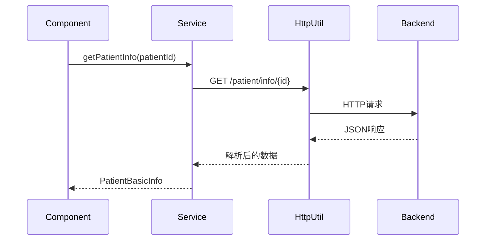
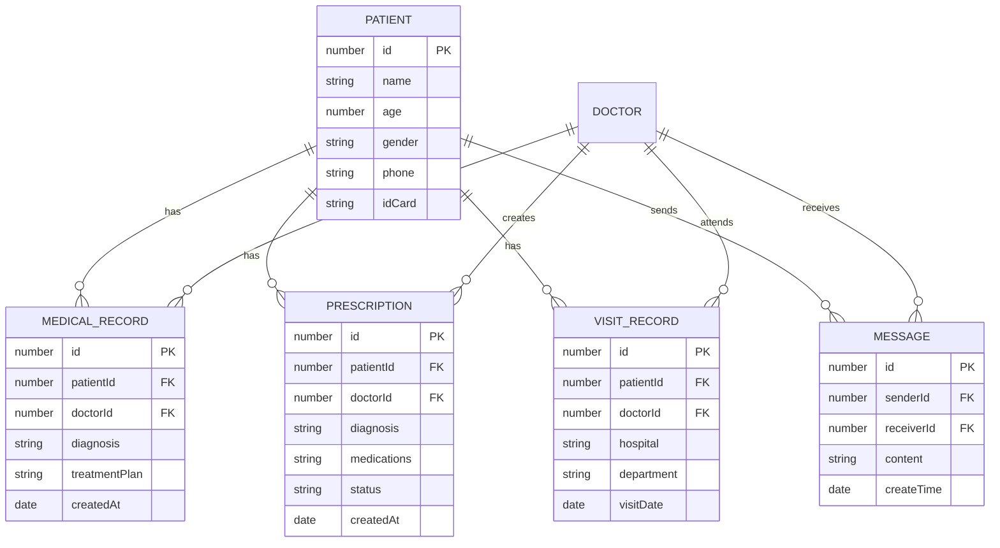
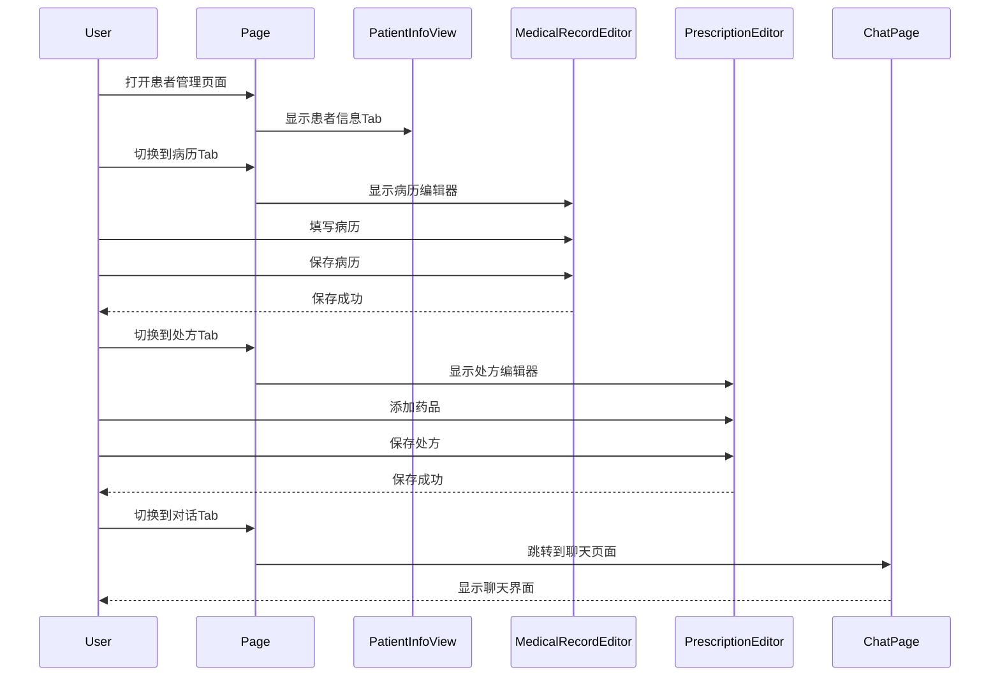

# 医生端患者管理功能 - 技术设计文档

**版本**: v1.0
**创建日期**: 2024-12-19
**最后更新**: 2024-12-19
**作者**: CodeArts Agent
**状态**: 草稿

---

## 1. 设计概述

### 1.1 设计目标

为医生端提供完整的患者管理能力，包括患者信息查看、病历书写、处方开具等核心医疗服务。该设计需要与现有患者端、消息系统、病历系统、处方系统紧密集成，确保医疗服务的连续性和数据一致性。

### 1.2 技术选型

| 技术领域 | 选型 | 理由 |
|---------|------|------|
| 前端框架 | ArkTS | HarmonyOS 原生开发语言，性能优秀 |
| UI组件 | ArkUI | HarmonyOS 原生UI框架 |
| 状态管理 | @State/@StorageLink | ArkTS内置响应式状态管理 |
| 网络请求 | HttpUtil | 项目已封装的HTTP工具 |
| 数据存储 | RDB | 结构化数据存储 |
| 类型安全 | ArkTS强类型 | 禁止any类型，使用精确类型 |

### 1.3 设计约束

- 必须符合国家医疗数据安全管理规范
- 必须符合电子病历应用管理规范
- 必须符合处方管理办法
- 医生只能查看与其建立咨询关系的患者信息
- 敏感信息（如身份证号）需要脱敏显示
- 所有医疗数据传输必须加密

---

## 2. 架构设计

### 2.1 整体架构



### 2.2 模块划分

| 模块名称 | 职责描述 |
|---------|---------|
| DoctorPatientManagementPage | 医生端患者管理主页面，协调各子功能模块 |
| PatientInfoView | 患者信息查看组件，展示患者基本信息、健康档案、历史就诊记录 |
| MedicalRecordEditor | 病历编辑组件，支持创建、编辑、查看病历 |
| PrescriptionEditor | 处方编辑组件，支持开具、查看处方 |
| ConsultationChatView | 咨询对话组件，与现有DoctorChatPage集成 |
| PatientService | 患者信息服务，封装患者信息相关API调用 |
| MedicalRecordService | 病历服务，封装病历相关API调用 |
| PrescriptionService | 处方服务，封装处方相关API调用 |
| MessageService | 消息服务，复用现有消息API |

### 2.3 依赖关系



---

## 3. 模块详细设计

### 3.1 DoctorPatientManagementPage

#### 3.1.1 职责定义
- 作为医生端患者管理的入口页面
- 接收路由参数（患者ID、医生ID）
- 协调各子功能模块的显示和交互
- 管理页面状态（当前选中的功能Tab、患者信息等）

#### 3.1.2 类/接口设计

```arkts
interface DoctorPatientManagementParams {
  patientId: number;           // 患者ID
  doctorId: number;            // 医生ID
  patientName: string;         // 患者姓名
  doctorName: string;          // 医生姓名
}

@Entry
@Component
struct DoctorPatientManagementPage {
  @StorageLink('userId') currentUserId: number = 0;
  @State patientId: number = 0;
  @State doctorId: number = 0;
  @State patientName: string = '';
  @State doctorName: string = '';
  @State currentTab: number = 0;  // 0:患者信息, 1:病历, 2:处方, 3:对话
  
  private aboutToAppear(): void;
  private build(): void;
}
```

#### 3.1.3 关键方法

| 方法名 | 参数 | 返回值 | 说明 |
|-------|------|--------|------|
| aboutToAppear | - | void | 初始化页面，加载路由参数 |
| build | - | void | 构建页面UI |

#### 3.1.4 数据流



---

### 3.2 PatientInfoView

#### 3.2.1 职责定义
- 展示患者基本信息（姓名、年龄、性别、联系方式）
- 展示患者健康档案（过敏史、既往病史、家族病史）
- 展示患者历史就诊记录
- 支持实时更新患者信息

#### 3.2.2 类/接口设计

```arkts
interface PatientBasicInfo {
  id: number;
  name: string;
  age: number;
  gender: string;
  phone: string;
  idCard: string;  // 脱敏显示
  avatar?: string;
}

interface PatientHealthProfile {
  allergies: string[];
  pastHistory: string[];
  familyHistory: string[];
}

interface PatientVisitRecord {
  id: number;
  visitDate: string;
  hospital: string;
  department: string;
  doctor: string;
  diagnosis: string;
  chiefComplaint: string;
}

@Component
export struct PatientInfoView {
  @Prop patientId: number = 0;
  @State basicInfo: PatientBasicInfo | null = null;
  @State healthProfile: PatientHealthProfile | null = null;
  @State visitRecords: PatientVisitRecord[] = [];
  @State isLoading: boolean = true;
  
  private aboutToAppear(): void;
  private build(): void;
}
```

#### 3.2.3 关键方法

| 方法名 | 参数 | 返回值 | 说明 |
|-------|------|--------|------|
| aboutToAppear | - | void | 加载患者信息 |
| loadPatientInfo | - | Promise\<void\> | 加载患者基本信息 |
| loadHealthProfile | - | Promise\<void\> | 加载健康档案 |
| loadVisitRecords | - | Promise\<void\> | 加载历史就诊记录 |
| desensitizeIdCard | idCard: string | string | 身份证号脱敏 |

#### 3.2.4 数据流



---

### 3.3 MedicalRecordEditor

#### 3.3.1 职责定义
- 创建新病历
- 编辑已有病历
- 查看病历详情
- 保存病历到后端

#### 3.3.2 类/接口设计

```arkts
interface MedicalRecordFormData {
  patientId: number;
  doctorId: number;
  patientName: string;
  doctorName: string;
  hospital: string;
  department: string;
  visitDate: string;
  chiefComplaint: string;
  presentIllness: string;
  pastHistory: string;
  personalHistory: string;
  familyHistory: string;
  physicalExam: string;
  auxiliaryExam: string;
  diagnosis: string;
  treatmentPlan: string;
  doctorAdvice: string;
}

@Component
export struct MedicalRecordEditor {
  @Prop patientId: number = 0;
  @Prop doctorId: number = 0;
  @Prop patientName: string = '';
  @Prop doctorName: string = '';
  @State recordId: number = 0;  // 0表示新建，非0表示编辑
  @State formData: MedicalRecordFormData = new MedicalRecordFormData();
  @State isSaving: boolean = false;
  
  private aboutToAppear(): void;
  private build(): void;
  private saveRecord(): Promise\<void\>;
  private loadRecord(): Promise\<void\>;
}
```

#### 3.3.3 关键方法

| 方法名 | 参数 | 返回值 | 说明 |
|-------|------|--------|------|
| aboutToAppear | - | void | 初始化，如果是编辑模式则加载已有病历 |
| loadRecord | - | Promise\<void\> | 加载已有病历数据 |
| saveRecord | - | Promise\<void\> | 保存病历（新建或更新） |
| validateForm | - | boolean | 表单验证 |

#### 3.3.4 数据流



---

### 3.4 PrescriptionEditor

#### 3.4.1 职责定义
- 开具新处方
- 查看已有处方
- 添加/删除药品
- 设置药品用法用量

#### 3.4.2 类/接口设计

```arkts
interface PrescriptionMedication {
  medicineId: number;
  medicineName: string;
  specification: string;
  dosage: string;
  frequency: string;
  quantity: number;
  unit: string;
}

interface PrescriptionFormData {
  patientId: number;
  patientName: string;
  doctorId: number;
  doctorName: string;
  diagnosis: string;
  medications: PrescriptionMedication[];
  notes: string;
}

@Component
export struct PrescriptionEditor {
  @Prop patientId: number = 0;
  @Prop patientName: string = '';
  @Prop doctorId: number = 0;
  @Prop doctorName: string = '';
  @State formData: PrescriptionFormData = new PrescriptionFormData();
  @State isSaving: boolean = false;
  @State showMedicineSelector: boolean = false;
  
  private build(): void;
  private addMedication(): void;
  private removeMedication(index: number): void;
  private savePrescription(): Promise\<void\>;
}
```

#### 3.4.3 关键方法

| 方法名 | 参数 | 返回值 | 说明 |
|-------|------|--------|------|
| addMedication | - | void | 添加药品 |
| removeMedication | index: number | void | 删除指定位置的药品 |
| savePrescription | - | Promise\<void\> | 保存处方 |

#### 3.4.4 数据流



---

### 3.5 ConsultationChatView

#### 3.5.1 职责定义
- 与患者进行实时对话
- 复用现有的DoctorChatPage组件

#### 3.5.2 类/接口设计

```arkts
@Component
export struct ConsultationChatView {
  @Prop patientId: number = 0;
  @Prop patientName: string = '';
  @Prop doctorId: number = 0;
  @Prop doctorName: string = '';
  
  private build(): void;
}
```

#### 3.5.3 关键方法

| 方法名 | 参数 | 返回值 | 说明 |
|-------|------|--------|------|
| build | - | void | 构建聊天界面，复用DoctorChatPage |

#### 3.5.4 数据流



---

### 3.6 PatientService

#### 3.6.1 职责定义
- 封装患者信息相关的API调用
- 提供患者信息获取、健康档案获取、历史就诊记录获取等方法

#### 3.6.2 类/接口设计

```arkts
export class PatientService {
  static getInstance(): PatientService;
  
  getPatientInfo(patientId: number): Promise\<PatientBasicInfo\>;
  getHealthProfile(patientId: number): Promise\<PatientHealthProfile\>;
  getVisitRecords(patientId: number): Promise\<PatientVisitRecord[]\>;
}
```

#### 3.6.3 关键方法

| 方法名 | 参数 | 返回值 | 说明 |
|-------|------|--------|------|
| getPatientInfo | patientId: number | Promise\<PatientBasicInfo\> | 获取患者基本信息 |
| getHealthProfile | patientId: number | Promise\<PatientHealthProfile\> | 获取健康档案 |
| getVisitRecords | patientId: number | Promise\<PatientVisitRecord[]\> | 获取历史就诊记录 |

#### 3.6.4 数据流



---

### 3.7 MedicalRecordService

#### 3.7.1 职责定义
- 封装病历相关的API调用
- 提供病历创建、更新、查询等方法

#### 3.7.2 类/接口设计

```arkts
export class MedicalRecordService {
  static getInstance(): MedicalRecordService;
  
  createRecord(data: MedicalRecordFormData): Promise\<number\>;
  updateRecord(id: number, data: MedicalRecordFormData): Promise\<boolean\>;
  getRecord(id: number): Promise\<MedicalRecordFormData\>;
  getPatientRecords(patientId: number): Promise\<MedicalRecordFormData[]\>;
}
```

#### 3.7.3 关键方法

| 方法名 | 参数 | 返回值 | 说明 |
|-------|------|--------|------|
| createRecord | data: MedicalRecordFormData | Promise\<number\> | 创建病历，返回病历ID |
| updateRecord | id: number, data: MedicalRecordFormData | Promise\<boolean\> | 更新病历 |
| getRecord | id: number | Promise\<MedicalRecordFormData\> | 获取病历详情 |
| getPatientRecords | patientId: number | Promise\<MedicalRecordFormData[]\> | 获取患者的所有病历 |

---

### 3.8 PrescriptionService

#### 3.8.1 职责定义
- 封装处方相关的API调用
- 提供处方创建、查询等方法

#### 3.8.2 类/接口设计

```arkts
export class PrescriptionService {
  static getInstance(): PrescriptionService;
  
  createPrescription(data: PrescriptionFormData): Promise\<number\>;
  getPrescription(id: number): Promise\<PrescriptionFormData\>;
  getPatientPrescriptions(patientId: number): Promise\<PrescriptionFormData[]\>;
}
```

#### 3.8.3 关键方法

| 方法名 | 参数 | 返回值 | 说明 |
|-------|------|--------|------|
| createPrescription | data: PrescriptionFormData | Promise\<number\> | 创建处方，返回处方ID |
| getPrescription | id: number | Promise\<PrescriptionFormData\> | 获取处方详情 |
| getPatientPrescriptions | patientId: number | Promise\<PrescriptionFormData[]\> | 获取患者的所有处方 |

---

## 4. 数据模型设计

### 4.1 核心数据结构

```arkts
// 患者基本信息
interface PatientBasicInfo {
  id: number;
  name: string;
  age: number;
  gender: 'male' | 'female' | 'other';
  phone: string;
  idCard: string;  // 脱敏显示
  avatar?: string;
}

// 患者健康档案
interface PatientHealthProfile {
  allergies: string[];      // 过敏史
  pastHistory: string[];    // 既往病史
  familyHistory: string[];  // 家族病史
}

// 就诊记录
interface PatientVisitRecord {
  id: number;
  visitDate: string;
  hospital: string;
  department: string;
  doctor: string;
  diagnosis: string;
  chiefComplaint: string;
}

// 病历表单数据
interface MedicalRecordFormData {
  patientId: number;
  doctorId: number;
  patientName: string;
  doctorName: string;
  hospital: string;
  department: string;
  visitDate: string;
  chiefComplaint: string;
  presentIllness: string;
  pastHistory: string;
  personalHistory: string;
  familyHistory: string;
  physicalExam: string;
  auxiliaryExam: string;
  diagnosis: string;
  treatmentPlan: string;
  doctorAdvice: string;
}

// 处方药品
interface PrescriptionMedication {
  medicineId: number;
  medicineName: string;
  specification: string;
  dosage: string;
  frequency: string;
  quantity: number;
  unit: string;
}

// 处方表单数据
interface PrescriptionFormData {
  patientId: number;
  patientName: string;
  doctorId: number;
  doctorName: string;
  diagnosis: string;
  medications: PrescriptionMedication[];
  notes: string;
}
```

### 4.2 数据关系



### 4.3 数据存储

| 数据类型 | 存储方案 | 说明 |
|---------|---------|------|
| 患者基本信息 | 后端数据库 | 从后端API获取，不本地缓存 |
| 健康档案 | 后端数据库 | 从后端API获取，不本地缓存 |
| 历史就诊记录 | 后端数据库 | 从后端API获取，不本地缓存 |
| 病历 | 后端数据库 | 从后端API获取，不本地缓存 |
| 处方 | 后端数据库 | 从后端API获取，不本地缓存 |
| 消息 | 后端数据库 | 从后端API获取，不本地缓存 |

---

## 5. API设计

### 5.1 内部API

#### PatientService

```arkts
export class PatientService {
  /**
   * 获取患者基本信息
   */
  getPatientInfo(patientId: number): Promise<PatientBasicInfo>;
  
  /**
   * 获取患者健康档案
   */
  getHealthProfile(patientId: number): Promise<PatientHealthProfile>;
  
  /**
   * 获取患者历史就诊记录
   */
  getVisitRecords(patientId: number): Promise<PatientVisitRecord[]>;
}
```

#### MedicalRecordService

```arkts
export class MedicalRecordService {
  /**
   * 创建病历
   */
  createRecord(data: MedicalRecordFormData): Promise<number>;
  
  /**
   * 更新病历
   */
  updateRecord(id: number, data: MedicalRecordFormData): Promise<boolean>;
  
  /**
   * 获取病历详情
   */
  getRecord(id: number): Promise<MedicalRecordFormData>;
  
  /**
   * 获取患者的所有病历
   */
  getPatientRecords(patientId: number): Promise<MedicalRecordFormData[]>;
}
```

#### PrescriptionService

```arkts
export class PrescriptionService {
  /**
   * 创建处方
   */
  createPrescription(data: PrescriptionFormData): Promise<number>;
  
  /**
   * 获取处方详情
   */
  getPrescription(id: number): Promise<PrescriptionFormData>;
  
  /**
   * 获取患者的所有处方
   */
  getPatientPrescriptions(patientId: number): Promise<PrescriptionFormData[]>;
}
```

### 5.2 外部API

| API路径 | 方法 | 说明 | 请求参数 | 响应数据 |
|---------|------|------|---------|---------|
| /patient/info/{id} | GET | 获取患者基本信息 | - | PatientBasicInfo |
| /patient/health-profile/{id} | GET | 获取患者健康档案 | - | PatientHealthProfile |
| /patient/visit-records/{id} | GET | 获取患者历史就诊记录 | - | PatientVisitRecord[] |
| /medical/record/create | POST | 创建病历 | MedicalRecordFormData | { id: number } |
| /medical/record/update | POST | 更新病历 | MedicalRecordFormData | boolean |
| /medical/record/detail | GET | 获取病历详情 | id: number | MedicalRecordFormData |
| /prescription/create | POST | 创建处方 | PrescriptionFormData | { id: number } |
| /prescription/detail | GET | 获取处方详情 | id: number | PrescriptionFormData |

### 5.3 API规范

#### 请求格式

```arkts
// GET请求
HttpUtil.get<T>(url: string, params?: Object): Promise<ApiResponse<T>>

// POST请求
HttpUtil.post<T>(url: string, data?: Object): Promise<ApiResponse<T>>
```

#### 响应格式

```arkts
interface ApiResponse<T> {
  success: boolean;
  message?: string;
  data?: T;
}
```

---

## 6. UI/UX设计

### 6.1 页面结构

```
DoctorPatientManagementPage
├── 顶部导航栏
│   ├── 返回按钮
│   ├── 患者姓名
│   └── 功能Tab切换
├── 内容区域
│   ├── PatientInfoView (患者信息)
│   ├── MedicalRecordEditor (病历)
│   ├── PrescriptionEditor (处方)
│   └── ConsultationChatView (对话)
```

### 6.2 组件设计

#### DoctorPatientManagementPage

| 属性名 | 类型 | 说明 |
|-------|------|------|
| patientId | number | 患者ID |
| doctorId | number | 医生ID |
| patientName | string | 患者姓名 |
| doctorName | string | 医生姓名 |
| currentTab | number | 当前选中的Tab (0-3) |

#### PatientInfoView

| 属性名 | 类型 | 说明 |
|-------|------|------|
| patientId | number | 患者ID |

#### MedicalRecordEditor

| 属性名 | 类型 | 说明 |
|-------|------|------|
| patientId | number | 患者ID |
| doctorId | number | 医生ID |
| patientName | string | 患者姓名 |
| doctorName | string | 医生姓名 |

#### PrescriptionEditor

| 属性名 | 类型 | 说明 |
|-------|------|------|
| patientId | number | 患者ID |
| patientName | string | 患者姓名 |
| doctorId | number | 医生ID |
| doctorName | string | 医生姓名 |

#### ConsultationChatView

| 属性名 | 类型 | 说明 |
|-------|------|------|
| patientId | number | 患者ID |
| patientName | string | 患者姓名 |
| doctorId | number | 医生ID |
| doctorName | string | 医生姓名 |

### 6.3 交互流程



---

## 7. 性能设计

### 7.1 性能目标

| 指标 | 目标值 | 说明 |
|-----|-------|------|
| 患者信息加载时间 | < 2s | 从打开页面到显示患者信息 |
| 病历保存响应时间 | < 1s | 点击保存到保存完成 |
| 处方保存响应时间 | < 1s | 点击保存到保存完成 |
| Tab切换响应时间 | < 300ms | 点击Tab到内容切换完成 |

### 7.2 优化策略

1. **懒加载**: 各Tab内容按需加载，避免一次性加载所有数据
2. **缓存策略**: 患者基本信息在页面生命周期内缓存，避免重复请求
3. **防抖节流**: 表单输入使用防抖，避免频繁触发验证
4. **骨架屏**: 数据加载时显示骨架屏，提升用户体验

### 7.3 监控方案

- 使用hilog记录关键操作的耗时
- 记录API请求的成功率和响应时间
- 监控页面加载性能指标

---

## 8. 安全设计

### 8.1 数据安全

- 敏感信息脱敏：身份证号、电话号码等敏感信息在显示时脱敏
- 数据传输加密：所有API请求使用HTTPS
- 本地存储加密：如果需要本地缓存，使用加密存储

### 8.2 权限控制

- 医生只能查看与其建立咨询关系的患者信息
- 后端API进行权限验证
- 前端显示权限不足提示

### 8.3 安全审计

- 记录病历创建、修改操作日志
- 记录取方开具操作日志
- 记录敏感信息访问日志

---

## 9. 测试设计

### 9.1 测试策略

- **单元测试**: 对Service层的方法进行单元测试
- **集成测试**: 测试各组件与后端API的集成
- **UI测试**: 测试页面交互和显示

### 9.2 测试用例

| 测试场景 | 测试步骤 | 预期结果 |
|---------|---------|---------|
| 查看患者信息 | 打开患者管理页面，切换到患者信息Tab | 显示患者基本信息、健康档案、历史就诊记录 |
| 创建病历 | 切换到处方Tab，填写病历信息，点击保存 | 病历保存成功，显示成功提示 |
| 开具处方 | 切换到处方Tab，添加药品，填写诊断，点击保存 | 处方保存成功，显示成功提示 |
| 对话功能 | 切换到对话Tab | 跳转到聊天页面，可以与患者对话 |
| 敏感信息脱敏 | 查看患者信息 | 身份证号、电话号码等敏感信息脱敏显示 |

### 9.3 Mock数据

```arkts
const mockPatientInfo: PatientBasicInfo = {
  id: 1,
  name: '张三',
  age: 35,
  gender: 'male',
  phone: '138****5678',
  idCard: '110***********1234',
  avatar: ''
};

const mockHealthProfile: PatientHealthProfile = {
  allergies: ['青霉素'],
  pastHistory: ['高血压'],
  familyHistory: ['糖尿病']
};

const mockVisitRecords: PatientVisitRecord[] = [
  {
    id: 1,
    visitDate: '2024-03-15',
    hospital: '协和医院',
    department: '内科',
    doctor: '王医生',
    diagnosis: '高血压 I 级',
    chiefComplaint: '头晕、头痛'
  }
];
```

---

## 10. 部署设计

### 10.1 环境要求

- HarmonyOS API 12+
- DevEco Studio 5.0+
- 真机或模拟器

### 10.2 配置管理

在`ApiConstants.ets`中添加新的API路径：

```arkts
PATIENT_INFO: string;
PATIENT_HEALTH_PROFILE: string;
PATIENT_VISIT_RECORDS: string;
```

### 10.3 发布流程

1. 代码审查
2. 单元测试
3. 集成测试
4. 打包构建
5. 真机测试
6. 发布上线

---

## 11. 附录

### 11.1 术语表

| 术语 | 说明 |
|-----|------|
| 患者信息 | 患者的基本信息，包括姓名、年龄、性别、联系方式等 |
| 健康档案 | 患者的健康记录，包括过敏史、既往病史、家族病史等 |
| 历史就诊记录 | 患者过去的就诊记录，包括就诊时间、医院、医生、诊断等 |
| 病历 | 医生为患者创建的诊疗记录 |
| 处方 | 医生为患者开具的药品处方 |

### 11.2 参考资料

- [ArkTS官方文档](https://developer.harmonyos.com/cn/docs/documentation/doc-guides-V3/arkTS-get-started-V3)
- [ArkUI官方文档](https://developer.harmonyos.com/cn/docs/documentation/doc-guides-V3/arkui-prompt-V3)
- [电子病历应用管理规范](http://www.nhc.gov.cn/)
- [处方管理办法](http://www.nhc.gov.cn/)

### 11.3 变更历史

| 版本 | 日期 | 作者 | 变更内容 |
|-----|------|------|---------|
| v1.0 | 2024-12-19 | CodeArts Agent | 初始版本 |
