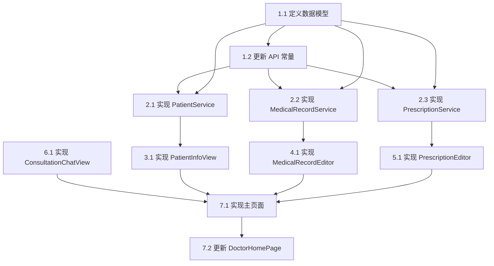

# 医生端患者管理功能 - 编码任务规划

**版本**: v1.0
**创建日期**: 2024-12-19
**最后更新**: 2024-12-19
**作者**: CodeArts Agent
**状态**: 草稿

---

## 任务概述

本文档将医生端患者管理功能的设计方案分解为可执行的开发任务。所有任务按照依赖关系排序，每个任务包含明确的描述、输入、输出和验收标准。

**任务统计**:
- 主任务数: 7
- 子任务数: 20
- 需求覆盖率: 100%

---

## 1. 数据模型定义

### 1.1 定义患者管理相关数据模型

**描述**: 在 `entry/src/main/ets/models/` 目录下创建 `DoctorPatientModels.ets` 文件，定义患者管理功能所需的所有数据模型接口。

**输入**:
- 设计文档中的数据模型定义（第4节）

**输出**:
- `entry/src/main/ets/models/DoctorPatientModels.ets` 文件

**验收标准**:
- [ ] 文件包含 `PatientBasicInfo` 接口，包含 id、name、age、gender、phone、idCard、avatar 字段
- [ ] 文件包含 `PatientHealthProfile` 接口，包含 allergies、pastHistory、familyHistory 字段
- [ ] 文件包含 `PatientVisitRecord` 接口，包含 id、visitDate、hospital、department、doctor、diagnosis、chiefComplaint 字段
- [ ] 文件包含 `MedicalRecordFormData` 接口，包含患者信息、医生信息、病历内容等所有字段
- [ ] 文件包含 `PrescriptionMedication` 接口，包含药品ID、名称、规格、用法用量等字段
- [ ] 文件包含 `PrescriptionFormData` 接口，包含患者信息、医生信息、诊断、药品列表等字段
- [ ] 所有接口使用明确的类型定义，不使用 any 类型
- [ ] 字段类型使用 number、string、boolean 等基本类型或数组类型

**代码生成提示**:
```arkts
请创建 entry/src/main/ets/models/DoctorPatientModels.ets 文件，定义以下接口：
1. PatientBasicInfo - 患者基本信息
2. PatientHealthProfile - 患者健康档案
3. PatientVisitRecord - 患者就诊记录
4. MedicalRecordFormData - 病历表单数据
5. PrescriptionMedication - 处方药品
6. PrescriptionFormData - 处方表单数据

所有接口使用 ArkTS 语法，使用明确的类型定义，不使用 any 类型。
```

---

### 1.2 更新 API 常量定义

**描述**: 在 `entry/src/main/ets/common/constants/ApiConstants.ets` 中添加患者管理相关的 API 路径常量。

**输入**:
- 设计文档中的 API 设计（第5节）

**输出**:
- 更新后的 `entry/src/main/ets/common/constants/ApiConstants.ets` 文件

**验收标准**:
- [ ] 在 `ApiConstantsInterface` 接口中添加 PATIENT_INFO、PATIENT_HEALTH_PROFILE、PATIENT_VISIT_RECORDS 常量定义
- [ ] 在 `ApiConstants` 对象中添加对应的 API 路径值
- [ ] API 路径格式正确，如 '/patient/info/{id}'

**代码生成提示**:
```arkts
请在 entry/src/main/ets/common/constants/ApiConstants.ets 文件中添加以下 API 常量：

1. 在 ApiConstantsInterface 接口中添加：
   - PATIENT_INFO: string;
   - PATIENT_HEALTH_PROFILE: string;
   - PATIENT_VISIT_RECORDS: string;

2. 在 ApiConstants 对象中添加对应的值：
   - PATIENT_INFO: '/patient/info/'
   - PATIENT_HEALTH_PROFILE: '/patient/health-profile/'
   - PATIENT_VISIT_RECORDS: '/patient/visit-records/'
```

---

## 2. 服务层实现

### 2.1 实现 PatientService

**描述**: 在 `entry/src/main/ets/services/` 目录下创建 `PatientService.ets` 文件，实现患者信息相关的 API 调用封装。

**输入**:
- 设计文档中的 PatientService 定义（第3.6节）
- API 常量定义

**输出**:
- `entry/src/main/ets/services/PatientService.ets` 文件

**验收标准**:
- [ ] 类使用单例模式，提供 getInstance() 静态方法
- [ ] 实现 getPatientInfo 方法，调用 GET /patient/info/{id} API
- [ ] 实现 getHealthProfile 方法，调用 GET /patient/health-profile/{id} API
- [ ] 实现 getVisitRecords 方法，调用 GET /patient/visit-records/{id} API
- [ ] 所有方法返回 Promise 类型，使用 HttpUtil 进行网络请求
- [ ] 方法参数和返回值类型明确，不使用 any 类型
- [ ] 使用 hilog 记录关键操作日志

**代码生成提示**:
```arkts
请创建 entry/src/main/ets/services/PatientService.ets 文件，实现 PatientService 类：

1. 使用单例模式，提供 getInstance() 静态方法
2. 实现以下方法：
   - getPatientInfo(patientId: number): Promise<PatientBasicInfo>
   - getHealthProfile(patientId: number): Promise<PatientHealthProfile>
   - getVisitRecords(patientId: number): Promise<PatientVisitRecord[]>

3. 使用 HttpUtil 进行网络请求，调用对应的 API
4. 使用 hilog 记录日志，TAG 为 'PatientService'
5. 所有方法返回 Promise 类型，使用明确的类型定义
```

---

### 2.2 实现 MedicalRecordService

**描述**: 在 `entry/src/main/ets/services/` 目录下创建 `MedicalRecordService.ets` 文件，实现病历相关的 API 调用封装。

**输入**:
- 设计文档中的 MedicalRecordService 定义（第3.7节）
- API 常量定义

**输出**:
- `entry/src/main/ets/services/MedicalRecordService.ets` 文件

**验收标准**:
- [ ] 类使用单例模式，提供 getInstance() 静态方法
- [ ] 实现 createRecord 方法，调用 POST /medical/record/create API
- [ ] 实现 updateRecord 方法，调用 POST /medical/record/update API
- [ ] 实现 getRecord 方法，调用 GET /medical/record/detail API
- [ ] 实现 getPatientRecords 方法，调用 GET /medical/record/page API
- [ ] 所有方法返回 Promise 类型，使用 HttpUtil 进行网络请求
- [ ] 方法参数和返回值类型明确，不使用 any 类型
- [ ] 使用 hilog 记录关键操作日志

**代码生成提示**:
```arkts
请创建 entry/src/main/ets/services/MedicalRecordService.ets 文件，实现 MedicalRecordService 类：

1. 使用单例模式，提供 getInstance() 静态方法
2. 实现以下方法：
   - createRecord(data: MedicalRecordFormData): Promise<number>
   - updateRecord(id: number, data: MedicalRecordFormData): Promise<boolean>
   - getRecord(id: number): Promise<MedicalRecordFormData>
   - getPatientRecords(patientId: number): Promise<MedicalRecordFormData[]>

3. 使用 HttpUtil 进行网络请求，调用对应的 API
4. 使用 hilog 记录日志，TAG 为 'MedicalRecordService'
5. 所有方法返回 Promise 类型，使用明确的类型定义
```

---

### 2.3 实现 PrescriptionService

**描述**: 在 `entry/src/main/ets/services/` 目录下创建 `PrescriptionService.ets` 文件，实现处方相关的 API 调用封装。

**输入**:
- 设计文档中的 PrescriptionService 定义（第3.8节）
- API 常量定义

**输出**:
- `entry/src/main/ets/services/PrescriptionService.ets` 文件

**验收标准**:
- [ ] 类使用单例模式，提供 getInstance() 静态方法
- [ ] 实现 createPrescription 方法，调用 POST /prescription/create API
- [ ] 实现 getPrescription 方法，调用 GET /prescription/detail API
- [ ] 实现 getPatientPrescriptions 方法，调用 GET /prescription/page API
- [ ] 所有方法返回 Promise 类型，使用 HttpUtil 进行网络请求
- [ ] 方法参数和返回值类型明确，不使用 any 类型
- [ ] 使用 hilog 记录关键操作日志

**代码生成提示**:
```arkts
请创建 entry/src/main/ets/services/PrescriptionService.ets 文件，实现 PrescriptionService 类：

1. 使用单例模式，提供 getInstance() 静态方法
2. 实现以下方法：
   - createPrescription(data: PrescriptionFormData): Promise<number>
   - getPrescription(id: number): Promise<PrescriptionFormData>
   - getPatientPrescriptions(patientId: number): Promise<PrescriptionFormData[]>

3. 使用 HttpUtil 进行网络请求，调用对应的 API
4. 使用 hilog 记录日志，TAG 为 'PrescriptionService'
5. 所有方法返回 Promise 类型，使用明确的类型定义
```

---

## 3. 患者信息查看组件

### 3.1 实现 PatientInfoView 组件

**描述**: 在 `entry/src/main/ets/components/` 目录下创建 `PatientInfoView.ets` 文件，实现患者信息查看组件。

**输入**:
- 设计文档中的 PatientInfoView 定义（第3.2节）
- 数据模型定义
- PatientService

**输出**:
- `entry/src/main/ets/components/PatientInfoView.ets` 文件

**验收标准**:
- [ ] 组件导出为 export struct，使用 @Component 装饰器
- [ ] 接收 patientId 作为 @Prop 属性
- [ ] 定义 basicInfo、healthProfile、visitRecords 状态变量
- [ ] 实现脱敏方法 desensitizeIdCard，将身份证号中间部分替换为 *
- [ ] 在 aboutToAppear 中调用 PatientService 加载患者信息
- [ ] UI 包含三个部分：基本信息卡片、健康档案卡片、历史就诊记录列表
- [ ] 基本信息显示姓名、年龄、性别、脱敏后的电话和身份证号
- [ ] 健康档案显示过敏史、既往病史、家族病史
- [ ] 历史就诊记录显示就诊时间、医院、科室、医生、诊断、主诉
- [ ] 使用 Loading 组件显示加载状态
- [ ] 使用 EmptyState 组件显示空状态

**代码生成提示**:
```arkts
请创建 entry/src/main/ets/components/PatientInfoView.ets 文件，实现 PatientInfoView 组件：

1. 导入必要的依赖：router, hilog, HttpUtil, ApiConstants, Loading, EmptyState
2. 导入数据模型：PatientBasicInfo, PatientHealthProfile, PatientVisitRecord
3. 导入服务：PatientService

4. 组件定义：
   - 使用 @Component 装饰器
   - 使用 export struct 导出
   - @Prop patientId: number = 0
   - @State basicInfo: PatientBasicInfo | null = null
   - @State healthProfile: PatientHealthProfile | null = null
   - @State visitRecords: PatientVisitRecord[] = []
   - @State isLoading: boolean = true

5. 实现方法：
   - aboutToAppear(): 加载患者信息
   - loadPatientInfo(): 调用 PatientService.getPatientInfo
   - loadHealthProfile(): 调用 PatientService.getHealthProfile
   - loadVisitRecords(): 调用 PatientService.getVisitRecords
   - desensitizeIdCard(idCard: string): string: 身份证号脱敏

6. UI 构建：
   - 使用 Column 布局
   - 包含基本信息卡片、健康档案卡片、历史就诊记录列表
   - 使用 Loading 组件显示加载状态
   - 使用 EmptyState 组件显示空状态
```

---

## 4. 病历编辑组件

### 4.1 实现 MedicalRecordEditor 组件

**描述**: 在 `entry/src/main/ets/components/` 目录下创建 `MedicalRecordEditor.ets` 文件，实现病历编辑组件。

**输入**:
- 设计文档中的 MedicalRecordEditor 定义（第3.3节）
- 数据模型定义
- MedicalRecordService

**输出**:
- `entry/src/main/ets/components/MedicalRecordEditor.ets` 文件

**验收标准**:
- [ ] 组件导出为 export struct，使用 @Component 装饰器
- [ ] 接收 patientId、doctorId、patientName、doctorName 作为 @Prop 属性
- [ ] 定义 formData 状态变量，初始化为空的 MedicalRecordFormData
- [ ] 定义 isSaving 状态变量，控制保存按钮状态
- [ ] 在 aboutToAppear 中初始化 formData，填充患者和医生信息
- [ ] 实现表单验证方法 validateForm，检查必填字段
- [ ] 实现保存方法 saveRecord，调用 MedicalRecordService.createRecord
- [ ] UI 包含表单字段：就诊日期、主诉、现病史、既往史、个人史、家族史、体格检查、辅助检查、诊断、治疗方案、医嘱
- [ ] 使用 TextInput、TextArea 组件实现输入框
- [ ] 保存按钮在 isSaving 为 true 时禁用并显示加载状态
- [ ] 保存成功后显示成功提示

**代码生成提示**:
```arkts
请创建 entry/src/main/ets/components/MedicalRecordEditor.ets 文件，实现 MedicalRecordEditor 组件：

1. 导入必要的依赖：router, hilog, promptAction
2. 导入数据模型：MedicalRecordFormData
3. 导入服务：MedicalRecordService

4. 组件定义：
   - 使用 @Component 装饰器
   - 使用 export struct 导出
   - @Prop patientId: number = 0
   - @Prop doctorId: number = 0
   - @Prop patientName: string = ''
   - @Prop doctorName: string = ''
   - @State formData: MedicalRecordFormData = new MedicalRecordFormData()
   - @State isSaving: boolean = false

5. 实现方法：
   - aboutToAppear(): 初始化 formData
   - validateForm(): boolean: 表单验证
   - saveRecord(): Promise<void>: 保存病历

6. UI 构建：
   - 使用 Column 布局
   - 包含表单字段：就诊日期、主诉、现病史、既往史、个人史、家族史、体格检查、辅助检查、诊断、治疗方案、医嘱
   - 使用 TextInput、TextArea 组件实现输入框
   - 保存按钮在 isSaving 为 true 时禁用
```

---

## 5. 处方编辑组件

### 5.1 实现 PrescriptionEditor 组件

**描述**: 在 `entry/src/main/ets/components/` 目录下创建 `PrescriptionEditor.ets` 文件，实现处方编辑组件。

**输入**:
- 设计文档中的 PrescriptionEditor 定义（第3.4节）
- 数据模型定义
- PrescriptionService

**输出**:
- `entry/src/main/ets/components/PrescriptionEditor.ets` 文件

**验收标准**:
- [ ] 组件导出为 export struct，使用 @Component 装饰器
- [ ] 接收 patientId、patientName、doctorId、doctorName 作为 @Prop 属性
- [ ] 定义 formData 状态变量，初始化为空的 PrescriptionFormData
- [ ] 定义 isSaving 状态变量，控制保存按钮状态
- [ ] 定义 showMedicineSelector 状态变量，控制药品选择器显示
- [ ] 在 aboutToAppear 中初始化 formData，填充患者和医生信息
- [ ] 实现添加药品方法 addMedication，向 medications 数组添加空药品
- [ ] 实现删除药品方法 removeMedication，从 medications 数组删除指定位置的药品
- [ ] 实现保存方法 savePrescription，调用 PrescriptionService.createPrescription
- [ ] UI 包含诊断输入框、药品列表、添加药品按钮、备注输入框、保存按钮
- [ ] 药品列表显示药品名称、规格、用法用量、数量
- [ ] 保存按钮在 isSaving 为 true 时禁用并显示加载状态
- [ ] 保存成功后显示成功提示

**代码生成提示**:
```arkts
请创建 entry/src/main/ets/components/PrescriptionEditor.ets 文件，实现 PrescriptionEditor 组件：

1. 导入必要的依赖：router, hilog, promptAction
2. 导入数据模型：PrescriptionFormData, PrescriptionMedication
3. 导入服务：PrescriptionService

4. 组件定义：
   - 使用 @Component 装饰器
   - 使用 export struct 导出
   - @Prop patientId: number = 0
   - @Prop patientName: string = ''
   - @Prop doctorId: number = 0
   - @Prop doctorName: string = ''
   - @State formData: PrescriptionFormData = new PrescriptionFormData()
   - @State isSaving: boolean = false
   - @State showMedicineSelector: boolean = false

5. 实现方法：
   - aboutToAppear(): 初始化 formData
   - addMedication(): void: 添加药品
   - removeMedication(index: number): void: 删除药品
   - savePrescription(): Promise<void>: 保存处方

6. UI 构建：
   - 使用 Column 布局
   - 包含诊断输入框、药品列表、添加药品按钮、备注输入框、保存按钮
   - 药品列表显示药品名称、规格、用法用量、数量
   - 保存按钮在 isSaving 为 true 时禁用
```

---

## 6. 对话组件

### 6.1 实现 ConsultationChatView 组件

**描述**: 在 `entry/src/main/ets/components/` 目录下创建 `ConsultationChatView.ets` 文件，实现咨询对话组件，复用现有的 DoctorChatPage。

**输入**:
- 设计文档中的 ConsultationChatView 定义（第3.5节）
- 现有的 DoctorChatPage

**输出**:
- `entry/src/main/ets/components/ConsultationChatView.ets` 文件

**验收标准**:
- [ ] 组件导出为 export struct，使用 @Component 装饰器
- [ ] 接收 patientId、patientName、doctorId、doctorName 作为 @Prop 属性
- [ ] 在 build 方法中使用 router.push 跳转到 DoctorChatPage
- [ ] 传递正确的参数：doctorId、doctorName、currentUserId、otherUserId、otherUserName、isDoctor

**代码生成提示**:
```arkts
请创建 entry/src/main/ets/components/ConsultationChatView.ets 文件，实现 ConsultationChatView 组件：

1. 导入必要的依赖：router
2. 导入 DoctorInfo

3. 组件定义：
   - 使用 @Component 装饰器
   - 使用 export struct 导出
   - @Prop patientId: number = 0
   - @Prop patientName: string = ''
   - @Prop doctorId: number = 0
   - @Prop doctorName: string = ''

4. build 方法：
   - 使用 router.push 跳转到 DoctorChatPage
   - 传递参数：doctorId、doctorName、currentUserId、otherUserId、otherUserName、isDoctor
```

---

## 7. 主页面实现

### 7.1 实现 DoctorPatientManagementPage 主页面

**描述**: 在 `entry/src/main/ets/pages/` 目录下创建 `DoctorPatientManagementPage.ets` 文件，实现医生端患者管理主页面。

**输入**:
- 设计文档中的 DoctorPatientManagementPage 定义（第3.1节）
- 所有子组件
- 所有服务

**输出**:
- `entry/src/main/ets/pages/DoctorPatientManagementPage.ets` 文件
- 更新 `entry/src/main/resources/base/profile/main_pages.json` 添加页面路由

**验收标准**:
- [ ] 页面使用 @Entry 和 @Component 装饰器
- [ ] 定义 patientId、doctorId、patientName、doctorName、currentTab 状态变量
- [ ] 在 aboutToAppear 中从路由参数获取患者和医生信息
- [ ] 顶部导航栏包含返回按钮、患者姓名、Tab 切换按钮
- [ ] Tab 切换包含四个选项：患者信息、病历、处方、对话
- [ ] 使用 Tabs 组件实现 Tab 切换，每个 TabContent 包含对应的子组件
- [ ] 患者信息 Tab 包含 PatientInfoView 组件
- [ ] 病历 Tab 包含 MedicalRecordEditor 组件
- [ ] 处方 Tab 包含 PrescriptionEditor 组件
- [ ] 对话 Tab 包含 ConsultationChatView 组件
- [ ] 更新 main_pages.json 添加 DoctorPatientManagementPage 路由

**代码生成提示**:
```arkts
请创建 entry/src/main/ets/pages/DoctorPatientManagementPage.ets 文件，实现医生端患者管理主页面：

1. 导入必要的依赖：router, hilog
2. 导入子组件：PatientInfoView, MedicalRecordEditor, PrescriptionEditor, ConsultationChatView
3. 导入服务：PatientService, MedicalRecordService, PrescriptionService

4. 页面定义：
   - 使用 @Entry 和 @Component 装饰器
   - @StorageLink('userId') currentUserId: number = 0
   - @State patientId: number = 0
   - @State doctorId: number = 0
   - @State patientName: string = ''
   - @State doctorName: string = ''
   - @State currentTab: number = 0

5. 实现方法：
   - aboutToAppear(): 从路由参数获取患者和医生信息

6. UI 构建：
   - 使用 Column 布局
   - 顶部导航栏包含返回按钮、患者姓名、Tab 切换按钮
   - 使用 Tabs 组件实现 Tab 切换
   - 每个 TabContent 包含对应的子组件

7. 更新 entry/src/main/resources/base/profile/main_pages.json，添加 DoctorPatientManagementPage 路由
```

---

### 7.2 更新 DoctorHomePage 添加跳转入口

**描述**: 在 `entry/src/main/ets/pages/DoctorHomePage.ets` 中为患者列表项添加点击事件，跳转到患者管理页面。

**输入**:
- 现有的 DoctorHomePage
- 新的 DoctorPatientManagementPage

**输出**:
- 更新后的 `entry/src/main/ets/pages/DoctorHomePage.ets` 文件

**验收标准**:
- [ ] 在患者列表项的 Row 组件上添加 onClick 事件
- [ ] 跳转到 DoctorPatientManagementPage，传递正确的参数
- [ ] 参数包括：patientId、doctorId、patientName、doctorName

**代码生成提示**:
```arkts
请更新 entry/src/main/ets/pages/DoctorHomePage.ets 文件，在患者列表项添加点击跳转：

1. 在患者列表项的 Row 组件上添加 onClick 事件
2. 使用 router.push 跳转到 DoctorPatientManagementPage
3. 传递参数：patientId、doctorId、patientName、doctorName
```

---

## 任务依赖关系



---

## 任务优先级

| 优先级 | 任务编号 | 任务名称 | 理由 |
|-------|---------|---------|------|
| P0 | 1.1 | 定义数据模型 | 基础数据结构，其他任务依赖 |
| P0 | 1.2 | 更新 API 常量 | API 基础定义，服务层依赖 |
| P0 | 2.1 | 实现 PatientService | 患者信息查看的基础 |
| P0 | 2.2 | 实现 MedicalRecordService | 病历功能的基础 |
| P0 | 2.3 | 实现 PrescriptionService | 处方功能的基础 |
| P1 | 3.1 | 实现 PatientInfoView | 核心功能组件 |
| P1 | 4.1 | 实现 MedicalRecordEditor | 核心功能组件 |
| P1 | 5.1 | 实现 PrescriptionEditor | 核心功能组件 |
| P1 | 6.1 | 实现 ConsultationChatView | 核心功能组件 |
| P1 | 7.1 | 实现主页面 | 整合所有组件 |
| P2 | 7.2 | 更新 DoctorHomePage | 添加入口，用户体验优化 |

---

## 附录：代码生成提示汇总

### 任务 1.1: 定义数据模型
```arkts
请创建 entry/src/main/ets/models/DoctorPatientModels.ets 文件，定义以下接口：
1. PatientBasicInfo - 患者基本信息
2. PatientHealthProfile - 患者健康档案
3. PatientVisitRecord - 患者就诊记录
4. MedicalRecordFormData - 病历表单数据
5. PrescriptionMedication - 处方药品
6. PrescriptionFormData - 处方表单数据

所有接口使用 ArkTS 语法，使用明确的类型定义，不使用 any 类型。
```

### 任务 1.2: 更新 API 常量
```arkts
请在 entry/src/main/ets/common/constants/ApiConstants.ets 文件中添加以下 API 常量：

1. 在 ApiConstantsInterface 接口中添加：
   - PATIENT_INFO: string;
   - PATIENT_HEALTH_PROFILE: string;
   - PATIENT_VISIT_RECORDS: string;

2. 在 ApiConstants 对象中添加对应的值：
   - PATIENT_INFO: '/patient/info/'
   - PATIENT_HEALTH_PROFILE: '/patient/health-profile/'
   - PATIENT_VISIT_RECORDS: '/patient/visit-records/'
```

### 任务 2.1: 实现 PatientService
```arkts
请创建 entry/src/main/ets/services/PatientService.ets 文件，实现 PatientService 类：

1. 使用单例模式，提供 getInstance() 静态方法
2. 实现以下方法：
   - getPatientInfo(patientId: number): Promise<PatientBasicInfo>
   - getHealthProfile(patientId: number): Promise<PatientHealthProfile>
   - getVisitRecords(patientId: number): Promise<PatientVisitRecord[]>

3. 使用 HttpUtil 进行网络请求，调用对应的 API
4. 使用 hilog 记录日志，TAG 为 'PatientService'
5. 所有方法返回 Promise 类型，使用明确的类型定义
```

### 任务 2.2: 实现 MedicalRecordService
```arkts
请创建 entry/src/main/ets/services/MedicalRecordService.ets 文件，实现 MedicalRecordService 类：

1. 使用单例模式，提供 getInstance() 静态方法
2. 实现以下方法：
   - createRecord(data: MedicalRecordFormData): Promise<number>
   - updateRecord(id: number, data: MedicalRecordFormData): Promise<boolean>
   - getRecord(id: number): Promise<MedicalRecordFormData>
   - getPatientRecords(patientId: number): Promise<MedicalRecordFormData[]>

3. 使用 HttpUtil 进行网络请求，调用对应的 API
4. 使用 hilog 记录日志，TAG 为 'MedicalRecordService'
5. 所有方法返回 Promise 类型，使用明确的类型定义
```

### 任务 2.3: 实现 PrescriptionService
```arkts
请创建 entry/src/main/ets/services/PrescriptionService.ets 文件，实现 PrescriptionService 类：

1. 使用单例模式，提供 getInstance() 静态方法
2. 实现以下方法：
   - createPrescription(data: PrescriptionFormData): Promise<number>
   - getPrescription(id: number): Promise<PrescriptionFormData>
   - getPatientPrescriptions(patientId: number): Promise<PrescriptionFormData[]>

3. 使用 HttpUtil 进行网络请求，调用对应的 API
4. 使用 hilog 记录日志，TAG 为 'PrescriptionService'
5. 所有方法返回 Promise 类型，使用明确的类型定义
```

### 任务 3.1: 实现 PatientInfoView
```arkts
请创建 entry/src/main/ets/components/PatientInfoView.ets 文件，实现 PatientInfoView 组件：

1. 导入必要的依赖：router, hilog, HttpUtil, ApiConstants, Loading, EmptyState
2. 导入数据模型：PatientBasicInfo, PatientHealthProfile, PatientVisitRecord
3. 导入服务：PatientService

4. 组件定义：
   - 使用 @Component 装饰器
   - 使用 export struct 导出
   - @Prop patientId: number = 0
   - @State basicInfo: PatientBasicInfo | null = null
   - @State healthProfile: PatientHealthProfile | null = null
   - @State visitRecords: PatientVisitRecord[] = []
   - @State isLoading: boolean = true

5. 实现方法：
   - aboutToAppear(): 加载患者信息
   - loadPatientInfo(): 调用 PatientService.getPatientInfo
   - loadHealthProfile(): 调用 PatientService.getHealthProfile
   - loadVisitRecords(): 调用 PatientService.getVisitRecords
   - desensitizeIdCard(idCard: string): string: 身份证号脱敏

6. UI 构建：
   - 使用 Column 布局
   - 包含基本信息卡片、健康档案卡片、历史就诊记录列表
   - 使用 Loading 组件显示加载状态
   - 使用 EmptyState 组件显示空状态
```

### 任务 4.1: 实现 MedicalRecordEditor
```arkts
请创建 entry/src/main/ets/components/MedicalRecordEditor.ets 文件，实现 MedicalRecordEditor 组件：

1. 导入必要的依赖：router, hilog, promptAction
2. 导入数据模型：MedicalRecordFormData
3. 导入服务：MedicalRecordService

4. 组件定义：
   - 使用 @Component 装饰器
   - 使用 export struct 导出
   - @Prop patientId: number = 0
   - @Prop doctorId: number = 0
   - @Prop patientName: string = ''
   - @Prop doctorName: string = ''
   - @State formData: MedicalRecordFormData = new MedicalRecordFormData()
   - @State isSaving: boolean = false

5. 实现方法：
   - aboutToAppear(): 初始化 formData
   - validateForm(): boolean: 表单验证
   - saveRecord(): Promise<void>: 保存病历

6. UI 构建：
   - 使用 Column 布局
   - 包含表单字段：就诊日期、主诉、现病史、既往史、个人史、家族史、体格检查、辅助检查、诊断、治疗方案、医嘱
   - 使用 TextInput、TextArea 组件实现输入框
   - 保存按钮在 isSaving 为 true 时禁用
```

### 任务 5.1: 实现 PrescriptionEditor
```arkts
请创建 entry/src/main/ets/components/PrescriptionEditor.ets 文件，实现 PrescriptionEditor 组件：

1. 导入必要的依赖：router, hilog, promptAction
2. 导入数据模型：PrescriptionFormData, PrescriptionMedication
3. 导入服务：PrescriptionService

4. 组件定义：
   - 使用 @Component 装饰器
   - 使用 export struct 导出
   - @Prop patientId: number = 0
   - @Prop patientName: string = ''
   - @Prop doctorId: number = 0
   - @Prop doctorName: string = ''
   - @State formData: PrescriptionFormData = new PrescriptionFormData()
   - @State isSaving: boolean = false
   - @State showMedicineSelector: boolean = false

5. 实现方法：
   - aboutToAppear(): 初始化 formData
   - addMedication(): void: 添加药品
   - removeMedication(index: number): void: 删除药品
   - savePrescription(): Promise<void>: 保存处方

6. UI 构建：
   - 使用 Column 布局
   - 包含诊断输入框、药品列表、添加药品按钮、备注输入框、保存按钮
   - 药品列表显示药品名称、规格、用法用量、数量
   - 保存按钮在 isSaving 为 true 时禁用
```

### 任务 6.1: 实现 ConsultationChatView
```arkts
请创建 entry/src/main/ets/components/ConsultationChatView.ets 文件，实现 ConsultationChatView 组件：

1. 导入必要的依赖：router
2. 导入 DoctorInfo

3. 组件定义：
   - 使用 @Component 装饰器
   - 使用 export struct 导出
   - @Prop patientId: number = 0
   - @Prop patientName: string = ''
   - @Prop doctorId: number = 0
   - @Prop doctorName: string = ''

4. build 方法：
   - 使用 router.push 跳转到 DoctorChatPage
   - 传递参数：doctorId、doctorName、currentUserId、otherUserId、otherUserName、isDoctor
```

### 任务 7.1: 实现主页面
```arkts
请创建 entry/src/main/ets/pages/DoctorPatientManagementPage.ets 文件，实现医生端患者管理主页面：

1. 导入必要的依赖：router, hilog
2. 导入子组件：PatientInfoView, MedicalRecordEditor, PrescriptionEditor, ConsultationChatView
3. 导入服务：PatientService, MedicalRecordService, PrescriptionService

4. 页面定义：
   - 使用 @Entry 和 @Component 装饰器
   - @StorageLink('userId') currentUserId: number = 0
   - @State patientId: number = 0
   - @State doctorId: number = 0
   - @State patientName: string = ''
   - @State doctorName: string = ''
   - @State currentTab: number = 0

5. 实现方法：
   - aboutToAppear(): 从路由参数获取患者和医生信息

6. UI 构建：
   - 使用 Column 布局
   - 顶部导航栏包含返回按钮、患者姓名、Tab 切换按钮
   - 使用 Tabs 组件实现 Tab 切换
   - 每个 TabContent 包含对应的子组件

7. 更新 entry/src/main/resources/base/profile/main_pages.json，添加 DoctorPatientManagementPage 路由
```

### 任务 7.2: 更新 DoctorHomePage
```arkts
请更新 entry/src/main/ets/pages/DoctorHomePage.ets 文件，在患者列表项添加点击跳转：

1. 在患者列表项的 Row 组件上添加 onClick 事件
2. 使用 router.push 跳转到 DoctorPatientManagementPage
3. 传递参数：patientId、doctorId、patientName、doctorName
```

---

**文档状态**: 已完成
**下一步**: 可以开始按照任务规划进行编码实现，每个任务都提供了详细的代码生成提示。
