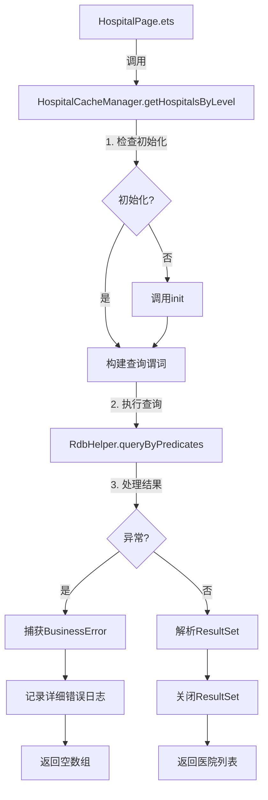
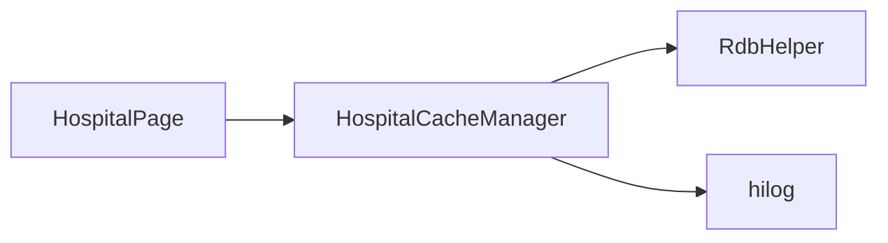
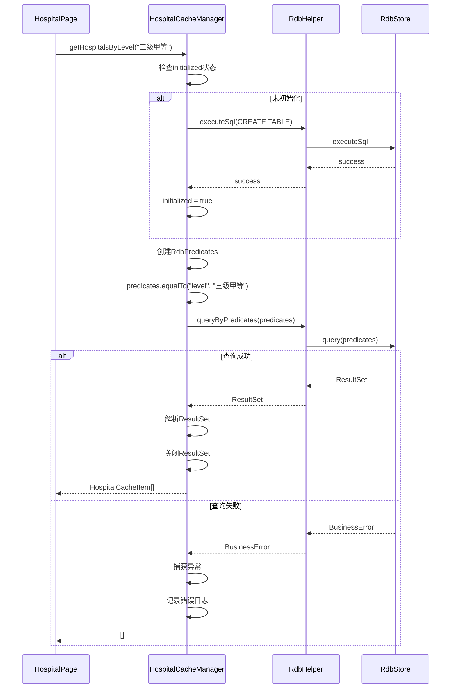
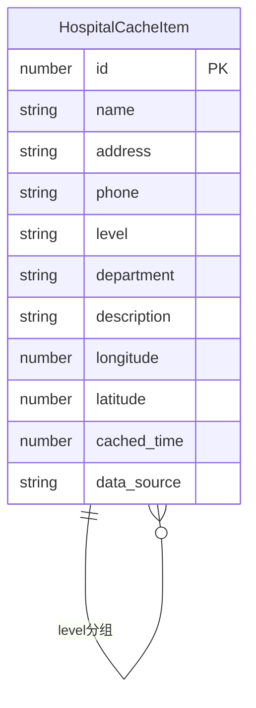
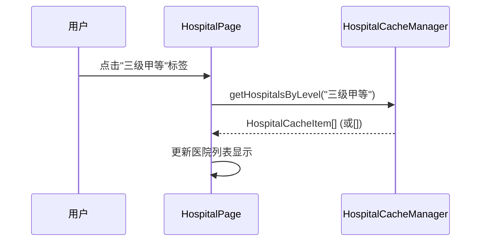

# 医院筛选崩溃修复 - 技术设计文档

**版本**: v1.0
**创建日期**: 2025-01-08
**最后更新**: 2025-01-08
**作者**: CodeArts Agent
**状态**: 草稿

## 1. 设计概述

### 1.1 设计目标
通过增强`HospitalCacheManager.getHospitalsByLevel`方法的错误处理机制，确保数据库查询异常时应用不崩溃，并提供详细的错误日志用于问题定位。

### 1.2 技术选型
- **编程语言**: ArkTS
- **数据库**: HarmonyOS关系型数据库 (RDB)
- **日志**: `@kit.PerformanceAnalysisKit`的`hilog`
- **错误处理**: `try-catch` + `BusinessError`类型检查

### 1.3 设计约束
- 不能修改方法签名，保持向后兼容
- 不能修改`RdbHelper`类的核心逻辑
- 必须兼容现有的`@ohos.data.relationalStore` API
- 错误日志不能包含敏感信息

## 2. 架构设计

### 2.1 整体架构



### 2.2 模块划分

| 模块 | 职责 | 修改范围 |
|------|------|---------|
| HospitalCacheManager | 医院缓存管理，提供查询接口 | 修改`getHospitalsByLevel`方法 |
| RdbHelper | 数据库操作封装 | 不修改 |
| HospitalPage | 医院列表页面UI | 不修改 |

### 2.3 依赖关系



## 3. 模块详细设计

### 3.1 HospitalCacheManager模块

#### 3.1.1 职责定义
- 管理医院数据的本地缓存
- 提供按等级、ID等条件查询医院的方法
- 处理数据库初始化和表结构管理

#### 3.1.2 类/接口设计

```arkts
export interface HospitalCacheItem {
  id: number;
  name: string;
  address: string;
  phone: string;
  level: string;
  department: string;
  description: string;
  longitude: number;
  latitude: number;
  cached_time: number;
  data_source: string;
}

class HospitalCacheManager {
  private static instance: HospitalCacheManager;
  private initialized: boolean = false;

  public static getInstance(): HospitalCacheManager;
  public async init(): Promise<void>;
  public async saveHospitals(hospitals: HospitalCacheItem[]): Promise<void>;
  public async getHospitalsByLevel(level: string): Promise<HospitalCacheItem[]>;
  public async getHospitalById(id: number): Promise<HospitalCacheItem | null>;
  public async clearCache(): Promise<void>;
  public async getCacheStats(): Promise<CacheStats>;
  public async isCacheValid(maxAgeMs?: number): Promise<boolean>;
}
```

#### 3.1.3 关键方法

**方法**: `getHospitalsByLevel(level: string): Promise<HospitalCacheItem[]>`

**修改前逻辑**:
```arkts
public async getHospitalsByLevel(level: string): Promise<HospitalCacheItem[]> {
  if (!this.initialized) {
    await this.init();
  }

  try {
    const predicates = new relationalStore.RdbPredicates(TABLE_NAME);

    if (level && level !== '全部') {
      predicates.equalTo('level', level);
    }

    predicates.orderByAsc('name');

    const resultSet = await rdbHelper.queryByPredicates(predicates);
    const hospitals: HospitalCacheItem[] = [];

    while (resultSet.goToNextRow()) {
      const hospital: HospitalCacheItem = {
        id: resultSet.getLong(resultSet.getColumnIndex('id')),
        name: resultSet.getString(resultSet.getColumnIndex('name')),
        address: resultSet.getString(resultSet.getColumnIndex('address')),
        phone: resultSet.getString(resultSet.getColumnIndex('phone')),
        level: resultSet.getString(resultSet.getColumnIndex('level')),
        department: resultSet.getString(resultSet.getColumnIndex('department')),
        description: resultSet.getString(resultSet.getColumnIndex('description')),
        longitude: resultSet.getDouble(resultSet.getColumnIndex('longitude')),
        latitude: resultSet.getDouble(resultSet.getColumnIndex('latitude')),
        cached_time: resultSet.getLong(resultSet.getColumnIndex('cached_time')),
        data_source: resultSet.getString(resultSet.getColumnIndex('data_source'))
      };
      hospitals.push(hospital);
    }

    resultSet.close();
    hilog.info(0x0000, TAG, 'Retrieved %{public}d hospitals from cache', hospitals.length);
    return hospitals;
  } catch (error) {
    hilog.error(0x0000, TAG, 'Failed to get hospitals: %{public}s', JSON.stringify(error));
    return [];
  }
}
```

**修改后逻辑**:
```arkts
public async getHospitalsByLevel(level: string): Promise<HospitalCacheItem[]> {
  if (!this.initialized) {
    await this.init();
  }

  const hospitals: HospitalCacheItem[] = [];
  let resultSet: relationalStore.ResultSet | null = null;

  try {
    const predicates = new relationalStore.RdbPredicates(TABLE_NAME);

    if (level && level !== '全部') {
      predicates.equalTo('level', level);
    }

    predicates.orderByAsc('name');

    hilog.info(0x0000, TAG, 'Querying hospitals with level: %{public}s', level || '全部');

    resultSet = await rdbHelper.queryByPredicates(predicates);

    while (resultSet.goToNextRow()) {
      const hospital: HospitalCacheItem = {
        id: resultSet.getLong(resultSet.getColumnIndex('id')),
        name: resultSet.getString(resultSet.getColumnIndex('name')),
        address: resultSet.getString(resultSet.getColumnIndex('address')),
        phone: resultSet.getString(resultSet.getColumnIndex('phone')),
        level: resultSet.getString(resultSet.getColumnIndex('level')),
        department: resultSet.getString(resultSet.getColumnIndex('department')),
        description: resultSet.getString(resultSet.getColumnIndex('description')),
        longitude: resultSet.getDouble(resultSet.getColumnIndex('longitude')),
        latitude: resultSet.getDouble(resultSet.getColumnIndex('latitude')),
        cached_time: resultSet.getLong(resultSet.getColumnIndex('cached_time')),
        data_source: resultSet.getString(resultSet.getColumnIndex('data_source'))
      };
      hospitals.push(hospital);
    }

    hilog.info(0x0000, TAG, 'Retrieved %{public}d hospitals from cache', hospitals.length);
  } catch (error) {
    if (error instanceof BusinessError) {
      hilog.error(0x0000, TAG,
        'Failed to get hospitals. BusinessError: code=%{public}d, message=%{public}s',
        error.code, error.message);
    } else {
      hilog.error(0x0000, TAG,
        'Failed to get hospitals. err=%{public}s',
        JSON.stringify(error) ?? '');
    }
  } finally {
    if (resultSet) {
      try {
        resultSet.close();
      } catch (err) {
        hilog.error(0x0000, TAG, 'close resultSet failed, err=%{public}s', JSON.stringify(err) ?? '');
      }
    }
  }

  return hospitals;
}
```

**关键修改点**:
1. 在`finally`块中确保`resultSet`被正确关闭
2. 区分`BusinessError`和其他类型的错误，记录不同的日志格式
3. 添加查询参数日志记录
4. 将`hospitals`数组声明移到`try`块外部，确保异常时能返回空数组

#### 3.1.4 数据流



## 4. 数据模型设计

### 4.1 核心数据结构

```arkts
export interface HospitalCacheItem {
  id: number;              // 医院ID
  name: string;            // 医院名称
  address: string;         // 医院地址
  phone: string;           // 医院电话
  level: string;           // 医院等级（如"三级甲等"）
  department: string;      // 科室类型（如"综合医院"）
  description: string;     // 医院描述
  longitude: number;       // 经度
  latitude: number;        // 纬度
  cached_time: number;     // 缓存时间戳
  data_source: string;     // 数据来源
}

interface CacheStats {
  total: number;           // 总医院数
  byLevel: Record<string, number>;  // 按等级分组的统计
}
```

### 4.2 数据关系



### 4.3 数据存储

**表名**: `local_hospital_cache`

**索引**:
- `idx_hospital_level`: 加速按等级查询
- `idx_hospital_name`: 加速按名称查询

**存储位置**: 应用私有目录下的`local.db`文件

## 5. API设计

### 5.1 内部API

#### 5.1.1 HospitalCacheManager.getHospitalsByLevel

**方法签名**:
```arkts
public async getHospitalsByLevel(level: string): Promise<HospitalCacheItem[]>
```

**参数**:
| 参数名 | 类型 | 必填 | 说明 |
|--------|------|------|------|
| level | string | 是 | 医院等级，如"三级甲等"、"综合医院"，或"全部"表示查询所有 |

**返回值**:
```arkts
Promise<HospitalCacheItem[]>  // 医院列表，查询失败时返回空数组
```

**异常处理**:
- 方法内部捕获所有异常，不会向外抛出
- 异常信息通过`hilog`记录
- 异常情况下返回空数组

### 5.2 外部API
无

### 5.3 API规范

**日志格式**:
```arkts
// 成功日志
hilog.info(0x0000, TAG, 'Retrieved %{public}d hospitals from cache', hospitals.length);

// BusinessError日志
hilog.error(0x0000, TAG,
  'Failed to get hospitals. BusinessError: code=%{public}d, message=%{public}s',
  error.code, error.message);

// 其他错误日志
hilog.error(0x0000, TAG,
  'Failed to get hospitals. err=%{public}s',
  JSON.stringify(error) ?? '');
```

## 6. 关键算法设计

### 6.1 异常安全查询算法

#### 算法原理
使用`try-catch-finally`结构确保资源的正确释放和异常的优雅处理。

#### 伪代码
```
FUNCTION getHospitalsByLevel(level)
    hospitals = []
    resultSet = null

    TRY
        IF NOT initialized THEN
            CALL init()
        END IF

        predicates = CREATE RdbPredicates(TABLE_NAME)
        IF level AND level != '全部' THEN
            predicates.equalTo('level', level)
        END IF
        predicates.orderByAsc('name')

        LOG 'Querying hospitals with level: ' + level

        resultSet = CALL rdbHelper.queryByPredicates(predicates)

        WHILE resultSet.goToNextRow() DO
            hospital = PARSE resultSet
            hospitals.APPEND(hospital)
        END WHILE

        LOG 'Retrieved ' + hospitals.length + ' hospitals'

    CATCH error AS BusinessError
        LOG 'BusinessError: code=' + error.code + ', message=' + error.message
    CATCH error
        LOG 'Error: ' + JSON.stringify(error)
    FINALLY
        IF resultSet != null THEN
            TRY
                resultSet.close()
            CATCH err
                LOG 'Failed to close resultSet: ' + JSON.stringify(err)
            END TRY
        END IF
    END TRY

    RETURN hospitals
END FUNCTION
```

#### 复杂度分析
- **时间复杂度**: O(n)，n为查询结果数量
- **空间复杂度**: O(n)，存储查询结果

## 7. UI/UX设计

### 7.1 页面结构
本功能不涉及UI修改，保持现有`HospitalPage.ets`不变。

### 7.2 组件设计
无新增组件。

### 7.3 交互流程



## 8. 性能设计

### 8.1 性能目标
| 指标 | 目标值 | 测量方法 |
|------|--------|---------|
| 查询响应时间 | < 500ms | 性能分析工具测量 |
| 错误处理开销 | < 10ms | 模拟异常测量try-catch执行时间 |
| 内存占用 | < 1MB | DevEco Studio Profiler |

### 8.2 优化策略
1. **索引优化**: 利用`idx_hospital_level`索引加速查询
2. **资源释放**: 在`finally`块中及时关闭`ResultSet`
3. **日志优化**: 使用`%{public}s`占位符避免字符串拼接开销

### 8.3 监控方案
- 使用`hilog`记录查询耗时
- 监控异常发生频率
- 跟踪返回空数组的次数

## 9. 安全设计

### 9.1 数据安全
- 日志中不记录敏感信息（医院电话、地址等）
- 仅记录查询参数和错误类型

### 9.2 权限控制
无特殊权限要求，使用应用私有数据库。

### 9.3 安全审计
- 审查日志输出，确保无敏感信息泄露
- 验证SQL注入防护（使用参数化查询）

## 10. 测试设计

### 10.1 测试策略
- **单元测试**: 测试`getHospitalsByLevel`方法的正常流程和异常流程
- **集成测试**: 测试与`RdbHelper`的集成
- **手工测试**: 在真机上验证筛选功能不崩溃

### 10.2 测试用例

| 用例ID | 场景 | 输入 | 预期输出 |
|--------|------|------|---------|
| TC-001 | 正常查询 | level="三级甲等" | 返回匹配的医院列表 |
| TC-002 | 查询全部 | level="全部" | 返回所有医院 |
| TC-003 | 空结果 | level="不存在的等级" | 返回空数组 |
| TC-004 | 数据库未初始化 | 首次调用 | 自动初始化后返回结果 |
| TC-005 | 查询异常 | 模拟BusinessError | 记录错误日志，返回空数组 |
| TC-006 | ResultSet关闭失败 | 模拟close异常 | 记录错误日志，返回空数组 |

### 10.3 Mock数据

```arkts
const mockHospitals: HospitalCacheItem[] = [
  {
    id: 1,
    name: "北京协和医院",
    address: "北京市东城区帅府园1号",
    phone: "010-69156699",
    level: "三级甲等",
    department: "综合医院",
    description: "全国疑难重症诊治指导中心",
    longitude: 116.4178,
    latitude: 39.9136,
    cached_time: Date.now(),
    data_source: "server"
  },
  {
    id: 2,
    name: "北京大学第一医院",
    address: "北京市西城区西什库大街8号",
    phone: "010-83575711",
    level: "三级甲等",
    department: "综合医院",
    description: "综合性三级甲等医院",
    longitude: 116.3823,
    latitude: 39.9389,
    cached_time: Date.now(),
    data_source: "server"
  }
];
```

## 11. 部署设计

### 11.1 环境要求
- **开发环境**: DevEco Studio 5.0+
- **运行环境**: HarmonyOS Next 5.0+
- **最低API版本**: API 12

### 11.2 配置管理
无新增配置项。

### 11.3 发布流程
1. 代码审查
2. 单元测试通过
3. 集成测试通过
4. 手工测试验证
5. 合并到主分支

## 12. 附录

### 12.1 术语表

| 术语 | 定义 |
|-----|------|
| RdbStore | 关系型数据库存储对象 |
| RdbPredicates | 关系型数据库查询谓词 |
| ResultSet | 数据库查询结果集 |
| BusinessError | HarmonyOS API抛出的业务错误 |

### 12.2 参考资料
- [HarmonyOS关系型数据库开发指南](https://developer.huawei.com/consumer/cn/doc/harmonyos-guides-V5/data-rdb-guidelines-V5)
- [HiLog日志开发指南](https://developer.huawei.com/consumer/cn/doc/harmonyos-guides-V5/arkts-hilog-guidelines-V5)
- 项目代码路径: `entry/src/main/ets/utils/HospitalCacheManager.ets`

### 12.3 变更历史

| 版本 | 日期 | 作者 | 变更说明 |
|------|------|------|---------|
| v1.0 | 2025-01-08 | CodeArts Agent | 初始版本 |
