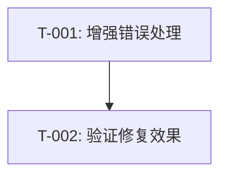

# 医院筛选崩溃修复 - 编码任务文档

**版本**: v1.0
**创建日期**: 2025-01-08
**最后更新**: 2025-01-08
**作者**: CodeArts Agent
**状态**: 草稿

## 任务概览

| 任务ID | 任务名称 | 优先级 | 预计工时 | 状态 |
|--------|---------|--------|---------|------|
| T-001 | 增强HospitalCacheManager错误处理 | P0 | 2小时 | 待开始 |
| T-002 | 验证修复效果 | P0 | 1小时 | 待开始 |

**需求覆盖**: 4个功能需求 + 4个非功能需求

---

## T-001: 增强HospitalCacheManager错误处理

**优先级**: P0
**预计工时**: 2小时
**负责模块**: HospitalCacheManager

### 任务描述
修改`HospitalCacheManager.getHospitalsByLevel`方法，增强错误处理机制，确保数据库查询异常时应用不崩溃，并提供详细的错误日志。

### 输入
- 现有代码：`entry/src/main/ets/utils/HospitalCacheManager.ets`
- 设计文档：`.codeartsdoer/specs/hospital-filter-crash-fix/design.md`

### 输出
- 修改后的`HospitalCacheManager.ets`文件

### 验收标准
- [ ] 在`finally`块中确保`resultSet`被正确关闭
- [ ] 区分`BusinessError`和其他类型的错误，记录不同的日志格式
- [ ] 添加查询参数日志记录
- [ ] 将`hospitals`数组声明移到`try`块外部
- [ ] 代码编译通过，无语法错误

### 子任务

#### T-001.1: 修改getHospitalsByLevel方法结构
**描述**: 将`hospitals`数组和`resultSet`变量声明移到`try`块外部，添加`finally`块确保资源释放。

**代码提示**:
```arkts
public async getHospitalsByLevel(level: string): Promise<HospitalCacheItem[]> {
  if (!this.initialized) {
    await this.init();
  }

  const hospitals: HospitalCacheItem[] = [];
  let resultSet: relationalStore.ResultSet | null = null;

  try {
    // 查询逻辑
  } catch (error) {
    // 错误处理
  } finally {
    // 资源释放
  }

  return hospitals;
}
```

#### T-001.2: 增强错误日志记录
**描述**: 区分`BusinessError`和其他错误类型，记录详细的错误信息。

**代码提示**:
```arkts
catch (error) {
  if (error instanceof BusinessError) {
    hilog.error(0x0000, TAG,
      'Failed to get hospitals. BusinessError: code=%{public}d, message=%{public}s',
      error.code, error.message);
  } else {
    hilog.error(0x0000, TAG,
      'Failed to get hospitals. err=%{public}s',
      JSON.stringify(error) ?? '');
  }
}
```

#### T-001.3: 添加查询参数日志
**描述**: 在执行查询前记录查询参数，便于调试。

**代码提示**:
```arkts
hilog.info(0x0000, TAG, 'Querying hospitals with level: %{public}s', level || '全部');
```

#### T-001.4: 确保ResultSet正确关闭
**描述**: 在`finally`块中安全关闭`resultSet`，捕获关闭时的异常。

**代码提示**:
```arkts
finally {
  if (resultSet) {
    try {
      resultSet.close();
    } catch (err) {
      hilog.error(0x0000, TAG, 'close resultSet failed, err=%{public}s', JSON.stringify(err) ?? '');
    }
  }
}
```

### 代码生成提示
请根据以下完整代码实现修改`getHospitalsByLevel`方法：

```arkts
public async getHospitalsByLevel(level: string): Promise<HospitalCacheItem[]> {
  if (!this.initialized) {
    await this.init();
  }

  const hospitals: HospitalCacheItem[] = [];
  let resultSet: relationalStore.ResultSet | null = null;

  try {
    const predicates = new relationalStore.RdbPredicates(TABLE_NAME);

    if (level && level !== '全部') {
      predicates.equalTo('level', level);
    }

    predicates.orderByAsc('name');

    hilog.info(0x0000, TAG, 'Querying hospitals with level: %{public}s', level || '全部');

    resultSet = await rdbHelper.queryByPredicates(predicates);

    while (resultSet.goToNextRow()) {
      const hospital: HospitalCacheItem = {
        id: resultSet.getLong(resultSet.getColumnIndex('id')),
        name: resultSet.getString(resultSet.getColumnIndex('name')),
        address: resultSet.getString(resultSet.getColumnIndex('address')),
        phone: resultSet.getString(resultSet.getColumnIndex('phone')),
        level: resultSet.getString(resultSet.getColumnIndex('level')),
        department: resultSet.getString(resultSet.getColumnIndex('department')),
        description: resultSet.getString(resultSet.getColumnIndex('description')),
        longitude: resultSet.getDouble(resultSet.getColumnIndex('longitude')),
        latitude: resultSet.getDouble(resultSet.getColumnIndex('latitude')),
        cached_time: resultSet.getLong(resultSet.getColumnIndex('cached_time')),
        data_source: resultSet.getString(resultSet.getColumnIndex('data_source'))
      };
      hospitals.push(hospital);
    }

    hilog.info(0x0000, TAG, 'Retrieved %{public}d hospitals from cache', hospitals.length);
  } catch (error) {
    if (error instanceof BusinessError) {
      hilog.error(0x0000, TAG,
        'Failed to get hospitals. BusinessError: code=%{public}d, message=%{public}s',
        error.code, error.message);
    } else {
      hilog.error(0x0000, TAG,
        'Failed to get hospitals. err=%{public}s',
        JSON.stringify(error) ?? '');
    }
  } finally {
    if (resultSet) {
      try {
        resultSet.close();
      } catch (err) {
        hilog.error(0x0000, TAG, 'close resultSet failed, err=%{public}s', JSON.stringify(err) ?? '');
      }
    }
  }

  return hospitals;
}
```

---

## T-002: 验证修复效果

**优先级**: P0
**预计工时**: 1小时
**依赖**: T-001

### 任务描述
通过手工测试验证修复后的医院筛选功能不再崩溃，并确认错误日志正确记录。

### 输入
- 修改后的`HospitalCacheManager.ets`文件
- 测试用例：`.codeartsdoer/specs/hospital-filter-crash-fix/design.md` 第10.2节

### 输出
- 测试报告
- 截图或日志记录

### 验收标准
- [ ] 点击任意分类筛选标签，应用不崩溃
- [ ] 正常查询返回正确的医院列表
- [ ] 查询不存在的等级返回空数组
- [ ] 异常情况下日志正确记录错误信息
- [ ] 执行100次筛选操作，无崩溃发生

### 子任务

#### T-002.1: 正常流程测试
**描述**: 测试筛选功能在正常情况下的表现。

**测试步骤**:
1. 启动应用，进入医院列表页面
2. 点击"三级甲等"标签
3. 验证显示匹配的医院列表
4. 点击"综合医院"标签
5. 验证显示匹配的医院列表
6. 点击"全部"标签
7. 验证显示所有医院

**预期结果**: 应用正常运行，不崩溃，显示正确的筛选结果。

#### T-002.2: 空结果测试
**描述**: 测试查询不存在的等级时的表现。

**测试步骤**:
1. 进入医院列表页面
2. 修改代码模拟查询不存在的等级（如"不存在的等级"）
3. 观察应用行为

**预期结果**: 应用不崩溃，返回空数组，页面显示空状态。

#### T-002.3: 异常处理测试
**描述**: 测试数据库查询异常时的错误处理。

**测试步骤**:
1. 临时注释掉数据库初始化代码
2. 启动应用并点击筛选标签
3. 查看HiLog日志输出
4. 恢复数据库初始化代码

**预期结果**: 应用不崩溃，日志中记录详细的错误信息（包含错误类型和消息）。

#### T-002.4: 稳定性测试
**描述**: 执行大量筛选操作，验证稳定性。

**测试步骤**:
1. 进入医院列表页面
2. 连续点击不同的筛选标签100次
3. 观察应用是否崩溃

**预期结果**: 应用稳定运行，无崩溃发生。

#### T-002.5: 日志验证
**描述**: 验证日志格式和内容符合设计要求。

**验证项**:
- [ ] 查询参数日志：`Querying hospitals with level: xxx`
- [ ] 成功日志：`Retrieved N hospitals from cache`
- [ ] BusinessError日志：包含code和message
- [ ] 其他错误日志：包含错误对象JSON
- [ ] ResultSet关闭失败日志：记录关闭异常

### 测试记录模板

| 用例ID | 测试场景 | 测试结果 | 备注 |
|--------|---------|---------|------|
| TC-001 | 正常查询-三级甲等 | ☐ 通过 ☐ 失败 | |
| TC-002 | 正常查询-全部 | ☐ 通过 ☐ 失败 | |
| TC-003 | 空结果查询 | ☐ 通过 ☐ 失败 | |
| TC-004 | 数据库未初始化 | ☐ 通过 ☐ 失败 | |
| TC-005 | 查询异常 | ☐ 通过 ☐ 失败 | |
| TC-006 | ResultSet关闭失败 | ☐ 通过 ☐ 失败 | |

---

## 任务依赖关系



---

## 附录

### A. 相关文件路径
- 源代码：`entry/src/main/ets/utils/HospitalCacheManager.ets`
- 页面代码：`entry/src/main/ets/pages/HospitalPage.ets`
- 数据库助手：`entry/src/main/ets/utils/RdbHelper.ets`

### B. 参考文档
- [HarmonyOS关系型数据库开发指南](https://developer.huawei.com/consumer/cn/doc/harmonyos-guides-V5/data-rdb-guidelines-V5)
- [HiLog日志开发指南](https://developer.huawei.com/consumer/cn/doc/harmonyos-guides-V5/arkts-hilog-guidelines-V5)

### C. 变更历史
| 版本 | 日期 | 作者 | 变更说明 |
|------|------|------|---------|
| v1.0 | 2025-01-08 | CodeArts Agent | 初始版本 |
