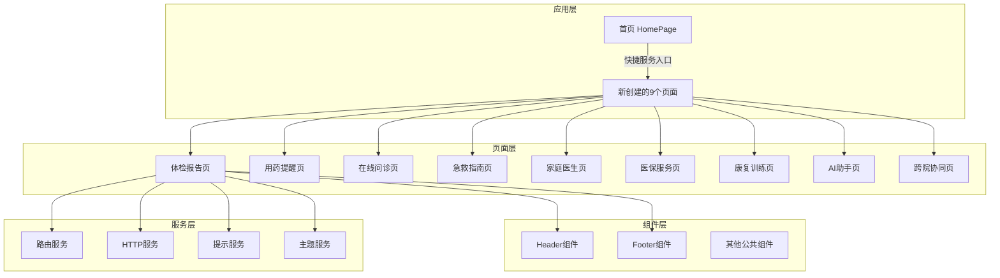
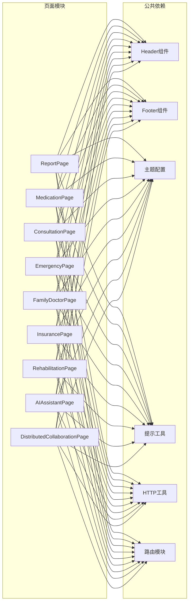
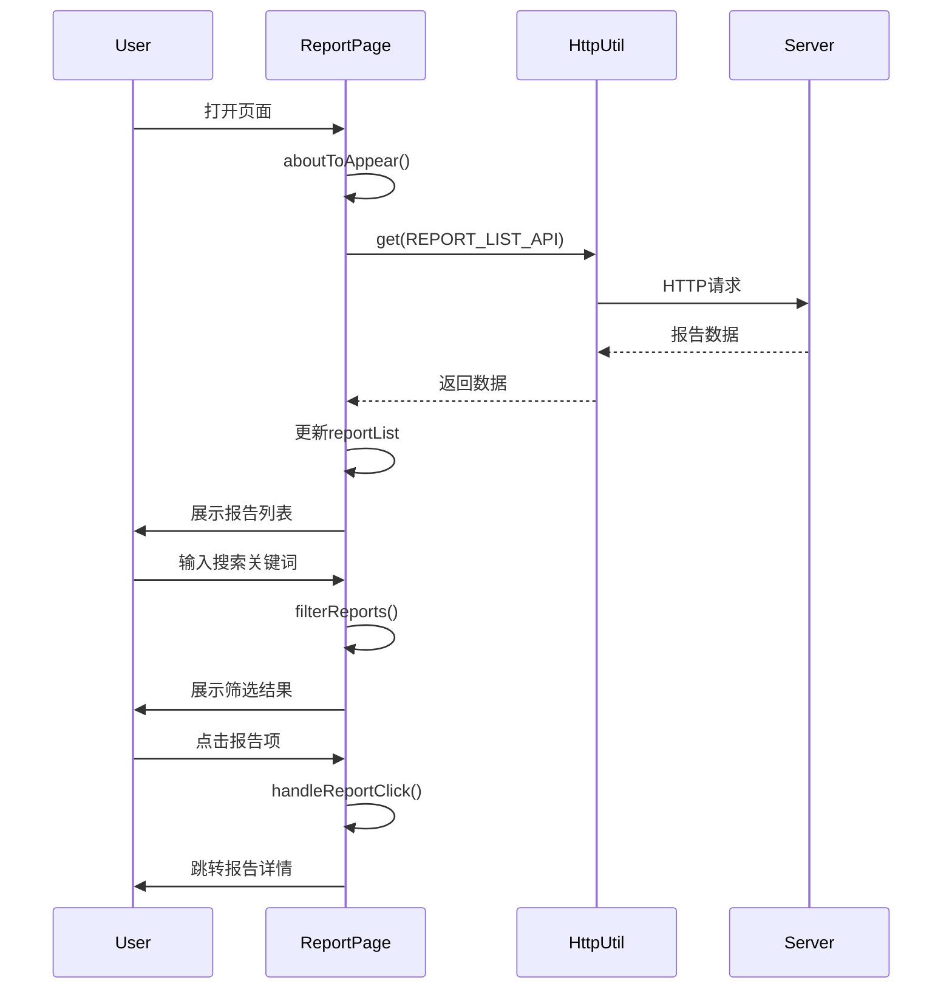
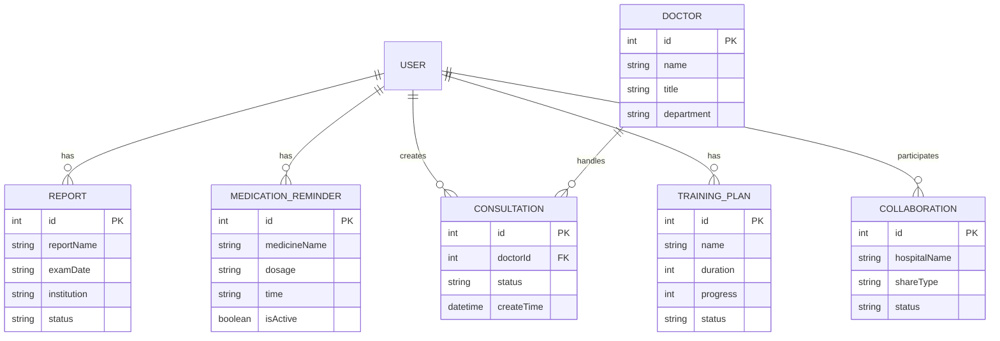
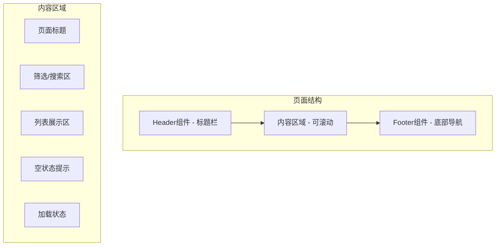
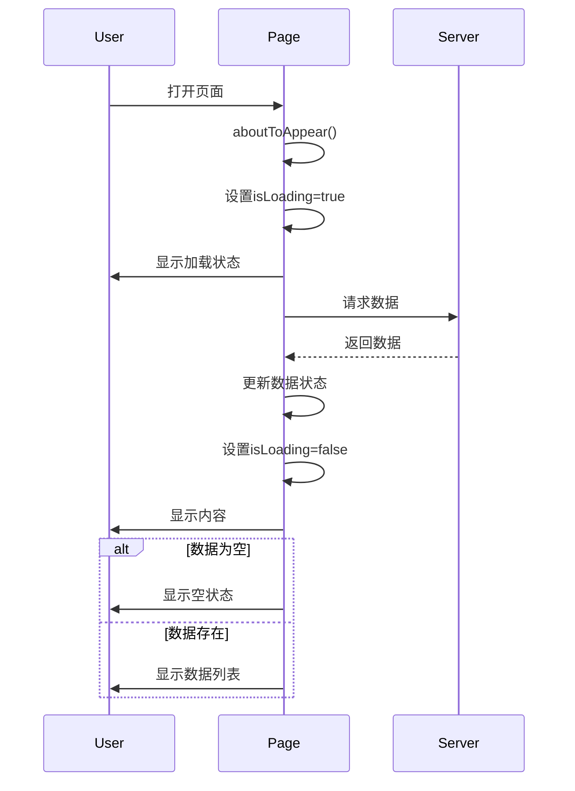
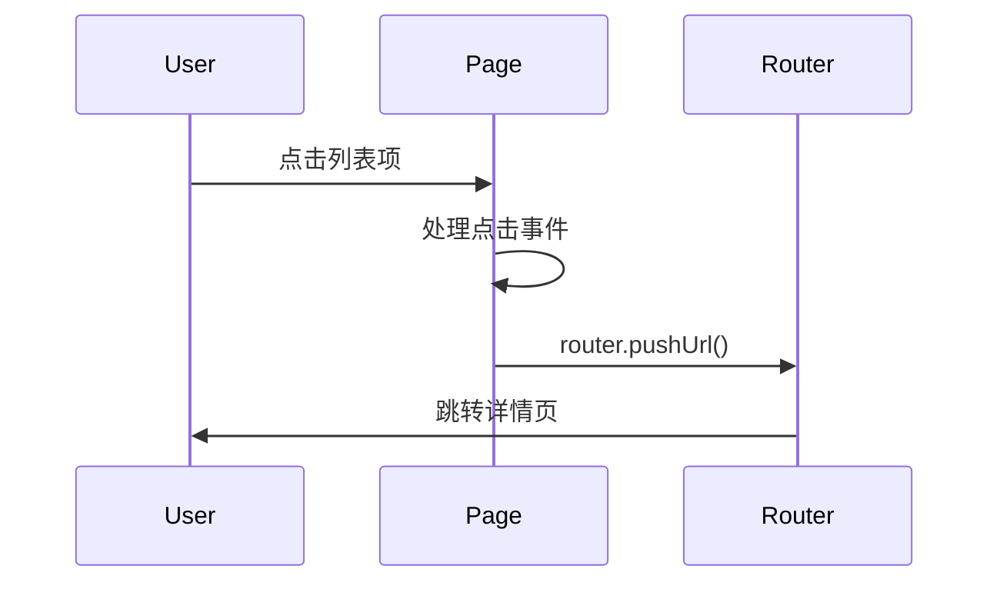

# 缺失页面创建 - 技术设计文档

**版本**: v1.0
**创建日期**: 2025-01-14
**最后更新**: 2025-01-14
**作者**: SDD Agent
**状态**: 草稿

## 1. 设计概述

### 1.1 设计目标

本技术设计旨在为鸿蒙健康护理应用创建9个缺失的页面文件，实现以下目标：

1. **功能完整性**：确保首页所有快捷服务入口能够正常跳转到对应页面
2. **UI一致性**：新页面与现有页面保持统一的设计风格和交互模式
3. **可扩展性**：页面架构支持后续业务功能的渐进式开发
4. **性能优化**：页面加载快速，响应流畅，符合HarmonyOS性能标准
5. **类型安全**：使用ArkTS强类型特性，避免运行时类型错误

### 1.2 技术选型

| 技术项 | 选型 | 选型理由 |
|--------|------|---------|
| 开发语言 | ArkTS | HarmonyOS官方推荐，基于TypeScript扩展，提供强类型安全和声明式UI |
| UI框架 | ArkUI声明式 | 声明式开发范式，代码简洁，性能优异，支持状态管理 |
| 路由方案 | @kit.ArkUI router | HarmonyOS官方路由方案，支持页面导航和参数传递 |
| 状态管理 | @State/@StorageLink | ArkUI内置状态管理，轻量高效，支持跨组件状态共享 |
| 网络请求 | HttpUtil | 项目现有工具类，统一处理HTTP请求和响应 |
| 提示组件 | ToastUtil | 项目现有工具类，统一提示信息展示 |
| 主题管理 | GlobalTheme | 项目现有主题配置，支持适老模式切换 |

### 1.3 设计约束

**技术约束**：
- 必须使用HarmonyOS 6.0及以上API
- 必须遵循项目现有的代码规范和目录结构
- 必须使用项目现有的公共组件和工具类
- 页面代码行数控制在300行以内（单一职责原则）

**业务约束**：
- 页面功能应与首页快捷服务描述一致
- 不得修改现有页面的功能逻辑
- 路由配置不得与现有路由冲突
- 页面标题和图标应与首页服务入口一致

**性能约束**：
- 页面首次加载时间不超过500ms
- 页面跳转响应时间不超过200ms
- 内存占用不超过10MB/页面

## 2. 架构设计

### 2.1 整体架构



### 2.2 模块划分

| 模块名称 | 职责说明 | 文件路径 |
|---------|---------|---------|
| ReportPage | 体检报告展示，报告列表和详情查看 | pages/ReportPage.ets |
| MedicationPage | 用药提醒管理，提醒列表和编辑 | pages/MedicationPage.ets |
| ConsultationPage | 在线问诊入口，科室和医生选择 | pages/ConsultationPage.ets |
| EmergencyPage | 急救指南展示，急救知识分类和搜索 | pages/EmergencyPage.ets |
| FamilyDoctorPage | 家庭医生服务，医生信息和签约管理 | pages/FamilyDoctorPage.ets |
| InsurancePage | 医保服务查询，医保信息和报销记录 | pages/InsurancePage.ets |
| RehabilitationPage | 康复训练管理，训练计划和记录 | pages/RehabilitationPage.ets |
| AIAssistantPage | AI智能助手，对话交互界面 | pages/AIAssistantPage.ets |
| DistributedCollaborationPage | 跨院协同管理，数据共享和病历同步 | pages/DistributedCollaborationPage.ets |

### 2.3 依赖关系



## 3. 模块详细设计

### 3.1 ReportPage（体检报告页面）

#### 3.1.1 职责定义
展示用户体检报告列表，支持查看报告详情，提供报告筛选和搜索功能。

#### 3.1.2 类/接口设计

```typescript
// 数据接口定义
interface ReportItem {
  id: number;                    // 报告ID
  reportName: string;            // 报告名称
  examDate: string;              // 检查日期
  institution: string;           // 检查机构
  status: 'normal' | 'abnormal' | 'pending';  // 报告状态
  summary?: string;              // 报告摘要
}

// 页面组件
@Entry
@Component
struct ReportPage {
  @StorageLink('isOldModeEnabled') isElderMode: boolean = false;
  @State reportList: ReportItem[] = [];
  @State isLoading: boolean = true;
  @State searchText: string = '';
  @State filteredReports: ReportItem[] = [];
}
```

#### 3.1.3 关键方法

| 方法名 | 方法签名 | 功能说明 |
|--------|---------|---------|
| aboutToAppear | `aboutToAppear(): void` | 页面初始化，加载报告数据 |
| loadReports | `async loadReports(): Promise<void>` | 从服务器获取报告列表 |
| filterReports | `filterReports(): void` | 根据搜索条件筛选报告 |
| handleReportClick | `handleReportClick(report: ReportItem): void` | 处理报告项点击，跳转详情 |
| onBackPress | `onBackPress(): void` | 返回上一页 |

#### 3.1.4 数据流



### 3.2 MedicationPage（用药提醒页面）

#### 3.2.1 职责定义
管理用户用药提醒，展示提醒列表，支持添加、编辑和删除提醒。

#### 3.2.2 类/接口设计

```typescript
interface MedicationReminder {
  id: number;                    // 提醒ID
  medicineName: string;          // 药品名称
  dosage: string;                // 剂量
  frequency: string;             // 频率
  time: string;                  // 提醒时间
  startDate: string;             // 开始日期
  endDate?: string;              // 结束日期
  isActive: boolean;             // 是否启用
  notes?: string;                // 备注
}

@Entry
@Component
struct MedicationPage {
  @StorageLink('isOldModeEnabled') isElderMode: boolean = false;
  @State reminderList: MedicationReminder[] = [];
  @State isLoading: boolean = true;
  @State showAddDialog: boolean = false;
}
```

#### 3.2.3 关键方法

| 方法名 | 方法签名 | 功能说明 |
|--------|---------|---------|
| loadReminders | `async loadReminders(): Promise<void>` | 加载用药提醒列表 |
| toggleReminder | `toggleReminder(id: number): void` | 切换提醒启用状态 |
| addReminder | `addReminder(reminder: MedicationReminder): void` | 添加新提醒 |
| editReminder | `editReminder(id: number): void` | 编辑提醒，跳转编辑页 |
| deleteReminder | `async deleteReminder(id: number): Promise<void>` | 删除提醒 |

### 3.3 ConsultationPage（在线问诊页面）

#### 3.3.1 职责定义
提供在线问诊入口，展示科室列表，支持选择科室和医生进行在线咨询。

#### 3.3.2 类/接口设计

```typescript
interface Department {
  id: number;                    // 科室ID
  name: string;                  // 科室名称
  icon: string;                  // 科室图标
  description: string;           // 科室描述
  doctorCount: number;           // 医生数量
}

interface Doctor {
  id: number;                    // 医生ID
  name: string;                  // 医生姓名
  title: string;                 // 职称
  department: string;            // 所属科室
  avatar: string;                // 头像
  rating: number;                // 评分
  consultationCount: number;     // 问诊次数
}

@Entry
@Component
struct ConsultationPage {
  @StorageLink('isOldModeEnabled') isElderMode: boolean = false;
  @State departments: Department[] = [];
  @State recommendedDoctors: Doctor[] = [];
  @State isLoading: boolean = true;
  @State selectedDepartment: number | null = null;
}
```

#### 3.3.3 关键方法

| 方法名 | 方法签名 | 功能说明 |
|--------|---------|---------|
| loadDepartments | `async loadDepartments(): Promise<void>` | 加载科室列表 |
| loadRecommendedDoctors | `async loadRecommendedDoctors(): Promise<void>` | 加载推荐医生 |
| selectDepartment | `selectDepartment(id: number): void` | 选择科室，跳转医生列表 |
| consultDoctor | `consultDoctor(doctorId: number): void` | 选择医生，发起问诊 |

### 3.4 EmergencyPage（急救指南页面）

#### 3.4.1 职责定义
展示急救知识指南，提供急救知识分类浏览和搜索功能。

#### 3.4.2 类/接口设计

```typescript
interface EmergencyGuide {
  id: number;                    // 知识ID
  title: string;                 // 标题
  category: string;              // 分类
  icon: string;                  // 图标
  summary: string;               // 摘要
  content: string;               // 详细内容
  images?: string[];             // 图片列表
  videoUrl?: string;             // 视频链接
}

@Entry
@Component
struct EmergencyPage {
  @StorageLink('isOldModeEnabled') isElderMode: boolean = false;
  @State guides: EmergencyGuide[] = [];
  @State categories: string[] = [];
  @State selectedCategory: string = '全部';
  @State searchText: string = '';
  @State isLoading: boolean = true;
}
```

#### 3.4.3 关键方法

| 方法名 | 方法签名 | 功能说明 |
|--------|---------|---------|
| loadGuides | `async loadGuides(): Promise<void>` | 加载急救知识列表 |
| filterByCategory | `filterByCategory(category: string): void` | 按分类筛选 |
| searchGuides | `searchGuides(keyword: string): void` | 搜索急救知识 |
| viewGuideDetail | `viewGuideDetail(id: number): void` | 查看知识详情 |

### 3.5 FamilyDoctorPage（家庭医生页面）

#### 3.5.1 职责定义
提供家庭医生服务，展示医生信息，支持签约管理和在线咨询。

#### 3.5.2 类/接口设计

```typescript
interface FamilyDoctor {
  id: number;                    // 医生ID
  name: string;                  // 姓名
  title: string;                 // 职称
  hospital: string;              // 所属医院
  department: string;            // 科室
  avatar: string;                // 头像
  rating: number;                // 评分
  serviceCount: number;          // 服务次数
  specialties: string[];         // 专长
  isSigned: boolean;             // 是否已签约
}

@Entry
@Component
struct FamilyDoctorPage {
  @StorageLink('isOldModeEnabled') isElderMode: boolean = false;
  @State doctors: FamilyDoctor[] = [];
  @State myDoctor: FamilyDoctor | null = null;
  @State isLoading: boolean = true;
}
```

#### 3.5.3 关键方法

| 方法名 | 方法签名 | 功能说明 |
|--------|---------|---------|
| loadDoctors | `async loadDoctors(): Promise<void>` | 加载家庭医生列表 |
| loadMyDoctor | `async loadMyDoctor(): Promise<void>` | 加载已签约医生 |
| signDoctor | `async signDoctor(doctorId: number): Promise<void>` | 签约医生 |
| unsignDoctor | `async unsignDoctor(doctorId: number): Promise<void>` | 解约医生 |
| consultDoctor | `consultDoctor(doctorId: number): void` | 咨询医生 |

### 3.6 InsurancePage（医保服务页面）

#### 3.6.1 职责定义
提供医保服务查询，展示医保信息和报销记录。

#### 3.6.2 类/接口设计

```typescript
interface InsuranceInfo {
  cardNumber: string;            // 医保卡号
  cardType: string;              // 卡类型
  balance: number;               // 余额
  status: string;                // 状态
  validDate: string;             // 有效期
}

interface ReimbursementRecord {
  id: number;                    // 记录ID
  type: string;                  // 类型
  amount: number;                // 金额
  date: string;                  // 日期
  hospital: string;              // 医院
  status: 'pending' | 'approved' | 'rejected';  // 状态
}

@Entry
@Component
struct InsurancePage {
  @StorageLink('isOldModeEnabled') isElderMode: boolean = false;
  @State insuranceInfo: InsuranceInfo | null = null;
  @State records: ReimbursementRecord[] = [];
  @State isLoading: boolean = true;
}
```

#### 3.6.3 关键方法

| 方法名 | 方法签名 | 功能说明 |
|--------|---------|---------|
| loadInsuranceInfo | `async loadInsuranceInfo(): Promise<void>` | 加载医保信息 |
| loadRecords | `async loadRecords(): Promise<void>` | 加载报销记录 |
| queryDetail | `queryDetail(recordId: number): void` | 查询记录详情 |

### 3.7 RehabilitationPage（康复训练页面）

#### 3.7.1 职责定义
管理康复训练计划，展示训练记录和进度。

#### 3.7.2 类/接口设计

```typescript
interface TrainingPlan {
  id: number;                    // 计划ID
  name: string;                  // 计划名称
  description: string;           // 描述
  duration: number;              // 时长（天）
  progress: number;              // 进度（百分比）
  startDate: string;             // 开始日期
  endDate: string;               // 结束日期
  status: 'active' | 'completed' | 'paused';  // 状态
}

interface TrainingRecord {
  id: number;                    // 记录ID
  planId: number;                // 计划ID
  date: string;                  // 日期
  duration: number;              // 时长（分钟）
  completed: boolean;            // 是否完成
  notes?: string;                // 备注
}

@Entry
@Component
struct RehabilitationPage {
  @StorageLink('isOldModeEnabled') isElderMode: boolean = false;
  @State plans: TrainingPlan[] = [];
  @State records: TrainingRecord[] = [];
  @State isLoading: boolean = true;
}
```

#### 3.7.3 关键方法

| 方法名 | 方法签名 | 功能说明 |
|--------|---------|---------|
| loadPlans | `async loadPlans(): Promise<void>` | 加载训练计划 |
| loadRecords | `async loadRecords(): Promise<void>` | 加载训练记录 |
| startTraining | `startTraining(planId: number): void` | 开始训练 |
| viewDetail | `viewDetail(planId: number): void` | 查看计划详情 |

### 3.8 AIAssistantPage（AI助手页面）

#### 3.8.1 职责定义
提供AI智能助手对话功能，支持健康咨询和智能问答。

#### 3.8.2 类/接口设计

```typescript
interface ChatMessage {
  id: string;                    // 消息ID
  type: 'user' | 'assistant';    // 消息类型
  content: string;               // 内容
  timestamp: number;             // 时间戳
  isLoading?: boolean;           // 是否加载中
}

@Entry
@Component
struct AIAssistantPage {
  @StorageLink('isOldModeEnabled') isElderMode: boolean = false;
  @State messages: ChatMessage[] = [];
  @State inputText: string = '';
  @State isTyping: boolean = false;
  private scroller: Scroller = new Scroller();
}
```

#### 3.8.3 关键方法

| 方法名 | 方法签名 | 功能说明 |
|--------|---------|---------|
| sendMessage | `async sendMessage(): Promise<void>` | 发送消息 |
| receiveMessage | `async receiveMessage(userMessage: string): Promise<void>` | 接收AI回复 |
| clearHistory | `clearHistory(): void` | 清空对话历史 |
| scrollToBottom | `scrollToBottom(): void` | 滚动到底部 |

### 3.9 DistributedCollaborationPage（跨院协同页面）

#### 3.9.1 职责定义
管理跨院数据协同，支持病历共享和数据同步。

#### 3.9.2 类/接口设计

```typescript
interface CollaborationRecord {
  id: number;                    // 协同ID
  hospitalName: string;          // 医院名称
  shareType: string;             // 共享类型
  shareDate: string;             // 共享日期
  status: 'pending' | 'completed' | 'failed';  // 状态
  dataTypes: string[];           // 数据类型
}

interface MedicalRecord {
  id: number;                    // 病历ID
  hospital: string;              // 医院
  department: string;            // 科室
  doctor: string;                // 医生
  date: string;                  // 日期
  diagnosis: string;             // 诊断
  treatment: string;             // 治疗方案
}

@Entry
@Component
struct DistributedCollaborationPage {
  @StorageLink('isOldModeEnabled') isElderMode: boolean = false;
  @State collaborations: CollaborationRecord[] = [];
  @State medicalRecords: MedicalRecord[] = [];
  @State isLoading: boolean = true;
}
```

#### 3.9.3 关键方法

| 方法名 | 方法签名 | 功能说明 |
|--------|---------|---------|
| loadCollaborations | `async loadCollaborations(): Promise<void>` | 加载协同记录 |
| loadMedicalRecords | `async loadMedicalRecords(): Promise<void>` | 加载病历列表 |
| shareRecord | `async shareRecord(recordId: number): Promise<void>` | 共享病历 |
| syncData | `async syncData(): Promise<void>` | 同步数据 |

## 4. 数据模型设计

### 4.1 核心数据结构

所有数据模型均使用TypeScript接口定义，确保类型安全：

```typescript
// 通用响应结构
interface BaseResponse<T> {
  success: boolean;
  code: number;
  message: string;
  data: T | null;
}

// 分页请求参数
interface PageRequest {
  pageNum: number;
  pageSize: number;
  keyword?: string;
}

// 分页响应数据
interface PageResponse<T> {
  list: T[];
  total: number;
  pageNum: number;
  pageSize: number;
}
```

### 4.2 数据关系



### 4.3 数据存储

本阶段仅实现页面框架，数据存储方案如下（供后续实现参考）：

| 数据类型 | 存储方案 | 说明 |
|---------|---------|------|
| 用户设置 | Preferences API | 适老模式、主题设置等轻量数据 |
| 缓存数据 | 内存缓存 | 临时数据，页面销毁时释放 |
| 业务数据 | 后端API | 主要业务数据通过HTTP请求获取 |
| 离线数据 | RDB | 需要离线访问的数据使用关系型数据库 |

## 5. API设计

### 5.1 内部API

页面间导航API：

```typescript
// 路由跳转
router.pushUrl({
  url: 'pages/TargetPage',
  params: { id: 123 }
});

// 路由返回
router.back();

// 路由替换
router.replaceUrl({
  url: 'pages/TargetPage'
});
```

### 5.2 外部API

各页面需要调用的后端API（本阶段仅定义，不实现）：

| 页面 | API端点 | 请求方法 | 说明 |
|-----|---------|---------|------|
| ReportPage | /api/reports | GET | 获取报告列表 |
| ReportPage | /api/reports/{id} | GET | 获取报告详情 |
| MedicationPage | /api/medications | GET | 获取提醒列表 |
| MedicationPage | /api/medications | POST | 添加提醒 |
| MedicationPage | /api/medications/{id} | PUT | 更新提醒 |
| MedicationPage | /api/medications/{id} | DELETE | 删除提醒 |
| ConsultationPage | /api/departments | GET | 获取科室列表 |
| ConsultationPage | /api/doctors/recommended | GET | 获取推荐医生 |
| EmergencyPage | /api/emergency-guides | GET | 获取急救知识 |
| FamilyDoctorPage | /api/family-doctors | GET | 获取家庭医生列表 |
| FamilyDoctorPage | /api/family-doctors/sign | POST | 签约医生 |
| InsurancePage | /api/insurance/info | GET | 获取医保信息 |
| InsurancePage | /api/insurance/records | GET | 获取报销记录 |
| RehabilitationPage | /api/training-plans | GET | 获取训练计划 |
| AIAssistantPage | /api/ai/chat | POST | AI对话 |
| DistributedCollaborationPage | /api/collaborations | GET | 获取协同记录 |

### 5.3 API规范

**请求格式**：

```typescript
// GET请求
const response = await HttpUtil.get<ResponseType>(ApiConstants.ENDPOINT, {
  headers: { 'Authorization': 'Bearer token' }
});

// POST请求
const response = await HttpUtil.post<ResponseType>(ApiConstants.ENDPOINT, requestBody, {
  headers: { 'Authorization': 'Bearer token' }
});
```

**响应格式**：

```typescript
interface BaseResponse<T> {
  success: boolean;      // 请求是否成功
  code: number;          // 业务状态码
  message: string;       // 提示信息
  data: T | null;        // 业务数据
}
```

## 6. 关键算法设计

本阶段主要实现页面框架，不涉及复杂算法。以下为后续可能涉及的算法设计：

### 6.1 列表过滤算法

#### 算法原理
根据用户输入的关键词，对列表数据进行模糊匹配过滤。

#### 伪代码

```
function filterList(list, keyword):
    if keyword is empty:
        return list

    filteredList = []
    for item in list:
        if item.name contains keyword OR
           item.description contains keyword:
            add item to filteredList

    return filteredList
```

#### 复杂度分析
- 时间复杂度：O(n)，n为列表长度
- 空间复杂度：O(n)，最坏情况需要存储所有元素

## 7. UI/UX设计

### 7.1 页面结构

所有页面采用统一的结构布局：



### 7.2 组件设计

**公共组件使用**：

| 组件 | 属性 | 说明 |
|-----|------|------|
| Header | title: string, showBack: boolean | 页面标题栏，支持返回按钮 |
| Footer | 无 | 底部导航栏 |
| GlobalTheme | isElderMode: boolean | 主题配置，支持适老模式 |

**页面组件设计原则**：

1. 使用`@State`管理组件内部状态
2. 使用`@StorageLink`连接全局状态（适老模式）
3. 使用`ForEach`渲染列表数据
4. 使用`Scroll`组件实现内容滚动
5. 使用`LoadingProgress`展示加载状态

### 7.3 交互流程

**页面加载流程**：



**列表项点击流程**：



## 8. 性能设计

### 8.1 性能目标

| 性能指标 | 目标值 | 测量方法 |
|---------|--------|---------|
| 页面首次加载时间 | < 500ms | DevEco Studio性能分析 |
| 页面跳转响应时间 | < 200ms | 时间戳差值测量 |
| 列表滚动帧率 | ≥ 60fps | 性能监控工具 |
| 内存占用 | < 10MB/页面 | 内存分析工具 |

### 8.2 优化策略

**加载优化**：
- 使用异步加载，避免阻塞主线程
- 数据分页加载，减少单次数据量
- 图片懒加载，按需加载资源

**渲染优化**：
- 使用`ForEach`而非`Map`渲染列表
- 避免在`build`方法中进行复杂计算
- 使用`@State`精确控制更新范围

**内存优化**：
- 页面销毁时释放资源
- 避免内存泄漏（清除定时器、监听器）
- 使用对象池复用对象

### 8.3 监控方案

```typescript
// 性能监控示例
const startTime = Date.now();
await loadData();
const loadTime = Date.now() - startTime;
console.log(`[Performance] Page load time: ${loadTime}ms`);

if (loadTime > 500) {
  console.warn(`[Performance] Slow page load: ${loadTime}ms`);
}
```

## 9. 安全设计

### 9.1 数据安全

- 敏感数据不记录日志
- 网络请求使用HTTPS
- 本地存储数据加密（如需要）
- 不在代码中硬编码密钥

### 9.2 权限控制

本阶段不涉及特殊权限申请，后续功能可能需要：

- 相机权限（拍照上传）
- 麦克风权限（语音输入）
- 存储权限（文件保存）

### 9.3 安全审计

- 输入验证：验证用户输入的合法性
- XSS防护：避免直接渲染用户输入的HTML
- CSRF防护：使用token验证请求

## 10. 测试设计

### 10.1 测试策略

| 测试类型 | 占比 | 测试重点 |
|---------|------|---------|
| 单元测试 | 70% | 数据处理、工具方法 |
| 集成测试 | 20% | 页面导航、API调用 |
| E2E测试 | 10% | 用户操作流程 |

### 10.2 测试用例

**页面加载测试**：

| 测试场景 | 前置条件 | 操作步骤 | 预期结果 |
|---------|---------|---------|---------|
| 正常加载 | 网络正常 | 打开页面 | 显示数据列表 |
| 网络异常 | 网络断开 | 打开页面 | 显示错误提示 |
| 数据为空 | 账号无数据 | 打开页面 | 显示空状态 |

**页面导航测试**：

| 测试场景 | 前置条件 | 操作步骤 | 预期结果 |
|---------|---------|---------|---------|
| 正常跳转 | 页面已注册 | 点击服务图标 | 成功跳转目标页 |
| 返回导航 | 已跳转页面 | 点击返回按钮 | 返回上一页 |
| 参数传递 | 页面支持参数 | 带参数跳转 | 参数正确传递 |

### 10.3 Mock数据

```typescript
// Mock数据示例
const mockReports: ReportItem[] = [
  {
    id: 1,
    reportName: '2024年度体检报告',
    examDate: '2024-12-15',
    institution: '北京协和医院',
    status: 'normal',
    summary: '各项指标正常'
  },
  {
    id: 2,
    reportName: '血常规检查',
    examDate: '2024-11-20',
    institution: '北京同仁医院',
    status: 'abnormal',
    summary: '白细胞偏高'
  }
];
```

## 11. 部署设计

### 11.1 环境要求

- HarmonyOS 6.0及以上版本
- DevEco Studio 4.0及以上版本
- Node.js 14.x及以上版本

### 11.2 配置管理

**路由配置**：

在`entry/src/main/resources/base/profile/main_pages.json`中添加：

```json
{
  "src": [
    "pages/Index",
    "pages/HomePage",
    "pages/ReportPage",
    "pages/MedicationPage",
    "pages/ConsultationPage",
    "pages/EmergencyPage",
    "pages/FamilyDoctorPage",
    "pages/InsurancePage",
    "pages/RehabilitationPage",
    "pages/AIAssistantPage",
    "pages/DistributedCollaborationPage"
  ]
}
```

### 11.3 发布流程

1. 代码开发完成
2. 本地测试通过
3. 提交代码审查
4. 合并到主分支
5. 构建发布包
6. 部署到测试环境
7. 验收测试通过
8. 部署到生产环境

## 12. 附录

### 12.1 术语表

| 术语 | 定义 |
|-----|------|
| ArkTS | HarmonyOS应用开发语言，基于TypeScript扩展 |
| ArkUI | HarmonyOS声明式UI开发框架 |
| @Entry | 页面入口装饰器，标识页面组件 |
| @Component | 组件装饰器，定义UI组件 |
| @State | 状态装饰器，管理组件内部状态 |
| @StorageLink | 存储链接装饰器，连接全局状态 |
| router | HarmonyOS路由模块，用于页面导航 |
| 适老模式 | 针对老年用户的界面优化模式 |

### 12.2 参考资料

- HarmonyOS官方文档：https://developer.huawei.com/consumer/cn/doc/harmonyos-guides-V5/arkts-get-start-V5
- ArkUI组件参考：https://developer.huawei.com/consumer/cn/doc/harmonyos-references-V5/arkui-overview-V5
- 项目现有页面实现：pages/Medications、pages/AiChatPage、pages/RehabPage
- 项目路由配置：entry/src/main/resources/base/profile/main_pages.json

### 12.3 变更历史

| 版本 | 日期 | 变更内容 | 作者 |
|-----|------|---------|------|
| v1.0 | 2025-01-14 | 初始版本创建 | SDD Agent |
