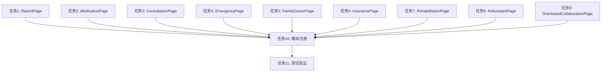

# 缺失页面创建 - 任务规划文档

**版本**: v1.0
**创建日期**: 2025-01-14
**最后更新**: 2025-01-14
**作者**: SDD Agent
**状态**: 草稿

## 任务概述

本文档将技术设计转化为可执行的编码任务，共规划**11个主任务**，包含**23个子任务**，覆盖所有需求规格（FR-001至FR-012）。

**任务依赖关系**：
- 任务1-9（页面创建）可并行执行
- 任务10（路由注册）依赖任务1-9完成
- 任务11（测试验证）依赖任务10完成

---

## 任务1：创建ReportPage（体检报告页面）

### 任务描述
创建体检报告页面文件，实现报告列表展示和基础交互功能。

### 输入
- 设计文档中ReportPage模块设计
- 现有参考页面：pages/Medications.ets
- 公共组件：Header、Footer、GlobalTheme

### 输出
- pages/ReportPage.ets文件

### 验收标准
- 文件创建成功，包含@Entry和@Component装饰器
- 页面标题显示"体检报告"
- 包含报告列表展示区域
- 支持返回导航功能
- 支持适老模式切换
- 代码行数不超过300行

### 子任务

#### 1.1 创建页面基础结构
**描述**：创建ReportPage.ets文件，搭建页面基础框架
**操作步骤**：
1. 在pages目录创建ReportPage.ets文件
2. 导入必要模块（router、Header、Footer、GlobalTheme、ToastUtil、HttpUtil）
3. 定义ReportItem数据接口
4. 创建@Entry @Component struct ReportPage组件
5. 定义状态变量（reportList、isLoading、searchText等）

#### 1.2 实现页面生命周期
**描述**：实现aboutToAppear生命周期方法
**操作步骤**：
1. 在aboutToAppear中初始化适老模式状态
2. 调用loadReports方法加载报告数据
3. 添加浏览记录追踪（可选）

#### 1.3 实现数据加载方法
**描述**：实现loadReports异步方法
**操作步骤**：
1. 设置isLoading为true
2. 使用HttpUtil.get调用报告列表API
3. 处理响应数据，更新reportList
4. 异常处理，加载失败时使用默认数据
5. 设置isLoading为false

#### 1.4 实现UI布局
**描述**：实现build方法，构建页面UI
**操作步骤**：
1. 使用Column作为根容器
2. 添加Header组件，设置标题"体检报告"
3. 使用Scroll包裹内容区域
4. 添加搜索框组件
5. 使用ForEach渲染报告列表
6. 添加加载状态和空状态展示
7. 添加Footer组件

#### 1.5 实现交互方法
**描述**：实现报告项点击和筛选方法
**操作步骤**：
1. 实现handleReportClick方法，跳转报告详情
2. 实现filterReports方法，根据关键词筛选
3. 实现onBackPress方法，处理返回操作

### 代码生成提示
```
创建pages/ReportPage.ets文件，参考pages/Medications.ets的实现风格。
使用Header组件显示标题"体检报告"，使用GlobalTheme支持适老模式。
实现报告列表展示，支持搜索筛选，使用ForEach渲染列表项。
添加加载状态LoadingProgress和空状态提示。
```

---

## 任务2：创建MedicationPage（用药提醒页面）

### 任务描述
创建用药提醒页面文件，实现提醒列表管理和基础交互功能。

### 输入
- 设计文档中MedicationPage模块设计
- 现有参考页面：pages/MedicationReminderListPage.ets
- 公共组件：Header、Footer、GlobalTheme

### 输出
- pages/MedicationPage.ets文件

### 验收标准
- 文件创建成功，包含@Entry和@Component装饰器
- 页面标题显示"用药提醒"
- 包含提醒列表展示区域
- 包含添加提醒入口
- 支持返回导航功能
- 支持适老模式切换

### 子任务

#### 2.1 创建页面基础结构
**描述**：创建MedicationPage.ets文件，搭建页面基础框架
**操作步骤**：
1. 在pages目录创建MedicationPage.ets文件
2. 导入必要模块
3. 定义MedicationReminder数据接口
4. 创建@Entry @Component struct MedicationPage组件
5. 定义状态变量（reminderList、isLoading、showAddDialog等）

#### 2.2 实现数据加载方法
**描述**：实现loadReminders异步方法
**操作步骤**：
1. 设置isLoading为true
2. 使用HttpUtil.get调用提醒列表API
3. 处理响应数据，更新reminderList
4. 异常处理
5. 设置isLoading为false

#### 2.3 实现UI布局
**描述**：实现build方法，构建页面UI
**操作步骤**：
1. 使用Column作为根容器
2. 添加Header组件，设置标题"用药提醒"
3. 使用Scroll包裹内容区域
4. 使用ForEach渲染提醒列表
5. 添加浮动按钮（添加提醒）
6. 添加加载状态和空状态展示
7. 添加Footer组件

#### 2.4 实现交互方法
**描述**：实现提醒管理相关方法
**操作步骤**：
1. 实现toggleReminder方法，切换提醒状态
2. 实现addReminder方法，跳转添加提醒页
3. 实现editReminder方法，跳转编辑提醒页
4. 实现deleteReminder方法，删除提醒

### 代码生成提示
```
创建pages/MedicationPage.ets文件，参考pages/MedicationReminderListPage.ets的实现风格。
使用Header组件显示标题"用药提醒"，实现提醒列表展示。
每个提醒项显示药品名称、剂量、时间，支持启用/禁用切换。
添加浮动按钮用于添加新提醒。
```

---

## 任务3：创建ConsultationPage（在线问诊页面）

### 任务描述
创建在线问诊页面文件，实现科室选择和医生推荐功能。

### 输入
- 设计文档中ConsultationPage模块设计
- 现有参考页面：pages/DepartmentListPage.ets、pages/DoctorListPage.ets
- 公共组件：Header、Footer、GlobalTheme

### 输出
- pages/ConsultationPage.ets文件

### 验收标准
- 文件创建成功，包含@Entry和@Component装饰器
- 页面标题显示"在线问诊"
- 包含科室选择列表
- 包含医生推荐区域
- 支持返回导航功能

### 子任务

#### 3.1 创建页面基础结构
**描述**：创建ConsultationPage.ets文件，搭建页面基础框架
**操作步骤**：
1. 在pages目录创建ConsultationPage.ets文件
2. 导入必要模块
3. 定义Department和Doctor数据接口
4. 创建@Entry @Component struct ConsultationPage组件
5. 定义状态变量（departments、recommendedDoctors、isLoading等）

#### 3.2 实现数据加载方法
**描述**：实现loadDepartments和loadRecommendedDoctors方法
**操作步骤**：
1. 实现loadDepartments方法，加载科室列表
2. 实现loadRecommendedDoctors方法，加载推荐医生
3. 在aboutToAppear中调用两个加载方法

#### 3.3 实现UI布局
**描述**：实现build方法，构建页面UI
**操作步骤**：
1. 使用Column作为根容器
2. 添加Header组件，设置标题"在线问诊"
3. 使用Scroll包裹内容区域
4. 添加科室选择区域（网格布局）
5. 添加推荐医生区域（列表布局）
6. 添加加载状态
7. 添加Footer组件

#### 3.4 实现交互方法
**描述**：实现科室和医生选择方法
**操作步骤**：
1. 实现selectDepartment方法，跳转医生列表页
2. 实现consultDoctor方法，发起问诊

### 代码生成提示
```
创建pages/ConsultationPage.ets文件，参考pages/DepartmentListPage.ets的实现风格。
使用Header组件显示标题"在线问诊"。
使用Grid布局展示科室列表，每个科室显示图标和名称。
使用List展示推荐医生，显示头像、姓名、职称、评分。
点击科室跳转到pages/DoctorListPage，点击医生发起问诊。
```

---

## 任务4：创建EmergencyPage（急救指南页面）

### 任务描述
创建急救指南页面文件，实现急救知识分类和搜索功能。

### 输入
- 设计文档中EmergencyPage模块设计
- 现有参考页面：pages/SciencePage.ets
- 公共组件：Header、Footer、GlobalTheme

### 输出
- pages/EmergencyPage.ets文件

### 验收标准
- 文件创建成功，包含@Entry和@Component装饰器
- 页面标题显示"急救指南"
- 包含急救知识分类列表
- 包含搜索功能
- 支持返回导航功能

### 子任务

#### 4.1 创建页面基础结构
**描述**：创建EmergencyPage.ets文件，搭建页面基础框架
**操作步骤**：
1. 在pages目录创建EmergencyPage.ets文件
2. 导入必要模块
3. 定义EmergencyGuide数据接口
4. 创建@Entry @Component struct EmergencyPage组件
5. 定义状态变量（guides、categories、selectedCategory、searchText等）

#### 4.2 实现数据加载方法
**描述**：实现loadGuides方法
**操作步骤**：
1. 设置isLoading为true
2. 使用HttpUtil.get调用急救知识API
3. 处理响应数据，更新guides和categories
4. 异常处理
5. 设置isLoading为false

#### 4.3 实现UI布局
**描述**：实现build方法，构建页面UI
**操作步骤**：
1. 使用Column作为根容器
2. 添加Header组件，设置标题"急救指南"
3. 添加搜索框
4. 添加分类筛选标签（横向滚动）
5. 使用Scroll包裹内容区域
6. 使用ForEach渲染知识列表
7. 添加加载状态和空状态
8. 添加Footer组件

#### 4.4 实现交互方法
**描述**：实现筛选和搜索方法
**操作步骤**：
1. 实现filterByCategory方法，按分类筛选
2. 实现searchGuides方法，搜索急救知识
3. 实现viewGuideDetail方法，查看知识详情

### 代码生成提示
```
创建pages/EmergencyPage.ets文件，参考pages/SciencePage.ets的实现风格。
使用Header组件显示标题"急救指南"。
添加搜索框和分类筛选标签（全部、心肺复苏、外伤处理、中毒急救等）。
使用ForEach渲染急救知识列表，每项显示图标、标题、摘要。
点击知识项跳转详情页。
```

---

## 任务5：创建FamilyDoctorPage（家庭医生页面）

### 任务描述
创建家庭医生页面文件，实现医生信息展示和签约管理功能。

### 输入
- 设计文档中FamilyDoctorPage模块设计
- 现有参考页面：pages/DoctorListPage.ets
- 公共组件：Header、Footer、GlobalTheme

### 输出
- pages/FamilyDoctorPage.ets文件

### 验收标准
- 文件创建成功，包含@Entry和@Component装饰器
- 页面标题显示"家庭医生"
- 包含医生信息展示
- 包含签约管理入口
- 支持返回导航功能

### 子任务

#### 5.1 创建页面基础结构
**描述**：创建FamilyDoctorPage.ets文件，搭建页面基础框架
**操作步骤**：
1. 在pages目录创建FamilyDoctorPage.ets文件
2. 导入必要模块
3. 定义FamilyDoctor数据接口
4. 创建@Entry @Component struct FamilyDoctorPage组件
5. 定义状态变量（doctors、myDoctor、isLoading等）

#### 5.2 实现数据加载方法
**描述**：实现loadDoctors和loadMyDoctor方法
**操作步骤**：
1. 实现loadDoctors方法，加载家庭医生列表
2. 实现loadMyDoctor方法，加载已签约医生
3. 在aboutToAppear中调用加载方法

#### 5.3 实现UI布局
**描述**：实现build方法，构建页面UI
**操作步骤**：
1. 使用Column作为根容器
2. 添加Header组件，设置标题"家庭医生"
3. 使用Scroll包裹内容区域
4. 添加"我的家庭医生"区域（如已签约）
5. 添加"推荐医生"区域（列表布局）
6. 添加加载状态
7. 添加Footer组件

#### 5.4 实现交互方法
**描述**：实现签约和咨询方法
**操作步骤**：
1. 实现signDoctor方法，签约医生
2. 实现unsignDoctor方法，解约医生
3. 实现consultDoctor方法，咨询医生

### 代码生成提示
```
创建pages/FamilyDoctorPage.ets文件，参考pages/DoctorListPage.ets的实现风格。
使用Header组件显示标题"家庭医生"。
如果有已签约医生，在顶部显示"我的家庭医生"卡片。
使用List展示推荐医生，显示头像、姓名、职称、专长、评分。
提供签约和咨询按钮。
```

---

## 任务6：创建InsurancePage（医保服务页面）

### 任务描述
创建医保服务页面文件，实现医保信息查询和报销记录展示功能。

### 输入
- 设计文档中InsurancePage模块设计
- 现有参考页面：pages/HealthRecords.ets
- 公共组件：Header、Footer、GlobalTheme

### 输出
- pages/InsurancePage.ets文件

### 验收标准
- 文件创建成功，包含@Entry和@Component装饰器
- 页面标题显示"医保服务"
- 包含医保信息展示
- 包含报销记录列表
- 支持返回导航功能

### 子任务

#### 6.1 创建页面基础结构
**描述**：创建InsurancePage.ets文件，搭建页面基础框架
**操作步骤**：
1. 在pages目录创建InsurancePage.ets文件
2. 导入必要模块
3. 定义InsuranceInfo和ReimbursementRecord数据接口
4. 创建@Entry @Component struct InsurancePage组件
5. 定义状态变量（insuranceInfo、records、isLoading等）

#### 6.2 实现数据加载方法
**描述**：实现loadInsuranceInfo和loadRecords方法
**操作步骤**：
1. 实现loadInsuranceInfo方法，加载医保信息
2. 实现loadRecords方法，加载报销记录
3. 在aboutToAppear中调用加载方法

#### 6.3 实现UI布局
**描述**：实现build方法，构建页面UI
**操作步骤**：
1. 使用Column作为根容器
2. 添加Header组件，设置标题"医保服务"
3. 使用Scroll包裹内容区域
4. 添加医保信息卡片（卡号、余额、状态）
5. 添加报销记录列表
6. 添加加载状态
7. 添加Footer组件

#### 6.4 实现交互方法
**描述**：实现查询和详情查看方法
**操作步骤**：
1. 实现queryDetail方法，查询记录详情
2. 实现refreshInfo方法，刷新医保信息

### 代码生成提示
```
创建pages/InsurancePage.ets文件，参考pages/HealthRecords.ets的实现风格。
使用Header组件显示标题"医保服务"。
顶部显示医保信息卡片（医保卡号、类型、余额、有效期）。
使用List展示报销记录，每项显示类型、金额、日期、状态。
点击记录查看详情。
```

---

## 任务7：创建RehabilitationPage（康复训练页面）

### 任务描述
创建康复训练页面文件，实现训练计划展示和记录管理功能。

### 输入
- 设计文档中RehabilitationPage模块设计
- 现有参考页面：pages/RehabPage.ets
- 公共组件：Header、Footer、GlobalTheme

### 输出
- pages/RehabilitationPage.ets文件

### 验收标准
- 文件创建成功，包含@Entry和@Component装饰器
- 页面标题显示"康复训练"
- 包含训练计划列表
- 包含训练记录展示
- 支持返回导航功能

### 子任务

#### 7.1 创建页面基础结构
**描述**：创建RehabilitationPage.ets文件，搭建页面基础框架
**操作步骤**：
1. 在pages目录创建RehabilitationPage.ets文件
2. 导入必要模块
3. 定义TrainingPlan和TrainingRecord数据接口
4. 创建@Entry @Component struct RehabilitationPage组件
5. 定义状态变量（plans、records、isLoading等）

#### 7.2 实现数据加载方法
**描述**：实现loadPlans和loadRecords方法
**操作步骤**：
1. 实现loadPlans方法，加载训练计划
2. 实现loadRecords方法，加载训练记录
3. 在aboutToAppear中调用加载方法

#### 7.3 实现UI布局
**描述**：实现build方法，构建页面UI
**操作步骤**：
1. 使用Column作为根容器
2. 添加Header组件，设置标题"康复训练"
3. 使用Scroll包裹内容区域
4. 添加训练计划列表（显示进度条）
5. 添加训练记录区域
6. 添加加载状态
7. 添加Footer组件

#### 7.4 实现交互方法
**描述**：实现训练相关方法
**操作步骤**：
1. 实现startTraining方法，开始训练
2. 实现viewDetail方法，查看计划详情
3. 实现pausePlan方法，暂停计划

### 代码生成提示
```
创建pages/RehabilitationPage.ets文件，参考pages/RehabPage.ets的实现风格。
使用Header组件显示标题"康复训练"。
使用List展示训练计划，每项显示计划名称、进度条、状态。
添加训练记录时间线展示。
点击计划跳转详情或开始训练。
```

---

## 任务8：创建AIAssistantPage（AI助手页面）

### 任务描述
创建AI助手页面文件，实现AI对话交互功能。

### 输入
- 设计文档中AIAssistantPage模块设计
- 现有参考页面：pages/AiChatPage.ets
- 公共组件：Header、Footer、GlobalTheme

### 输出
- pages/AIAssistantPage.ets文件

### 验收标准
- 文件创建成功，包含@Entry和@Component装饰器
- 页面标题显示"AI助手"
- 包含对话消息列表
- 包含输入框和发送按钮
- 支持返回导航功能

### 子任务

#### 8.1 创建页面基础结构
**描述**：创建AIAssistantPage.ets文件，搭建页面基础框架
**操作步骤**：
1. 在pages目录创建AIAssistantPage.ets文件
2. 导入必要模块
3. 定义ChatMessage数据接口
4. 创建@Entry @Component struct AIAssistantPage组件
5. 定义状态变量（messages、inputText、isTyping等）
6. 定义Scroller控制器

#### 8.2 实现对话方法
**描述**：实现sendMessage和receiveMessage方法
**操作步骤**：
1. 实现sendMessage方法，发送用户消息
2. 实现receiveMessage方法，接收AI回复
3. 实现scrollToBottom方法，滚动到底部
4. 实现clearHistory方法，清空对话

#### 8.3 实现UI布局
**描述**：实现build方法，构建页面UI
**操作步骤**：
1. 使用Column作为根容器
2. 添加Header组件，设置标题"AI助手"
3. 使用Scroll包裹消息列表区域
4. 使用ForEach渲染消息列表（区分用户和AI消息）
5. 添加底部输入区域（输入框+发送按钮）
6. 添加Footer组件

#### 8.4 实现交互方法
**描述**：实现消息发送和快捷问题
**操作步骤**：
1. 实现输入框文本变化监听
2. 实现发送按钮点击处理
3. 添加快捷问题建议（可选）
4. 实现消息长按菜单（复制、删除）

### 代码生成提示
```
创建pages/AIAssistantPage.ets文件，参考pages/AiChatPage.ets的实现风格。
使用Header组件显示标题"AI助手"。
使用List展示对话消息，用户消息靠右，AI消息靠左。
底部固定输入区域，包含输入框和发送按钮。
发送消息后自动滚动到底部，显示AI正在输入状态。
```

---

## 任务9：创建DistributedCollaborationPage（跨院协同页面）

### 任务描述
创建跨院协同页面文件，实现数据协同和病历共享功能。

### 输入
- 设计文档中DistributedCollaborationPage模块设计
- 现有参考页面：pages/MedicalRecordSyncPage.ets
- 公共组件：Header、Footer、GlobalTheme

### 输出
- pages/DistributedCollaborationPage.ets文件

### 验收标准
- 文件创建成功，包含@Entry和@Component装饰器
- 页面标题显示"跨院协同"
- 包含协同记录列表
- 包含病历共享入口
- 支持返回导航功能

### 子任务

#### 9.1 创建页面基础结构
**描述**：创建DistributedCollaborationPage.ets文件，搭建页面基础框架
**操作步骤**：
1. 在pages目录创建DistributedCollaborationPage.ets文件
2. 导入必要模块
3. 定义CollaborationRecord和MedicalRecord数据接口
4. 创建@Entry @Component struct DistributedCollaborationPage组件
5. 定义状态变量（collaborations、medicalRecords、isLoading等）

#### 9.2 实现数据加载方法
**描述**：实现loadCollaborations和loadMedicalRecords方法
**操作步骤**：
1. 实现loadCollaborations方法，加载协同记录
2. 实现loadMedicalRecords方法，加载病历列表
3. 在aboutToAppear中调用加载方法

#### 9.3 实现UI布局
**描述**：实现build方法，构建页面UI
**操作步骤**：
1. 使用Column作为根容器
2. 添加Header组件，设置标题"跨院协同"
3. 使用Scroll包裹内容区域
4. 添加协同记录列表
5. 添加病历共享按钮
6. 添加加载状态
7. 添加Footer组件

#### 9.4 实现交互方法
**描述**：实现协同和共享方法
**操作步骤**：
1. 实现shareRecord方法，共享病历
2. 实现syncData方法，同步数据
3. 实现viewCollaborationDetail方法，查看协同详情

### 代码生成提示
```
创建pages/DistributedCollaborationPage.ets文件，参考pages/MedicalRecordSyncPage.ets的实现风格。
使用Header组件显示标题"跨院协同"。
使用List展示协同记录，每项显示医院名称、共享类型、日期、状态。
添加病历共享按钮，点击选择病历进行共享。
提供数据同步功能。
```

---

## 任务10：注册路由配置

### 任务描述
在main_pages.json中注册所有新创建的页面路由。

### 输入
- 已创建的9个页面文件
- 现有路由配置：entry/src/main/resources/base/profile/main_pages.json

### 输出
- 更新后的main_pages.json文件

### 验收标准
- main_pages.json包含所有9个新页面的路由配置
- 路由配置格式正确，无语法错误
- 不影响现有路由配置
- 应用能够正常编译

### 子任务

#### 10.1 备份现有配置
**描述**：备份main_pages.json文件
**操作步骤**：
1. 读取现有main_pages.json内容
2. 创建备份文件main_pages.json.backup
3. 验证备份成功

#### 10.2 添加新页面路由
**描述**：在路由配置中添加新页面
**操作步骤**：
1. 读取main_pages.json文件
2. 在src数组中添加9个新页面路由：
   - "pages/ReportPage"
   - "pages/MedicationPage"
   - "pages/ConsultationPage"
   - "pages/EmergencyPage"
   - "pages/FamilyDoctorPage"
   - "pages/InsurancePage"
   - "pages/RehabilitationPage"
   - "pages/AIAssistantPage"
   - "pages/DistributedCollaborationPage"
3. 保持JSON格式正确
4. 保存文件

#### 10.3 验证路由配置
**描述**：验证路由配置正确性
**操作步骤**：
1. 检查JSON格式是否正确
2. 检查所有页面路径是否存在
3. 检查是否有重复路由
4. 尝试编译项目验证配置

### 代码生成提示
```
更新entry/src/main/resources/base/profile/main_pages.json文件。
在src数组中添加以下路由：
"pages/ReportPage",
"pages/MedicationPage",
"pages/ConsultationPage",
"pages/EmergencyPage",
"pages/FamilyDoctorPage",
"pages/InsurancePage",
"pages/RehabilitationPage",
"pages/AIAssistantPage",
"pages/DistributedCollaborationPage"
确保JSON格式正确，不破坏现有配置。
```

---

## 任务11：测试验证

### 任务描述
测试所有新创建页面的功能，验证需求规格的验收标准。

### 输入
- 已创建的9个页面文件
- 已更新的路由配置
- 需求规格文档中的验收标准

### 输出
- 测试报告
- 问题修复记录

### 验收标准
- 所有页面能够正常打开
- 页面标题显示正确
- 返回导航功能正常
- 适老模式切换正常
- 无编译错误和运行时错误

### 子任务

#### 11.1 编译测试
**描述**：编译项目，检查编译错误
**操作步骤**：
1. 清理项目构建缓存
2. 执行项目编译
3. 检查编译输出，记录错误和警告
4. 修复编译错误

#### 11.2 页面跳转测试
**描述**：测试从首页跳转到各个新页面
**操作步骤**：
1. 启动应用，进入首页
2. 依次点击9个快捷服务图标
3. 验证页面跳转成功
4. 验证页面标题正确
5. 记录测试结果

#### 11.3 返回导航测试
**描述**：测试各页面的返回导航功能
**操作步骤**：
1. 进入各个新页面
2. 点击返回按钮
3. 验证返回到首页
4. 记录测试结果

#### 11.4 适老模式测试
**描述**：测试适老模式切换功能
**操作步骤**：
1. 切换适老模式
2. 进入各个新页面
3. 验证字体和布局调整
4. 记录测试结果

#### 11.5 UI一致性测试
**描述**：验证新页面UI与现有页面风格一致
**操作步骤**：
1. 对比新页面与参考页面的UI风格
2. 检查颜色、字体、间距是否一致
3. 检查组件使用是否规范
4. 记录差异和改进建议

#### 11.6 性能测试
**描述**：测试页面加载和跳转性能
**操作步骤**：
1. 测量各页面首次加载时间
2. 测量页面跳转响应时间
3. 检查内存占用情况
4. 记录性能数据
5. 对比性能目标，提出优化建议

### 代码生成提示
```
执行以下测试：
1. 编译项目，确保无编译错误
2. 启动应用，从首页依次点击9个快捷服务图标，验证跳转成功
3. 在各页面点击返回按钮，验证返回导航正常
4. 切换适老模式，验证页面显示正确
5. 检查UI风格与现有页面一致
6. 测量页面加载时间，确保符合性能目标
记录测试结果，生成测试报告。
```

---

## 任务执行顺序



**并行执行**：任务1-9可同时进行，互不依赖
**串行执行**：任务10依赖任务1-9完成，任务11依赖任务10完成

---

## 需求覆盖矩阵

| 需求ID | 需求描述 | 覆盖任务 | 验证状态 |
|--------|---------|---------|---------|
| FR-001 | ReportPage页面创建 | 任务1 | 待验证 |
| FR-002 | MedicationPage页面创建 | 任务2 | 待验证 |
| FR-003 | ConsultationPage页面创建 | 任务3 | 待验证 |
| FR-004 | EmergencyPage页面创建 | 任务4 | 待验证 |
| FR-005 | FamilyDoctorPage页面创建 | 任务5 | 待验证 |
| FR-006 | InsurancePage页面创建 | 任务6 | 待验证 |
| FR-007 | RehabilitationPage页面创建 | 任务7 | 待验证 |
| FR-008 | AIAssistantPage页面创建 | 任务8 | 待验证 |
| FR-009 | DistributedCollaborationPage页面创建 | 任务9 | 待验证 |
| FR-010 | 路由配置更新 | 任务10 | 待验证 |
| FR-011 | 页面返回导航 | 任务11.3 | 待验证 |
| FR-012 | 页面标题显示 | 任务11.2 | 待验证 |

---

## 风险与应对

| 风险项 | 风险等级 | 应对措施 |
|--------|---------|---------|
| 页面文件创建失败 | 中 | 检查文件权限，确保目录存在 |
| 路由配置格式错误 | 高 | 备份现有配置，使用JSON验证工具 |
| 编译错误 | 高 | 逐个页面编译，定位错误源头 |
| UI风格不一致 | 中 | 参考现有页面，使用统一主题配置 |
| 性能不达标 | 中 | 优化数据加载，使用懒加载和缓存 |

---

## 附录

### 参考文件路径

- 项目根目录：`e:/HMOS6.0/Github/harmony-health-care`
- 页面目录：`entry/src/main/ets/pages/`
- 路由配置：`entry/src/main/resources/base/profile/main_pages.json`
- 公共组件：`entry/src/main/ets/components/`
- 工具类：`entry/src/main/ets/common/utils/`

### 变更历史

| 版本 | 日期 | 变更内容 | 作者 |
|-----|------|---------|------|
| v1.0 | 2025-01-14 | 初始版本创建 | SDD Agent |
