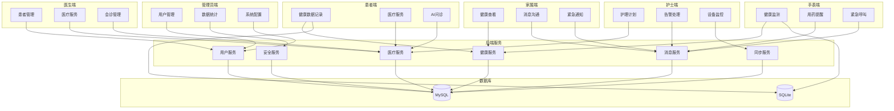

# 技术设计文档

## 文档信息

| 属性 | 值 |
|------|-----|
| 文档名称 | 星云医疗助手项目优化技术设计文档 |
| 文档版本 | v1.0 |
| 创建日期 | 2026-05-10 |
| 项目名称 | harmony-health-care |
| 功能模块 | project_optimization |

---

# **1. 实现模型**

## **1.1 上下文视图**



## **1.2 服务/组件总体架构**

```
┌─────────────────────────────────────────────────────────────────┐
│                        表现层 (Presentation)                      │
│  患者端 │ 医生端 │ 护士端 │ 家属端 │ 管理员端 │ 手表端             │
├─────────────────────────────────────────────────────────────────┤
│                        业务逻辑层 (Business)                       │
│  多端连通性检查 │ 数据同步验证 │ 功能完整性评估 │ 安全功能完善    │
├─────────────────────────────────────────────────────────────────┤
│                        数据管理层 (Data)                          │
│  MySQL数据库 │ SQLite本地数据库 │ Redis缓存 │ 同步队列           │
├─────────────────────────────────────────────────────────────────┤
│                        基础设施层 (Infrastructure)                 │
│  HTTP客户端 │ WebSocket │ 加密工具 │ 日志工具 │ 测试框架        │
└─────────────────────────────────────────────────────────────────┘
```

## **1.3 实现设计文档**

### 1.3.1 多端数据连通性检查实现

**核心组件**：
- `ConnectivityChecker` - 连通性检查器
- `DataSyncValidator` - 数据同步验证器
- `WebSocketTester` - WebSocket测试器

**实现思路**：
1. 通过HTTP请求验证各端API连通性
2. 通过WebSocket验证实时通信连通性
3. 通过数据写入和读取验证数据同步连通性
4. 生成连通性测试报告

### 1.3.2 数据同步机制验证实现

**核心组件**：
- `SyncMechanismTester` - 同步机制测试器
- `OfflineSyncTester` - 离线同步测试器
- `ConflictResolverTester` - 冲突解决测试器

**实现思路**：
1. 模拟网络正常场景，测试实时同步
2. 模拟离线场景，测试离线数据保存和恢复同步
3. 模拟并发修改场景，测试冲突检测和解决
4. 测量同步延迟和性能指标

### 1.3.3 数据库表结构分析实现

**核心组件**：
- `DatabaseAnalyzer` - 数据库分析器
- `TableSchemaValidator` - 表结构验证器
- `DataModelGenerator` - 数据模型生成器

**实现思路**：
1. 读取数据库表结构定义
2. 分析表之间的关联关系
3. 评估索引设计是否合理
4. 识别缺失的表和字段
5. 生成数据库优化建议

### 1.3.4 医生端功能扩展实现

**核心组件**：
- `DoctorScheduleManager` - 医生排班管理器
- `PrescriptionTemplateManager` - 处方模板管理器
- `MedicalRecordTemplateManager` - 病历模板管理器
- `ConsultationManager` - 会诊管理器

**实现思路**：
1. 设计医生排班数据模型和API
2. 设计处方模板数据模型和API
3. 设计病历模板数据模型和API
4. 设计会诊管理数据模型和API
5. 实现前端页面和交互逻辑

### 1.3.5 隐私安全功能完善实现

**核心组件**：
- `BiometricAuthManager` - 生物识别认证管理器
- `TwoFactorAuthService` - 双因素认证服务
- `DataAccessApprovalService` - 数据访问审批服务
- `SensitiveOperationConfirmService` - 敏感操作确认服务
- `AbnormalLoginDetector` - 异常登录检测器

**实现思路**：
1. 集成HarmonyOS生物识别API
2. 实现短信验证码双因素认证
3. 设计数据访问审批流程
4. 实现敏感操作二次确认
5. 实现异常登录检测算法

---

# **2. 接口设计**

## **2.1 总体设计**

### 2.1.1 API设计原则

- 遵循RESTful API设计规范
- 使用HTTPS协议传输
- 使用JWT Token进行身份认证
- 统一的响应格式
- 完善的错误处理

### 2.1.2 统一响应格式

```json
{
  "code": 200,
  "message": "success",
  "data": {},
  "timestamp": 1715299200000
}
```

### 2.1.3 错误码定义

| 错误码 | 说明 |
|-------|------|
| 200 | 成功 |
| 400 | 请求参数错误 |
| 401 | 未授权 |
| 403 | 禁止访问 |
| 404 | 资源不存在 |
| 500 | 服务器内部错误 |

## **2.2 接口清单**

### 2.2.1 多端连通性检查接口

#### 2.2.1.1 检查所有端连通性

**接口路径**：`POST /api/check/connectivity`

**请求参数**：
```json
{
  "terminals": ["patient", "doctor", "nurse", "family", "admin", "watch"]
}
```

**响应参数**：
```json
{
  "code": 200,
  "message": "success",
  "data": {
    "patient": {
      "api": true,
      "websocket": true,
      "dataSync": true,
      "latency": 150
    },
    "doctor": {
      "api": true,
      "websocket": true,
      "dataSync": true,
      "latency": 120
    },
    "nurse": {
      "api": true,
      "websocket": true,
      "dataSync": true,
      "latency": 130
    },
    "family": {
      "api": true,
      "websocket": true,
      "dataSync": true,
      "latency": 140
    },
    "admin": {
      "api": true,
      "websocket": false,
      "dataSync": true,
      "latency": 100
    },
    "watch": {
      "api": true,
      "websocket": true,
      "dataSync": true,
      "latency": 200
    }
  },
  "timestamp": 1715299200000
}
```

### 2.2.2 数据同步验证接口

#### 2.2.2.1 测试实时同步

**接口路径**：`POST /api/sync/test/realtime`

**请求参数**：
```json
{
  "dataType": "health_record",
  "testData": {
    "userId": "1",
    "recordType": "heart_rate",
    "value": 75,
    "unit": "bpm"
  }
}
```

**响应参数**：
```json
{
  "code": 200,
  "message": "success",
  "data": {
    "syncLatency": 450,
    "syncSuccess": true,
    "receiverTerminals": ["doctor", "nurse", "family"]
  },
  "timestamp": 1715299200000
}
```

#### 2.2.2.2 测试离线同步

**接口路径**：`POST /api/sync/test/offline`

**请求参数**：
```json
{
  "dataType": "health_record",
  "offlineDuration": 300
}
```

**响应参数**：
```json
{
  "code": 200,
  "message": "success",
  "data": {
    "offlineDataSaved": true,
    "syncAfterRecovery": true,
    "syncedRecords": 5,
    "failedRecords": 0
  },
  "timestamp": 1715299200000
}
```

#### 2.2.2.3 测试冲突解决

**接口路径**：`POST /api/sync/test/conflict`

**请求参数**：
```json
{
  "dataType": "health_record",
  "recordId": "1",
  "terminal1": {
    "terminal": "patient",
    "updates": {"value": 75}
  },
  "terminal2": {
    "terminal": "doctor",
    "updates": {"value": 80}
  }
}
```

**响应参数**：
```json
{
  "code": 200,
  "message": "success",
  "data": {
    "conflictDetected": true,
    "resolutionStrategy": "last_write_wins",
    "resolvedValue": 80
  },
  "timestamp": 1715299200000
}
```

### 2.2.3 数据库分析接口

#### 2.2.3.1 获取数据库表列表

**接口路径**：`GET /api/database/tables`

**响应参数**：
```json
{
  "code": 200,
  "message": "success",
  "data": {
    "tables": [
      {
        "name": "user",
        "rowCount": 1234,
        "size": "2.5MB",
        "lastModified": "2026-05-10T10:00:00Z"
      },
      {
        "name": "health_record",
        "rowCount": 12345,
        "size": "15.3MB",
        "lastModified": "2026-05-10T10:00:00Z"
      }
    ]
  },
  "timestamp": 1715299200000
}
```

#### 2.2.3.2 获取表结构

**接口路径**：`GET /api/database/tables/{tableName}/schema`

**响应参数**：
```json
{
  "code": 200,
  "message": "success",
  "data": {
    "tableName": "health_record",
    "columns": [
      {
        "name": "id",
        "type": "bigint",
        "nullable": false,
        "primaryKey": true,
        "autoIncrement": true
      },
      {
        "name": "user_id",
        "type": "bigint",
        "nullable": false,
        "foreignKey": {
          "table": "user",
          "column": "id"
        }
      }
    ],
    "indexes": [
      {
        "name": "idx_user_id",
        "columns": ["user_id"],
        "unique": false
      }
    ]
  },
  "timestamp": 1715299200000
}
```

#### 2.2.3.3 数据库优化建议

**接口路径**：`GET /api/database/optimization/suggestions`

**响应参数**：
```json
{
  "code": 200,
  "message": "success",
  "data": {
    "suggestions": [
      {
        "type": "missing_index",
        "table": "health_record",
        "description": "建议在record_time字段上添加索引以提高查询性能",
        "priority": "high"
      },
      {
        "type": "missing_table",
        "tableName": "appointment",
        "description": "建议创建预约挂号表以支持预约功能",
        "priority": "medium"
      }
    ]
  },
  "timestamp": 1715299200000
}
```

### 2.2.4 医生端新功能接口

#### 2.2.4.1 医生排班管理

**创建排班**

**接口路径**：`POST /api/doctor/schedule`

**请求参数**：
```json
{
  "doctorId": "1",
  "hospitalId": "1",
  "departmentId": "1",
  "scheduleDate": "2026-05-11",
  "timeSlots": [
    {
      "startTime": "08:00",
      "endTime": "12:00",
      "maxAppointments": 20
    },
    {
      "startTime": "14:00",
      "endTime": "17:00",
      "maxAppointments": 15
    }
  ]
}
```

**响应参数**：
```json
{
  "code": 200,
  "message": "success",
  "data": {
    "scheduleId": "1"
  },
  "timestamp": 1715299200000
}
```

**获取医生排班**

**接口路径**：`GET /api/doctor/{doctorId}/schedule`

**查询参数**：
- `startDate`: 开始日期
- `endDate`: 结束日期

**响应参数**：
```json
{
  "code": 200,
  "message": "success",
  "data": {
    "schedules": [
      {
        "scheduleId": "1",
        "scheduleDate": "2026-05-11",
        "timeSlots": [
          {
            "slotId": "1",
            "startTime": "08:00",
            "endTime": "12:00",
            "maxAppointments": 20,
            "bookedAppointments": 15
          }
        ]
      }
    ]
  },
  "timestamp": 1715299200000
}
```

#### 2.2.4.2 处方模板管理

**创建处方模板**

**接口路径**：`POST /api/doctor/prescription-template`

**请求参数**：
```json
{
  "doctorId": "1",
  "templateName": "高血压常规处方",
  "medicines": [
    {
      "medicineId": "1",
      "medicineName": "氨氯地平",
      "dosage": "5mg",
      "frequency": "每日一次",
      "duration": "30天"
    }
  ],
  "notes": "注意监测血压"
}
```

**响应参数**：
```json
{
  "code": 200,
  "message": "success",
  "data": {
    "templateId": "1"
  },
  "timestamp": 1715299200000
}
```

**获取处方模板列表**

**接口路径**：`GET /api/doctor/{doctorId}/prescription-templates`

**响应参数**：
```json
{
  "code": 200,
  "message": "success",
  "data": {
    "templates": [
      {
        "templateId": "1",
        "templateName": "高血压常规处方",
        "medicines": [
          {
            "medicineName": "氨氯地平",
            "dosage": "5mg",
            "frequency": "每日一次",
            "duration": "30天"
          }
        ],
        "notes": "注意监测血压",
        "createdAt": "2026-05-10T10:00:00Z"
      }
    ]
  },
  "timestamp": 1715299200000
}
```

**使用模板创建处方**

**接口路径**：`POST /api/doctor/prescription/from-template`

**请求参数**：
```json
{
  "templateId": "1",
  "patientId": "1",
  "customizations": {
    "medicines": [
      {
        "medicineId": "1",
        "dosage": "10mg"
      }
    ]
  }
}
```

**响应参数**：
```json
{
  "code": 200,
  "message": "success",
  "data": {
    "prescriptionId": "1"
  },
  "timestamp": 1715299200000
}
```

#### 2.2.4.3 病历模板管理

**创建病历模板**

**接口路径**：`POST /api/doctor/medical-record-template`

**请求参数**：
```json
{
  "doctorId": "1",
  "templateName": "高血压初诊病历",
  "diagnosisTemplate": "高血压病",
  "treatmentTemplate": "1. 生活方式干预\n2. 药物治疗",
  "notesTemplate": "注意监测血压，定期复查"
}
```

**响应参数**：
```json
{
  "code": 200,
  "message": "success",
  "data": {
    "templateId": "1"
  },
  "timestamp": 1715299200000
}
```

**获取病历模板列表**

**接口路径**：`GET /api/doctor/{doctorId}/medical-record-templates`

**响应参数**：
```json
{
  "code": 200,
  "message": "success",
  "data": {
    "templates": [
      {
        "templateId": "1",
        "templateName": "高血压初诊病历",
        "diagnosisTemplate": "高血压病",
        "treatmentTemplate": "1. 生活方式干预\n2. 药物治疗",
        "notesTemplate": "注意监测血压，定期复查",
        "createdAt": "2026-05-10T10:00:00Z"
      }
    ]
  },
  "timestamp": 1715299200000
}
```

#### 2.2.4.4 会诊管理

**发起会诊**

**接口路径**：`POST /api/doctor/consultation`

**请求参数**：
```json
{
  "initiatorId": "1",
  "patientId": "1",
  "title": "多学科会诊",
  "description": "患者病情复杂，需要多科室会诊",
  "departmentIds": ["1", "2", "3"],
  "scheduledTime": "2026-05-11T14:00:00Z"
}
```

**响应参数**：
```json
{
  "code": 200,
  "message": "success",
  "data": {
    "consultationId": "1"
  },
  "timestamp": 1715299200000
}
```

**获取会诊列表**

**接口路径**：`GET /api/doctor/{doctorId}/consultations`

**查询参数**：
- `status`: 会诊状态（pending, in_progress, completed）
- `page`: 页码
- `pageSize`: 每页数量

**响应参数**：
```json
{
  "code": 200,
  "message": "success",
  "data": {
    "consultations": [
      {
        "consultationId": "1",
        "title": "多学科会诊",
        "patientName": "张三",
        "status": "pending",
        "scheduledTime": "2026-05-11T14:00:00Z",
        "participants": [
          {
            "doctorId": "1",
            "doctorName": "李医生",
            "department": "心内科"
          }
        ]
      }
    ],
    "total": 10,
    "page": 1,
    "pageSize": 10
  },
  "timestamp": 1715299200000
}
```

**会诊详情**

**接口路径**：`GET /api/doctor/consultation/{consultationId}`

**响应参数**：
```json
{
  "code": 200,
  "message": "success",
  "data": {
    "consultationId": "1",
    "title": "多学科会诊",
    "description": "患者病情复杂，需要多科室会诊",
    "patientId": "1",
    "patientName": "张三",
    "status": "in_progress",
    "initiator": {
      "doctorId": "1",
      "doctorName": "李医生"
    },
    "participants": [
      {
        "doctorId": "1",
        "doctorName": "李医生",
        "department": "心内科"
      }
    ],
    "scheduledTime": "2026-05-11T14:00:00Z",
    "createdAt": "2026-05-10T10:00:00Z",
    "records": [
      {
        "recordId": "1",
        "doctorId": "1",
        "doctorName": "李医生",
        "content": "患者血压控制不佳，建议调整用药",
        "recordTime": "2026-05-11T14:30:00Z"
      }
    ]
  },
  "timestamp": 1715299200000
}
```

**添加会诊记录**

**接口路径**：`POST /api/doctor/consultation/{consultationId}/record`

**请求参数**：
```json
{
  "doctorId": "1",
  "content": "患者血压控制不佳，建议调整用药"
}
```

**响应参数**：
```json
{
  "code": 200,
  "message": "success",
  "data": {
    "recordId": "1"
  },
  "timestamp": 1715299200000
}
```

### 2.2.5 安全功能接口

#### 2.2.5.1 数据访问审批

**申请数据访问**

**接口路径**：`POST /api/security/data-access-apply`

**请求参数**：
```json
{
  "requesterId": "1",
  "requesterRole": "doctor",
  "dataType": "medical_record",
  "dataId": "1",
  "reason": "需要查看患者详细病历进行诊断",
  "duration": 24
}
```

**响应参数**：
```json
{
  "code": 200,
  "message": "success",
  "data": {
    "applicationId": "1",
    "status": "pending"
  },
  "timestamp": 1715299200000
}
```

**审批数据访问**

**接口路径**：`POST /api/security/data-access-approve`

**请求参数**：
```json
{
  "approverId": "1",
  "applicationId": "1",
  "approved": true,
  "comment": "同意访问"
}
```

**响应参数**：
```json
{
  "code": 200,
  "message": "success",
  "data": {
    "applicationId": "1",
    "status": "approved"
  },
  "timestamp": 1715299200000
}
```

**获取待审批列表**

**接口路径**：`GET /api/security/data-access-pending`

**查询参数**：
- `approverId`: 审批人ID
- `page`: 页码
- `pageSize`: 每页数量

**响应参数**：
```json
{
  "code": 200,
  "message": "success",
  "data": {
    "applications": [
      {
        "applicationId": "1",
        "requesterName": "张医生",
        "requesterRole": "doctor",
        "dataType": "medical_record",
        "reason": "需要查看患者详细病历进行诊断",
        "appliedAt": "2026-05-10T10:00:00Z"
      }
    ],
    "total": 5,
    "page": 1,
    "pageSize": 10
  },
  "timestamp": 1715299200000
}
```

#### 2.2.5.2 敏感操作确认

**发起敏感操作**

**接口路径**：`POST /api/security/sensitive-operation`

**请求参数**：
```json
{
  "userId": "1",
  "operationType": "delete",
  "resourceType": "medical_record",
  "resourceId": "1",
  "reason": "病历录入错误，需要删除"
}
```

**响应参数**：
```json
{
  "code": 200,
  "message": "success",
  "data": {
    "operationId": "1",
    "status": "pending_confirmation",
    "confirmationCode": "123456"
  },
  "timestamp": 1715299200000
}
```

**确认敏感操作**

**接口路径**：`POST /api/security/sensitive-operation/confirm`

**请求参数**：
```json
{
  "operationId": "1",
  "confirmationCode": "123456"
}
```

**响应参数**：
```json
{
  "code": 200,
  "message": "success",
  "data": {
    "operationId": "1",
    "status": "confirmed"
  },
  "timestamp": 1715299200000
}
```

#### 2.2.5.3 异常登录检测

**获取异常登录记录**

**接口路径**：`GET /api/security/abnormal-logins`

**查询参数**：
- `userId`: 用户ID
- `startDate`: 开始日期
- `endDate`: 结束日期

**响应参数**：
```json
{
  "code": 200,
  "message": "success",
  "data": {
    "abnormalLogins": [
      {
        "loginId": "1",
        "userId": "1",
        "userName": "张三",
        "loginTime": "2026-05-10T10:00:00Z",
        "loginLocation": "北京市",
        "deviceInfo": "iPhone 15",
        "abnormalReason": "异地登录",
        "riskLevel": "high"
      }
    ]
  },
  "timestamp": 1715299200000
}
```

---

# **4. 数据模型**

## **4.1 设计目标**

1. 支持医生排班管理功能
2. 支持处方模板功能
3. 支持病历模板功能
4. 支持会诊管理功能
5. 支持数据访问审批功能
6. 支持敏感操作确认功能
7. 支持异常登录检测功能
8. 优化现有数据库表结构

## **4.2 模型实现**

### 4.2.1 医生排班表 (doctor_schedule)

```sql
CREATE TABLE `doctor_schedule` (
  `id` bigint NOT NULL AUTO_INCREMENT COMMENT '主键ID',
  `doctor_id` bigint NOT NULL COMMENT '医生ID',
  `hospital_id` bigint NOT NULL COMMENT '医院ID',
  `department_id` bigint NOT NULL COMMENT '科室ID',
  `schedule_date` date NOT NULL COMMENT '排班日期',
  `time_slot_id` bigint NOT NULL COMMENT '时间段ID',
  `start_time` time NOT NULL COMMENT '开始时间',
  `end_time` time NOT NULL COMMENT '结束时间',
  `max_appointments` int NOT NULL DEFAULT 20 COMMENT '最大预约数',
  `booked_appointments` int NOT NULL DEFAULT 0 COMMENT '已预约数',
  `status` varchar(20) NOT NULL DEFAULT 'available' COMMENT '状态：available-可预约, full-已满, cancelled-已取消',
  `created_at` datetime NOT NULL DEFAULT CURRENT_TIMESTAMP COMMENT '创建时间',
  `updated_at` datetime NOT NULL DEFAULT CURRENT_TIMESTAMP ON UPDATE CURRENT_TIMESTAMP COMMENT '更新时间',
  PRIMARY KEY (`id`),
  KEY `idx_doctor_id` (`doctor_id`),
  KEY `idx_schedule_date` (`schedule_date`),
  KEY `idx_hospital_department` (`hospital_id`, `department_id`)
) ENGINE=InnoDB DEFAULT CHARSET=utf8mb4 COLLATE=utf8mb4_unicode_ci COMMENT='医生排班表';
```

### 4.2.2 处方模板表 (prescription_template)

```sql
CREATE TABLE `prescription_template` (
  `id` bigint NOT NULL AUTO_INCREMENT COMMENT '主键ID',
  `doctor_id` bigint NOT NULL COMMENT '医生ID',
  `template_name` varchar(100) NOT NULL COMMENT '模板名称',
  `medicines` json NOT NULL COMMENT '药品列表',
  `notes` text COMMENT '备注',
  `is_public` tinyint NOT NULL DEFAULT 0 COMMENT '是否公开：0-私有，1-公开',
  `usage_count` int NOT NULL DEFAULT 0 COMMENT '使用次数',
  `created_at` datetime NOT NULL DEFAULT CURRENT_TIMESTAMP COMMENT '创建时间',
  `updated_at` datetime NOT NULL DEFAULT CURRENT_TIMESTAMP ON UPDATE CURRENT_TIMESTAMP COMMENT '更新时间',
  PRIMARY KEY (`id`),
  KEY `idx_doctor_id` (`doctor_id`),
  KEY `idx_is_public` (`is_public`)
) ENGINE=InnoDB DEFAULT CHARSET=utf8mb4 COLLATE=utf8mb4_unicode_ci COMMENT='处方模板表';
```

### 4.2.3 病历模板表 (medical_record_template)

```sql
CREATE TABLE `medical_record_template` (
  `id` bigint NOT NULL AUTO_INCREMENT COMMENT '主键ID',
  `doctor_id` bigint NOT NULL COMMENT '医生ID',
  `template_name` varchar(100) NOT NULL COMMENT '模板名称',
  `diagnosis_template` text COMMENT '诊断模板',
  `treatment_template` text COMMENT '治疗方案模板',
  `notes_template` text COMMENT '备注模板',
  `is_public` tinyint NOT NULL DEFAULT 0 COMMENT '是否公开：0-私有，1-公开',
  `usage_count` int NOT NULL DEFAULT 0 COMMENT '使用次数',
  `created_at` datetime NOT NULL DEFAULT CURRENT_TIMESTAMP COMMENT '创建时间',
  `updated_at` datetime NOT NULL DEFAULT CURRENT_TIMESTAMP ON UPDATE CURRENT_TIMESTAMP COMMENT '更新时间',
  PRIMARY KEY (`id`),
  KEY `idx_doctor_id` (`doctor_id`),
  KEY `idx_is_public` (`is_public`)
) ENGINE=InnoDB DEFAULT CHARSET=utf8mb4 COLLATE=utf8mb4_unicode_ci COMMENT='病历模板表';
```

### 4.2.4 会诊表 (consultation)

```sql
CREATE TABLE `consultation` (
  `id` bigint NOT NULL AUTO_INCREMENT COMMENT '主键ID',
  `initiator_id` bigint NOT NULL COMMENT '发起人ID',
  `patient_id` bigint NOT NULL COMMENT '患者ID',
  `title` varchar(200) NOT NULL COMMENT '会诊标题',
  `description` text COMMENT '会诊描述',
  `status` varchar(20) NOT NULL DEFAULT 'pending' COMMENT '状态：pending-待开始, in_progress-进行中, completed-已完成, cancelled-已取消',
  `scheduled_time` datetime COMMENT '预定开始时间',
  `started_time` datetime COMMENT '实际开始时间',
  `ended_time` datetime COMMENT '实际结束时间',
  `created_at` datetime NOT NULL DEFAULT CURRENT_TIMESTAMP COMMENT '创建时间',
  `updated_at` datetime NOT NULL DEFAULT CURRENT_TIMESTAMP ON UPDATE CURRENT_TIMESTAMP COMMENT '更新时间',
  PRIMARY KEY (`id`),
  KEY `idx_initiator_id` (`initiator_id`),
  KEY `idx_patient_id` (`patient_id`),
  KEY `idx_status` (`status`),
  KEY `idx_scheduled_time` (`scheduled_time`)
) ENGINE=InnoDB DEFAULT CHARSET=utf8mb4 COLLATE=utf8mb4_unicode_ci COMMENT='会诊表';
```

### 4.2.5 会诊参与人表 (consultation_participant)

```sql
CREATE TABLE `consultation_participant` (
  `id` bigint NOT NULL AUTO_INCREMENT COMMENT '主键ID',
  `consultation_id` bigint NOT NULL COMMENT '会诊ID',
  `doctor_id` bigint NOT NULL COMMENT '医生ID',
  `department_id` bigint NOT NULL COMMENT '科室ID',
  `status` varchar(20) NOT NULL DEFAULT 'invited' COMMENT '状态：invited-已邀请, accepted-已接受, declined-已拒绝',
  `joined_time` datetime COMMENT '加入时间',
  `created_at` datetime NOT NULL DEFAULT CURRENT_TIMESTAMP COMMENT '创建时间',
  `updated_at` datetime NOT NULL DEFAULT CURRENT_TIMESTAMP ON UPDATE CURRENT_TIMESTAMP COMMENT '更新时间',
  PRIMARY KEY (`id`),
  KEY `idx_consultation_id` (`consultation_id`),
  KEY `idx_doctor_id` (`doctor_id`)
) ENGINE=InnoDB DEFAULT CHARSET=utf8mb4 COLLATE=utf8mb4_unicode_ci COMMENT='会诊参与人表';
```

### 4.2.6 会诊记录表 (consultation_record)

```sql
CREATE TABLE `consultation_record` (
  `id` bigint NOT NULL AUTO_INCREMENT COMMENT '主键ID',
  `consultation_id` bigint NOT NULL COMMENT '会诊ID',
  `doctor_id` bigint NOT NULL COMMENT '医生ID',
  `content` text NOT NULL COMMENT '记录内容',
  `record_time` datetime NOT NULL DEFAULT CURRENT_TIMESTAMP COMMENT '记录时间',
  `created_at` datetime NOT NULL DEFAULT CURRENT_TIMESTAMP COMMENT '创建时间',
  PRIMARY KEY (`id`),
  KEY `idx_consultation_id` (`consultation_id`),
  KEY `idx_doctor_id` (`doctor_id`)
) ENGINE=InnoDB DEFAULT CHARSET=utf8mb4 COLLATE=utf8mb4_unicode_ci COMMENT='会诊记录表';
```

### 4.2.7 数据访问申请表 (data_access_application)

```sql
CREATE TABLE `data_access_application` (
  `id` bigint NOT NULL AUTO_INCREMENT COMMENT '主键ID',
  `requester_id` bigint NOT NULL COMMENT '申请人ID',
  `requester_role` varchar(20) NOT NULL COMMENT '申请人角色',
  `approver_id` bigint COMMENT '审批人ID',
  `data_type` varchar(50) NOT NULL COMMENT '数据类型',
  `data_id` bigint NOT NULL COMMENT '数据ID',
  `reason` text NOT NULL COMMENT '申请原因',
  `duration` int NOT NULL COMMENT '访问时长（小时）',
  `status` varchar(20) NOT NULL DEFAULT 'pending' COMMENT '状态：pending-待审批, approved-已批准, rejected-已拒绝, expired-已过期',
  `approved_at` datetime COMMENT '审批时间',
  `expires_at` datetime COMMENT '过期时间',
  `created_at` datetime NOT NULL DEFAULT CURRENT_TIMESTAMP COMMENT '创建时间',
  `updated_at` datetime NOT NULL DEFAULT CURRENT_TIMESTAMP ON UPDATE CURRENT_TIMESTAMP COMMENT '更新时间',
  PRIMARY KEY (`id`),
  KEY `idx_requester_id` (`requester_id`),
  KEY `idx_approver_id` (`approver_id`),
  KEY `idx_status` (`status`),
  KEY `idx_data` (`data_type`, `data_id`)
) ENGINE=InnoDB DEFAULT CHARSET=utf8mb4 COLLATE=utf8mb4_unicode_ci COMMENT='数据访问申请表';
```

### 4.2.8 敏感操作表 (sensitive_operation)

```sql
CREATE TABLE `sensitive_operation` (
  `id` bigint NOT NULL AUTO_INCREMENT COMMENT '主键ID',
  `user_id` bigint NOT NULL COMMENT '用户ID',
  `operation_type` varchar(50) NOT NULL COMMENT '操作类型：delete, update, export',
  `resource_type` varchar(50) NOT NULL COMMENT '资源类型',
  `resource_id` bigint NOT NULL COMMENT '资源ID',
  `reason` text COMMENT '操作原因',
  `status` varchar(20) NOT NULL DEFAULT 'pending_confirmation' COMMENT '状态：pending_confirmation-待确认, confirmed-已确认, cancelled-已取消',
  `confirmation_code` varchar(10) NOT NULL COMMENT '确认码',
  `confirmed_at` datetime COMMENT '确认时间',
  `created_at` datetime NOT NULL DEFAULT CURRENT_TIMESTAMP COMMENT '创建时间',
  PRIMARY KEY (`id`),
  KEY `idx_user_id` (`user_id`),
  KEY `idx_status` (`status`),
  KEY `idx_resource` (`resource_type`, `resource_id`)
) ENGINE=InnoDB DEFAULT CHARSET=utf8mb4 COLLATE=utf8mb4_unicode_ci COMMENT='敏感操作表';
```

### 4.2.9 异常登录记录表 (abnormal_login)

```sql
CREATE TABLE `abnormal_login` (
  `id` bigint NOT NULL AUTO_INCREMENT COMMENT '主键ID',
  `user_id` bigint NOT NULL COMMENT '用户ID',
  `login_time` datetime NOT NULL COMMENT '登录时间',
  `login_location` varchar(100) COMMENT '登录地点',
  `device_info` varchar(200) COMMENT '设备信息',
  `ip_address` varchar(50) COMMENT 'IP地址',
  `abnormal_reason` varchar(100) NOT NULL COMMENT '异常原因：abnormal_location-异地登录, abnormal_device-异常设备, abnormal_time-异常时间',
  `risk_level` varchar(20) NOT NULL COMMENT '风险等级：low-低, medium-中, high-高',
  `is_handled` tinyint NOT NULL DEFAULT 0 COMMENT '是否已处理：0-未处理，1-已处理',
  `created_at` datetime NOT NULL DEFAULT CURRENT_TIMESTAMP COMMENT '创建时间',
  PRIMARY KEY (`id`),
  KEY `idx_user_id` (`user_id`),
  KEY `idx_login_time` (`login_time`),
  KEY `idx_risk_level` (`risk_level`),
  KEY `idx_is_handled` (`is_handled`)
) ENGINE=InnoDB DEFAULT CHARSET=utf8mb4 COLLATE=utf8mb4_unicode_ci COMMENT='异常登录记录表';
```

### 4.2.10 现有表优化建议

#### 优化 health_record 表

```sql
-- 添加索引以提高查询性能
ALTER TABLE `health_record` ADD INDEX `idx_record_time` (`record_time`);
ALTER TABLE `health_record` ADD INDEX `idx_user_record_type` (`user_id`, `record_type`);
```

#### 优化 medical_record 表

```sql
-- 添加索引以提高查询性能
ALTER TABLE `medical_record` ADD INDEX `idx_patient_doctor` (`patient_id`, `doctor_id`);
ALTER TABLE `medical_record` ADD INDEX `idx_created_at` (`created_at`);
```

#### 优化 prescription 表

```sql
-- 添加索引以提高查询性能
ALTER TABLE `prescription` ADD INDEX `idx_patient_doctor` (`patient_id`, `doctor_id`);
ALTER TABLE `prescription` ADD INDEX `idx_created_at` (`created_at`);
```

#### 优化 medication_reminder 表

```sql
-- 添加索引以提高查询性能
ALTER TABLE `medication_reminder` ADD INDEX `idx_patient_reminder_time` (`patient_id`, `reminder_time`);
ALTER TABLE `medication_reminder` ADD INDEX `idx_status` (`status`);
```

#### 优化 doctor_message 表

```sql
-- 添加索引以提高查询性能
ALTER TABLE `doctor_message` ADD INDEX `idx_session_send_time` (`session_id`, `send_time`);
ALTER TABLE `doctor_message` ADD INDEX `idx_receiver_read_status` (`receiver_id`, `read_status`);
```

#### 优化 data_access_log 表

```sql
-- 添加索引以提高查询性能
ALTER TABLE `data_access_log` ADD INDEX `idx_accessor_data` (`accessor_id`, `data_id`);
ALTER TABLE `data_access_log` ADD INDEX `idx_access_time` (`access_time`);
```

---

## 5. 前端页面设计

### 5.1 医生端新增页面

#### 5.1.1 医生排班管理页面 (DoctorSchedulePage.ets)

```arkts
@Entry
@Component
export struct DoctorSchedulePage {
  @State selectedDate: Date = new Date()
  @State schedules: DoctorSchedule[] = []
  @State showAddDialog: boolean = false

  build() {
    Column() {
      // 日期选择器
      Calendar({
        selectedDate: this.selectedDate
      })

      // 排班列表
      List() {
        ForEach(this.schedules, (schedule: DoctorSchedule) => {
          ListItem() {
            ScheduleItem({ schedule: schedule })
          }
        })
      }

      // 添加排班按钮
      Button('添加排班')
        .onClick(() => {
          this.showAddDialog = true
        })
    }
  }
}

@Component
struct ScheduleItem {
  @Prop schedule: DoctorSchedule

  build() {
    Row() {
      Column() {
        Text(this.schedule.timeSlot)
        Text(`${this.schedule.bookedCount}/${this.schedule.maxCount}`)
      }
    }
  }
}
```

#### 5.1.2 处方模板管理页面 (PrescriptionTemplatePage.ets)

```arkts
@Entry
@Component
export struct PrescriptionTemplatePage {
  @State templates: PrescriptionTemplate[] = []
  @State showCreateDialog: boolean = false
  @State selectedTemplate: PrescriptionTemplate = undefined

  build() {
    Column() {
      // 模板列表
      List() {
        ForEach(this.templates, (template: PrescriptionTemplate) => {
          ListItem() {
            PrescriptionTemplateItem({ template: template })
              .onClick(() => {
                this.selectedTemplate = template
              })
          }
        })
      }

      // 创建模板按钮
      Button('创建模板')
        .onClick(() => {
          this.showCreateDialog = true
        })
    }
  }
}

@Component
struct PrescriptionTemplateItem {
  @Prop template: PrescriptionTemplate

  build() {
    Column() {
      Text(this.template.templateName)
      Text(`使用次数：${this.template.usageCount}`)
    }
  }
}
```

#### 5.1.3 会诊管理页面 (ConsultationPage.ets)

```arkts
@Entry
@Component
export struct ConsultationPage {
  @State consultations: Consultation[] = []
  @State selectedTab: number = 0
  @State showCreateDialog: boolean = false

  build() {
    Tabs() {
      TabContent() {
        // 待开始会诊
        List() {
          ForEach(this.consultations.filter(c => c.status === 'pending'), (consultation: Consultation) => {
            ListItem() {
              ConsultationItem({ consultation: consultation })
            }
          })
        }
      }
      .tabBar('待开始')

      TabContent() {
        // 进行中会诊
        List() {
          ForEach(this.consultations.filter(c => c.status === 'in_progress'), (consultation: Consultation) => {
            ListItem() {
              ConsultationItem({ consultation: consultation })
            }
          })
        }
      }
      .tabBar('进行中')

      TabContent() {
        // 已完成会诊
        List() {
          ForEach(this.consultations.filter(c => c.status === 'completed'), (consultation: Consultation) => {
            ListItem() {
              ConsultationItem({ consultation: consultation })
            }
          })
        }
      }
      .tabBar('已完成')
    }
  }
}

@Component
struct ConsultationItem {
  @Prop consultation: Consultation

  build() {
    Column() {
      Text(this.consultation.title)
      Text(`患者：${this.consultation.patientName}`)
      Text(`时间：${this.consultation.scheduledTime}`)
    }
  }
}
```

#### 5.1.4 数据访问审批页面 (DataAccessApprovalPage.ets)

```arkts
@Entry
@Component
export struct DataAccessApprovalPage {
  @State applications: DataAccessApplication[] = []

  build() {
    Column() {
      List() {
        ForEach(this.applications, (application: DataAccessApplication) => {
          ListItem() {
            DataAccessApplicationItem({ application: application })
          }
        })
      }
    }
  }
}

@Component
struct DataAccessApplicationItem {
  @Prop application: DataAccessApplication

  build() {
    Column() {
      Text(`申请人：${this.application.requesterName}`)
      Text(`数据类型：${this.application.dataType}`)
      Text(`申请原因：${this.application.reason}`)

      Row() {
        Button('批准')
          .onClick(() => {
            // 批准访问
          })

        Button('拒绝')
          .onClick(() => {
            // 拒绝访问
          })
      }
    }
  }
}
```

---

## 6. 测试计划

### 6.1 多端连通性测试

| 测试项 | 测试方法 | 预期结果 |
|-------|---------|---------|
| API连通性 | HTTP请求各端API | 返回200 |
| WebSocket连通性 | 连接各端WebSocket | 连接成功 |
| 数据同步连通性 | 写入数据，读取验证 | 数据一致 |

### 6.2 数据同步测试

| 测试项 | 测试方法 | 预期结果 |
|-------|---------|---------|
| 实时同步 | 网络正常时写入数据 | 延迟<1秒 |
| 离线同步 | 离线时写入数据，恢复网络 | 自动同步 |
| 冲突解决 | 多端同时修改同一数据 | 检测冲突并解决 |

### 6.3 功能测试

| 测试项 | 测试方法 | 预期结果 |
|-------|---------|---------|
| 医生排班 | 创建、查询、修改、删除排班 | 操作成功 |
| 处方模板 | 创建、查询、使用模板 | 操作成功 |
| 病历模板 | 创建、查询、使用模板 | 操作成功 |
| 会诊管理 | 发起、参与、记录会诊 | 操作成功 |
| 数据访问审批 | 申请、审批、拒绝访问 | 操作成功 |
| 敏感操作确认 | 发起、确认、取消操作 | 操作成功 |
| 异常登录检测 | 模拟异常登录 | 检测并记录 |

---

## 7. 部署计划

### 7.1 数据库更新

1. 备份现有数据库
2. 执行新建表SQL脚本
3. 执行索引优化SQL脚本
4. 验证表结构正确性

### 7.2 后端更新

1. 更新后端代码
2. 添加新接口
3. 更新数据访问层
4. 重启后端服务

### 7.3 前端更新

1. 添加新页面
2. 更新路由配置
3. 更新API调用
4. 编译前端应用

---

## 8. 风险评估

| 风险项 | 风险等级 | 应对措施 |
|-------|---------|---------|
| 数据库迁移失败 | 高 | 备份数据库，分步迁移 |
| 新功能影响现有功能 | 中 | 充分测试，灰度发布 |
| 性能下降 | 中 | 添加索引，优化查询 |
| 安全漏洞 | 高 | 代码审查，安全测试 |

---

## 9. 变更记录

| 版本 | 日期 | 变更人 | 变更内容 |
|------|------|-------|---------|
| v1.0 | 2026-05-10 | CodeArts Agent | 初始版本 |
