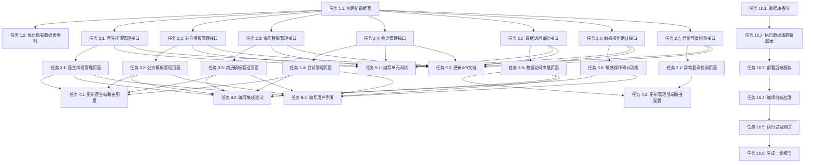

# 开发任务文档

## 文档信息

| 属性 | 值 |
|------|-----|
| 文档名称 | 星云医疗助手项目优化开发任务文档 |
| 文档版本 | v1.0 |
| 创建日期 | 2026-05-10 |
| 项目名称 | harmony-health-care |
| 功能模块 | project_optimization |

---

## 任务概述

本文档基于需求规格说明书和技术设计文档，将项目优化需求分解为可执行的开发任务。任务按照优先级排序，确保核心功能优先实现。

---

## 任务列表

### 阶段一：数据库优化 (P0)

#### 任务 1.1：创建新数据表

**优先级**：P0  
**预计工时**：2小时  
**负责人**：待分配

**任务描述**：
根据设计文档，创建以下新数据表：
1. 医生排班表 (doctor_schedule)
2. 处方模板表 (prescription_template)
3. 病历模板表 (medical_record_template)
4. 会诊表 (consultation)
5. 会诊参与人表 (consultation_participant)
6. 会诊记录表 (consultation_record)
7. 数据访问申请表 (data_access_application)
8. 敏感操作表 (sensitive_operation)
9. 异常登录记录表 (abnormal_login)

**验收标准**：
- [ ] 所有表创建成功
- [ ] 表结构符合设计文档
- [ ] 索引创建正确
- [ ] 外键约束正确

**依赖**：无

---

#### 任务 1.2：优化现有数据表索引

**优先级**：P0  
**预计工时**：1小时  
**负责人**：待分配

**任务描述**：
为现有数据表添加索引以提高查询性能：
1. health_record 表：添加 idx_record_time 和 idx_user_record_type 索引
2. medical_record 表：添加 idx_patient_doctor 和 idx_created_at 索引
3. prescription 表：添加 idx_patient_doctor 和 idx_created_at 索引
4. medication_reminder 表：添加 idx_patient_reminder_time 和 idx_status 索引
5. doctor_message 表：添加 idx_session_send_time 和 idx_receiver_read_status 索引
6. data_access_log 表：添加 idx_accessor_data 和 idx_access_time 索引

**验收标准**：
- [ ] 所有索引创建成功
- [ ] 索引命名符合规范
- [ ] 查询性能提升

**依赖**：任务 1.1

---

### 阶段二：后端接口开发 (P0-P1)

#### 任务 2.1：实现医生排班管理接口

**优先级**：P1  
**预计工时**：4小时  
**负责人**：待分配

**任务描述**：
实现医生排班管理的后端接口：
1. POST /api/doctor/schedule - 创建排班
2. GET /api/doctor/{doctorId}/schedule - 获取医生排班
3. PUT /api/doctor/schedule/{scheduleId} - 修改排班
4. DELETE /api/doctor/schedule/{scheduleId} - 删除排班

**验收标准**：
- [ ] 接口实现完成
- [ ] 参数验证正确
- [ ] 数据持久化成功
- [ ] 接口文档更新

**依赖**：任务 1.1

---

#### 任务 2.2：实现处方模板管理接口

**优先级**：P1  
**预计工时**：4小时  
**负责人**：待分配

**任务描述**：
实现处方模板管理的后端接口：
1. POST /api/doctor/prescription-template - 创建处方模板
2. GET /api/doctor/{doctorId}/prescription-templates - 获取处方模板列表
3. GET /api/doctor/prescription-template/{templateId} - 获取处方模板详情
4. PUT /api/doctor/prescription-template/{templateId} - 修改处方模板
5. DELETE /api/doctor/prescription-template/{templateId} - 删除处方模板
6. POST /api/doctor/prescription/from-template - 使用模板创建处方

**验收标准**：
- [ ] 接口实现完成
- [ ] 参数验证正确
- [ ] 数据持久化成功
- [ ] 接口文档更新

**依赖**：任务 1.1

---

#### 任务 2.3：实现病历模板管理接口

**优先级**：P1  
**预计工时**：4小时  
**负责人**：待分配

**任务描述**：
实现病历模板管理的后端接口：
1. POST /api/doctor/medical-record-template - 创建病历模板
2. GET /api/doctor/{doctorId}/medical-record-templates - 获取病历模板列表
3. GET /api/doctor/medical-record-template/{templateId} - 获取病历模板详情
4. PUT /api/doctor/medical-record-template/{templateId} - 修改病历模板
5. DELETE /api/doctor/medical-record-template/{templateId} - 删除病历模板

**验收标准**：
- [ ] 接口实现完成
- [ ] 参数验证正确
- [ ] 数据持久化成功
- [ ] 接口文档更新

**依赖**：任务 1.1

---

#### 任务 2.4：实现会诊管理接口

**优先级**：P1  
**预计工时**：6小时  
**负责人**：待分配

**任务描述**：
实现会诊管理的后端接口：
1. POST /api/doctor/consultation - 发起会诊
2. GET /api/doctor/{doctorId}/consultations - 获取会诊列表
3. GET /api/doctor/consultation/{consultationId} - 获取会诊详情
4. PUT /api/doctor/consultation/{consultationId} - 更新会诊状态
5. POST /api/doctor/consultation/{consultationId}/record - 添加会诊记录
6. GET /api/doctor/consultation/{consultationId}/records - 获取会诊记录列表

**验收标准**：
- [ ] 接口实现完成
- [ ] 参数验证正确
- [ ] 数据持久化成功
- [ ] 会诊状态流转正确
- [ ] 接口文档更新

**依赖**：任务 1.1

---

#### 任务 2.5：实现数据访问审批接口

**优先级**：P0  
**预计工时**：5小时  
**负责人**：待分配

**任务描述**：
实现数据访问审批的后端接口：
1. POST /api/security/data-access-apply - 申请数据访问
2. POST /api/security/data-access-approve - 审批数据访问
3. GET /api/security/data-access-pending - 获取待审批列表
4. GET /api/security/data-access-history - 获取审批历史
5. GET /api/security/data-access/{applicationId} - 获取审批详情

**验收标准**：
- [ ] 接口实现完成
- [ ] 参数验证正确
- [ ] 数据持久化成功
- [ ] 审批流程正确
- [ ] 接口文档更新

**依赖**：任务 1.1

---

#### 任务 2.6：实现敏感操作确认接口

**优先级**：P0  
**预计工时**：4小时  
**负责人**：待分配

**任务描述**：
实现敏感操作确认的后端接口：
1. POST /api/security/sensitive-operation - 发起敏感操作
2. POST /api/security/sensitive-operation/confirm - 确认敏感操作
3. POST /api/security/sensitive-operation/cancel - 取消敏感操作
4. GET /api/security/sensitive-operation/{operationId} - 获取操作详情

**验收标准**：
- [ ] 接口实现完成
- [ ] 参数验证正确
- [ ] 数据持久化成功
- [ ] 确认码验证正确
- [ ] 接口文档更新

**依赖**：任务 1.1

---

#### 任务 2.7：实现异常登录检测接口

**优先级**：P1  
**预计工时**：4小时  
**负责人**：待分配

**任务描述**：
实现异常登录检测的后端接口：
1. GET /api/security/abnormal-logins - 获取异常登录记录
2. PUT /api/security/abnormal-login/{loginId}/handle - 处理异常登录
3. GET /api/security/abnormal-login/statistics - 获取异常登录统计

**验收标准**：
- [ ] 接口实现完成
- [ ] 参数验证正确
- [ ] 异常检测逻辑正确
- [ ] 接口文档更新

**依赖**：任务 1.1

---

### 阶段三：前端页面开发 (P0-P1)

#### 任务 3.1：实现医生排班管理页面

**优先级**：P1  
**预计工时**：6小时  
**负责人**：待分配

**任务描述**：
实现医生排班管理的前端页面：
1. 创建 DoctorSchedulePage.ets 页面
2. 实现日历组件，显示排班日期
3. 实现排班列表，显示时间段和预约情况
4. 实现添加排班对话框
5. 实现编辑排班对话框
6. 实现删除排班确认对话框
7. 调用后端接口进行数据交互

**验收标准**：
- [ ] 页面UI符合设计
- [ ] 日历组件功能正常
- [ ] 排班列表显示正确
- [ ] 添加、编辑、删除功能正常
- [ ] 数据交互正确

**依赖**：任务 2.1

---

#### 任务 3.2：实现处方模板管理页面

**优先级**：P1  
**预计工时**：6小时  
**负责人**：待分配

**任务描述**：
实现处方模板管理的前端页面：
1. 创建 PrescriptionTemplatePage.ets 页面
2. 实现模板列表，显示模板名称和使用次数
3. 实现创建模板对话框
4. 实现编辑模板对话框
5. 实现删除模板确认对话框
6. 实现使用模板创建处方功能
7. 调用后端接口进行数据交互

**验收标准**：
- [ ] 页面UI符合设计
- [ ] 模板列表显示正确
- [ ] 创建、编辑、删除功能正常
- [ ] 使用模板功能正常
- [ ] 数据交互正确

**依赖**：任务 2.2

---

#### 任务 3.3：实现病历模板管理页面

**优先级**：P1  
**预计工时**：6小时  
**负责人**：待分配

**任务描述**：
实现病历模板管理的前端页面：
1. 创建 MedicalRecordTemplatePage.ets 页面
2. 实现模板列表，显示模板名称和使用次数
3. 实现创建模板对话框
4. 实现编辑模板对话框
5. 实现删除模板确认对话框
6. 实现使用模板创建病历功能
7. 调用后端接口进行数据交互

**验收标准**：
- [ ] 页面UI符合设计
- [ ] 模板列表显示正确
- [ ] 创建、编辑、删除功能正常
- [ ] 使用模板功能正常
- [ ] 数据交互正确

**依赖**：任务 2.3

---

#### 任务 3.4：实现会诊管理页面

**优先级**：P1  
**预计工时**：8小时  
**负责人**：待分配

**任务描述**：
实现会诊管理的前端页面：
1. 创建 ConsultationPage.ets 页面
2. 实现Tab切换，显示待开始、进行中、已完成会诊
3. 实现会诊列表，显示会诊标题、患者、时间等信息
4. 实现发起会诊对话框
5. 实现会诊详情页面，显示会诊信息和记录
6. 实现添加会诊记录功能
7. 调用后端接口进行数据交互

**验收标准**：
- [ ] 页面UI符合设计
- [ ] Tab切换功能正常
- [ ] 会诊列表显示正确
- [ ] 发起会诊功能正常
- [ ] 会诊详情显示正确
- [ ] 添加记录功能正常
- [ ] 数据交互正确

**依赖**：任务 2.4

---

#### 任务 3.5：实现数据访问审批页面

**优先级**：P0  
**预计工时**：5小时  
**负责人**：待分配

**任务描述**：
实现数据访问审批的前端页面：
1. 创建 DataAccessApprovalPage.ets 页面
2. 实现待审批列表，显示申请信息
3. 实现批准操作
4. 实现拒绝操作
5. 实现审批历史列表
6. 调用后端接口进行数据交互

**验收标准**：
- [ ] 页面UI符合设计
- [ ] 待审批列表显示正确
- [ ] 批准、拒绝功能正常
- [ ] 审批历史显示正确
- [ ] 数据交互正确

**依赖**：任务 2.5

---

#### 任务 3.6：实现敏感操作确认功能

**优先级**：P0  
**预计工时**：4小时  
**负责人**：待分配

**任务描述**：
实现敏感操作确认的前端功能：
1. 在删除、修改等敏感操作前调用确认接口
2. 显示确认对话框，输入确认码
3. 验证确认码后执行操作
4. 处理确认失败的情况

**验收标准**：
- [ ] 确认对话框显示正确
- [ ] 确认码验证正确
- [ ] 操作执行流程正确
- [ ] 错误处理正确

**依赖**：任务 2.6

---

#### 任务 3.7：实现异常登录检测页面

**优先级**：P1  
**预计工时**：4小时  
**负责人**：待分配

**任务描述**：
实现异常登录检测的前端页面：
1. 创建 AbnormalLoginPage.ets 页面
2. 实现异常登录列表，显示登录信息
3. 实现处理异常登录功能
4. 实现异常登录统计图表
5. 调用后端接口进行数据交互

**验收标准**：
- [ ] 页面UI符合设计
- [ ] 异常登录列表显示正确
- [ ] 处理功能正常
- [ ] 统计图表显示正确
- [ ] 数据交互正确

**依赖**：任务 2.7

---

### 阶段四：路由配置和导航 (P0-P1)

#### 任务 4.1：更新医生端路由配置

**优先级**：P1  
**预计工时**：1小时  
**负责人**：待分配

**任务描述**：
更新医生端路由配置，添加新页面路由：
1. 添加医生排班管理页面路由
2. 添加处方模板管理页面路由
3. 添加病历模板管理页面路由
4. 添加会诊管理页面路由

**验收标准**：
- [ ] 路由配置正确
- [ ] 页面跳转正常
- [ ] 路由参数传递正确

**依赖**：任务 3.1, 3.2, 3.3, 3.4

---

#### 任务 4.2：更新管理员端路由配置

**优先级**：P0  
**预计工时**：1小时  
**负责人**：待分配

**任务描述**：
更新管理员端路由配置，添加新页面路由：
1. 添加数据访问审批页面路由
2. 添加异常登录检测页面路由

**验收标准**：
- [ ] 路由配置正确
- [ ] 页面跳转正常
- [ ] 路由参数传递正确

**依赖**：任务 3.5, 3.7

---

### 阶段五：多端连通性检查 (P0)

#### 任务 5.1：实现连通性检查工具

**优先级**：P0  
**预计工时**：4小时  
**负责人**：待分配

**任务描述**：
实现多端连通性检查工具：
1. 创建 ConnectivityChecker 类
2. 实现API连通性检查
3. 实现WebSocket连通性检查
4. 实现数据同步连通性检查
5. 生成连通性测试报告

**验收标准**：
- [ ] 工具实现完成
- [ ] 各端连通性检查正确
- [ ] 测试报告生成正确

**依赖**：无

---

#### 任务 5.2：执行连通性检查测试

**优先级**：P0  
**预计工时**：2小时  
**负责人**：待分配

**任务描述**：
执行多端连通性检查测试：
1. 测试患者端连通性
2. 测试医生端连通性
3. 测试护士端连通性
4. 测试家属端连通性
5. 测试管理员端连通性
6. 测试手表端连通性
7. 生成测试报告

**验收标准**：
- [ ] 所有端测试完成
- [ ] 测试报告完整
- [ ] 问题记录清晰

**依赖**：任务 5.1

---

### 阶段六：数据同步机制验证 (P0)

#### 任务 6.1：实现同步机制测试工具

**优先级**：P0  
**预计工时**：4小时  
**负责人**：待分配

**任务描述**：
实现数据同步机制测试工具：
1. 创建 SyncMechanismTester 类
2. 实现实时同步测试
3. 实现离线同步测试
4. 实现冲突解决测试
5. 测量同步延迟和性能

**验收标准**：
- [ ] 工具实现完成
- [ ] 同步测试正确
- [ ] 性能测量准确

**依赖**：无

---

#### 任务 6.2：执行数据同步测试

**优先级**：P0  
**预计工时**：2小时  
**负责人**：待分配

**任务描述**：
执行数据同步机制测试：
1. 测试实时同步延迟
2. 测试离线数据保存和恢复
3. 测试冲突检测和解决
4. 测试同步重试机制
5. 生成测试报告

**验收标准**：
- [ ] 所有测试完成
- [ ] 测试报告完整
- [ ] 性能指标达标

**依赖**：任务 6.1

---

### 阶段七：功能完整性评估 (P0)

#### 任务 7.1：评估患者端功能完整性

**优先级**：P0  
**预计工时**：2小时  
**负责人**：待分配

**任务描述**：
评估患者端功能完整性：
1. 检查用户管理功能
2. 检查健康管理功能
3. 检查医疗服务功能
4. 检查AI服务功能
5. 检查医院服务功能
6. 检查分布式功能
7. 检查无障碍功能
8. 生成评估报告

**验收标准**：
- [ ] 所有功能检查完成
- [ ] 评估报告完整
- [ ] 缺失功能记录清晰

**依赖**：无

---

#### 任务 7.2：评估医生端功能完整性

**优先级**：P0  
**预计工时**：2小时  
**负责人**：待分配

**任务描述**：
评估医生端功能完整性：
1. 检查用户管理功能
2. 检查患者管理功能
3. 检查医疗服务功能
4. 检查沟通服务功能
5. 检查AI服务功能
6. 检查智慧病房功能
7. 生成评估报告

**验收标准**：
- [ ] 所有功能检查完成
- [ ] 评估报告完整
- [ ] 缺失功能记录清晰

**依赖**：无

---

#### 任务 7.3：评估护士端功能完整性

**优先级**：P0  
**预计工时**：2小时  
**负责人**：待分配

**任务描述**：
评估护士端功能完整性：
1. 检查用户管理功能
2. 检查护士站功能
3. 检查护理管理功能
4. 检查智慧病房功能
5. 生成评估报告

**验收标准**：
- [ ] 所有功能检查完成
- [ ] 评估报告完整
- [ ] 缺失功能记录清晰

**依赖**：无

---

#### 任务 7.4：评估家属端功能完整性

**优先级**：P0  
**预计工时**：2小时  
**负责人**：待分配

**任务描述**：
评估家属端功能完整性：
1. 检查用户管理功能
2. 检查患者监护功能
3. 检查沟通服务功能
4. 生成评估报告

**验收标准**：
- [ ] 所有功能检查完成
- [ ] 评估报告完整
- [ ] 缺失功能记录清晰

**依赖**：无

---

#### 任务 7.5：评估管理员端功能完整性

**优先级**：P0  
**预计工时**：2小时  
**负责人**：待分配

**任务描述**：
评估管理员端功能完整性：
1. 检查用户管理功能
2. 检查数据统计功能
3. 检查系统配置功能
4. 生成评估报告

**验收标准**：
- [ ] 所有功能检查完成
- [ ] 评估报告完整
- [ ] 缺失功能记录清晰

**依赖**：无

---

#### 任务 7.6：评估手表端功能完整性

**优先级**：P0  
**预计工时**：2小时  
**负责人**：待分配

**任务描述**：
评估手表端功能完整性：
1. 检查健康监测功能
2. 检查用药提醒功能
3. 检查紧急呼叫功能
4. 生成评估报告

**验收标准**：
- [ ] 所有功能检查完成
- [ ] 评估报告完整
- [ ] 缺失功能记录清晰

**依赖**：无

---

### 阶段八：数据脱敏规则完善 (P1)

#### 任务 8.1：扩展数据脱敏工具

**优先级**：P1  
**预计工时**：3小时  
**负责人**：待分配

**任务描述**：
扩展数据脱敏工具，增加新的脱敏规则：
1. 添加邮箱脱敏规则：z*******@e******.com
2. 添加地址脱敏规则：北京市朝阳区***********
3. 添加银行卡脱敏规则：6222***********1234
4. 更新 DesensitizationUtil 类

**验收标准**：
- [ ] 脱敏规则实现正确
- [ ] 脱敏效果符合预期
- [ ] 单元测试通过

**依赖**：无

---

### 阶段九：测试和文档 (P0)

#### 任务 9.1：编写单元测试

**优先级**：P0  
**预计工时**：8小时  
**负责人**：待分配

**任务描述**：
为新功能编写单元测试：
1. 医生排班管理接口测试
2. 处方模板管理接口测试
3. 病历模板管理接口测试
4. 会诊管理接口测试
5. 数据访问审批接口测试
6. 敏感操作确认接口测试
7. 异常登录检测接口测试

**验收标准**：
- [ ] 测试覆盖率 > 60%
- [ ] 所有测试通过
- [ ] 测试代码符合规范

**依赖**：任务 2.1-2.7

---

#### 任务 9.2：编写集成测试

**优先级**：P0  
**预计工时**：6小时  
**负责人**：待分配

**任务描述**：
编写集成测试，验证端到端功能：
1. 医生排班管理流程测试
2. 处方模板使用流程测试
3. 病历模板使用流程测试
4. 会诊管理流程测试
5. 数据访问审批流程测试
6. 敏感操作确认流程测试

**验收标准**：
- [ ] 所有集成测试通过
- [ ] 测试场景覆盖完整
- [ ] 测试报告完整

**依赖**：任务 3.1-3.6

---

#### 任务 9.3：更新API文档

**优先级**：P0  
**预计工时**：4小时  
**负责人**：待分配

**任务描述**：
更新API文档，添加新接口说明：
1. 医生排班管理接口文档
2. 处方模板管理接口文档
3. 病历模板管理接口文档
4. 会诊管理接口文档
5. 数据访问审批接口文档
6. 敏感操作确认接口文档
7. 异常登录检测接口文档

**验收标准**：
- [ ] 文档完整准确
- [ ] 接口示例正确
- [ ] 错误码说明清晰

**依赖**：任务 2.1-2.7

---

#### 任务 9.4：编写用户手册

**优先级**：P1  
**预计工时**：4小时  
**负责人**：待分配

**任务描述**：
编写用户手册，说明新功能使用方法：
1. 医生排班管理使用说明
2. 处方模板管理使用说明
3. 病历模板管理使用说明
4. 会诊管理使用说明
5. 数据访问审批使用说明
6. 敏感操作确认使用说明

**验收标准**：
- [ ] 手册内容完整
- [ ] 操作步骤清晰
- [ ] 截图示例准确

**依赖**：任务 3.1-3.6

---

### 阶段十：部署和上线 (P0)

#### 任务 10.1：数据库备份

**优先级**：P0  
**预计工时**：0.5小时  
**负责人**：待分配

**任务描述**：
备份现有数据库，确保数据安全。

**验收标准**：
- [ ] 数据库备份完成
- [ ] 备份文件验证正确

**依赖**：无

---

#### 任务 10.2：执行数据库更新脚本

**优先级**：P0  
**预计工时**：1小时  
**负责人**：待分配

**任务描述**：
执行数据库更新脚本，创建新表和优化索引。

**验收标准**：
- [ ] 脚本执行成功
- [ ] 表结构验证正确
- [ ] 索引创建成功

**依赖**：任务 10.1

---

#### 任务 10.3：部署后端服务

**优先级**：P0  
**预计工时**：1小时  
**负责人**：待分配

**任务描述**：
部署更新后的后端服务。

**验收标准**：
- [ ] 服务部署成功
- [ ] 服务启动正常
- [ ] 健康检查通过

**依赖**：任务 10.2

---

#### 任务 10.4：编译前端应用

**优先级**：P0  
**预计工时**：1小时  
**负责人**：待分配

**任务描述**：
编译更新后的前端应用。

**验收标准**：
- [ ] 编译成功
- [ ] 无编译错误
- [ ] 无编译警告

**依赖**：任务 10.3

---

#### 任务 10.5：执行冒烟测试

**优先级**：P0  
**预计工时**：2小时  
**负责人**：待分配

**任务描述**：
执行冒烟测试，验证核心功能正常：
1. 用户登录功能
2. 医生排班管理功能
3. 处方模板管理功能
4. 会诊管理功能
5. 数据访问审批功能
6. 敏感操作确认功能

**验收标准**：
- [ ] 所有核心功能正常
- [ ] 无严重bug
- [ ] 性能指标达标

**依赖**：任务 10.4

---

#### 任务 10.6：生成上线报告

**优先级**：P0  
**预计工时**：1小时  
**负责人**：待分配

**任务描述**：
生成上线报告，总结本次优化的内容和结果。

**验收标准**：
- [ ] 报告内容完整
- [ ] 问题记录清晰
- [ ] 后续计划明确

**依赖**：任务 10.5

---

## 任务依赖关系图

---

## 优先级说明

| 优先级 | 说明 |
|-------|------|
| P0 | 核心功能，必须完成，阻塞上线 |
| P1 | 重要功能，建议完成，影响用户体验 |
| P2 | 一般功能，可选完成，锦上添花 |
| P3 | 低优先级，暂不实现 |

---

## 预计总工时

| 阶段 | 预计工时 |
|------|---------|
| 阶段一：数据库优化 | 3小时 |
| 阶段二：后端接口开发 | 31小时 |
| 阶段三：前端页面开发 | 43小时 |
| 阶段四：路由配置和导航 | 2小时 |
| 阶段五：多端连通性检查 | 6小时 |
| 阶段六：数据同步机制验证 | 6小时 |
| 阶段七：功能完整性评估 | 12小时 |
| 阶段八：数据脱敏规则完善 | 3小时 |
| 阶段九：测试和文档 | 22小时 |
| 阶段十：部署和上线 | 6.5小时 |
| **总计** | **134.5小时** |

---

## 变更记录

| 版本 | 日期 | 变更人 | 变更内容 |
|------|------|-------|---------|
| v1.0 | 2026-05-10 | CodeArts Agent | 初始版本 |
