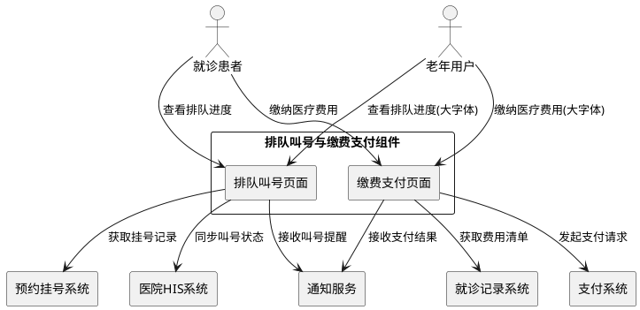
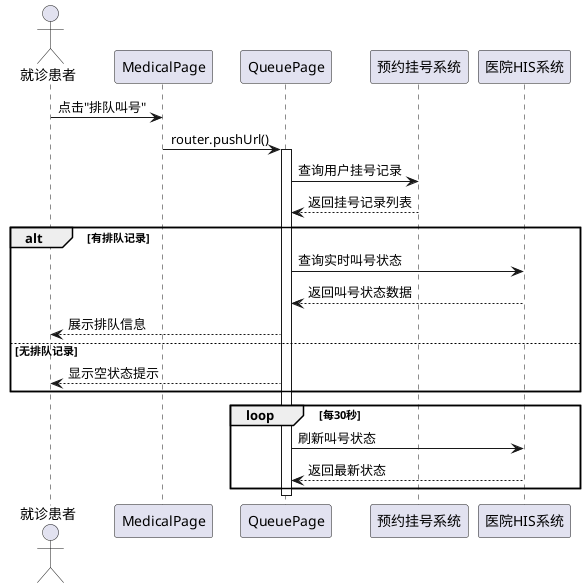
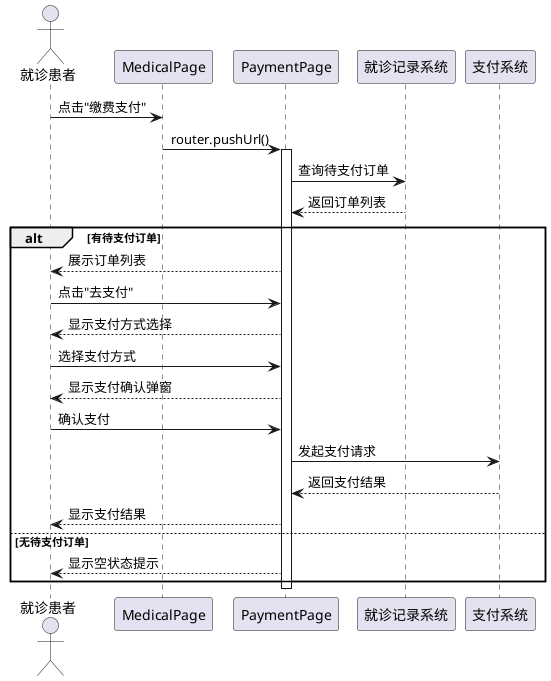

# **1. 组件定位**

## **1.1 核心职责**

本组件负责提供排队叫号和缴费支付两个核心就医服务功能，实现患者就诊流程的数字化管理。

## **1.2 核心输入**

1. 用户点击"排队叫号"或"缴费支付"按钮的操作指令
2. 预约挂号系统提供的挂号记录数据
3. 医院HIS系统提供的叫号状态数据
4. 就诊记录系统提供的费用清单数据
5. 支付系统返回的支付结果通知

## **1.3 核心输出**

1. 排队叫号页面展示的排队信息界面
2. 缴费支付页面展示的订单列表界面
3. 发送给医院HIS系统的取消排队请求
4. 发送给支付系统的支付请求
5. 推送给用户的叫号提醒通知

## **1.4 职责边界**

本组件不负责：
- 预约挂号的创建和管理（由HospitalPage和Appointments组件负责）
- 医保政策的计算和验证（由InsurancePage组件负责）
- 医院HIS系统的底层对接（由后端服务负责）
- 支付通道的具体实现（由第三方支付SDK负责）

# **2. 领域术语**

**排队号码**
: 患者在特定科室候诊队列中的唯一标识序号，用于确定就诊顺序。

**叫号状态**
: 排队记录的当前处理状态，包括：候诊中、正在叫号、已过号、已就诊、已取消。

**待支付订单**
: 患者就诊过程中产生的尚未完成支付的费用清单，包括挂号费、检查费、药费等。

**支付方式**
: 患者可选择用于完成支付的渠道类型，包括：微信支付、支付宝、医保卡支付。

# **3. 角色与边界**

## **3.1 核心角色**

- **就诊患者**：使用排队叫号查看就诊进度，使用缴费支付完成费用结算
- **老年用户**：需要大字体、高对比度界面的特殊用户群体

## **3.2 外部系统**

- **预约挂号系统**：提供患者的挂号记录和科室信息
- **医院HIS系统**：提供实时叫号状态和排队队列数据
- **就诊记录系统**：提供费用清单和处方信息
- **支付系统**：处理支付请求并返回支付结果
- **通知服务**：发送叫号提醒和支付结果通知

## **3.3 交互上下文**

# **4. DFX约束**

## **4.1 性能**

- 排队叫号页面加载时间必须小于2秒
- 缴费支付页面加载时间必须小于2秒
- 排队状态自动刷新间隔必须为30秒
- 支付请求响应时间必须小于3秒
- 页面滚动帧率必须保持60fps

## **4.2 可靠性**

- 排队状态数据必须每30秒自动刷新一次
- 支付结果必须支持二次确认机制
- 网络异常时必须显示友好的错误提示
- 页面崩溃后必须能恢复到上次状态

## **4.3 安全性**

- 支付金额必须加密传输
- 患者个人信息必须脱敏显示
- 支付操作必须记录审计日志
- 敏感操作必须进行二次确认

## **4.4 可维护性**

- 必须接入应用性能监控(APM)
- 关键操作必须记录结构化日志
- 错误信息必须包含错误码和上下文
- 必须支持远程配置动态调整

## **4.5 兼容性**

- 必须支持HarmonyOS 6.0及以上版本
- 必须支持老年模式和标准模式切换
- 必须支持无障碍访问功能
- 必须适配不同屏幕尺寸

# **5. 核心能力**

## **5.1 排队叫号功能**

### **5.1.1 业务规则**

1. **页面跳转规则**：用户点击"排队叫号"按钮时，系统必须跳转到QueuePage页面

   a. 验收条件：[用户在MedicalPage点击"排队叫号"] → [系统跳转到pages/QueuePage]

2. **空状态展示规则**：当用户无排队记录时，系统必须显示"暂无排队信息"的空状态提示

   a. 验收条件：[用户无挂号记录或已全部就诊完成] → [显示空状态提示："您当前无排队信息，请先预约挂号"]

3. **排队信息展示规则**：当用户有排队记录时，系统必须展示完整的排队信息

   a. 验收条件：[用户有未就诊的挂号记录] → [显示排队号码、当前叫号、预计等待时间、科室信息]

4. **实时刷新规则**：排队状态必须每30秒自动刷新一次

   a. 验收条件：[页面打开超过30秒] → [自动刷新排队状态数据]

5. **叫号提醒规则**：当轮到用户就诊时，系统必须发送通知提醒

   a. 验收条件：[用户的排队号码被叫到] → [发送推送通知"轮到您就诊了，请前往XX科室"]

6. **取消排队规则**：用户可以取消排队，取消后状态变更为"已取消"

   a. 验收条件：[用户点击"取消排队"并确认] → [排队状态变更为"已取消"，从队列中移除]

7. **禁止项**：禁止展示其他患者的排队信息

   a. 验收条件：[查看排队信息] → [仅显示当前登录用户的排队记录]

### **5.1.2 交互流程**

### **5.1.3 异常场景**

1. **网络请求失败**

   a. 触发条件：[调用HIS系统接口超时或返回错误]

   b. 系统行为：[记录错误日志，使用缓存数据或显示错误提示]

   c. 用户感知：[显示"网络异常，请稍后重试"提示，提供刷新按钮]

2. **挂号记录为空**

   a. 触发条件：[用户未进行过预约挂号]

   b. 系统行为：[显示空状态组件，提供"去预约"按钮]

   c. 用户感知：[显示"您当前无排队信息，请先预约挂号"，点击按钮跳转到预约页面]

3. **排队已过号**

   a. 触发条件：[用户未及时响应叫号，号码已过]

   b. 系统行为：[标记状态为"已过号"，提示用户联系护士站]

   c. 用户感知：[显示"您的号码已过号，请联系护士站重新排队"]

## **5.2 缴费支付功能**

### **5.2.1 业务规则**

1. **页面跳转规则**：用户点击"缴费支付"按钮时，系统必须跳转到PaymentPage页面

   a. 验收条件：[用户在MedicalPage点击"缴费支付"] → [系统跳转到pages/PaymentPage]

2. **空状态展示规则**：当用户无待支付订单时，系统必须显示"暂无待支付费用"的空状态提示

   a. 验收条件：[用户无待支付订单] → [显示空状态提示："暂无待支付费用，就诊后可在此缴费"]

3. **订单列表展示规则**：当用户有待支付订单时，系统必须按时间倒序展示订单列表

   a. 验收条件：[用户有待支付订单] → [显示订单编号、类型、金额、时间，最新订单在前]

4. **支付方式选择规则**：用户必须能够选择支付方式（微信、支付宝、医保卡）

   a. 验收条件：[用户点击"去支付"] → [显示支付方式选择弹窗，包含三种支付方式]

5. **支付确认规则**：发起支付前必须进行二次确认

   a. 验收条件：[用户选择支付方式] → [显示支付确认弹窗，包含订单详情和金额]

6. **支付结果处理规则**：支付完成后必须更新订单状态并显示结果

   a. 验收条件：[支付成功] → [订单状态变更为"已支付"，显示支付成功页面]

7. **禁止项**：禁止跳过支付确认直接发起支付

   a. 验收条件：[发起支付流程] → [必须经过支付方式选择和金额确认两个步骤]

### **5.2.2 交互流程**

### **5.2.3 异常场景**

1. **支付失败**

   a. 触发条件：[支付系统返回失败或超时]

   b. 系统行为：[记录失败日志，保留订单状态为"待支付"]

   c. 用户感知：[显示"支付失败，请重试"，提供重新支付按钮]

2. **订单已过期**

   a. 触发条件：[订单超过支付时限]

   b. 系统行为：[标记订单为"已过期"，从待支付列表移除]

   c. 用户感知：[显示"订单已过期，请联系医院重新生成"]

3. **余额不足**

   a. 触发条件：[医保卡余额不足以支付全部费用]

   b. 系统行为：[提示用户选择其他支付方式或组合支付]

   c. 用户感知：[显示"医保卡余额不足，请选择其他支付方式"]

# **6. 数据约束**

## **6.1 排队记录(QueueRecord)**

1. **queueNumber**：排队号码，必填，正整数，唯一标识
2. **currentNumber**：当前叫号号码，必填，正整数
3. **department**：科室名称，必填，字符串，最大长度50字符
4. **doctorName**：医生姓名，必填，字符串，最大长度20字符
5. **status**：叫号状态，必填，枚举值：[候诊中, 正在叫号, 已过号, 已就诊, 已取消]
6. **waitingCount**：前方等待人数，必填，非负整数
7. **estimatedTime**：预计等待时间，必填，正整数，单位分钟
8. **appointmentId**：关联的预约记录ID，必填，字符串
9. **createTime**：创建时间，必填，时间戳
10. **updateTime**：更新时间，必填，时间戳

## **6.2 支付订单(PaymentOrder)**

1. **orderId**：订单编号，必填，字符串，唯一标识，格式：PO+时间戳+随机数
2. **orderType**：订单类型，必填，枚举值：[挂号费, 检查费, 药费, 治疗费, 其他]
3. **amount**：订单金额，必填，正数，精确到分，单位元
4. **status**：支付状态，必填，枚举值：[待支付, 支付中, 已支付, 已取消, 已过期]
5. **paymentMethod**：支付方式，可选，枚举值：[微信支付, 支付宝, 医保卡]
6. **description**：订单描述，必填，字符串，最大长度200字符
7. **medicalRecordId**：关联的就诊记录ID，必填，字符串
8. **createTime**：创建时间，必填，时间戳
9. **payTime**：支付时间，可选，时间戳
10. **expireTime**：过期时间，必填，时间戳

## **6.3 支付记录(PaymentRecord)**

1. **recordId**：记录编号，必填，字符串，唯一标识
2. **orderId**：关联的订单编号，必填，字符串
3. **paymentMethod**：支付方式，必填，枚举值：[微信支付, 支付宝, 医保卡]
4. **amount**：支付金额，必填，正数，精确到分，单位元
5. **transactionId**：第三方交易号，必填，字符串
6. **status**：支付结果，必填，枚举值：[成功, 失败]
7. **payTime**：支付时间，必填，时间戳
8. **remark**：备注信息，可选，字符串，最大长度500字符
