# Harmony Health Care - 项目数据流图

## 项目概述

**项目名称**: 星云医疗助手 (Harmony Health Care)
**项目类型**: HarmonyOS 智慧医疗健康平台
**技术栈**: ArkTS/ArkUI, Spring Boot后端
**主要功能**: 医疗健康管理、AI智能问诊、智慧病房、AR导航、古图像复原、智能停车

---

## 一、项目整体架构图

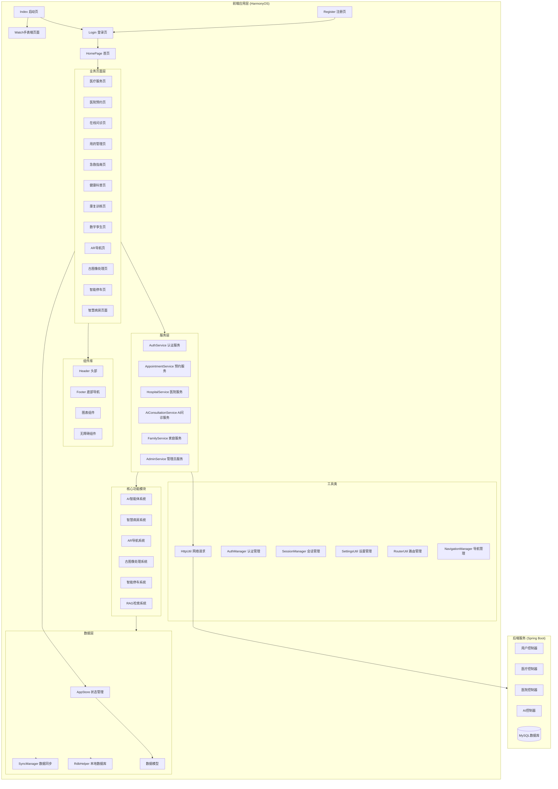
```mermaid
graph TB
    subgraph Frontend["前端应用层 (HarmonyOS)"]
        Index[Index 启动页]
        Login[Login 登录页]
        Register[Register 注册页]
        HomePage[HomePage 首页]
        WatchPages[Watch手表端页面]
        
        subgraph Pages["业务页面层"]
            MedicalPage[医疗服务页]
            HospitalPage[医院预约页]
            ConsultationPage[在线问诊页]
            MedicationPage[用药管理页]
            EmergencyPage[急救指南页]
            SciencePage[健康科普页]
            RehabilitationPage[康复训练页]
            DigitalTwinPage[数字孪生页]
            ARNavigationPage[AR导航页]
            AncientMedicalImgPage[古图像处理页]
            ParkingSpacePage[智能停车页]
            SmartWardPages[智慧病房页面]
        end
        
        subgraph Components["组件库"]
            Header[Header 头部]
            Footer[Footer 底部导航]
            Charts[图表组件]
            AccessibleComponents[无障碍组件]
        end
        
        subgraph Services["服务层"]
            AuthService[AuthService 认证服务]
            AppointmentService[AppointmentService 预约服务]
            HospitalService[HospitalService 医院服务]
            AiConsultationService[AiConsultationService AI问诊服务]
            FamilyService[FamilyService 家庭服务]
            AdminService[AdminService 管理员服务]
        end
        
        subgraph CoreModules["核心功能模块"]
            AIModule["AI智能体系统"]
            SmartWardModule["智慧病房系统"]
            ARModule["AR导航系统"]
            AncientImageModule["古图像处理系统"]
            ParkingModule["智能停车系统"]
            RAGModule["RAG检索系统"]
        end
        
        subgraph DataLayer["数据层"]
            AppStore[AppStore 状态管理]
            Models[数据模型]
            RdbHelper[RdbHelper 本地数据库]
            SyncManager[SyncManager 数据同步]
        end
        
        subgraph Utils["工具类"]
            HttpUtil[HttpUtil 网络请求]
            AuthManager[AuthManager 认证管理]
            SessionManager[SessionManager 会话管理]
            SettingsUtil[SettingsUtil 设置管理]
            RouterUtil[RouterUtil 路由管理]
            NavigationManager[NavigationManager 导航管理]
        end
    end
    
    subgraph Backend["后端服务 (Spring Boot)"]
        UserController[用户控制器]
        MedicalController[医疗控制器]
        HospitalController[医院控制器]
        AIController[AI控制器]
        Database[(MySQL数据库)]
    end
    
    Index --> Login
    Index --> WatchPages
    Login --> HomePage
    Register --> Login
    HomePage --> Pages
    Pages --> Services
    Services --> HttpUtil
    HttpUtil --> Backend
    Services --> CoreModules
    CoreModules --> DataLayer
    Pages --> Components
    Pages --> AppStore
    AppStore --> Models
    DataLayer --> RdbHelper
    DataLayer --> SyncManager
```

---

## 二、用户认证数据流

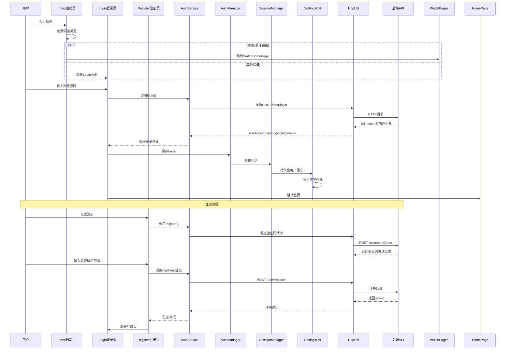
```mermaid
sequenceDiagram
    participant User as 用户
    participant Index as Index启动页
    participant Login as Login登录页
    participant Register as Register注册页
    participant AuthService as AuthService
    participant AuthManager as AuthManager
    participant SessionManager as SessionManager
    participant SettingsUtil as SettingsUtil
    participant HttpUtil as HttpUtil
    participant Backend as 后端API
    
    User->>Index: 打开应用
    Index->>Index: 检测设备类型
    alt 手表/手环设备
        Index->>WatchPages: 跳转WatchHomePage
    else 其他设备
        Index->>Login: 跳转Login页面
    end
    
    User->>Login: 输入账号密码
    Login->>AuthService: 调用login()
    AuthService->>HttpUtil: 发送POST /user/login
    HttpUtil->>Backend: HTTP请求
    Backend-->>HttpUtil: 返回token和用户信息
    HttpUtil-->>AuthService: BaseResponse<LoginResponse>
    AuthService-->>Login: 返回登录结果
    
    Login->>AuthManager: 保存token
    AuthManager->>SessionManager: 创建会话
    SessionManager->>SettingsUtil: 持久化用户信息
    SettingsUtil->>SettingsUtil: 写入本地存储
    
    Login->>HomePage: 跳转首页
    
    Note over User,Backend: 注册流程
    User->>Register: 点击注册
    Register->>AuthService: 调用register()
    AuthService->>HttpUtil: 发送验证码请求
    HttpUtil->>Backend: POST /user/sendCode
    Backend-->>HttpUtil: 返回验证码发送结果
    
    User->>Register: 输入验证码和密码
    Register->>AuthService: 调用register()提交
    AuthService->>HttpUtil: POST /user/register
    HttpUtil->>Backend: 注册请求
    Backend-->>HttpUtil: 返回userId
    HttpUtil-->>AuthService: 注册成功
    AuthService-->>Register: 注册完成
    Register->>Login: 跳转登录页
```

### 认证相关文件依赖关系

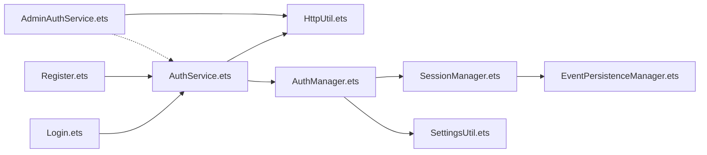
```mermaid
graph LR
    Login[Login.ets] --> AuthService[AuthService.ets]
    Register[Register.ets] --> AuthService
    AuthService --> HttpUtil[HttpUtil.ets]
    AuthService --> AuthManager[AuthManager.ets]
    AuthManager --> SessionManager[SessionManager.ets]
    AuthManager --> SettingsUtil[SettingsUtil.ets]
    SessionManager --> EventPersistenceManager[EventPersistenceManager.ets]
    
    AdminAuthService[AdminAuthService.ets] -.-> AuthService
    AdminAuthService --> HttpUtil
```

---

## 三、健康数据管理流

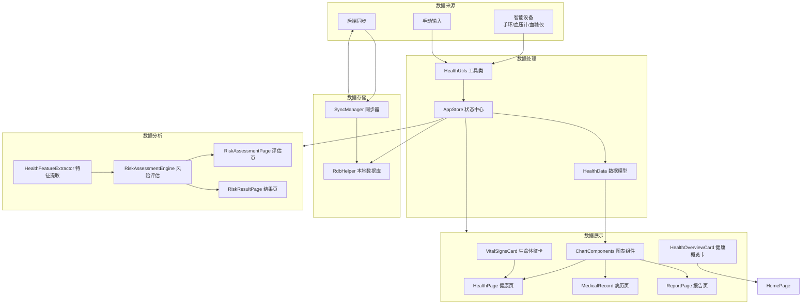
```mermaid
graph TB
    subgraph DataSource["数据来源"]
        Device[智能设备<br/>手环/血压计/血糖仪]
        ManualInput[手动输入]
        BackendSync[后端同步]
    end
    
    subgraph DataProcessing["数据处理"]
        HealthUtils[HealthUtils 工具类]
        AppStore[AppStore 状态中心]
        HealthDataModel[HealthData 数据模型]
    end
    
    subgraph DataStorage["数据存储"]
        RdbHelper[RdbHelper 本地数据库]
        SyncManager[SyncManager 同步器]
    end
    
    subgraph DataDisplay["数据展示"]
        HealthPage[HealthPage 健康页]
        MedicalRecord[MedicalRecord 病历页]
        ReportPage[ReportPage 报告页]
        ChartComponents[ChartComponents 图表组件]
        VitalSignsCard[VitalSignsCard 生命体征卡]
        HealthOverviewCard[HealthOverviewCard 健康概览卡]
    end
    
    subgraph DataAnalysis["数据分析"]
        RiskAssessmentEngine[RiskAssessmentEngine 风险评估]
        HealthFeatureExtractor[HealthFeatureExtractor 特征提取]
        RiskAssessmentPage[RiskAssessmentPage 评估页]
        RiskResultPage[RiskResultPage 结果页]
    end
    
    Device --> HealthUtils
    ManualInput --> HealthUtils
    BackendSync --> SyncManager
    
    HealthUtils --> AppStore
    AppStore --> HealthDataModel
    AppStore --> RdbHelper
    SyncManager --> RdbHelper
    SyncManager --> BackendSync
    
    AppStore --> DataDisplay
    HealthDataModel --> ChartComponents
    ChartComponents --> HealthPage
    ChartComponents --> MedicalRecord
    ChartComponents --> ReportPage
    VitalSignsCard --> HealthPage
    HealthOverviewCard --> HomePage
    
    AppStore --> DataAnalysis
    RiskAssessmentEngine --> RiskAssessmentPage
    RiskAssessmentEngine --> RiskResultPage
    HealthFeatureExtractor --> RiskAssessmentEngine
```

### 健康数据模型结构

```mermaid
classDiagram
    class UserInfo {
        +string id
        +string name
        +string avatar
        +number age
        +string gender
        +number height
        +number weight
        +string bloodType
        +string[] allergies
        +string emergencyContact
        +string phone
        +string email
        +string address
    }
    
    class HealthMetric {
        +string id
        +string type
        +number|string value
        +string unit
        +number timestamp
        +string notes
        +string device
    }
    
    class HealthRecord {
        +string id
        +string type
        +string value
        +string unit
        +string date
        +string time
        +string notes
        +string icon
        +string color
        +number createdAt
        +number updatedAt
    }
    
    class Appointment {
        +string id
        +string doctor
        +string specialty
        +string hospital
        +string date
        +string time
        +string status
        +string location
        +string avatarColor
    }
    
    class Medication {
        +string id
        +string name
        +string dosage
        +string frequency
        +string[] times
        +string status
        +boolean reminder
        +string startDate
        +string color
        +string icon
    }
    
    class Reminder {
        +string id
        +string title
        +string description
        +string time
        +string repeat
        +boolean enabled
        +string type
    }
    
    class HealthStats {
        +HeartRateStats heartRate
        +BloodPressureStats bloodPressure
        +BloodSugarStats bloodSugar
        +StepsStats steps
        +CaloriesStats calories
        +WeightStats weight
    }
    
    UserInfo "1" --> "*" : HealthMetric
    UserInfo "1" --> "*" : HealthRecord
    UserInfo "1" --> "*" : Appointment
    UserInfo "1" --> "*" : Medication
    UserInfo "1" --> "*" : Reminder
    UserInfo "1" --> "1" : HealthStats
```

---

## 四、AI智能体系统数据流

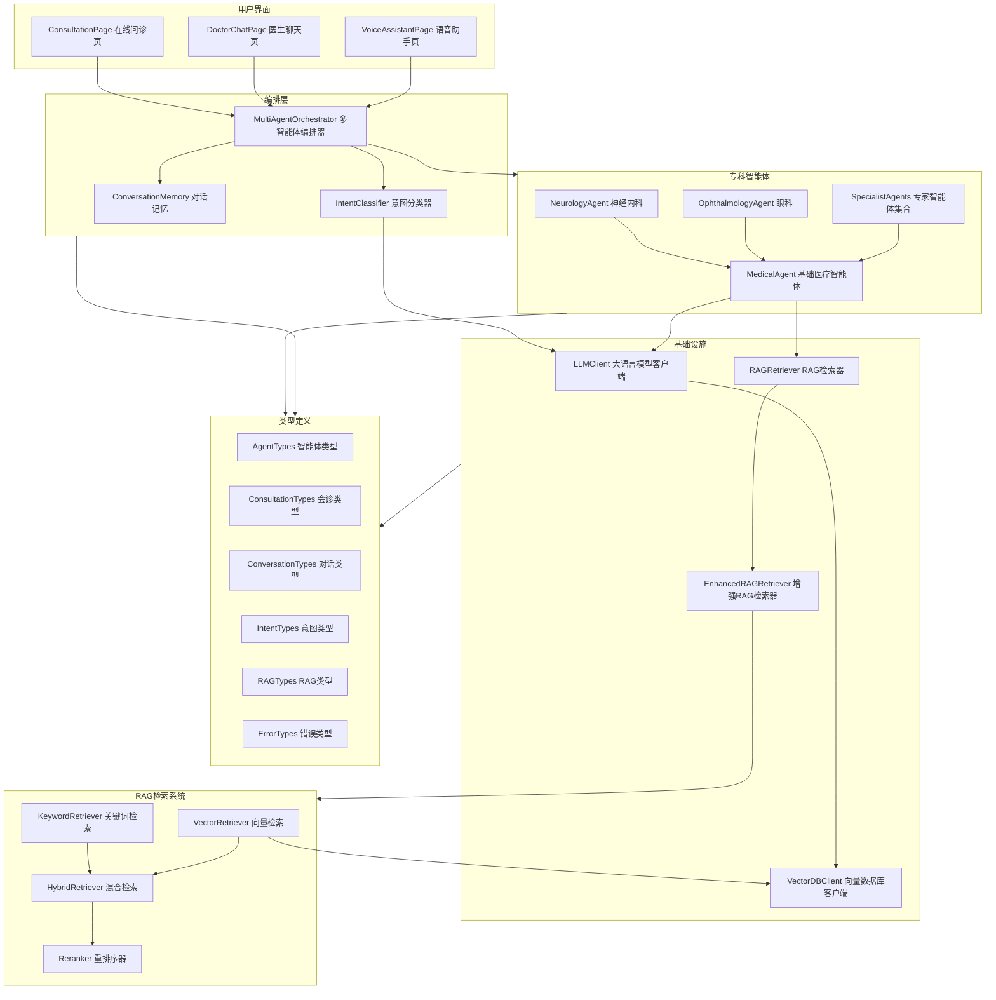
```mermaid
graph TB
    subgraph UI["用户界面"]
        ConsultationPage[ConsultationPage 在线问诊页]
        DoctorChatPage[DoctorChatPage 医生聊天页]
        VoiceAssistantPage[VoiceAssistantPage 语音助手页]
    end
    
    subgraph Orchestrator["编排层"]
        MultiAgentOrchestrator[MultiAgentOrchestrator 多智能体编排器]
        IntentClassifier[IntentClassifier 意图分类器]
        ConversationMemory[ConversationMemory 对话记忆]
    end
    
    subgraph Agents["专科智能体"]
        NeurologyAgent[NeurologyAgent 神经内科]
        OphthalmologyAgent[OphthalmologyAgent 眼科]
        MedicalAgent[MedicalAgent 基础医疗智能体]
        SpecialistAgents[SpecialistAgents 专家智能体集合]
    end
    
    subgraph Infrastructure["基础设施"]
        LLMClient[LLMClient 大语言模型客户端]
        VectorDBClient[VectorDBClient 向量数据库客户端]
        RAGRetriever[RAGRetriever RAG检索器]
        EnhancedRAGRetriever[EnhancedRAGRetriever 增强RAG检索器]
    end
    
    subgraph RAGSystem["RAG检索系统"]
        KeywordRetriever[KeywordRetriever 关键词检索]
        VectorRetriever[VectorRetriever 向量检索]
        HybridRetriever[HybridRetriever 混合检索]
        Reranker[Reranker 重排序器]
    end
    
    subgraph Types["类型定义"]
        AgentTypes[AgentTypes 智能体类型]
        ConsultationTypes[ConsultationTypes 会诊类型]
        ConversationTypes[ConversationTypes 对话类型]
        IntentTypes[IntentTypes 意图类型]
        RAGTypes[RAGTypes RAG类型]
        ErrorTypes[ErrorTypes 错误类型]
    end
    
    ConsultationPage --> MultiAgentOrchestrator
    DoctorChatPage --> MultiAgentOrchestrator
    VoiceAssistantPage --> MultiAgentOrchestrator
    
    MultiAgentOrchestrator --> IntentClassifier
    MultiAgentOrchestrator --> ConversationMemory
    MultiAgentOrchestrator --> Agents
    
    IntentClassifier --> LLMClient
    NeurologyAgent --> MedicalAgent
    OphthalmologyAgent --> MedicalAgent
    MedicalAgent --> LLMClient
    MedicalAgent --> RAGRetriever
    SpecialistAgents --> MedicalAgent
    
    RAGRetriever --> EnhancedRAGRetriever
    EnhancedRAGRetriever --> RAGSystem
    KeywordRetriever --> HybridRetriever
    VectorRetriever --> HybridRetriever
    HybridRetriever --> Reranker
    
    LLMClient --> VectorDBClient
    VectorRetriever --> VectorDBClient
    
    Agents --> Types
    Orchestrator --> Types
    Infrastructure --> Types
```

### AI问诊流程时序图

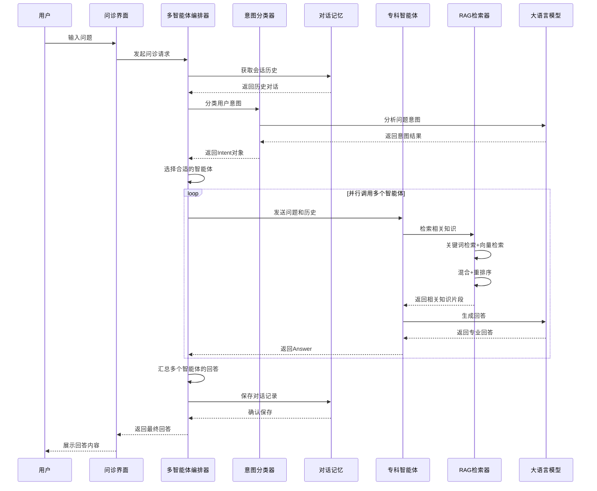
```mermaid
sequenceDiagram
    participant User as 用户
    participant UI as 问诊界面
    participant Orchestrator as 多智能体编排器
    participant IntentClassifier as 意图分类器
    participant Memory as 对话记忆
    participant Agent as 专科智能体
    participant RAG as RAG检索器
    participant LLM as 大语言模型
    
    User->>UI: 输入问题
    UI->>Orchestrator: 发起问诊请求
    
    Orchestrator->>Memory: 获取会话历史
    Memory-->>Orchestrator: 返回历史对话
    
    Orchestrator->>IntentClassifier: 分类用户意图
    IntentClassifier->>LLM: 分析问题意图
    LLM-->>IntentClassifier: 返回意图结果
    IntentClassifier-->>Orchestrator: 返回Intent对象
    
    Orchestrator->>Orchestrator: 选择合适的智能体
    
    loop 并行调用多个智能体
        Orchestrator->>Agent: 发送问题和历史
        Agent->>RAG: 检索相关知识
        RAG->>RAG: 关键词检索+向量检索
        RAG->>RAG: 混合+重排序
        RAG-->>Agent: 返回相关知识片段
        Agent->>LLM: 生成回答
        LLM-->>Agent: 返回专业回答
        Agent-->>Orchestrator: 返回Answer
    end
    
    Orchestrator->>Orchestrator: 汇总多个智能体的回答
    Orchestrator->>Memory: 保存对话记录
    Memory-->>Orchestrator: 确认保存
    
    Orchestrator-->>UI: 返回最终回答
    UI-->>User: 展示回答内容
```

---

## 五、智慧病房系统数据流

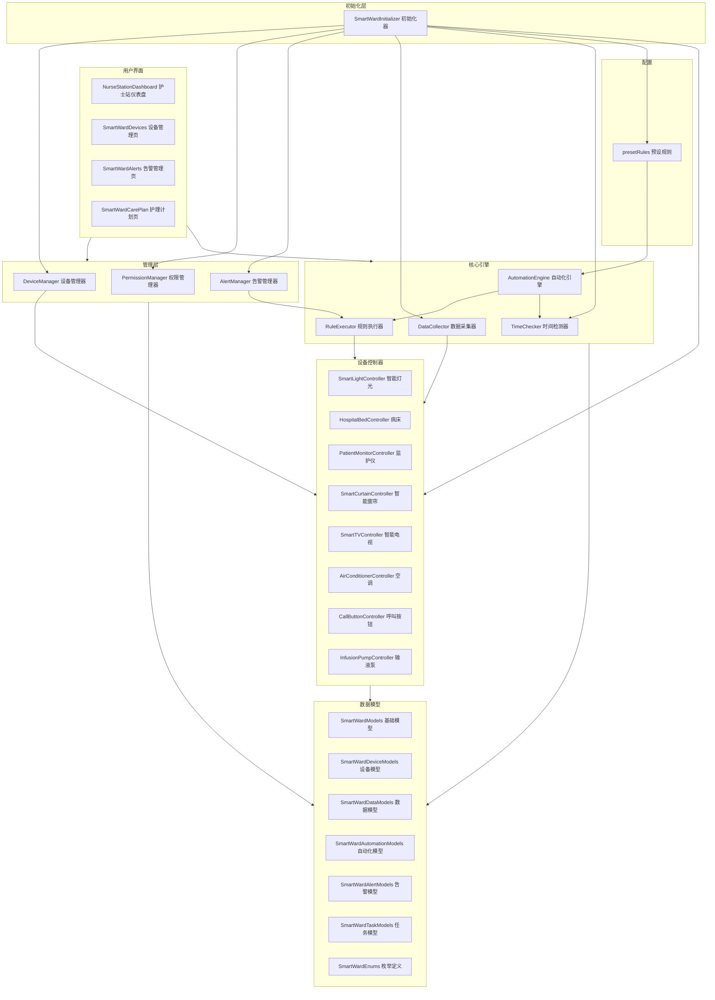
```mermaid
graph TB
    subgraph UI["用户界面"]
        NurseStationDashboard[NurseStationDashboard 护士站仪表盘]
        SmartWardDevices[SmartWardDevices 设备管理页]
        SmartWardAlerts[SmartWardAlerts 告警管理页]
        SmartWardCarePlan[SmartWardCarePlan 护理计划页]
    end
    
    subgraph Initializer["初始化层"]
        SmartWardInitializer[SmartWardInitializer 初始化器]
    end
    
    subgraph Managers["管理层"]
        DeviceManager[DeviceManager 设备管理器]
        PermissionManager[PermissionManager 权限管理器]
        AlertManager[AlertManager 告警管理器]
    end
    
    subgraph Core["核心引擎"]
        AutomationEngine[AutomationEngine 自动化引擎]
        RuleExecutor[RuleExecutor 规则执行器]
        TimeChecker[TimeChecker 时间检测器]
        DataCollector[DataCollector 数据采集器]
    end
    
    subgraph Controllers["设备控制器"]
        SmartLightController[SmartLightController 智能灯光]
        HospitalBedController[HospitalBedController 病床]
        PatientMonitorController[PatientMonitorController 监护仪]
        SmartCurtainController[SmartCurtainController 智能窗帘]
        SmartTVController[SmartTVController 智能电视]
        AirConditionerController[AirConditionerController 空调]
        CallButtonController[CallButtonController 呼叫按钮]
        InfusionPumpController[InfusionPumpController 输液泵]
    end
    
    subgraph Models["数据模型"]
        SmartWardModels[SmartWardModels 基础模型]
        SmartWardDeviceModels[SmartWardDeviceModels 设备模型]
        SmartWardDataModels[SmartWardDataModels 数据模型]
        SmartWardAutomationModels[SmartWardAutomationModels 自动化模型]
        SmartWardAlertModels[SmartWardAlertModels 告警模型]
        SmartWardTaskModels[SmartWardTaskModels 任务模型]
        SmartWardEnums[SmartWardEnums 枚举定义]
    end
    
    subgraph Config["配置"]
        presetRules[presetRules 预设规则]
    end
    
    UI --> Managers
    UI --> Core
    
    SmartWardInitializer --> DeviceManager
    SmartWardInitializer --> PermissionManager
    SmartWardInitializer --> AlertManager
    SmartWardInitializer --> DataCollector
    SmartWardInitializer --> TimeChecker
    SmartWardInitializer --> presetRules
    SmartWardInitializer --> Controllers
    
    DeviceManager --> Controllers
    AlertManager --> RuleExecutor
    AutomationEngine --> RuleExecutor
    AutomationEngine --> TimeChecker
    DataCollector --> Controllers
    
    RuleExecutor --> Controllers
    Controllers --> Models
    
    Core --> Models
    Managers --> Models
    presetRules --> AutomationEngine
```

### 智慧病房自动化流程

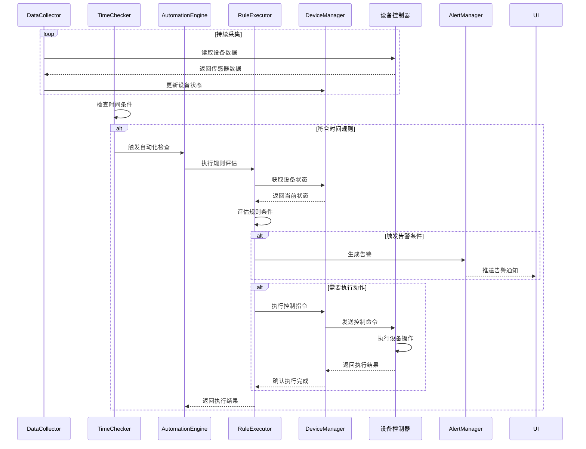
```mermaid
sequenceDiagram
    participant DC as DataCollector
    participant TC as TimeChecker
    participant AE as AutomationEngine
    participant RE as RuleExecutor
    participant DM as DeviceManager
    participant Ctrl as 设备控制器
    participant AM as AlertManager
    
    loop 持续采集
        DC->>Ctrl: 读取设备数据
        Ctrl-->>DC: 返回传感器数据
        DC->>DM: 更新设备状态
    end
    
    TC->>TC: 检查时间条件
    alt 符合时间规则
        TC->>AE: 触发自动化检查
        AE->>RE: 执行规则评估
        RE->>DM: 获取设备状态
        DM-->>RE: 返回当前状态
        RE->>RE: 评估规则条件
        
        alt 触发告警条件
            RE->>AM: 生成告警
            AM-->>UI: 推送告警通知
        end
        
        alt 需要执行动作
            RE->>DM: 执行控制指令
            DM->>Ctrl: 发送控制命令
            Ctrl->>Ctrl: 执行设备操作
            Ctrl-->>DM: 返回执行结果
            DM-->>RE: 确认执行完成
        end
        
        RE-->>AE: 返回执行结果
    end
```

---

## 六、AR导航系统数据流

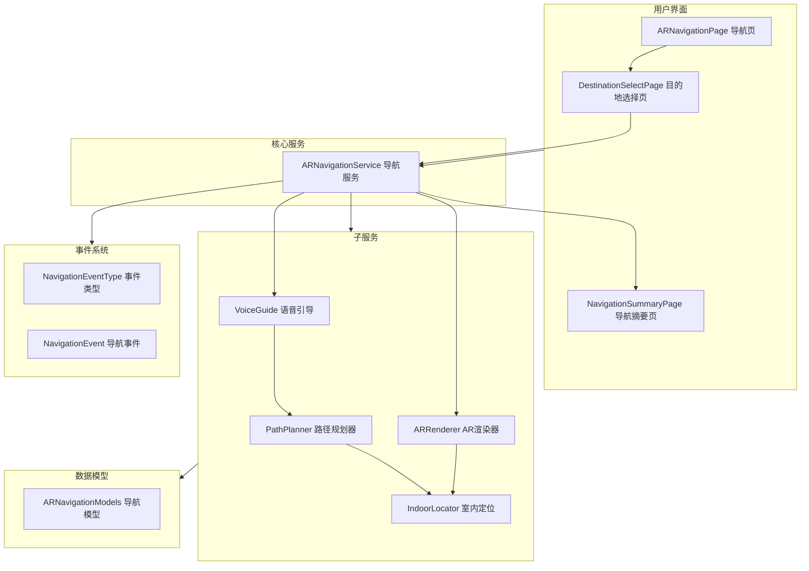
```mermaid
graph TB
    subgraph UI["用户界面"]
        ARNavigationPage[ARNavigationPage 导航页]
        DestinationSelectPage[DestinationSelectPage 目的地选择页]
        NavigationSummaryPage[NavigationSummaryPage 导航摘要页]
    end
    
    subgraph CoreService["核心服务"]
        ARNavigationService[ARNavigationService 导航服务]
    end
    
    subgraph SubServices["子服务"]
        PathPlanner[PathPlanner 路径规划器]
        IndoorLocator[IndoorLocator 室内定位]
        ARRenderer[ARRenderer AR渲染器]
        VoiceGuide[VoiceGuide 语音引导]
    end
    
    subgraph Models["数据模型"]
        ARNavigationModels[ARNavigationModels 导航模型]
    end
    
    subgraph Events["事件系统"]
        NavigationEventType[NavigationEventType 事件类型]
        NavigationEvent[NavigationEvent 导航事件]
    end
    
    UI --> ARNavigationService
    ARNavigationService --> SubServices
    SubServices --> Models
    ARNavigationService --> Events
    
    ARNavigationPage --> DestinationSelectPage
    DestinationSelectPage --> ARNavigationService
    ARNavigationService --> NavigationSummaryPage
    ARNavigationService --> ARRenderer
    ARNavigationService --> VoiceGuide
    
    PathPlanner --> IndoorLocator
    ARRenderer --> IndoorLocator
    VoiceGuide --> PathPlanner
```

### AR导航流程时序图

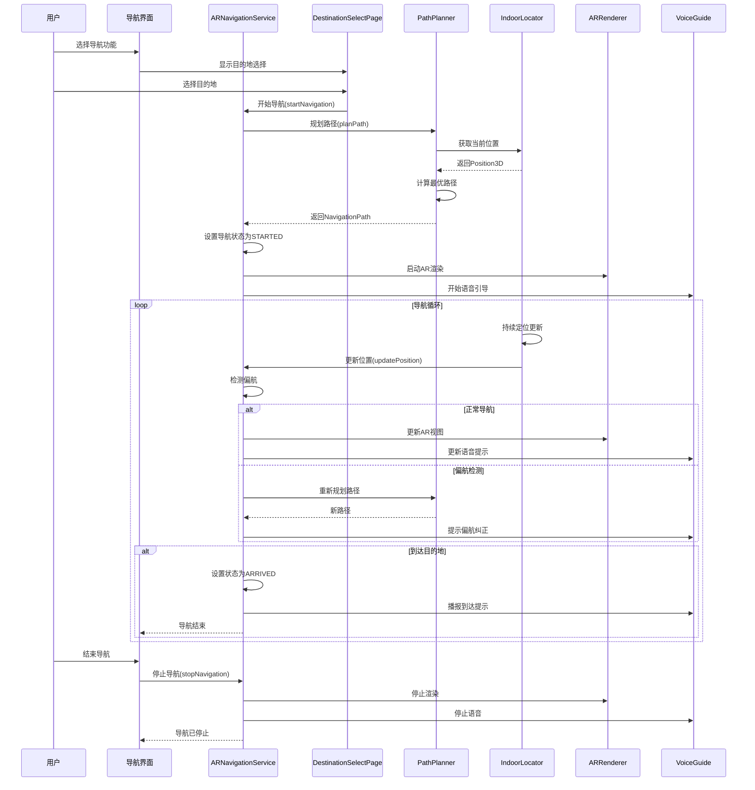
```mermaid
sequenceDiagram
    participant User as 用户
    participant UI as 导航界面
    participant NS as ARNavigationService
    participant DS as DestinationSelectPage
    participant PP as PathPlanner
    participant IL as IndoorLocator
    participant AR as ARRenderer
    participant VG as VoiceGuide
    
    User->>UI: 选择导航功能
    UI->>DS: 显示目的地选择
    User->>DS: 选择目的地
    DS->>NS: 开始导航(startNavigation)
    
    NS->>PP: 规划路径(planPath)
    PP->>IL: 获取当前位置
    IL-->>PP: 返回Position3D
    PP->>PP: 计算最优路径
    PP-->>NS: 返回NavigationPath
    
    NS->>NS: 设置导航状态为STARTED
    NS->>AR: 启动AR渲染
    NS->>VG: 开始语音引导
    
    loop 导航循环
        IL->>IL: 持续定位更新
        IL->>NS: 更新位置(updatePosition)
        NS->>NS: 检测偏航
        
        alt 正常导航
            NS->>AR: 更新AR视图
            NS->>VG: 更新语音提示
        else 偏航检测
            NS->>PP: 重新规划路径
            PP-->>NS: 新路径
            NS->>VG: 提示偏航纠正
        end
        
        alt 到达目的地
            NS->>NS: 设置状态为ARRIVED
            NS->>VG: 播报到达提示
            NS-->>UI: 导航结束
        end
    end
    
    User->>UI: 结束导航
    UI->>NS: 停止导航(stopNavigation)
    NS->>AR: 停止渲染
    NS->>VG: 停止语音
    NS-->>UI: 导航已停止
```

---

## 七、古图像处理系统数据流

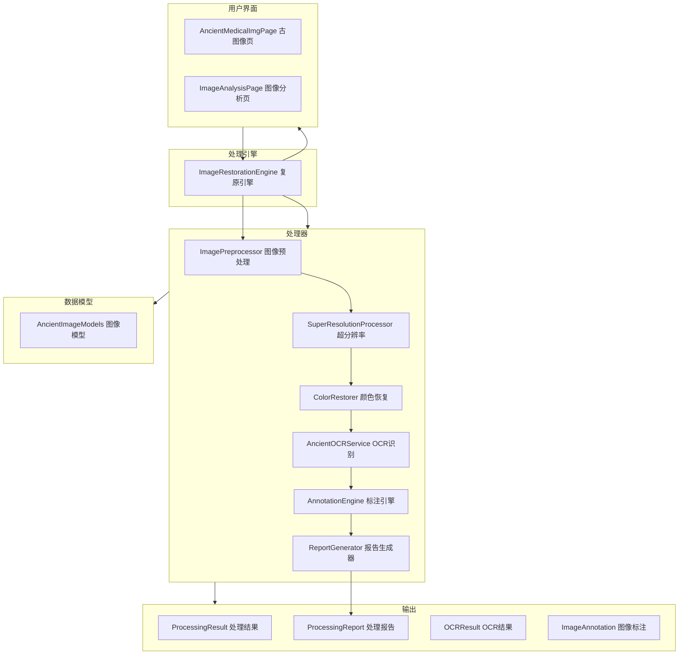
```mermaid
graph TB
    subgraph UI["用户界面"]
        AncientMedicalImgPage[AncientMedicalImgPage 古图像页]
        ImageAnalysisPage[ImageAnalysisPage 图像分析页]
    end
    
    subgraph Engine["处理引擎"]
        ImageRestorationEngine[ImageRestorationEngine 复原引擎]
    end
    
    subgraph Processors["处理器"]
        ImagePreprocessor[ImagePreprocessor 图像预处理]
        SuperResolutionProcessor[SuperResolutionProcessor 超分辨率]
        ColorRestorer[ColorRestorer 颜色恢复]
        AncientOCRService[AncientOCRService OCR识别]
        AnnotationEngine[AnnotationEngine 标注引擎]
        ReportGenerator[ReportGenerator 报告生成器]
    end
    
    subgraph Models["数据模型"]
        AncientImageModels[AncientImageModels 图像模型]
    end
    
    subgraph Output["输出"]
        ProcessingResult[ProcessingResult 处理结果]
        ProcessingReport[ProcessingReport 处理报告]
        OCRResult[OCRResult OCR结果]
        ImageAnnotation[ImageAnnotation 图像标注]
    end
    
    UI --> ImageRestorationEngine
    ImageRestorationEngine --> Processors
    Processors --> Models
    Processors --> Output
    ImageRestorationEngine --> UI
    
    ImageRestorationEngine --> ImagePreprocessor
    ImagePreprocessor --> SuperResolutionProcessor
    SuperResolutionProcessor --> ColorRestorer
    ColorRestorer --> AncientOCRService
    AncientOCRService --> AnnotationEngine
    AnnotationEngine --> ReportGenerator
    ReportGenerator --> ProcessingReport
```

### 图像处理流水线

```mermaid
flowchart LR
    A[原始图像输入] --> B[Stage1: 图像预处理]
    B --> C[Stage2: 质量评估]
    C --> D[Stage3: 超分辨率增强]
    D --> E[Stage4: 颜色恢复]
    E --> F[Stage5: OCR文字识别]
    F --> G[Stage6: 智能标注]
    G --> H[Stage7: 报告生成]
    H --> I[输出处理结果]
    
    style A fill:#e1f5fe
    style I fill:#e8f5e9
    style B fill:#fff3e0
    style C fill:#fff3e0
    style D fill:#fce4ec
    style E fill:#f3e5f5
    style F fill:#ede7f6
    style G fill:#e8eaf6
    style H fill:#e0f2f1
```

---

## 八、智能停车系统数据流

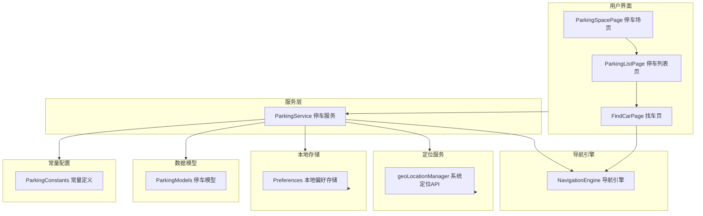
```mermaid
graph TB
    subgraph UI["用户界面"]
        ParkingSpacePage[ParkingSpacePage 停车场页]
        ParkingListPage[ParkingListPage 停车列表页]
        FindCarPage[FindCarPage 找车页]
    end
    
    subgraph Service["服务层"]
        ParkingService[ParkingService 停车服务]
    end
    
    subgraph Navigation["导航引擎"]
        NavigationEngine[NavigationEngine 导航引擎]
    end
    
    subgraph Location["定位服务"]
        GeoLocation[geoLocationManager 系统定位API]
    end
    
    subgraph Storage["本地存储"]
        Preferences[Preferences 本地偏好存储]
    end
    
    subgraph Models["数据模型"]
        ParkingModels[ParkingModels 停车模型]
    end
    
    subgraph Constants["常量配置"]
        ParkingConstants[ParkingConstants 常量定义]
    end
    
    UI --> ParkingService
    ParkingService --> NavigationEngine
    ParkingService --> Location
    ParkingService --> Storage
    ParkingService --> Models
    ParkingService --> Constants
    
    ParkingSpacePage --> ParkingListPage
    ParkingListPage --> FindCarPage
    FindCarPage --> NavigationEngine
    
    Location --> GeoLocation
    Storage --> Preferences
```

### 停车流程时序图

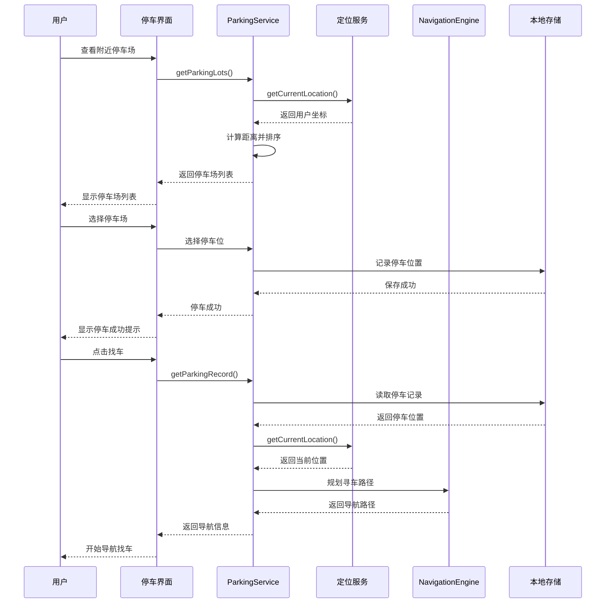
```mermaid
sequenceDiagram
    participant User as 用户
    participant UI as 停车界面
    participant PS as ParkingService
    participant Loc as 定位服务
    participant NE as NavigationEngine
    participant Store as 本地存储
    
    User->>UI: 查看附近停车场
    UI->>PS: getParkingLots()
    PS->>Loc: getCurrentLocation()
    Loc-->>PS: 返回用户坐标
    PS->>PS: 计算距离并排序
    PS-->>UI: 返回停车场列表
    UI-->>User: 显示停车场列表
    
    User->>UI: 选择停车场
    UI->>PS: 选择停车位
    PS->>Store: 记录停车位置
    Store-->>PS: 保存成功
    PS-->>UI: 停车成功
    UI-->>User: 显示停车成功提示
    
    User->>UI: 点击找车
    UI->>PS: getParkingRecord()
    PS->>Store: 读取停车记录
    Store-->>PS: 返回停车位置
    PS->>Loc: getCurrentLocation()
    Loc-->>PS: 返回当前位置
    PS->>NE: 规划寻车路径
    NE-->>PS: 返回导航路径
    PS-->>UI: 返回导航信息
    UI-->>User: 开始导航找车
```

---

## 九、RAG检索系统数据流

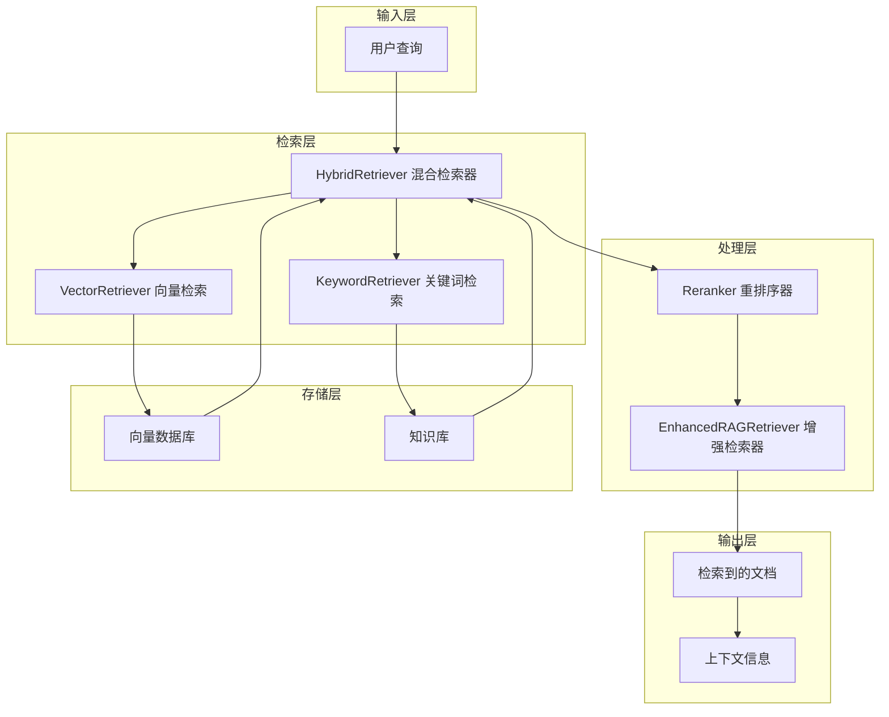
```mermaid
graph TB
    subgraph Input["输入层"]
        UserQuery[用户查询]
    end
    
    subgraph Retrieval["检索层"]
        HybridRetriever[HybridRetriever 混合检索器]
        KeywordRetriever[KeywordRetriever 关键词检索]
        VectorRetriever[VectorRetriever 向量检索]
    end
    
    subgraph Processing["处理层"]
        Reranker[Reranker 重排序器]
        EnhancedRAGRetriever[EnhancedRAGRetriever 增强检索器]
    end
    
    subgraph Storage["存储层"]
        VectorDB[向量数据库]
        KnowledgeBase[知识库]
    end
    
    subgraph Output["输出层"]
        RetrievedDocs[检索到的文档]
        Context[上下文信息]
    end
    
    UserQuery --> HybridRetriever
    HybridRetriever --> KeywordRetriever
    HybridRetriever --> VectorRetriever
    
    KeywordRetriever --> KnowledgeBase
    VectorRetriever --> VectorDB
    
    KnowledgeBase --> HybridRetriever
    VectorDB --> HybridRetriever
    
    HybridRetriever --> Reranker
    Reranker --> EnhancedRAGRetriever
    EnhancedRAGRetriever --> RetrievedDocs
    RetrievedDocs --> Context
```

---

## 十、手表端数据流

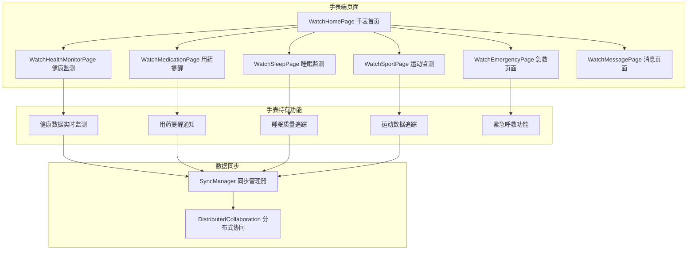
```mermaid
graph TB
    subgraph WatchPages["手表端页面"]
        WatchHomePage[WatchHomePage 手表首页]
        WatchHealthMonitorPage[WatchHealthMonitorPage 健康监测]
        WatchMedicationPage[WatchMedicationPage 用药提醒]
        WatchSleepPage[WatchSleepPage 睡眠监测]
        WatchSportPage[WatchSportPage 运动监测]
        WatchEmergencyPage[WatchEmergencyPage 急救页面]
        WatchMessagePage[WatchMessagePage 消息页面]
    end
    
    subgraph WatchFeatures["手表特有功能"]
        HealthMonitor[健康数据实时监测]
        MedicationReminder[用药提醒通知]
        SleepTracker[睡眠质量追踪]
        SportTracker[运动数据追踪]
        EmergencySOS[紧急呼救功能]
    end
    
    subgraph DataSync["数据同步"]
        SyncManager[SyncManager 同步管理器]
        DistributedCollaboration[DistributedCollaboration 分布式协同]
    end
    
    WatchHomePage --> WatchHealthMonitorPage
    WatchHomePage --> WatchMedicationPage
    WatchHomePage --> WatchSleepPage
    WatchHomePage --> WatchSportPage
    WatchHomePage --> WatchEmergencyPage
    WatchHomePage --> WatchMessagePage
    
    WatchHealthMonitorPage --> HealthMonitor
    WatchMedicationPage --> MedicationReminder
    WatchSleepPage --> SleepTracker
    WatchSportPage --> SportTracker
    WatchEmergencyPage --> EmergencySOS
    
    HealthMonitor --> SyncManager
    MedicationReminder --> SyncManager
    SleepTracker --> SyncManager
    SportTracker --> SyncManager
    
    SyncManager --> DistributedCollaboration
```

---

## 十一、状态管理数据流 (AppStore)

```mermaid
graph TB
    subgraph StateSource["状态来源"]
        UserActions[用户操作]
        NetworkResponse[网络响应]
        DeviceData[设备数据]
        TimerEvents[定时事件]
    end
    
    subgraph AppState["应用状态 (AppStore)"]
        UserState[UserState 用户状态]
        HealthMetricsState[HealthMetricsState 健康指标状态]
        HealthRecordsState[HealthRecordsState 健康记录状态]
        MedicationsState[MedicationsState 药物状态]
        AppointmentsState[AppointmentsState 预约状态]
        RemindersState[RemindersState 提醒状态]
        SettingsState[SettingsState 设置状态]
        UIState[UIState 界面状态]
    end
    
    subgraph StateConsumers["状态消费者"]
        HomePage[HomePage 首页]
        HealthPage[HealthPage 健康页]
        MedicalRecord[MedicalRecord 病历页]
        MedicationPage[MedicationPage 用药页]
        Profile[Profile 个人中心]
        ChartComponents[ChartComponents 图表组件]
    end
    
    UserActions --> AppState
    NetworkResponse --> AppState
    DeviceData --> AppState
    TimerEvents --> AppState
    
    UserState --> HomePage
    UserState --> Profile
    HealthMetricsState --> HealthPage
    HealthMetricsState --> ChartComponents
    HealthRecordsState --> MedicalRecord
    MedicationsState --> MedicationPage
    AppointmentsState --> HomePage
    RemindersState --> MedicationPage
    SettingsState --> Profile
    UIState --> 所有页面
    
    AppState --> LocalStorage[RdbHelper 本地存储]
    AppState --> SyncManager[SyncManager 云端同步]
```

---

## 十二、网络请求与数据同步架构

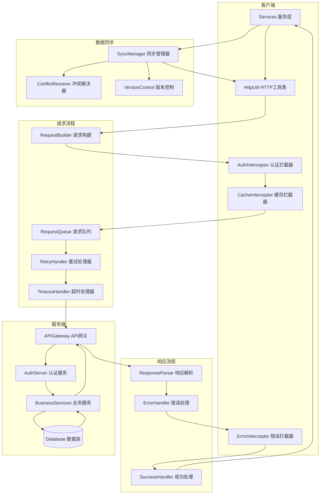
```mermaid
graph TB
    subgraph Client["客户端"]
        Services[Services 服务层]
        HttpUtil[HttpUtil HTTP工具类]
        AuthInterceptor[AuthInterceptor 认证拦截器]
        ErrorInterceptor[ErrorInterceptor 错误拦截器]
        CacheInterceptor[CacheInterceptor 缓存拦截器]
    end
    
    subgraph RequestFlow["请求流程"]
        RequestBuilder[RequestBuilder 请求构建]
        RequestQueue[RequestQueue 请求队列]
        RetryHandler[RetryHandler 重试处理器]
        TimeoutHandler[TimeoutHandler 超时处理器]
    end
    
    subgraph ResponseFlow["响应流程"]
        ResponseParser[ResponseParser 响应解析]
        ErrorHandler[ErrorHandler 错误处理]
        SuccessHandler[SuccessHandler 成功处理]
    end
    
    subgraph Server["服务端"]
        APIGateway[APIGateway API网关]
        AuthServer[AuthServer 认证服务]
        BusinessServices[BusinessServices 业务服务]
        Database[(Database 数据库)]
    end
    
    subgraph DataSync["数据同步"]
        SyncManager[SyncManager 同步管理器]
        ConflictResolver[ConflictResolver 冲突解决器]
        VersionControl[VersionControl 版本控制]
    end
    
    Services --> HttpUtil
    HttpUtil --> RequestBuilder
    RequestBuilder --> AuthInterceptor
    AuthInterceptor --> CacheInterceptor
    CacheInterceptor --> RequestQueue
    RequestQueue --> RetryHandler
    RetryHandler --> TimeoutHandler
    TimeoutHandler --> APIGateway
    
    APIGateway --> AuthServer
    AuthServer --> BusinessServices
    BusinessServices --> Database
    Database --> BusinessServices
    BusinessServices --> APIGateway
    APIGateway --> ResponseParser
    
    ResponseParser --> ErrorHandler
    ErrorHandler --> ErrorInterceptor
    ErrorInterceptor --> SuccessHandler
    SuccessHandler --> Services
    
    Services --> SyncManager
    SyncManager --> ConflictResolver
    SyncManager --> VersionControl
    SyncManager --> HttpUtil
```

---

## 十三、页面导航路由结构

```mermaid
graph LR
    subgraph Entry["入口"]
        Index[Index]
    end
    
    subgraph Auth["认证流程"]
        Login[Login]
        Register[Register]
    end
    
    subgraph MainTabs["主标签页 (Footer)"]
        HomePage[HomePage 首页]
        MedicalPage[MedicalPage 医疗]
        DiscoverPage[DiscoverPage 发现]
        FamilyPage[FamilyPage 家庭]
        Profile[Profile 我的]
    end
    
    subgraph MedicalServices["医疗服务"]
        HospitalPage[HospitalPage 医院]
        HospitalDetailPage[HospitalDetailPage]
        DepartmentPage[DepartmentPage 科室]
        DoctorListPage[DoctorListPage 医生列表]
        DoctorHomePage[DoctorHomePage 医生主页]
        DoctorChatPage[DoctorChatPage 医生聊天]
        ConsultationPage[ConsultationPage 在线问诊]
        AppointmentManagementPage[AppointmentManagementPage 预约管理]
        Appointments[Appointments 预约列表]
        AppointmentTimeSelectPage[AppointmentTimeSelectPage 时间选择]
    end
    
    subgraph HealthMgmt["健康管理"]
        HealthPage[HealthPage 健康]
        HealthRecords[HealthRecords 健康档案]
        HealthRecordDetail[HealthRecordDetail 详情]
        MedicationPage[MedicationPage 用药]
        Medications[Medications 药物列表]
        MedicationDetailPage[MedicationDetailPage 药物详情]
        MedicationReminderEditPage[MedicationReminderEditPage 编辑提醒]
        MedicationReminderListPage[MedicationReminderListPage 提醒列表]
        ReminderSettingsPage[ReminderSettingsPage 提醒设置]
        ReportPage[ReportPage 报告]
        RiskAssessmentPage[RiskAssessmentPage 风险评估]
        RiskResultPage[RiskResultPage 风险结果]
        RiskHistoryPage[RiskHistoryPage 风险历史]
        RiskDetailPage[RiskDetailPage 风险详情]
    end
    
    subgraph Knowledge["知识科普"]
        SciencePage[SciencePage 科普]
        ScienceListPage[ScienceListPage 列表]
        ScienceDetailPage[ScienceDetailPage 详情]
        PublishArticlePage[PublishArticlePage 发布]
        KnowledgeGraphPage[KnowledgeGraphPage 知识图谱]
        KnowledgeExplorePage[KnowledgeExplorePage 探索]
        HerbalListPage[HerbalListPage 中药列表]
        HerbalDetailPage[HerbalDetailPage 中药详情]
        HerbalComparePage[HerbalComparePage 中药对比]
        FoodEncyclopediaPage[FoodEncyclopediaPage 食物百科]
        FoodDetailPage[FoodDetailPage 食物详情]
    end
    
    subgraph AdvancedFeatures["高级功能"]
        ARNavigationPage[ARNavigationPage AR导航]
        DestinationSelectPage[DestinationSelectPage 目的地选择]
        NavigationSummaryPage[NavigationSummaryPage 导航摘要]
        AncientMedicalImgPage[AncientMedicalImgPage 古图像]
        ImageRestorationPage[ImageRestorationPage 图像复原]
        ImageAnalysisPage[ImageAnalysisPage 图像分析]
        DigitalTwinPage[DigitalTwinPage 数字孪生]
        DigitalTwinViewer[DigitalTwinViewer 孪生查看器]
        ParkingSpacePage[ParkingSpacePage 停车]
        ParkingListPage[ParkingListPage 停车列表]
        FindCarPage[FindCarPage 找车]
        VoiceAssistantPage[VoiceAssistantPage 语音助手]
    end
    
    subgraph SmartWard["智慧病房"]
        NurseStationDashboard[NurseStationDashboard 护士站]
        SmartWardDevices[SmartWardDevices 设备]
        SmartWardAlerts[SmartWardAlerts 告警]
        SmartWardCarePlan[SmartWardCarePlan 护理计划]
        MonitoringDashboard[MonitoringDashboard 监控面板]
        TransferApplyPage[TransferApplyPage 转诊申请]
        TransferApprovalPage[TransferApprovalPage 转诊审批]
        MedicalRecordSyncPage[MedicalRecordSyncPage 病历同步]
        DistributedCollaborationPage[DistributedCollaborationPage 分布式协同]
    end
    
    subgraph Rehab["康复训练"]
        RehabilitationPage[RehabilitationPage 康复]
        RehabPage[RehabPage 康复详情]
        RehabListPage[RehabListPage 康复列表]
        Rehab3DPage[Rehab3DPage 3D康复]
        DosageCalc[DosageCalc 剂量计算]
    end
    
    subgraph OtherPages["其他页面"]
        EmergencyPage[EmergencyPage 急救]
        EmergencyContactsPage[EmergencyContactsPage 紧急联系人]
        FamilyDoctorPage[FamilyDoctorPage 家庭医生]
        InsurancePage[InsurancePage 医保]
        FamilyPage[FamilyPage 家庭]
        DoctorFamilyChatPage[DoctorFamilyChatPage 家庭医生聊天]
        PrivacyPage[PrivacyPage 隐私]
        PrivacySettingPage[PrivacySettingPage 隐私设置]
        PrivacyPolicyPage[PrivacyPolicyPage 隐私政策]
        DataAuthPage[DataAuthPage 数据授权]
        MyCollectPage[MyCollectPage 我的收藏]
        BrowseHistoryPage[BrowseHistoryPage 浏览历史]
        DeviceManagePage[DeviceManagePage 设备管理]
        DeviceDiscoveryPage[DeviceDiscoveryPage 设备发现]
        StatisticsPage[StatisticsPage 统计]
        RankingPage[RankingPage 排行]
        DailyRecommendPage[DailyRecommendPage 每日推荐]
        PredictionReportPage[PredictionReportPage 预测报告]
        NewFeaturesDemoPage[NewFeaturesDemoPage 新功能演示]
        StandardPageTemplate[StandardPageTemplate 页面模板]
        TestPage[TestPage 测试页]
    end
    
    subgraph WatchPages["手表端页面"]
        WatchHomePage[WatchHomePage]
        WatchHealthMonitorPage[WatchHealthMonitorPage]
        WatchMedicationPage[WatchMedicationPage]
        WatchSleepPage[WatchSleepPage]
        WatchSportPage[WatchSportPage]
        WatchEmergencyPage[WatchEmergencyPage]
        WatchMessagePage[WatchMessagePage]
    end
    
    Index --> Login
    Index --> WatchHomePage
    Login --> Register
    Login --> HomePage
    
    HomePage --> MainTabs
    HomePage --> MedicalServices
    HomePage --> HealthMgmt
    HomePage --> Knowledge
    HomePage --> AdvancedFeatures
    HomePage --> SmartWard
    HomePage --> Rehab
    HomePage --> OtherPages
```

---

## 十四、核心依赖关系总图

```mermaid
graph TB
    subgraph Foundation["基础层"]
        GlobalTheme[GlobalTheme 全局主题]
        AccessibilityConfig[AccessibilityConfig 无障碍配置]
        BreakpointSystem[BreakpointSystem 断点系统]
        DeviceTypeUtil[DeviceTypeUtil 设备类型工具]
    end
    
    subgraph Utils["工具层"]
        HttpUtil[HttpUtil 网络请求]
        RouterUtil[RouterUtil 路由工具]
        ToastUtil[ToastUtil 提示工具]
        PageTransition[PageTransition 页面转场]
        NetworkDiagnostic[NetworkDiagnostic 网络诊断]
        HealthUtils[HealthUtils 健康工具]
        BrowseTracker[BrowseTracker 浏览追踪]
        SampleImageUtil[SampleImageUtil 示例图片]
    end
    
    subgraph AuthUtils["认证工具"]
        AuthManager[AuthManager 认证管理]
        SessionManager[SessionManager 会话管理]
        SettingsUtil[SettingsUtil 设置管理]
        EventPersistenceManager[EventPersistenceManager 事件持久化]
        AccessibilityUtils[AccessibilityUtils 无障碍工具]
        NavigationManager[NavigationManager 导航管理]
        NavigationErrorHandler[NavigationErrorHandler 导航错误处理]
        DatabaseConstants[DatabaseConstants 数据库常量]
        RdbHelper[RdbHelper 数据库帮助]
        SyncManager[SyncManager 同步管理]
    end
    
    subgraph Constants["常量配置"]
        ApiConstants[ApiConstants API常量]
        TimeoutConfig[TimeoutConfig 超时配置]
    end
    
    subgraph Types["类型定义"]
        NavigationTypes[NavigationTypes 导航类型]
        index_types[index.ets 类型索引]
    end
    
    subgraph Styles["样式"]
        globalStyles[globalStyles 全局样式]
        style_ets[style.ets 组件样式]
    end
    
    subgraph Store["状态管理"]
        AppStore[AppStore 应用状态]
    end
    
    Foundation --> Utils
    Constants --> HttpUtil
    Utils --> Services
    AuthUtils --> Services
    Types --> AdvancedFeatures
    Styles --> Components
    Store --> AllPages
    
    Services[Services 服务层]
    Components[Components 组件库]
    AllPages[所有页面]
    AdvancedFeatures[高级功能模块]
```

---

## 十五、数据持久化与同步架构

```mermaid
graph TB
    subgraph DataSources["数据源"]
        UserInput[用户输入]
        IoTDevices[IoT设备]
        BackendAPI[后端API]
    end
    
    subgraph LocalStorage["本地存储"]
        RdbHelper[RdbHelper 关系型数据库]
        Preferences[Preferences 键值存储]
        FileStorage[FileStorage 文件存储]
    end
    
    subgraph CacheLayer["缓存层"]
        MemoryCache[内存缓存]
        AppStore[AppStore 状态缓存]
    end
    
    subgraph SyncMechanism["同步机制"]
        SyncManager[SyncManager 同步管理器]
        ConflictDetection[ConflictDetection 冲突检测]
        MergeStrategy[MergeStrategy 合并策略]
        VersionControl[VersionControl 版本控制]
    end
    
    subgraph CloudStorage["云端存储"]
        BackendDatabase[(后端数据库)]
        CDN[CDN 内容分发]
        ObjectStorage[ObjectStorage 对象存储]
    end
    
    DataSources --> LocalStorage
    DataSources --> CacheLayer
    
    RdbHelper --> MemoryCache
    Preferences --> MemoryCache
    FileStorage --> MemoryCache
    
    MemoryCache --> AppStore
    AppStore --> UI[UI界面]
    
    SyncManager --> LocalStorage
    SyncManager --> CloudStorage
    SyncManager --> ConflictDetection
    ConflictDetection --> MergeStrategy
    MergeStrategy --> VersionControl
    
    BackendAPI --> BackendDatabase
    BackendDatabase --> SyncManager
    CDN --> FileStorage
    ObjectStorage --> FileStorage
```

---

## 项目模块统计

| 模块类别 | 文件数量 | 主要功能 |
|---------|---------|---------|
| **页面 (Pages)** | 100+ | 用户界面和交互 |
| **组件 (Components)** | 50+ | 可复用UI组件 |
| **服务 (Services)** | 20+ | 业务逻辑封装 |
| **AI智能体 (AI Agents)** | 15+ | AI问诊和诊断 |
| **智慧病房 (Smart Ward)** | 20+ | 智能病房管理 |
| **AR导航 (AR)** | 5+ | 增强现实导航 |
| **古图像 (Ancient Image)** | 7+ | 古医书图像处理 |
| **停车服务 (Parking)** | 3+ | 智能停车管理 |
| **数据模型 (Models)** | 25+ | 数据结构定义 |
| **工具类 (Utils)** | 20+ | 通用工具函数 |
| **RAG系统 (RAG)** | 5+ | 检索增强生成 |
| **手表端 (Watch)** | 8+ | 手表端适配 |

---

## 关键技术栈

- **前端框架**: ArkTS / ArkUI (HarmonyOS)
- **状态管理**: AppStore + @StorageLink + @State
- **网络请求**: @ohos.net.http (HttpUtil封装)
- **本地存储**: @kit.ArkData (RdbHelper + Preferences)
- **AI能力**: 大语言模型 (LLMClient) + RAG检索
- **AR能力**: ARKit (ARRenderer)
- **定位服务**: @kit.LocationKit
- **分布式能力**: 分布式数据协同 (DistributedCollaboration)

---

## 文件说明

本文档包含以下15个主要数据流图：

1. ✅ 项目整体架构图
2. ✅ 用户认证数据流
3. ✅ 健康数据管理流
4. ✅ AI智能体系统数据流
5. ✅ 智慧病房系统数据流
6. ✅ AR导航系统数据流
7. ✅ 古图像处理系统数据流
8. ✅ 智能停车系统数据流
9. ✅ RAG检索系统数据流
10. ✅ 手表端数据流
11. ✅ 状态管理数据流 (AppStore)
12. ✅ 网络请求与数据同步架构
13. ✅ 页面导航路由结构
14. ✅ 核心依赖关系总图
15. ✅ 数据持久化与同步架构

每个数据流图都详细展示了：
- 模块间的依赖关系
- 数据的流向
- 交互的时序
- 系统的层次结构

---

**文档版本**: v1.0
**生成日期**: 2026-05-07
**项目路径**: `e:\HMOS6.0\Github\harmony-health-care`
**扫描文件数**: 200+ .ets 文件
