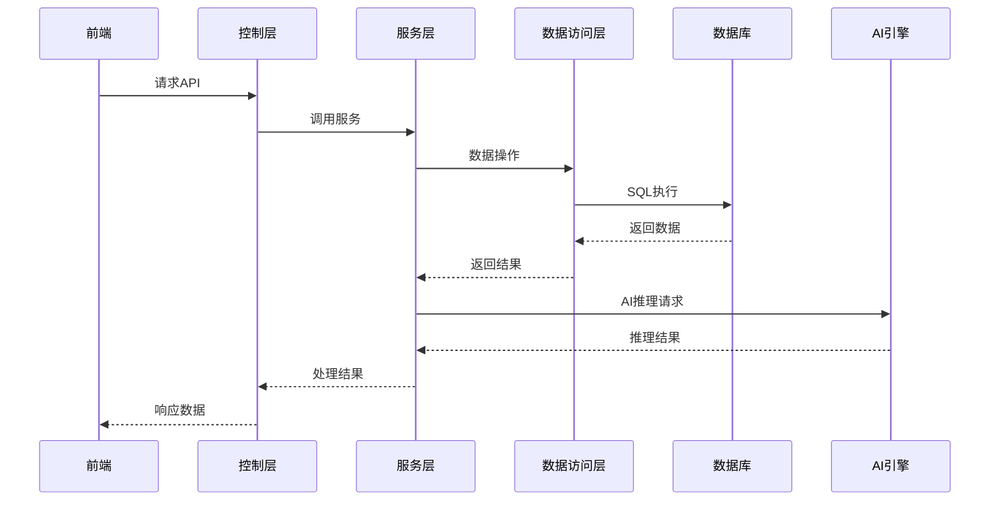

# 星云医疗助手 - 后端规划安排

> 基于 Spring Boot 的后端服务详细规划
> 
> 文档版本：v2.0
> 
> 更新日期：2026-04-09

---

## 目录

1. [后端技术栈](#一后端技术栈)
2. [架构设计](#二架构设计)
3. [API 接口规划](#三api-接口规划)
4. [数据库设计](#四数据库设计)
5. [核心功能模块](#五核心功能模块)
6. [安全与隐私](#六安全与隐私)
7. [部署与运维](#七部署与运维)
8. [详细时间规划](#八详细时间规划)

---

## 一、后端技术栈

### 1.1 核心技术

| 技术 | 版本 | 用途 |
|------|------|------|
| Spring Boot | 2.7.18 | 后端框架 |
| MyBatis-Plus | 3.5.3.1 | ORM框架 |
| HikariCP | 4.1.2 | 连接池 |
| MySQL | 8.0.45 | 云端数据库 |
| JDK | 1.8.0_371 | Java运行环境 |

### 1.2 辅助技术

| 技术 | 版本 | 用途 |
|------|------|------|
| Maven | 3.8.8 | 项目构建 |
| Redis | 7.0+ | 缓存 |
| Spring Security | 5.7.10 | 安全框架 |
| JWT | - | 身份认证 |
| Swagger | 3.0.0 | API文档 |
| MindSpore Lite | 2.2.10 | AI推理 |

---

## 二、架构设计

### 2.1 架构风格

- **架构模式**：分层架构
- **模块划分**：控制层、服务层、数据访问层
- **通信方式**：RESTful API

### 2.2 目录结构

```
backend/
├── src/main/
│   ├── java/com/nebula/healthcare/
│   │   ├── controller/     # 控制层
│   │   ├── service/        # 服务层
│   │   ├── mapper/         # 数据访问层
│   │   ├── model/          # 数据模型
│   │   ├── dto/            # 数据传输对象
│   │   ├── config/         # 配置类
│   │   ├── util/           # 工具类
│   │   └── Application.java # 应用入口
│   └── resources/
│       ├── application.yml # 应用配置
│       └── mapper/         # XML映射文件
├── pom.xml                 # 依赖管理
└── README.md               # 项目说明
```

### 2.3 核心流程图



---

## 三、API 接口规划

### 3.1 用户模块

| 接口路径 | 方法 | 功能描述 | 请求体 | 响应体 |
|---------|------|---------|--------|--------|
| `/api/auth/login` | POST | 用户登录 | `{"username": "...", "password": "..."}` | `{"code": 200, "data": {"token": "...", "user": {...}}}` |
| `/api/auth/register` | POST | 用户注册 | `{"username": "...", "password": "...", "phone": "..."}` | `{"code": 200, "data": {"userId": 1}}` |
| `/api/auth/logout` | POST | 用户退出 | N/A | `{"code": 200, "data": "success"}` |
| `/api/user/info` | GET | 获取用户信息 | N/A | `{"code": 200, "data": {...}}` |
| `/api/user/update` | PUT | 更新用户信息 | `{"phone": "...", "email": "..."}` | `{"code": 200, "data": "success"}` |

### 3.2 健康数据模块

| 接口路径 | 方法 | 功能描述 | 请求体 | 响应体 |
|---------|------|---------|--------|--------|
| `/api/health/data` | POST | 上传健康数据 | `{"type": "...", "value": "...", "time": "..."}` | `{"code": 200, "data": {"id": 1}}` |
| `/api/health/data` | GET | 获取健康数据列表 | `?type=...&startTime=...&endTime=...` | `{"code": 200, "data": [...]}` |
| `/api/health/data/{id}` | GET | 获取单条健康数据 | N/A | `{"code": 200, "data": {...}}` |
| `/api/health/data/{id}` | DELETE | 删除健康数据 | N/A | `{"code": 200, "data": "success"}` |
| `/api/health/assessment` | POST | 健康评估 | `{"bloodPressure": "...", "bloodSugar": "..."}` | `{"code": 200, "data": {...}}` |

### 3.3 预约管理模块

| 接口路径 | 方法 | 功能描述 | 请求体 | 响应体 |
|---------|------|---------|--------|--------|
| `/api/appointment` | POST | 创建预约 | `{"hospitalId": 1, "deptId": 1, "date": "...", "time": "..."}` | `{"code": 200, "data": {"id": 1}}` |
| `/api/appointment` | GET | 获取预约列表 | `?status=...` | `{"code": 200, "data": [...]}` |
| `/api/appointment/{id}` | GET | 获取预约详情 | N/A | `{"code": 200, "data": {...}}` |
| `/api/appointment/{id}` | PUT | 更新预约状态 | `{"status": "..."}` | `{"code": 200, "data": "success"}` |
| `/api/appointment/{id}` | DELETE | 取消预约 | N/A | `{"code": 200, "data": "success"}` |

### 3.4 康复管理模块

| 接口路径 | 方法 | 功能描述 | 请求体 | 响应体 |
|---------|------|---------|--------|--------|
| `/api/rehab/plan` | POST | 创建康复计划 | `{"name": "...", "startDate": "...", "endDate": "..."}` | `{"code": 200, "data": {"id": 1}}` |
| `/api/rehab/plan` | GET | 获取康复计划列表 | N/A | `{"code": 200, "data": [...]}` |
| `/api/rehab/plan/{id}` | GET | 获取康复计划详情 | N/A | `{"code": 200, "data": {...}}` |
| `/api/rehab/action` | POST | 添加康复动作 | `{"planId": 1, "name": "...", "duration": 60}` | `{"code": 200, "data": {"id": 1}}` |
| `/api/rehab/record` | POST | 记录康复进度 | `{"planId": 1, "actionId": 1, "duration": 60}` | `{"code": 200, "data": {"id": 1}}` |

### 3.5 科普内容模块

| 接口路径 | 方法 | 功能描述 | 请求体 | 响应体 |
|---------|------|---------|--------|--------|
| `/api/article` | GET | 获取文章列表 | `?category=...&page=1&size=10` | `{"code": 200, "data": {"list": [...], "total": 100}}` |
| `/api/article/{id}` | GET | 获取文章详情 | N/A | `{"code": 200, "data": {...}}` |
| `/api/article/collect` | POST | 收藏文章 | `{"articleId": 1}` | `{"code": 200, "data": "success"}` |
| `/api/article/collect` | GET | 获取收藏列表 | N/A | `{"code": 200, "data": [...]}` |
| `/api/article/comment` | POST | 发表评论 | `{"articleId": 1, "content": "..."}` | `{"code": 200, "data": {"id": 1}}` |

### 3.6 医院导航模块

| 接口路径 | 方法 | 功能描述 | 请求体 | 响应体 |
|---------|------|---------|--------|--------|
| `/api/hospital` | GET | 获取医院列表 | `?level=...&keyword=...` | `{"code": 200, "data": [...]}` |
| `/api/hospital/{id}` | GET | 获取医院详情 | N/A | `{"code": 200, "data": {...}}` |
| `/api/hospital/{id}/dept` | GET | 获取医院科室 | N/A | `{"code": 200, "data": [...]}` |
| `/api/hospital/parking` | GET | 获取停车位信息 | `?hospitalId=1` | `{"code": 200, "data": {"total": 100, "available": 50}}` |

---

## 四、数据库设计

### 4.1 核心表结构

#### 4.1.1 用户表 (sys_user)

| 字段名 | 数据类型 | 约束 | 描述 |
|--------|---------|------|------|
| id | BIGINT | PRIMARY KEY AUTO_INCREMENT | 用户ID |
| username | VARCHAR(50) | NOT NULL UNIQUE | 用户名 |
| password | VARCHAR(100) | NOT NULL | 密码（加密） |
| phone | VARCHAR(20) | UNIQUE | 手机号 |
| email | VARCHAR(100) | UNIQUE | 邮箱 |
| avatar | VARCHAR(255) | | 头像URL |
| role | TINYINT | DEFAULT 0 | 角色：0患者 1家属 2医生 3护士 |
| status | TINYINT | DEFAULT 1 | 状态：0禁用 1正常 |
| create_time | DATETIME | DEFAULT CURRENT_TIMESTAMP | 创建时间 |
| update_time | DATETIME | DEFAULT CURRENT_TIMESTAMP ON UPDATE CURRENT_TIMESTAMP | 更新时间 |

#### 4.1.2 健康数据表 (user_health_data)

| 字段名 | 数据类型 | 约束 | 描述 |
|--------|---------|------|------|
| id | BIGINT | PRIMARY KEY AUTO_INCREMENT | 数据ID |
| user_id | BIGINT | NOT NULL | 用户ID |
| data_type | VARCHAR(20) | NOT NULL | 数据类型：blood_pressure/blood_sugar/heart_rate/weight/steps |
| data_value | DECIMAL(10,2) | NOT NULL | 数据值 |
| unit | VARCHAR(20) | | 单位 |
| record_time | DATETIME | NOT NULL | 记录时间 |
| source | VARCHAR(50) | | 数据来源：manual/device/import |
| device_id | VARCHAR(100) | | 设备ID |
| is_abnormal | TINYINT | DEFAULT 0 | 是否异常：0正常 1异常 |
| remark | VARCHAR(500) | | 备注 |
| create_time | DATETIME | DEFAULT CURRENT_TIMESTAMP | 创建时间 |

#### 4.1.3 风险评估表 (disease_risk_assess)

| 字段名 | 数据类型 | 约束 | 描述 |
|--------|---------|------|------|
| id | BIGINT | PRIMARY KEY AUTO_INCREMENT | 评估ID |
| user_id | BIGINT | NOT NULL | 用户ID |
| assess_type | VARCHAR(50) | NOT NULL | 评估类型：sarcopenia/frailty/fall_risk/metabolic |
| risk_level | TINYINT | NOT NULL | 风险等级：1低 2中 3高 |
| risk_score | DECIMAL(5,2) | | 风险分数 |
| input_data | JSON | | 输入数据快照 |
| result_detail | JSON | | 评估结果详情 |
| recommendation | TEXT | | 建议 |
| assess_time | DATETIME | NOT NULL | 评估时间 |
| model_version | VARCHAR(20) | | 模型版本 |
| create_time | DATETIME | DEFAULT CURRENT_TIMESTAMP | 创建时间 |

#### 4.1.4 康复计划表 (rehab_plan)

| 字段名 | 数据类型 | 约束 | 描述 |
|--------|---------|------|------|
| id | BIGINT | PRIMARY KEY AUTO_INCREMENT | 计划ID |
| user_id | BIGINT | NOT NULL | 用户ID |
| plan_name | VARCHAR(100) | NOT NULL | 计划名称 |
| plan_type | VARCHAR(50) | | 计划类型：postoperative/chronic/injury_prevention |
| start_date | DATE | NOT NULL | 开始日期 |
| end_date | DATE | NOT NULL | 结束日期 |
| total_days | INT | | 总天数 |
| completed_days | INT | DEFAULT 0 | 已完成天数 |
| status | TINYINT | DEFAULT 0 | 状态：0未开始 1进行中 2已完成 3已暂停 |
| difficulty | TINYINT | DEFAULT 1 | 难度：1初级 2中级 3高级 |
| daily_duration | INT | | 每日时长（分钟） |
| description | TEXT | | 计划描述 |
| create_time | DATETIME | DEFAULT CURRENT_TIMESTAMP | 创建时间 |
| update_time | DATETIME | DEFAULT CURRENT_TIMESTAMP ON UPDATE CURRENT_TIMESTAMP | 更新时间 |

#### 4.1.5 康复动作表 (rehab_action)

| 字段名 | 数据类型 | 约束 | 描述 |
|--------|---------|------|------|
| id | BIGINT | PRIMARY KEY AUTO_INCREMENT | 动作ID |
| plan_id | BIGINT | NOT NULL | 计划ID |
| action_name | VARCHAR(100) | NOT NULL | 动作名称 |
| action_type | VARCHAR(50) | | 动作类型：stretching/strength/balance/cardio |
| duration | INT | | 持续时间（秒） |
| repetitions | INT | | 重复次数 |
| sets | INT | | 组数 |
| rest_time | INT | | 休息时间（秒） |
| video_url | VARCHAR(255) | | 演示视频URL |
| model_url | VARCHAR(255) | | 3D模型URL |
| voice_guide | TEXT | | 语音指导文本 |
| difficulty | TINYINT | DEFAULT 1 | 难度：1初级 2中级 3高级 |
| target_muscle | VARCHAR(200) | | 目标肌群 |
| precautions | TEXT | | 注意事项 |
| sort_order | INT | DEFAULT 0 | 排序 |
| create_time | DATETIME | DEFAULT CURRENT_TIMESTAMP | 创建时间 |

---

## 五、核心功能模块

### 5.1 用户认证与授权

- **JWT 认证**：生成和验证 JWT 令牌
- **权限管理**：基于角色的权限控制
- **密码加密**：使用 BCrypt 加密密码
- **登录限制**：防止暴力破解

### 5.2 健康数据管理

- **数据采集**：接收和存储健康数据
- **数据分析**：分析健康数据趋势
- **异常检测**：检测异常健康数据
- **数据同步**：与前端数据同步

### 5.3 AI 风险评估

- **共病评估**：多病症关联分析
- **风险预测**：预测健康风险
- **模型管理**：AI 模型版本管理
- **结果解释**：提供评估结果解释

### 5.4 康复管理

- **计划制定**：制定个性化康复计划
- **进度跟踪**：跟踪康复进度
- **效果评估**：评估康复效果
- **方案调整**：根据进度调整方案

### 5.5 医院导航

- **医院信息**：管理医院基本信息
- **科室导航**：管理科室位置信息
- **停车管理**：管理停车位信息
- **路径规划**：提供导航路径

### 5.6 科普内容管理

- **内容管理**：管理科普文章
- **分类管理**：管理文章分类
- **推荐系统**：个性化内容推荐
- **互动功能**：评论、收藏、点赞

### 5.7 分布式数据协同

- **跨院数据**：管理跨院数据
- **数据同步**：实现数据实时同步
- **权限控制**：控制数据访问权限
- **数据脱敏**：敏感数据脱敏处理

---

## 六、安全与隐私

### 6.1 数据安全

- **数据加密**：传输和存储加密
- **访问控制**：基于角色的访问控制
- **审计日志**：记录操作日志
- **数据备份**：定期数据备份

### 6.2 隐私保护

- **数据脱敏**：敏感信息脱敏
- **用户授权**：数据访问授权
- **数据最小化**：只收集必要数据
- **数据销毁**：过期数据自动销毁

### 6.3 安全防护

- **SQL 注入防护**：使用参数化查询
- **XSS 防护**：输入验证和转义
- **CSRF 防护**：使用 CSRF 令牌
- **DDoS 防护**：限流和防护措施

---

## 七、部署与运维

### 7.1 部署方案

- **容器化部署**：使用 Docker 容器
- **集群部署**：多实例负载均衡
- **环境分离**：开发、测试、生产环境分离
- **CI/CD**：持续集成和持续部署

### 7.2 监控与日志

- **应用监控**：监控应用运行状态
- **性能监控**：监控系统性能
- **日志管理**：集中式日志管理
- **告警系统**：异常告警

### 7.3 维护与升级

- **版本管理**：语义化版本控制
- **补丁管理**：安全补丁及时更新
- **数据库迁移**：平滑数据库迁移
- **回滚机制**：出现问题时快速回滚

---

## 八、详细时间规划

### 8.1 第一周：基础搭建（Day1-Day7）

| 日期 | 任务 | 时间 | 交付物 |
|------|------|------|--------|
| Day1 | 项目初始化 | 全天 | 项目结构搭建 |
| Day1 | 依赖配置 | 下午 | pom.xml 配置 |
| Day2 | 数据库设计 | 全天 | 数据库脚本 |
| Day3 | 基础配置 | 全天 | 配置文件 |
| Day4 | 用户认证模块 | 全天 | 认证功能 |
| Day5 | 健康数据模块 | 全天 | 数据管理功能 |
| Day6 | AI 评估模块 | 全天 | 评估功能 |
| Day7 | 康复管理模块 | 全天 | 康复功能 |

### 8.2 第二周：核心功能开发（Day8-Day14）

| 日期 | 任务 | 时间 | 交付物 |
|------|------|------|--------|
| Day8 | 医院导航模块 | 全天 | 导航功能 |
| Day9 | 科普内容模块 | 全天 | 内容管理功能 |
| Day10 | 分布式数据协同 | 全天 | 数据协同功能 |
| Day11 | API 文档生成 | 全天 | Swagger 文档 |
| Day12 | 安全与隐私 | 全天 | 安全功能 |
| Day13 | 单元测试 | 全天 | 测试用例 |
| Day14 | 集成测试 | 全天 | 集成测试报告 |

### 8.3 第三周：部署与优化（Day15-Day21）

| 日期 | 任务 | 时间 | 交付物 |
|------|------|------|--------|
| Day15 | 性能优化 | 全天 | 性能报告 |
| Day16 | 安全测试 | 全天 | 安全报告 |
| Day17 | 部署配置 | 全天 | 部署方案 |
| Day18 | 监控配置 | 全天 | 监控系统 |
| Day19 | 数据同步测试 | 全天 | 同步测试报告 |
| Day20 | 最终调整 | 全天 | 最终版本 |
| Day21 | 文档完善 | 全天 | 技术文档 |

---

## 总结

后端开发是整个项目的核心支撑，负责数据管理、业务逻辑处理、AI 推理和安全保障。通过合理的架构设计和模块划分，确保系统的可扩展性、可靠性和安全性。同时，与前端紧密配合，实现完整的医疗助手功能，为用户提供优质的医疗服务体验。通过详细的时间规划，确保后端开发工作有序进行，按时完成各个阶段的交付物。